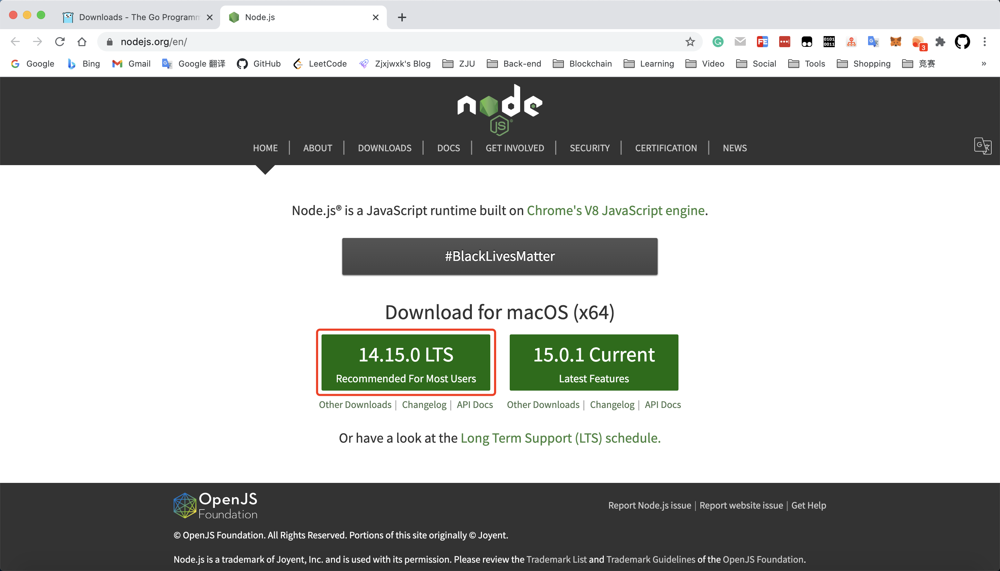

# 1. 以太坊开发环境搭建

## 1.1 配置以太坊环境

### 1.1.1 安装 Go 环境

可在 Go 官网 https://golang.org/dl/ 直接下载相应操作系统的安装包，本人使用 MacOS 系统，故点击如下按钮下载：


根据其提示信息进行安装，无需配置环境变量，在终端中输入 `go version` ，若出现如下版本信息则 Go 环境安装成功。


### 1.1.2 安装 Node.js、NPM

由于 Node.js 的安装包已经包含了 NPM，故只需下载最新稳定版本的 Node.js 安装包即可。



同样根据提示安装，无需配置环境变量，在终端中输入 `node -v` 和 `npm -v` ，若分别出现如下 Node.js 和 NPM 的版本信息，则安装成功。


### 1.1.3 安装以太坊 Ethereum

由于本人使用 MacOS 系统，故使用 brew 安装，在终端中输入 `brew install ethereum` 即可安装。安装完成后，若输入 `geth version` 出现如下版本信息，则 Ethereum 安装成功。


### 1.1.4 安装 solc 编译器

solc 是智能合约 Solidity 的编译器，可以使用 npm 安装，在终端中输入 `sudo npm install solc` 进行安装。


安装完成后，若输入 `solcjs --version` 出现如下版本信息，则 solc 编译器安装成功。


## 1.2 搭建以太坊私有链

### 1.2.1 创建账户（公钥）

在终端中输入以下命令创建以太坊账户，在创建时需要输入该账户的密码：


所有的账户的公钥都可以在 Ethereum 安装目录的 keystore 下查看，本人的地址为 `/Users/zjxjwxk/Library/Ethereum/keystore`。


### 1.2.2 编写创世块文件

在根目录下 `~/` 下创建 `genesis.json` 文件，如下配置：

```json
{
	"config": {
		"chainId": 11,
		"homesteadBlock" : 0,
		"eip150Block": 0,
		"eip155Block": 0,
		"eip158Block": 0
	},
	"alloc": {
		"e68c39884e87fa216b8a9dafbc7f4a5398b648e2": {
			"balance": "20000000000000000000000000000"
		},
		"ffcb1e2a08abca5b5d8a68077441125b8ffe97cd": {
			"balance": "20000000000000000000000000000"
		},
		"24d2a6dd2c503c5dcc1cac7b30028ab3bc44756c": {
			"balance": "20000000000000000000000000000"
		}
	},
	"coinbase": "0x0000000000000000000000000000000000000000",
	"difficulty": "0x20000",
	"extraData": "",
	"gasLimit": "0x2fefd8",
	"nonce": "0x0000000000000042",
	"mixhash": "0x0000000000000000000000000000000000000000000000000000000000000000",
	"parentHash": "0x0000000000000000000000000000000000000000000000000000000000000000",
	"timestamp": "0x00"
}
```

### 1.2.3 初始化创世块

Ethereum 默认安装在 `～/Library/Ethereum` 目录下，本人将私链初始化在 `～/Library/Ethereum/privatechain` 中，使用以下命令来初始化刚刚创建的创世块文件：

```bash
geth --datadir "~/Library/Ethereum/privatechain" init ~/genesis.json
```


### 1.2.4 配置自动解锁账户的脚本

进入私链安装目录，创建 password 文件，并在该文件中输入在 genesis.json 中每个账户对应的密码，如下所示：

```bash
123456
123456
123456
```

### 1.2.5 编写以太坊启动脚本

创建启动脚本文件 private_blockchain.sh 文件，并在文件中编写如下内容：

```shell
geth --rpc --rpcaddr="0.0.0.0" --rpccorsdomain="*" --unlock '0,1,2' --password ~/Library/Ethereum/privatechain/password --nodiscover --maxpeers '5' --networkid '0' --datadir '~/Library/Ethereum/privatechain' console
```

以后每次启动 geth 结点时，只需要在终端执行以下命令即可：

```bash
sh private_blockchain.sh
```

### 1.2.6 启动以太坊

成功启动以太坊私有链的结果如下所示：


### 1.2.7 启动挖矿

执行以下命令开始挖矿：

```bash
miner.start()
```

执行以下命令提示挖矿：

```bash
miner.stop()
```

挖矿时如下图所示：


# 2. 智能合约

### 2.1 编写合约

编写一个非常简单的合约 Multiply7 为例，该合约有一个 multiply() 方法，传入一个 uint 类型数据，乘 7 后返回结果。

```solidity
contract Multiply7 {
	event Print(uint);
	function multiply(uint input) returns (uint) {
		Print(input * 7);
		return input * 7;
	}
}
```

### 2.2 编译合约

编译合约是为了获取合约的字节码，用于后面合约的部署，由于 go-ethereum 在其 1.6 版本中放弃使用 eth_compileSolidity 方法，当企图用 curl 方式调用时会返回 `The method eth_compileSolidity does not exist/is not available` 的提示，因此使用 Remix 进行在线编译合约，得到最重要的数据字节码和 abiDefinition 数据。


点击下方 "ABI" 和 "Bytecode" 可复制 ABI 和 Bytecode，点击 Compilation Details 可获取编译相关数据：


### 2.3 获得调用账户

当前以太坊私链中可能有多个创建账户，需要选定一个账户作为调用部署合约、调用合约方法的发起者。并且该账户中要包含足够的以太币。这里使用挖矿基地址作为交易的发起者，该地址也就是默认当前账户中的第一个账户。在一个终端 A 启动以太坊，并在另一个终端 B 中执行以下命令:

```bash
curl --data '{"jsonrpc": "2.0", "method": "eth_coinbase", "id": 1}' -H "Content-Type: application/json" -X POST  localhost:8545
```

返回结果：


返回结果中的 0xe68c39884e87fa216b8a9dafbc7f4a5398b648e2 就是要使用的发起交易的账户。

### 2.4 部署合约

执行以下代码创建合约，参数为所获得的 ABI：

```js
var multiply7Contract = web3.eth.contract([
	{
		"constant": false,
		"inputs": [
			{
				"name": "input",
				"type": "uint256"
			}
		],
		"name": "multiply",
		"outputs": [
			{
				"name": "",
				"type": "uint256"
			}
		],
		"payable": false,
		"stateMutability": "nonpayable",
		"type": "function"
	},
	{
		"anonymous": false,
		"inputs": [
			{
				"indexed": false,
				"name": "",
				"type": "uint256"
			}
		],
		"name": "Print",
		"type": "event"
	}
]);
```


然后执行以下代码提交合约部署：

```javascript
var multiply7 = multiply7Contract.new({
		from: web3.eth.accounts[0],
		data: '0x608060405234801561001057600080fd5b5060fc8061001f6000396000f3fe6080604052600436106039576000357c010000000000000000000000000000000000000000000000000000000090048063c6888fa114603e575b600080fd5b348015604957600080fd5b50607360048036036020811015605e57600080fd5b81019080803590602001909291905050506089565b6040518082815260200191505060405180910390f35b60007f24abdb5865df5079dcc5ac590ff6f01d5c16edbc5fab4e195d9febd1114503da600783026040518082815260200191505060405180910390a160078202905091905056fea165627a7a7230582038bd52c038b56d86557d4dada43f00d8f45736557fb735e6a4519026d96be4800029',
		gas: '3100000',
	}, function (e, contract) {
		console.log(e, contract);
		if (typeof contract.address != 'undefined') {
			console.log('Contract mined! address' + contract.address + ' transactionHash: ' + contract.transactionHash);
		}
	}
)
```


输入合约名称，可以查看合约信息。可以发现合约 address 为 undefined，这时合约还没有部署，需要矿工挖矿共识：


矿工开始挖矿，将合约部署到区块中：


过一段时间后，再查看合约信息，发现合约 address 已经生成，合约部署成功：


### 2.5 调用合约

输入以下命令调用部署的 multiply7 合约的 multiply 函数，参数为 5，应该返回 5 * 7，即 35：

```
multiply7.multiply.call(5)
```


以上，就是以太坊私有链的搭建以及合约部署和调用的过程。

