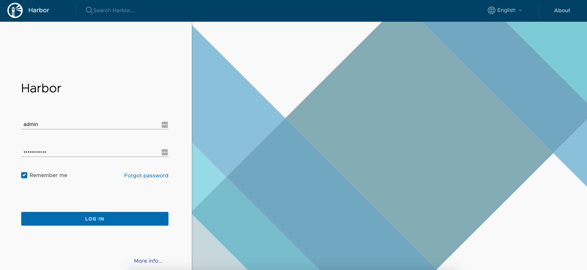

# 服务 Docker 化

## 修改项目配置

由于镜像运行时 MySQL 数据库所在的主机地址是动态的，所以将项目中的 MySQL 数据库地址和 Zookeeper 注册中心地址配置为动态变量：

```yaml
spring: 
	dubbo:
		registry: zookeeper://${zk.address}:2181
	datasource:
		url: jdbc:mysql://{mysql.address}:3306/cinema?autoReconnect=true&useUnicode=true&characterEncoding=utf8&serverTimezone=GMT%2B8
```

## 获取 Java 镜像

```shell
docker pull openjdk:8-jre
```

## 打包 Maven 项目

在项目根目录下，执行 Maven 的清除和打包命令（跳过测试）：

```shell
mvn clean && mvn package -Dmaven.test.skip=true
```

这样就会在 target 目录下生成 jar 包（Spring Boot 项目）。

## 编写 Dockerfile

在 user 子模块的根目录下，创建 Dockerfile 文件，并编辑如下，Dockerfile 文件用于构建 Docker 镜像：

```dockerfile
FROM openjdk:8-jre
MAINTAINER zjxjwxk zjxjwxk@gmail.com

COPY target/user.jar /user.jar

ENTRYPOINT ["java", "-jar", "/user.jar"]
```

## 构建项目 Docker 镜像

```shell
docker build -t user:latest .
```

## 编写 build 脚本

在和 Dockerfile 同一目录下，创建一个 build.sh 脚本，用于打包和构建 Docker 镜像：

```shell
mvn clean && mvn package -Dmaven.test.skip=true
docker build -t user:latest .
```

## 启动镜像容器

```shell
docker run -it user:latest --mysql.address=172.20.10.3 --zk.address=172.20.10.3
```

注意：此处 `172.20.10.3` 为我的本机地址，可通过 ifconfig 查看（不可为 localhost 或 127.0.0.1，因为容器中的网络和本机是隔离的）。

# Docker 下的服务通讯

Docker 容器之间的通讯有三种方法：

1. 通过容器的 IP 和端口直接访问（不稳定，容器在每次重启时 IP 可能发生变化）
2. 通过主机和容器的端口映射来访问
3. 使用 Docker 的 link 机制，通过名字来访问

对于微服务之间，我们使用第 3 种方式；对于依赖的基础环境，如 MySQL、Zookeeper，我们使用第 2 种方式。

## 建立服务之间的 link 关系

### 创建 Docker Compose

Compose 是用于定义和运行多容器 Docker 应用程序的工具。通过 Compose，您可以使用 YML 文件来配置应用程序需要的所有服务。然后，使用一个命令，就可以从 YML 文件配置中创建并启动所有服务。

在项目根目录创建一个 docker-compose.yml 文件，编辑如下：

```yaml
version: '1'

services:
  cinema-user:
    image: cinema-user:latest
    command:
      - "--mysql.address=172.20.10.3 --zk.address=172.20.10.3"

  cinema-film:
    image: cinema-film:latest
    command:
      - "--mysql.address=172.20.10.3 --zk.address=172.20.10.3"

  cinema-cinema:
    image: cinema-cinema:latest
    command:
      - "--mysql.address=172.20.10.3 --zk.address=172.20.10.3"

  cinema-order:
    image: cinema-order:latest
    command:
      - "--mysql.address=172.20.10.3 --zk.address=172.20.10.3"
    links:
      - cinema-cinema

  cinema-alipay:
    image: cinema-alipay:latest
    command:
      - "--mysql.address=172.20.10.3 --zk.address=172.20.10.3"
    links:
      - cinema-order

  cinema-gateway:
    image: cinema-gateway:latest
    command:
      - "--mysql.address=172.20.10.3 --zk.address=172.20.10.3"
    links:
      - cinema-user
      - cinema-film
      - cinema-cinema
      - cinema-order
      - cinema-alipay
    ports:
      - 8081:8081
```

其中，services 为所有需要构建的服务，command 为启动时添加的命令，links 为该服务依赖的服务。

## 执行 docker-compose

在有 docker-compose.sh 的目录下，

创建并运行所有容器：

```shell
docker-compose up -d
```

关闭并删除所有容器：

```shell
docker-compose down
```

#  镜像仓库

## 上传镜像

登录 Docker，执行以下命令，并输入 Docker Hub 的账号密码：

```shell
docker login
```

将现有的镜像打个 tag：

```shell
docker tag cinema-user:latest zjxjwxk/cinema-user:latest
```

将该镜像 push 到 Docker Hub：

```shell
docker push zjxjwxk/cinema-user:latest
```

或是将镜像从 Docker Hub pull 下来：

```shell
docker pull zjxjwxk/cinema-user:latest
```

## 使用 harbor

从 https://github.com/goharbor/harbor/releases 下载 harbor-offline-installer，解压之。

### 配置 harbor.yml

配置其目录下的 `harbor.yml` ：

将其中的 `hostname` 为 hub.xxx.com（xxx 为你的域名）。将 `http` 的 `port` 修改为 8080（由于 MacOS 80 端口不对外开放）。

如果是 MacOS 系统，还需要将其中本机 host 相关的目录由根目录 `/` 改为 `/Users/xxx/` (xxx 为你当前系统的用户名)，避免挂载权限不足的问题。

```yml
# Configuration file of Harbor

# The IP address or hostname to access admin UI and registry service.
# DO NOT use localhost or 127.0.0.1, because Harbor needs to be accessed by external clients.
hostname: hub.zjxjwxk.com

# http related config
http:
  # port for http, default is 80. If https enabled, this port will redirect to https port
  port: 8080

# https related config
#https:
  # https port for harbor, default is 443
#  port: 443
  # The path of cert and key files for nginx
#  certificate: /your/certificate/path
#  private_key: /your/private/key/path

# Uncomment external_url if you want to enable external proxy
# And when it enabled the hostname will no longer used
# external_url: https://reg.mydomain.com:8433

# The initial password of Harbor admin
# It only works in first time to install harbor
# Remember Change the admin password from UI after launching Harbor.
harbor_admin_password: Harbor12345

# Harbor DB configuration
database:
  # The password for the root user of Harbor DB. Change this before any production use.
  password: root123
  # The maximum number of connections in the idle connection pool. If it <=0, no idle connections are retained.
  max_idle_conns: 50
  # The maximum number of open connections to the database. If it <= 0, then there is no limit on the number of open connections.
  # Note: the default number of connections is 100 for postgres.
  max_open_conns: 100

# The default data volume
data_volume: /Users/zjxjwxk/data

# Harbor Storage settings by default is using /data dir on local filesystem
# Uncomment storage_service setting If you want to using external storage
# storage_service:
#   # ca_bundle is the path to the custom root ca certificate, which will be injected into the truststore
#   # of registry's and chart repository's containers.  This is usually needed when the user hosts a internal storage with self signed certificate.
#   ca_bundle:

#   # storage backend, default is filesystem, options include filesystem, azure, gcs, s3, swift and oss
#   # for more info about this configuration please refer https://docs.docker.com/registry/configuration/
#   filesystem:
#     maxthreads: 100
#   # set disable to true when you want to disable registry redirect
#   redirect:
#     disabled: false

# Clair configuration
clair:
  # The interval of clair updaters, the unit is hour, set to 0 to disable the updaters.
  updaters_interval: 12

jobservice:
  # Maximum number of job workers in job service
  max_job_workers: 10

notification:
  # Maximum retry count for webhook job
  webhook_job_max_retry: 10

chart:
  # Change the value of absolute_url to enabled can enable absolute url in chart
  absolute_url: disabled

# Log configurations
log:
  # options are debug, info, warning, error, fatal
  level: info
  # configs for logs in local storage
  local:
    # Log files are rotated log_rotate_count times before being removed. If count is 0, old versions are removed rather than rotated.
    rotate_count: 50
    # Log files are rotated only if they grow bigger than log_rotate_size bytes. If size is followed by k, the size is assumed to be in kilobytes.
    # If the M is used, the size is in megabytes, and if G is used, the size is in gigabytes. So size 100, size 100k, size 100M and size 100G
    # are all valid.
    rotate_size: 200M
    # The directory on your host that store log
    location: /Users/zjxjwxk/var/log/harbor

  # Uncomment following lines to enable external syslog endpoint.
  # external_endpoint:
  #   # protocol used to transmit log to external endpoint, options is tcp or udp
  #   protocol: tcp
  #   # The host of external endpoint
  #   host: localhost
  #   # Port of external endpoint
  #   port: 5140

#This attribute is for migrator to detect the version of the .cfg file, DO NOT MODIFY!
_version: 1.10.0

# Uncomment external_database if using external database.
# external_database:
#   harbor:
#     host: harbor_db_host
#     port: harbor_db_port
#     db_name: harbor_db_name
#     username: harbor_db_username
#     password: harbor_db_password
#     ssl_mode: disable
#     max_idle_conns: 2
#     max_open_conns: 0
#   clair:
#     host: clair_db_host
#     port: clair_db_port
#     db_name: clair_db_name
#     username: clair_db_username
#     password: clair_db_password
#     ssl_mode: disable
#   notary_signer:
#     host: notary_signer_db_host
#     port: notary_signer_db_port
#     db_name: notary_signer_db_name
#     username: notary_signer_db_username
#     password: notary_signer_db_password
#     ssl_mode: disable
#   notary_server:
#     host: notary_server_db_host
#     port: notary_server_db_port
#     db_name: notary_server_db_name
#     username: notary_server_db_username
#     password: notary_server_db_password
#     ssl_mode: disable

# Uncomment external_redis if using external Redis server
# external_redis:
#   host: redis
#   port: 6379
#   password:
#   # db_index 0 is for core, it's unchangeable
#   registry_db_index: 1
#   jobservice_db_index: 2
#   chartmuseum_db_index: 3
#   clair_db_index: 4

# Uncomment uaa for trusting the certificate of uaa instance that is hosted via self-signed cert.
# uaa:
#   ca_file: /path/to/ca

# Global proxy
# Config http proxy for components, e.g. http://my.proxy.com:3128
# Components doesn't need to connect to each others via http proxy.
# Remove component from `components` array if want disable proxy
# for it. If you want use proxy for replication, MUST enable proxy
# for core and jobservice, and set `http_proxy` and `https_proxy`.
# Add domain to the `no_proxy` field, when you want disable proxy
# for some special registry.
proxy:
  http_proxy:
  https_proxy:
  # no_proxy endpoints will appended to 127.0.0.1,localhost,.local,.internal,log,db,redis,nginx,core,portal,postgresql,jobservice,registry,registryctl,clair,chartmuseum,notary-server
  no_proxy:
  components:
    - core
    - jobservice
    - clair
```

### 启动 harbar

执行 `sh install.sh` 运行 harbar。

出现以下则说明启动成功：

```shell
[Step 5]: starting Harbor ...
Creating network "harbor_harbor" with the default driver
Creating harbor-log ... done
Creating redis         ... done
Creating harbor-portal ... done
Creating registryctl   ... done
Creating harbor-db     ... done
Creating registry      ... done
Creating harbor-core   ... done
Creating nginx             ... done
Creating harbor-jobservice ... done
✔ ----Harbor has been installed and started successfully.----
```

访问 localhost:8080 进入 Harbor UI 界面。默认账号为 admin，默认密码为 `harbor.yml` 中的 `harbor_admin_password` : Harbor12345。



