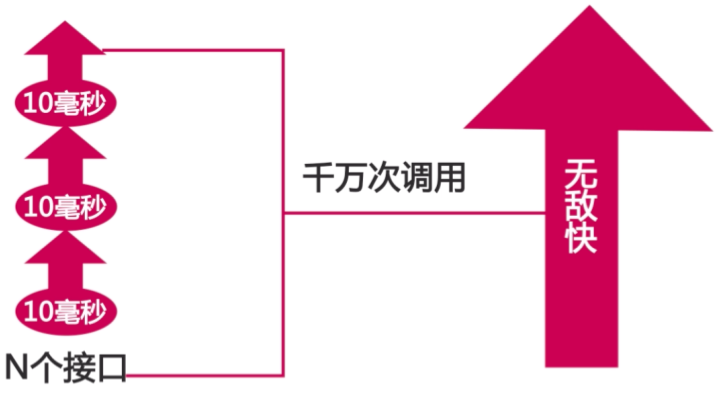
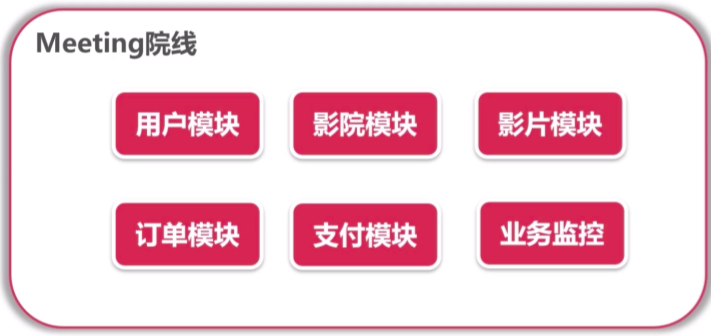
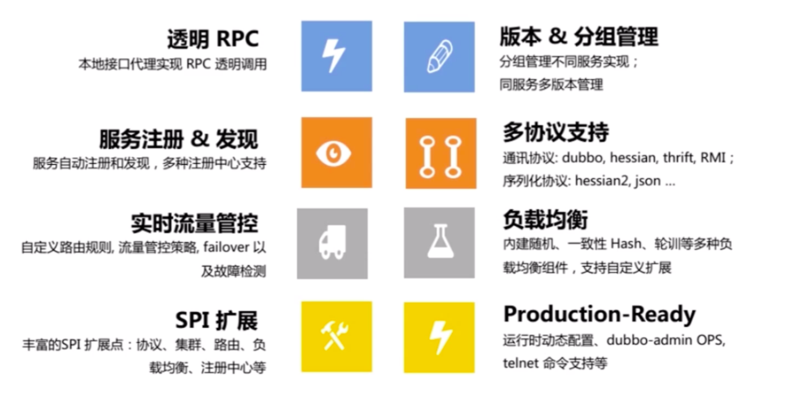
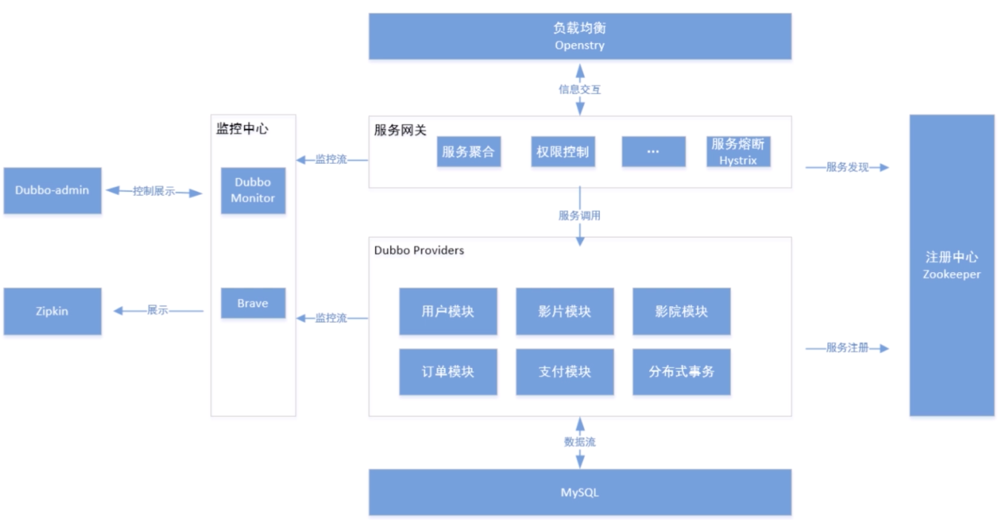

# 为什么使用Dubbo

## Dubbo 是基于 RPC 通信协议，速度更快

## Dubbo 的多中心配置更灵活

- ZooKeeper
- Redis

## Dubbo 可以按需集成其他组件，完成微服务生态环境构建

- Hystrix
- Zipkin

## 包括阿里、小米、京东等多家互联网公司都有使用

# 学习目标

- 构建业务完整的商业化项目
- 掌握以 Dubbo 为底的各项微服务套件的应用
- 掌握基于 Dubbo 的微服务常见面试问题

# 业务结构图

# 核心功能

# 主要知识点

# 技术架构图

