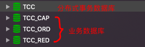

# 章节概要

- 事务简介
- 分布式事务的前世今生
- 分布式事务解决方案
- 主流分布式事务框架介绍

# 事务简介

- 事务是用来保证一组**数据操作**的完整性和一致性的
- 事务必须满足 ACID 的四大特性
- 事务具有四种隔离级别
- 事务具有七种传播行为

## 事务属性

- 原子性（Atomicity）
- 一致性（Consistency）
- 隔离型（Isolation）
- 持久性（Durability）

# 分布式事务

## 概念

- 分布式事务就是将多个节点的事务看成一个整体处理
- 分布式事务由事务参与者、资源服务器、事务管理器等组成
- 常见的分布式事务的例子：支付、下订单等

## 实现思路

- 两段式事务和三段式事务
- 基于 XA 的分布式事务
- 基于消息的最终一致性方案
- **TCC 编程式补偿性事务**

# 分布式事务类型

## 两段式和三段式事务

### 两段式事务


### 三段式事务


## 基于 XA 的分布式事务


## 基于消息的一致性方案


## TCC 补偿性事务


### 基于消息的一致性方案和 TCC 补偿性事务的区别

- 基于消息的事务是强一致性事务，会存在浪费
- TCC 事务是柔性事务，在 try 阶段要对资源做预留
- TCC 事务在确认或取消阶段释放资源
- 与基于消息的事务对比，TCC 的时效性更好

# 分布式事务框架

- 全局事务服务（Global Transaction Service，简称 GTS）
- 蚂蚁金服分布式事务（Distributed Transaction-eXtended，简称 DTX）
- **开源 TCC 框架（TCC-Transaction）**（https://github.com/changmingxie/tcc-transaction）
- 开源 TCC 框架（ByteTCC）（https://github.com/liuyangming/ByteTCC）

# TCC-Transaction 分布式事务框架

> Github 仓库：https://github.com/changmingxie/tcc-transaction

1. 在需要提供分布式事务支持的接口方法上添加 `@Compensable`
2. 在对应的接口实现方法上也添加 @Compensable，并添加注解参数 `confirmMethod`, `cancelMethod` 和 `transactionContextEditor`
3. 实现对应的 `confirmMethod` 和 `cancelMethod`（必须和 try 方法在同一个类中）

注意：

1. 在分布式事务框架中，不要轻易在业务层捕获所有异常，只有在抛出异常的情况下，分布式事务框架才知道该业务是执行失败的。
2. 使用 TCC-Transaction 时，confirm 和 cancel 的幂等性问题需要自己解决。
3. TCC 的数据库应该和业务数据库分开，以保证分布式事务的正常进行。

## 建立用于分布式事务的数据库

TCC 的数据库应该和业务数据库分开，以保证分布式事务的正常进行。



其中，TCC 库用于实现分布式事务，其包含的表和表结构如下：


## Dubbo Demo

### 子事务：红包模块

**接口**

```java
public interface RedPacketTradeOrderService {

    @Compensable
    public String record(RedPacketTradeOrderDto tradeOrderDto);
}
```

**实现类**

```java
@Service("redPacketTradeOrderService")
public class RedPacketTradeOrderServiceImpl implements RedPacketTradeOrderService {

    @Autowired
    RedPacketAccountRepository redPacketAccountRepository;

    @Autowired
    TradeOrderRepository tradeOrderRepository;

    @Override
    @Compensable(confirmMethod = "confirmRecord", cancelMethod = "cancelRecord", transactionContextEditor = DubboTransactionContextEditor.class)
    @Transactional
    public String record(RedPacketTradeOrderDto tradeOrderDto) {
        TradeOrder foundTradeOrder = tradeOrderRepository.findByMerchantOrderNo(tradeOrderDto.getMerchantOrderNo());
        // check if trade order has been recorded, if yes, return success directly.
        if (foundTradeOrder == null) {
            TradeOrder tradeOrder = new TradeOrder(
                    tradeOrderDto.getSelfUserId(),
                    tradeOrderDto.getOppositeUserId(),
                    tradeOrderDto.getMerchantOrderNo(),
                    tradeOrderDto.getAmount()
            );
            try {
                tradeOrderRepository.insert(tradeOrder);
                RedPacketAccount transferFromAccount = redPacketAccountRepository.findByUserId(tradeOrderDto.getSelfUserId());
                transferFromAccount.transferFrom(tradeOrderDto.getAmount());
                redPacketAccountRepository.save(transferFromAccount);
            } catch (DataIntegrityViolationException e) {
                // this exception may happen when insert trade order concurrently, if happened, ignore this insert operation.
            }
        }
        return "success";
    }

    @Transactional
    public void confirmRecord(RedPacketTradeOrderDto tradeOrderDto) {
        TradeOrder tradeOrder = tradeOrderRepository.findByMerchantOrderNo(tradeOrderDto.getMerchantOrderNo());
        // check if the trade order status is DRAFT, if yes, return directly, ensure idempotency.
        if (tradeOrder != null && tradeOrder.getStatus().equals("DRAFT")) {
            tradeOrder.confirm();
            tradeOrderRepository.update(tradeOrder);
            RedPacketAccount transferToAccount = redPacketAccountRepository.findByUserId(tradeOrderDto.getOppositeUserId());
            transferToAccount.transferTo(tradeOrderDto.getAmount());
            redPacketAccountRepository.save(transferToAccount);
        }
    }

    @Transactional
    public void cancelRecord(RedPacketTradeOrderDto tradeOrderDto) {
        TradeOrder tradeOrder = tradeOrderRepository.findByMerchantOrderNo(tradeOrderDto.getMerchantOrderNo());
        // check if the trade order status is DRAFT, if yes, return directly, ensure idempotency.
        if (null != tradeOrder && "DRAFT".equals(tradeOrder.getStatus())) {
            tradeOrder.cancel();
            tradeOrderRepository.update(tradeOrder);
            RedPacketAccount capitalAccount = redPacketAccountRepository.findByUserId(tradeOrderDto.getSelfUserId());
            capitalAccount.cancelTransfer(tradeOrderDto.getAmount());
            redPacketAccountRepository.save(capitalAccount);
        }
    }
}
```

思考：为什么要在 `confirm` 和 `cancel` 方法里先检查订单状态是否为 DRAFT（在 try 方法中新增的一个订单），而不直接修改为结束状态？

答：为了保证服务的幂等性，即使用相同参数对同一资源重复调用某个接口的结果与调用一次的结果相同。

### 主事务：订单模块

注意：要在主事务的业务已经实现的差不多的时候才调用子事务。

```java
@Service
public class PaymentServiceImpl {

    @Autowired
    CapitalTradeOrderService capitalTradeOrderService;

    @Autowired
    RedPacketTradeOrderService redPacketTradeOrderService;

    @Autowired
    OrderRepository orderRepository;

    @Compensable(confirmMethod = "confirmMakePayment", cancelMethod = "cancelMakePayment", asyncConfirm = false, delayCancelExceptions = {SocketTimeoutException.class, org.apache.dubbo.remoting.TimeoutException.class})
    public void makePayment(@UniqueIdentity String orderNo, BigDecimal redPacketPayAmount, BigDecimal capitalPayAmount) {
        Order order = orderRepository.findByMerchantOrderNo(orderNo);
        // check if the order status is DRAFT, if no, means that another call makePayment for the same order happened, ignore this call makePayment.
        if (order.getStatus().equals("DRAFT")) {
            order.pay(redPacketPayAmount, capitalPayAmount);
            try {
                orderRepository.updateOrder(order);
            } catch (OptimisticLockingFailureException e) {
                // ignore the concurrently update order exception, ensure idempotency.
            }
        }
      // 调用子事务
        String result = capitalTradeOrderService.record(buildCapitalTradeOrderDto(order));
        String result2 = redPacketTradeOrderService.record(buildRedPacketTradeOrderDto(order));
    }

    public void confirmMakePayment(String orderNo, BigDecimal redPacketPayAmount, BigDecimal capitalPayAmount) {
        Order foundOrder = orderRepository.findByMerchantOrderNo(orderNo);
        // check if the trade order status is PAYING, if no, means another call confirmMakePayment happened, return directly, ensure idempotency.
        if (foundOrder != null && foundOrder.getStatus().equals("PAYING")) {
            foundOrder.confirm();
            orderRepository.updateOrder(foundOrder);
        }
    }

    public void cancelMakePayment(String orderNo,  BigDecimal redPacketPayAmount, BigDecimal capitalPayAmount) {
        Order foundOrder = orderRepository.findByMerchantOrderNo(orderNo);
        // check if the trade order status is PAYING, if no, means another call cancelMakePayment happened, return directly, ensure idempotency.
        if (foundOrder != null && foundOrder.getStatus().equals("PAYING")) {
            foundOrder.cancelPayment();
            orderRepository.updateOrder(foundOrder);
        }
    }
}
```

## 流程图


## 隐式参数

根据官方文档可以得知，1.2.x 版本支持 rpc 框架支持隐式传参情况下将事务上下文参数 `TransactionContext` 以隐式传参方式进行传递。

那么，在子事务的 Service 实现代码中获取 Dubbo 隐式参数：

```java
Map<String, String> attachments = RpcContext.getContext().getAttachments();
```


打一个断点，可以从隐式参数中得到 key 为 TRANSACTION_CONTEXT，value 为以下信息的键值对：

```json
{
  "attachments":{},
  "status":1,
  "xid":{
    "branchQualifier":"hMBMmir6Q56M0hskfmPebw==",
    "formatId":1,
    "globalTransactionId":"trSosXg0Soi8Q9xlauTToQ=="
  }
}
```

其中，包含了 `globalTransactionId` 这一全局事务 id，和 `branchQualifier` 分支事务 id。

##提出疑问

1. 什么时候生成的 `TRANSACTION_CONTEXT` 隐式参数？
2. 如何判断一个大的事务下，都有哪些小的事务？
3. 为什么要有 `@Compensable` 注解？
4. 两个拦截器都没有处理 confirm 和 cancel，谁来处理？

## 源码分析


### 事务拦截器

重点介绍 tcc-transaction-core 核心包的 interceptor 包，也就是拦截器包。


**CompensableMethodContext**

这是加了 `@Compensable` 注释的目标方法对象的上下文类。通过构造函数，利用拦截的目标对象上下文，获取被拦截目标对象方法的各种信息。

```java
public CompensableMethodContext(ProceedingJoinPoint pjp) {
        this.pjp = pjp;
  	// 获取待访问对象的方法名称
        this.method = getCompensableMethod();
  	// 获取目标对象的 Compensable 注解
        this.compensable = method.getAnnotation(Compensable.class);
  	// 获取目标对象的事务传播属性（默认为 REQUIRED）
        this.propagation = compensable.propagation();
  	// 获取事务上下文
        this.transactionContext = FactoryBuilder.factoryOf(compensable.transactionContextEditor()).getInstance().get(pjp.getTarget(), method, pjp.getArgs());
}
```

其中，transactionContext 是一个 `TransactionContext` 类，定义在 tcc-transaction-api 模块中：

```java
public class TransactionContext implements Serializable {

    private static final long serialVersionUID = -8199390103169700387L;
    private TransactionXid xid;

    private int status;
   /**
     * 保存当前事务有几个子事务
     */
    private Map<String, String> attachments = new ConcurrentHashMap<String, String>();

    public TransactionContext() {

    }

    public TransactionContext(TransactionXid xid, int status) {
        this.xid = xid;
        this.status = status;
    }

    public void setXid(TransactionXid xid) {
        this.xid = xid;
    }

    public TransactionXid getXid() {
        return xid.clone();
    }

    public void setAttachments(Map<String, String> attachments) {
        if (attachments != null && !attachments.isEmpty()) {
            this.attachments.putAll(attachments);
        }
    }

    public Map<String, String> getAttachments() {
        return attachments;
    }

    public void setStatus(int status) {
        this.status = status;
    }

    public int getStatus() {
        return status;
    }
}
```


**CompensableTransactionAspect**

这是一个 AOP 切面类。`@Pointcut` 将 `@Compensable` 注解标记为切入点，其签名为 `compensableService()`。`@Around` 表示在 `compensableService()` 之前和之后调用 `interceptCompensableMethod()`，其中调用了 `CompensableTransactionInterceptor` 的 `interceptCompensableMethod()`。

```java
    @Pointcut("@annotation(org.mengyun.tcctransaction.api.Compensable)")
    public void compensableService() {

    }

    @Around("compensableService()")
    public Object interceptCompensableMethod(ProceedingJoinPoint pjp) throws Throwable {

        return compensableTransactionInterceptor.interceptCompensableMethod(pjp);
    }
```


**CompensableTransactionInterceptor**

这是事务拦截器，具有以下作用：

1. 将事务区分为 ROOT 事务和 PROVIDER 分支事务
2. 不断地修改数据库内的状态（初始化事务、修改事务状态）
3. 修改和清除事务管理区中的事务队列
4. （并没有执行目标对象方法，pjp.proceed() 其实是交给了下一个拦截器 ResourceCoordinatorInterceptor）

**interceptCompensableMethod**

其中`interceptCompensableMethod()` 方法中，参数 pjp 表示被代理的目标对象，比如被加了 `@Compensable` 注解的 `makePayment` 方法对象，就会作为该参数，通过其获取该方法的各种信息。

```java
public Object interceptCompensableMethod(ProceedingJoinPoint pjp) throws Throwable {

  	 // 通过上下文对象，获取待访问对象的各种信息，见下方 CompensableMethodContext() 构造函数
        CompensableMethodContext compensableMethodContext = new CompensableMethodContext(pjp);
	  // 通过事务管理器，来判断是否有存在的事务队列（从 ThreadLocal 获取 transactions 来判断当前线程是否已经有事务）
        boolean isTransactionActive = transactionManager.isTransactionActive();

        if (!TransactionUtils.isLegalTransactionContext(isTransactionActive, compensableMethodContext)) {
            throw new SystemException("no active compensable transaction while propagation is mandatory for method " + compensableMethodContext.getMethod().getName());
        }
	  // 获取并判断当前事务的角色（ROOT 表示主事务，PROVIDER 表示分支事务或事务参与者），并根据其角色调用不同的方法来处理
        switch (compensableMethodContext.getMethodRole(isTransactionActive)) {
            case ROOT:
                return rootMethodProceed(compensableMethodContext);
            case PROVIDER:
                return providerMethodProceed(compensableMethodContext);
            default:
                return pjp.proceed();
        }
    }
```


**rootMethodProceed**

处理主事务的 `rootMethodProceed()` 方法，它会完成：

1. 开启全局事务
2. 持久化全局事务
3. 注册全局事务
4. 判断应该 confirm 还是 cancel
5. 清除事务队列

```java
private Object rootMethodProceed(CompensableMethodContext compensableMethodContext) throws Throwable {

        Object returnValue = null;

        Transaction transaction = null;

        boolean asyncConfirm = compensableMethodContext.getAnnotation().asyncConfirm();

        boolean asyncCancel = compensableMethodContext.getAnnotation().asyncCancel();

        Set<Class<? extends Exception>> allDelayCancelExceptions = new HashSet<Class<? extends Exception>>();
        allDelayCancelExceptions.addAll(this.delayCancelExceptions);
        allDelayCancelExceptions.addAll(Arrays.asList(compensableMethodContext.getAnnotation().delayCancelExceptions()));

        try {
            // 让事务管理器开启一个全新的事务，持久化事务，并事务管理器注册该事务（加入事务队列）
            transaction = transactionManager.begin(compensableMethodContext.getUniqueIdentity());

            try {
                // 执行目标方法（实际上会先调用 ResourceCoordinatorIntercepter 拦截器）
                returnValue = compensableMethodContext.proceed();
                // 如果执行异常，就回滚，否则提交
            } catch (Throwable tryingException) {

                if (!isDelayCancelException(tryingException, allDelayCancelExceptions)) {

                    logger.warn(String.format("compensable transaction trying failed. transaction content:%s", JSON.toJSONString(transaction)), tryingException);

                    /*
                        1. 修改数据库状态
                        2. 执行 rollback 方法
                        3. 如果执行成功，则删除事务资源数据
                     */
                    transactionManager.rollback(asyncCancel);
                }

                throw tryingException;
            }

            /*
                1. 修改数据库状态
                2. 执行 confirm 方法
                3. 如果执行成功，则删除事务资源数据
             */
            transactionManager.commit(asyncConfirm);

        } finally {
            // 到这里，分支事务就都执行完了，就清除队列中的事务
            transactionManager.cleanAfterCompletion(transaction);
        }

        return returnValue;
    }
```

其中事务管理器 `TransactionManager` 的 `begin()` 方法：

```java
    public Transaction begin(Object uniqueIdentify) {
        Transaction transaction = new Transaction(uniqueIdentify,TransactionType.ROOT);
      // 持久化事务
        transactionRepository.create(transaction);
      // 注册事务，向事务队列中加入该事务
        registerTransaction(transaction);
        return transaction;
    }
```


**providerMethodProceed**

处理分支事务的 `providerMethodProceed()` 方法：

```java
    private Object providerMethodProceed(CompensableMethodContext compensableMethodContext) throws Throwable {

        Transaction transaction = null;
      
        boolean asyncConfirm = compensableMethodContext.getAnnotation().asyncConfirm();

        boolean asyncCancel = compensableMethodContext.getAnnotation().asyncCancel();

        try {
		// 根据事务的不同状态，执行不同的动作
            switch (TransactionStatus.valueOf(compensableMethodContext.getTransactionContext().getStatus())) {
                case TRYING:
                    // propagationNewBegin() 持久化事务参与者的数据到当前服务中（默认状态为 TRYING），并向事务管理器注册事务
                    transaction = transactionManager.propagationNewBegin(compensableMethodContext.getTransactionContext());
                    return compensableMethodContext.proceed();
                case CONFIRMING:
                    try {
                      // propagationExistBegin() 修改事务状态，并注册事务
                        transaction = transactionManager.propagationExistBegin(compensableMethodContext.getTransactionContext());
                      // commit() 修改事务状态为 CONFIRMING，并持久化更新，提交事务
                        transactionManager.commit(asyncConfirm);
                    } catch (NoExistedTransactionException excepton) {
                        //the transaction has been commit,ignore it.
                    }
                    break;
                case CANCELLING:

                    try {
                      // propagationExistBegin() 修改事务状态，并注册事务
                        transaction = transactionManager.propagationExistBegin(compensableMethodContext.getTransactionContext());
                      // rollback() 修改事务状态为 CANCELLING，并持久化更新，回滚事务
                        transactionManager.rollback(asyncCancel);
                    } catch (NoExistedTransactionException exception) {
                        //the transaction has been rollback,ignore it.
                    }
                    break;
            }

        } finally {
          // 清除事务队列
            transactionManager.cleanAfterCompletion(transaction);
        }

        Method method = compensableMethodContext.getMethod();

        return ReflectionUtils.getNullValue(method.getReturnType());
    }
```


**ResourceCoordinatorAspect**

资源协调切面类和 CompensableTransactionAspect 类似，几乎一样，不再赘述。

```java
    @Pointcut("@annotation(org.mengyun.tcctransaction.api.Compensable)")
    public void transactionContextCall() {

    }

    @Around("transactionContextCall()")
    public Object interceptTransactionContextMethod(ProceedingJoinPoint pjp) throws Throwable {
        return resourceCoordinatorInterceptor.interceptTransactionContextMethod(pjp);
    }
```


**ResourceCoordinatorInterceptor**

主要处理 try 阶段的事情，在 try 阶段，就将所有的“资源”封装完成并交给事务管理器。

其中“资源”指的是“事务资源”：

即事务的参与者：

1. confirm 上下文
2. cancel 上下文
3. 分支事务信息

然后事务管理器修改数据库状态。

**interceptTransactionContextMethod**

```java
    public Object interceptTransactionContextMethod(ProceedingJoinPoint pjp) throws Throwable {
		// 使用事务管理器，传递一些事务相关的信息（线程共享）
        Transaction transaction = transactionManager.getCurrentTransaction();

        if (transaction != null) {

            switch (transaction.getStatus()) {
                case TRYING:
                    enlistParticipant(pjp);
                    break;
                case CONFIRMING:
                    break;
                case CANCELLING:
                    break;
            }
        }

        return pjp.proceed(pjp.getArgs());
    }
```


**enlistParticipant**

```java
private void enlistParticipant(ProceedingJoinPoint pjp) throws IllegalAccessException, InstantiationException {
		// 获取对象的方法
        Method method = CompensableMethodUtils.getCompensableMethod(pjp);
        if (method == null) {
            throw new RuntimeException(String.format("join point not found method, point is : %s", pjp.getSignature().getName()));
        }
  	// 获取对应的 @Compensable 对象
        Compensable compensable = method.getAnnotation(Compensable.class);
	  // 获取配置的 confirm 和 cancel 方法
  	
        String confirmMethodName = compensable.confirmMethod();
        String cancelMethodName = compensable.cancelMethod();

        Transaction transaction = transactionManager.getCurrentTransaction();
        TransactionXid xid = new TransactionXid(transaction.getXid().getGlobalTransactionId());

        if (FactoryBuilder.factoryOf(compensable.transactionContextEditor()).getInstance().get(pjp.getTarget(), method, pjp.getArgs()) == null) {
            FactoryBuilder.factoryOf(compensable.transactionContextEditor()).getInstance().set(new TransactionContext(xid, TransactionStatus.TRYING.getId()), pjp.getTarget(), ((MethodSignature) pjp.getSignature()).getMethod(), pjp.getArgs());
        }

        Class targetClass = ReflectionUtils.getDeclaringType(pjp.getTarget().getClass(), method.getName(), method.getParameterTypes());

        InvocationContext confirmInvocation = new InvocationContext(targetClass,
                confirmMethodName,
                method.getParameterTypes(), pjp.getArgs());

        InvocationContext cancelInvocation = new InvocationContext(targetClass,
                cancelMethodName,
                method.getParameterTypes(), pjp.getArgs());

        Participant participant =
                new Participant(
                        xid,
                        confirmInvocation,
                        cancelInvocation,
                        compensable.transactionContextEditor());

        transactionManager.enlistParticipant(participant);
    }
```


这样，经过两个拦截器后，才调用目标对象方法。

### 幂等性问题

TCC-Transaction 不能保证幂等性，需要自己实现幂等性。如以下 confirm 和 cancel 方法就实现了幂等性：

**confirm 的幂等性**

```java
@Transactional
    public void confirmRecord(RedPacketTradeOrderDto tradeOrderDto) {

        try {
            Thread.sleep(1000l);
        } catch (InterruptedException e) {
            throw new RuntimeException(e);
        }

        System.out.println("red packet confirm record called. time seq:" + DateFormatUtils.format(Calendar.getInstance(), "yyyy-MM-dd HH:mm:ss"));

        TradeOrder tradeOrder = tradeOrderRepository.findByMerchantOrderNo(tradeOrderDto.getMerchantOrderNo());

        // 保证幂等性 check if the trade order status is DRAFT, if yes, return directly, ensure idempotency.
        if (tradeOrder != null && tradeOrder.getStatus().equals("DRAFT")) {
            tradeOrder.confirm();
            tradeOrderRepository.update(tradeOrder);

            RedPacketAccount transferToAccount = redPacketAccountRepository.findByUserId(tradeOrderDto.getOppositeUserId());

            transferToAccount.transferTo(tradeOrderDto.getAmount());

            redPacketAccountRepository.save(transferToAccount);
        }
    }
```


**cancel 的幂等性**

```java
@Transactional
    public void cancelRecord(RedPacketTradeOrderDto tradeOrderDto) {

        try {
            Thread.sleep(1000l);
        } catch (InterruptedException e) {
            throw new RuntimeException(e);
        }

        System.out.println("red packet cancel record called. time seq:" + DateFormatUtils.format(Calendar.getInstance(), "yyyy-MM-dd HH:mm:ss"));

        TradeOrder tradeOrder = tradeOrderRepository.findByMerchantOrderNo(tradeOrderDto.getMerchantOrderNo());

        // 保证幂等性 check if the trade order status is DRAFT, if yes, return directly, ensure idempotency.
        if (null != tradeOrder && "DRAFT".equals(tradeOrder.getStatus())) {
            tradeOrder.cancel();
            tradeOrderRepository.update(tradeOrder);

            RedPacketAccount capitalAccount = redPacketAccountRepository.findByUserId(tradeOrderDto.getSelfUserId());

            capitalAccount.cancelTransfer(tradeOrderDto.getAmount());

            redPacketAccountRepository.save(capitalAccount);
        }
    }
```


## 小结

事务的相关信息（全局事务编号，乐观锁版本等要持久化存储）

### 资源

try 核心点：预留资源（业务资源、事务数据资源）

### 流程

注册和初始化事务 -> 组织事务参与者 -> 执行目标方法（try） -> 执行 confirm 和 cancel 方法

# 总结

- 熟悉 TCC-Transaction 的分布式事务处理流程
- TCC-Transaction 不能保证幂等性
- TCC 分布式事务的核心是资源（业务资源和事务资源）

