# 章节概要

- 了解 Dubbo 监控相关内容
- 熟练掌握 Dubbo-admin 使用
- 熟练掌握链路监控
- 完成业务系统部署

# Dubbo-monitor

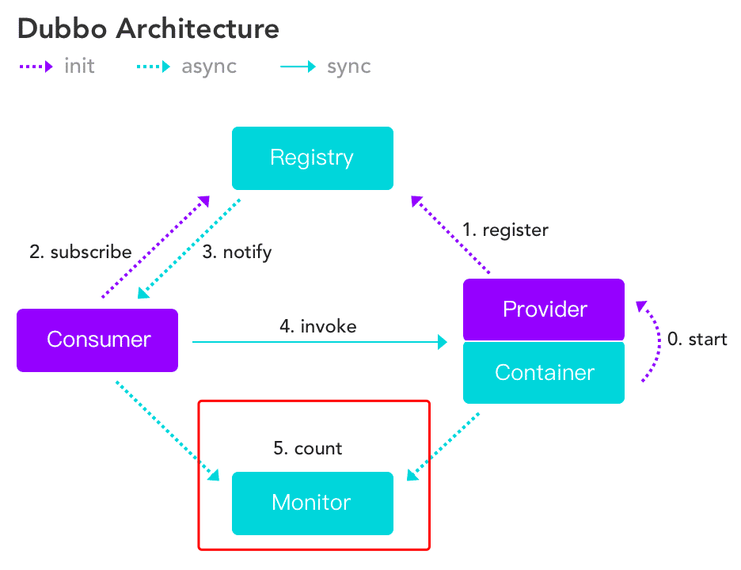

## 源码下载和打包

目前，还可以从当当网的项目 Dubbox 中获取（很久没有维护了）：https://github.com/dangdangdotcom/dubbox ，在项目中执行以下命令打包并拷贝到本地仓库（跳过单元测试）：

```shell
mvn package -Dmaven.test.skip=true  
```

其中，可能会遇到 Missing artifact com.alibaba:dubbo:jar:2.8.4 的坑，需要在根项目的 pom.xml 文件中添加以下 maven 插件：

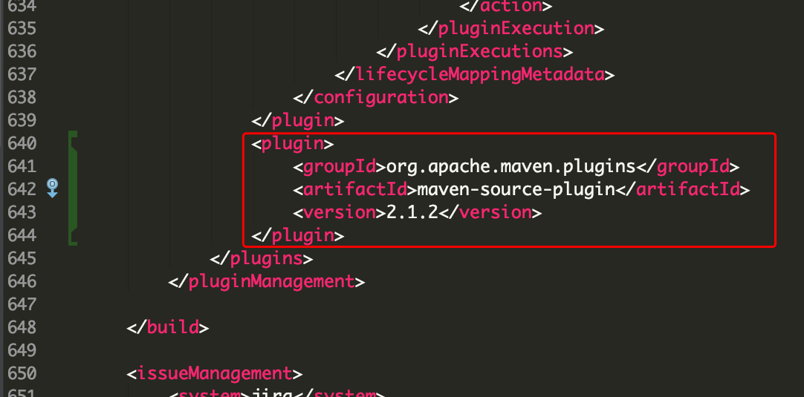

这样在本地仓库就有了 ~/.m2/repository/com/alibaba/dubbo-monitor-simple/2.8.4/dubbo-monitor-simple-2.8.4-assembly.tar.gz 这个 tar.gz 包，解压它可以得到以下文件：


## 启动服务监控

在 conf 文件夹下，编辑 dubbo.properties，将相关参数配置如下：

```properties
dubbo.container=log4j,spring,registry,jetty
dubbo.application.name=simple-monitor
dubbo.application.owner=
#dubbo.registry.address=multicast://224.5.6.7:1234
dubbo.registry.address=zookeeper://127.0.0.1:2181
#dubbo.registry.address=redis://127.0.0.1:6379
#dubbo.registry.address=dubbo://127.0.0.1:9090
dubbo.protocol.port=7070
dubbo.jetty.port=8090
dubbo.jetty.directory=monitor
dubbo.charts.directory=monitor/charts
dubbo.statistics.directory=monitor/statistics
dubbo.log4j.file=monitor/dubbo-monitor-simple.log
dubbo.log4j.level=WARN
```

 然后，进入 bin 目录，运行 start.sh 就可以启动 Dubbo-Monitor 了，运行在配置好的 8090 端口（需要先打开 Zookeeper）。

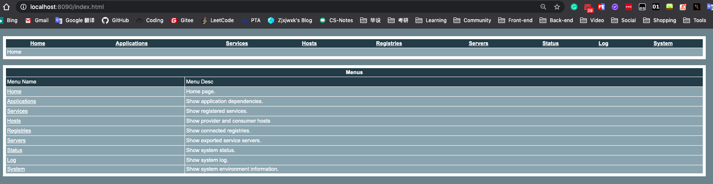

启动服务提供者和消费者后，可以在 Applications 中看到如下信息：

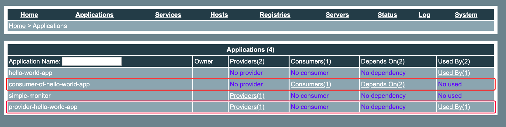

同时，可以点击 Providers 查看服务某一服务提供者的详细信息，并且可以将其取消注册：

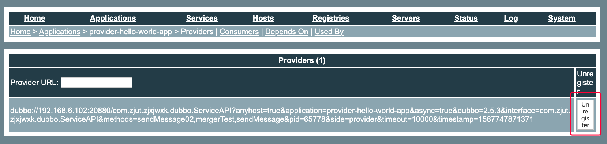

取消注册后，服务消费者将不能够调用该提供者的服务：

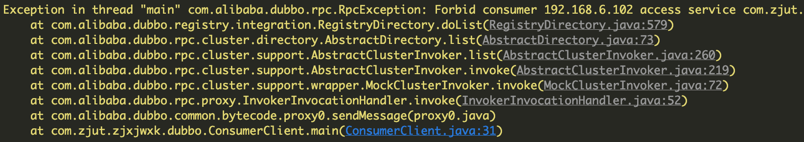

# Dubbo-admin

现在有两种版本：

- Dubbo 原生的 admin 工程
- Apache 修正版

## Apache 修正版

> 官方文档：https://dubbo.apache.org/zh-cn/docs/admin/introduction.html

### Maven方式部署

- 安装

```shell
git clone https://github.com/apache/dubbo-admin.git
cd dubbo-admin
mvn clean package
cd dubbo-admin-distribution/target
java -jar dubbo-admin-0.1.jar
```

- 访问
  [http://localhost:8080](http://localhost:8080/)

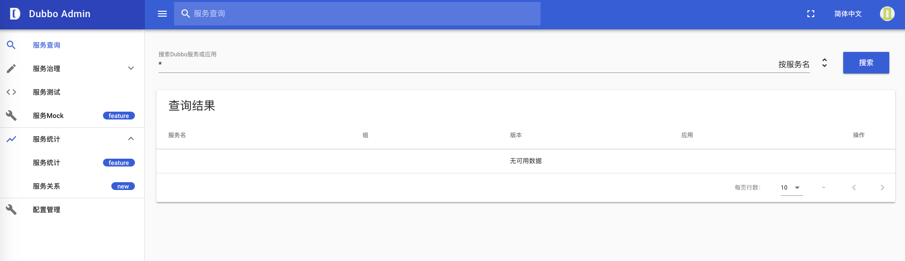

## Dubbo 原生

现在很少能找到，但目前还能在当当网的 dubbox 项目中找到，打包当当网的 dubbox 项目后，可以在 dubbo-admin 模块下找到其 war 包。

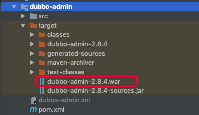

将其放到 tomcat 目录的 webapps 下，启动 tomcat 即可在默认的 8080 端口访问到 Dubbo-admin 的界面，http://localhost:8080/dubbo-admin ，dubbo-admin 为 war 包名称。默认 root 的登录密码为 root，可以在 WEB-INF 中的 dubbo.properties 中配置。

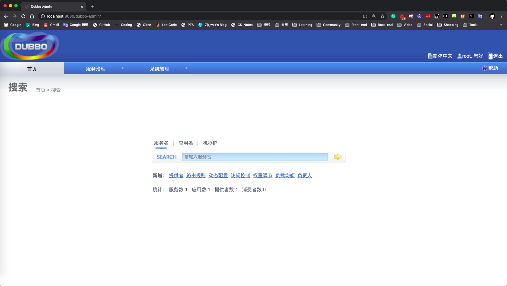

可以在服务治理的服务中查看所有服务，点击服务名可以查看该服务的提供者、消费者等详细信息。

### 服务提供者

可以对其提供者进行权重修改（用于 Dubbo 的负载均衡特性），权重越高越容易被调用。也可以禁用某一台机器的服务，消费者将不会对其进行调用。

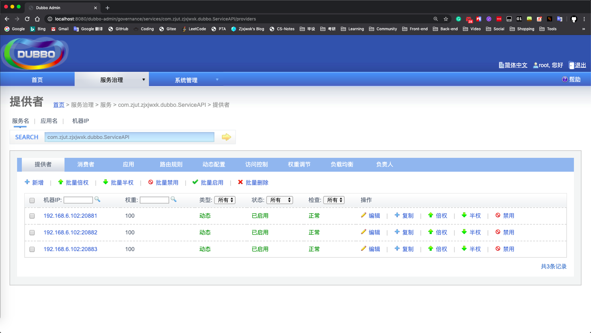

### 服务消费者

可以对服务消费者进行静止、屏蔽和容错。

- 若禁止某一台消费者，则该消费者调用时将会抛出异常。
- 若屏蔽某一台消费者，则该消费者将不会进行远程调用，并且直接返回空对象。
- 若对某一台消费者开启容错，则报任何错误时都会返回一个空对象。

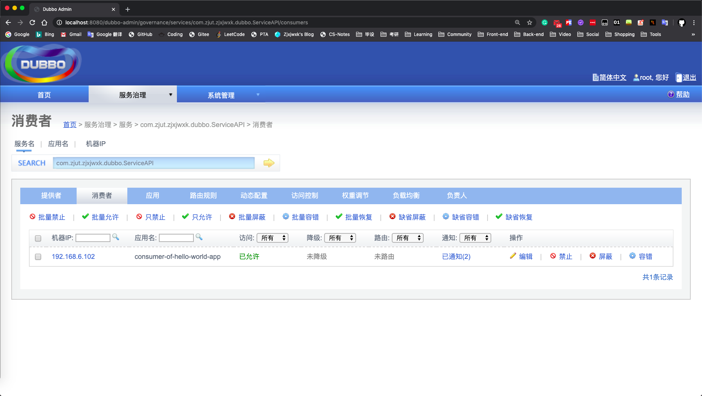

### 应用

可以查看所有应用，包括提供者和消费者。

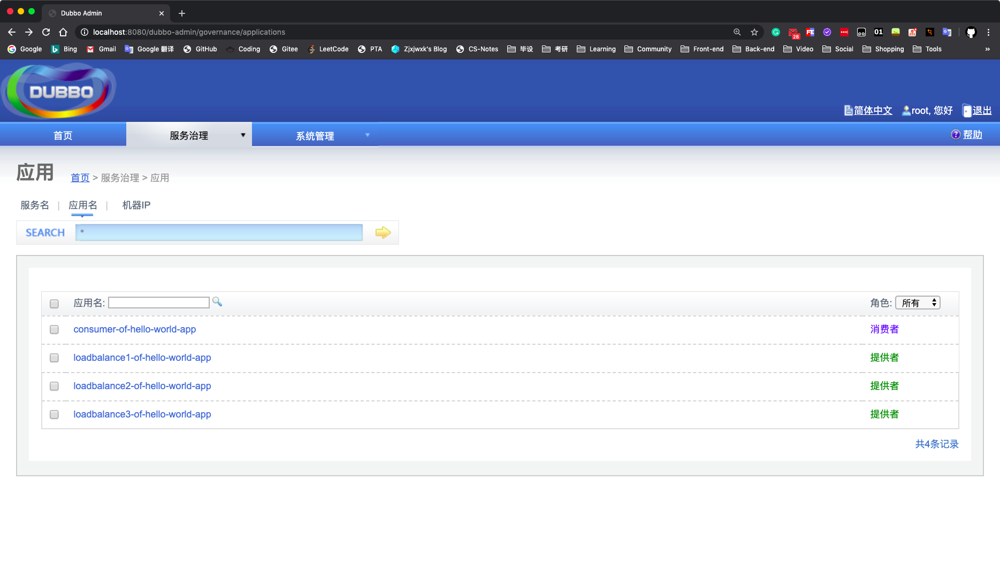

### 路由规则

路由规则在发起一次RPC调用前起到过滤目标服务器地址的作用，过滤后的地址列表，将作为消费端最终发起RPC调用的备选地址。

> 官方文档：https://dubbo.apache.org/zh-cn/docs/user/demos/routing-rule.html

根据官方文档的配置说明，可以在 Dubbo Admin 的服务治理的路由规则中新增配置：

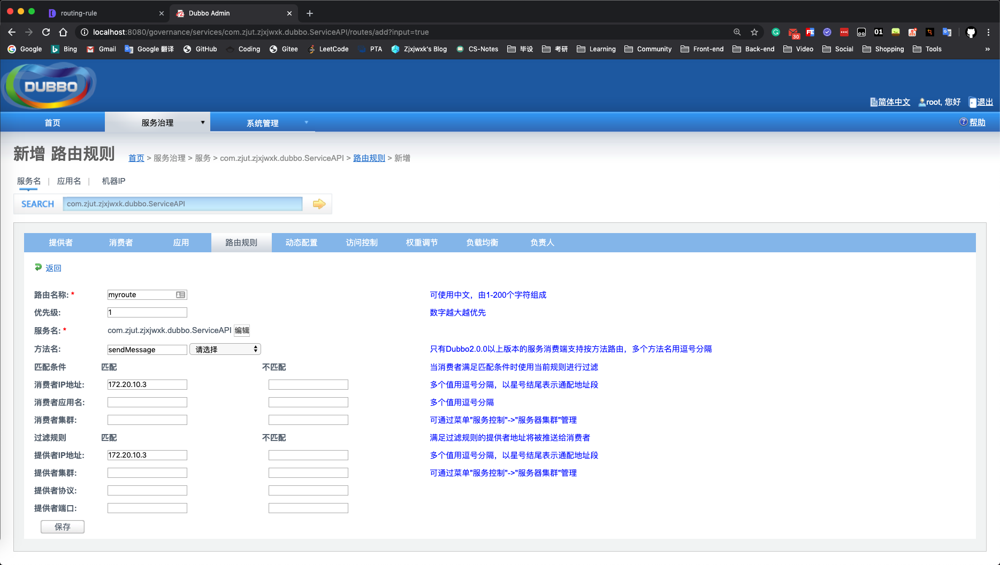

### 动态配置

覆盖规则是Dubbo设计的在无需重启应用的情况下，动态调整RPC调用行为的一种能力。2.7.0版本开始，支持从**服务**和**应用**两个粒度来调整动态配置。

> 官方文档：https://dubbo.apache.org/zh-cn/docs/user/demos/config-rule.html

# 链路监控

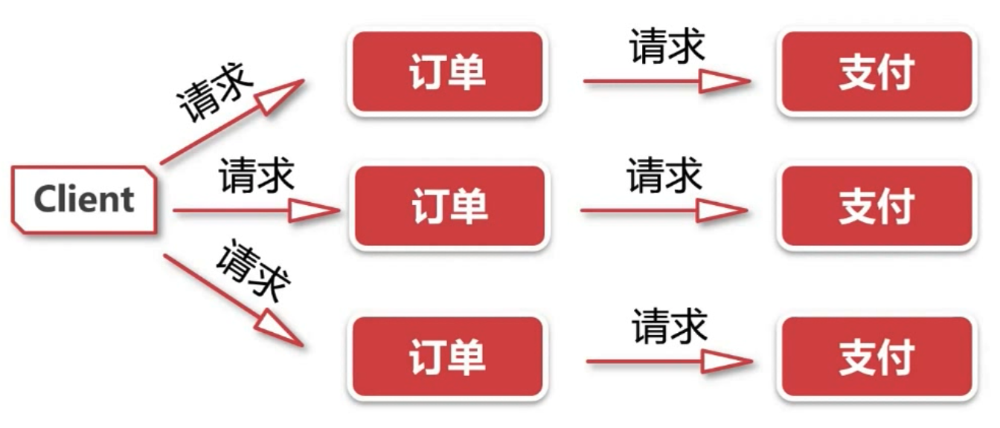

首先，我们需要先熟悉一下 Dubbo-Filter 拦截器：

## Dubbo-Filter

> 官方文档：http://dubbo.apache.org/zh-cn/docs/dev/impls/filter.html

- Dubbo 支持 Filter 机制
- Dubbo 诸多工作都是通过 Filter 实现
- 常见自定义 Filter：例子记录、trace 功能等

### 拦截器简介

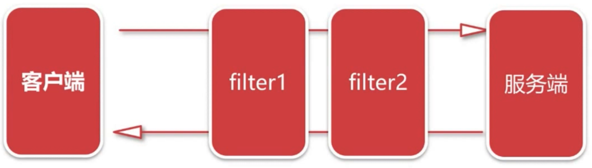

### Dubbo-Filter 使用

Spring XML 配置：

```xml
<!-- 消费方调用过程拦截 -->
<dubbo:reference filter="xxx,yyy" />
<!-- 消费方调用过程缺省拦截器，将拦截所有reference -->
<dubbo:consumer filter="xxx,yyy"/>
<!-- 提供方调用过程拦截 -->
<dubbo:service filter="xxx,yyy" />
<!-- 提供方调用过程缺省拦截器，将拦截所有service -->
<dubbo:provider filter="xxx,yyy"/>
```

创建一个 Filter 类，实现 com.alibaba.dubbo.rpc.Filter 接口，可以在服务调用前后做一些事情，这里用控制台输出表示：

```java
public class MyFilter implements Filter {

    @Override
    public Result invoke(Invoker<?> invoker, Invocation invocation) throws RpcException {
     // do something...
        System.out.println("服务调用之前");
        Result result = invoker.invoke(invocation);
        System.out.println("服务调用之后");
     // do something...
        return result;
    }
}
```

在模块的 resources 下创建 META-INF 文件夹，并在 META-INF 下创建 dubbo 文件夹，在其中创建一个名为 com.alibaba.dubbo.rpc.Filter 的纯文件（File），并在其中添加之前创建的 Filter 类：

```txt
MyFilter=com.zjut.zjxjwxk.springboot.provider.filter.MyFilter
```

这样，在调用服务时，就会被 MyFilter 拦截器拦截，并在调用前后可以做一些事情，比如链路监控。

```
服务调用之前
quickstart-provider-message=Hello World!
服务调用之后
```


然后，介绍一下 Zipkin：

## Zipkin

> 官网：https://zipkin.io

Zipkin 是一个分布式跟踪系统。它有助于收集解决服务体系结构中的延迟问题所需的时序数据。功能包括该数据的收集和查找。

### Zipkin 架构

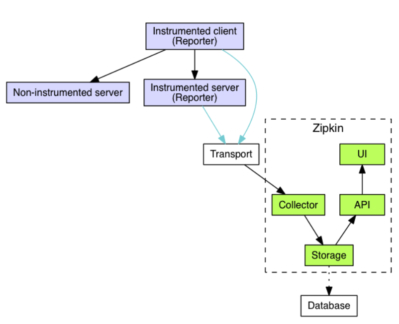

### Zipkin 简介

| 构成           | 作用                       |
| -------------- | -------------------------- |
| TraceID        | 全局唯一表示，单次请求唯一 |
| SpanID         | 调用编号，每次远程调用唯一 |
| ParentID       | 父请求编号，上一级 SpanID  |
| Client Start   | cs，表示客户端发起请求     |
| Server Receive | sr，表示服务端收到请求     |
| Server Send    | ss，表示服务端完成处理     |
| Client Receive | cr，表示客户端收到相应     |


### Zipkin 运行

The quickest way to get started is to fetch the [latest released server](https://search.maven.org/remote_content?g=io.zipkin&a=zipkin-server&v=LATEST&c=exec) as a self-contained executable jar. Note that the Zipkin server requires minimum JRE 8. For example:

```shell
curl -sSL https://zipkin.io/quickstart.sh | bash -s
java -jar zipkin.jar
```

可以在默认的 9411 端口上看到 Zipkin 的界面：

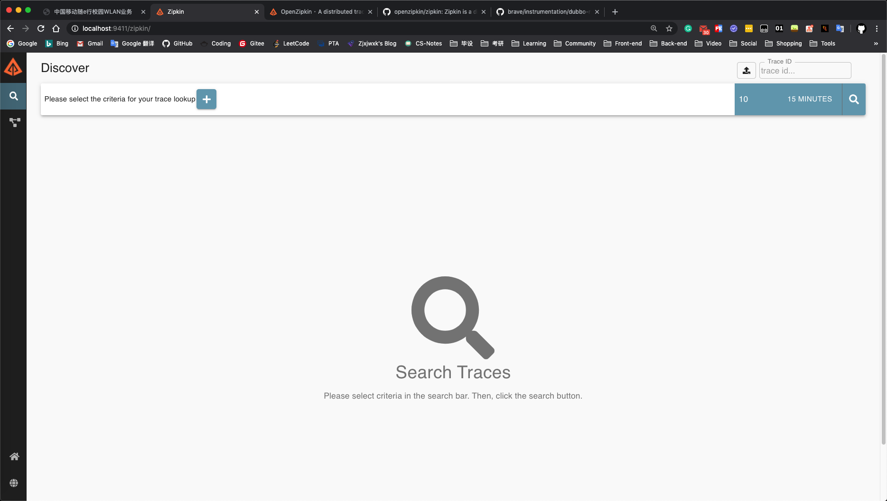

### Dubbo Spring 项目配置

主模块 pom.xml：

```xml
<dependencyManagement>
        <dependencies>
            <dependency>
                <groupId>io.zipkin.brave</groupId>
                <artifactId>brave-bom</artifactId>
                <version>5.5.0</version>
                <type>pom</type>
                <scope>import</scope>
            </dependency>
            <dependency>
                <groupId>io.zipkin.reporter2</groupId>
                <artifactId>zipkin-reporter-bom</artifactId>
                <version>2.7.9</version>
                <type>pom</type>
                <scope>import</scope>
            </dependency>
        </dependencies>
    </dependencyManagement>
```

provider 模块 pom.xml：

```xml
<dependency>
            <groupId>io.zipkin.brave</groupId>
            <artifactId>brave-instrumentation-dubbo-rpc</artifactId>
        </dependency>

        <dependency>
            <groupId>io.zipkin.brave</groupId>
            <artifactId>brave-spring-beans</artifactId>
        </dependency>

        <dependency>
            <groupId>io.zipkin.brave</groupId>
            <artifactId>brave-context-slf4j</artifactId>
        </dependency>

        <dependency>
            <groupId>io.zipkin.reporter2</groupId>
            <artifactId>zipkin-sender-okhttp3</artifactId>
        </dependency>
```

provider spring 配置文件：

```xml
<bean id="sender" class="zipkin2.reporter.beans.OkHttpSenderFactoryBean">
		<property name="endpoint" value="http://localhost:9411/api/v2/spans"/>
	</bean>

	<bean id="tracing" class="brave.spring.beans.TracingFactoryBean">
		<property name="localServiceName" value="hello-service"/>
		<property name="spanReporter">
			<bean class="zipkin2.reporter.beans.AsyncReporterFactoryBean">
				<property name="sender" ref="sender"/>
				<!-- wait up to half a second for any in-flight spans on close -->
				<property name="closeTimeout" value="500"/>
			</bean>
		</property>
		<property name="currentTraceContext">
			<bean class="brave.spring.beans.CurrentTraceContextFactoryBean">
				<property name="scopeDecorators">
					<bean class="brave.context.slf4j.MDCScopeDecorator" factory-method="create"/>
				</property>
			</bean>
		</property>
	</bean>
```

根据 openzipkin/brave GitHub 仓库中，brave/instrumentation/dubbo-rpc 中的文档说明：https://github.com/openzipkin/brave/tree/master/instrumentation/dubbo-rpc ，要在需要监控的服务上添加 filter="tracing" ，如：

```xml
<dubbo:service
			interface="com.zjut.zjxjwxk.dubbo.ServiceAPI"
			ref="quickStartService"
			filter="tracing"
	/>
```

或者监控所有服务，则加在 consumer 和 provider 上：

```xml
<dubbo:consumer filter="tracing" />
<dubbo:provider filter="tracing" />
```

这样，在调用服务后，就能在 Zipkin 中找到对应的服务请求状态了：

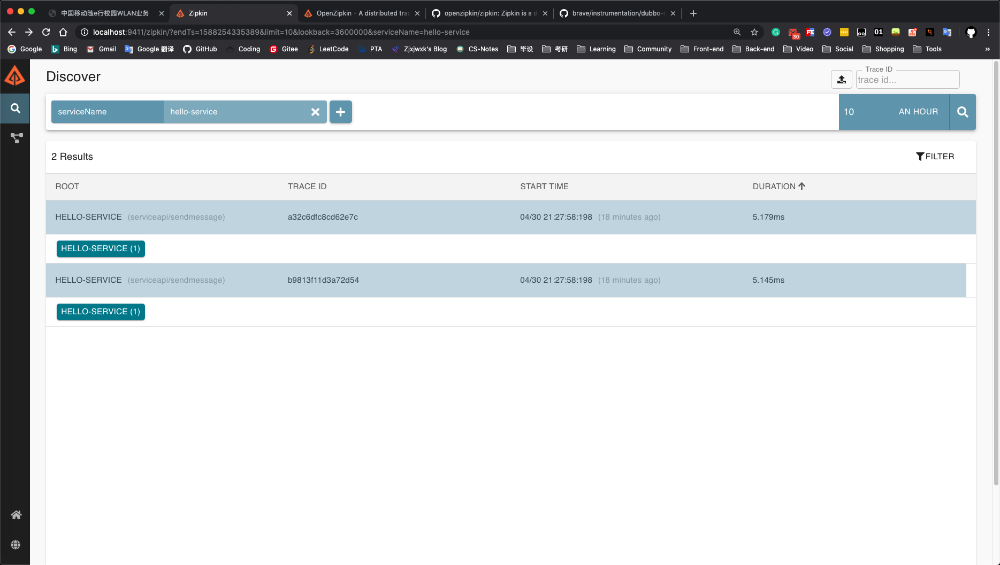

### Dubbo SpringBoot 项目配置

主模块 pom.xml：

```xml
<dependencyManagement>
        <dependencies>
            <dependency>
                <groupId>io.zipkin.brave</groupId>
                <artifactId>brave-bom</artifactId>
                <version>5.5.0</version>
                <type>pom</type>
                <scope>import</scope>
            </dependency>
            <dependency>
                <groupId>io.zipkin.reporter2</groupId>
                <artifactId>zipkin-reporter-bom</artifactId>
                <version>2.7.9</version>
                <type>pom</type>
                <scope>import</scope>
            </dependency>
        </dependencies>
    </dependencyManagement>
```

provider 模块 pom.xml：

```xml
<dependency>
            <groupId>io.zipkin.brave</groupId>
            <artifactId>brave-instrumentation-dubbo-rpc</artifactId>
        </dependency>

        <dependency>
            <groupId>io.zipkin.brave</groupId>
            <artifactId>brave-spring-beans</artifactId>
        </dependency>

        <dependency>
            <groupId>io.zipkin.brave</groupId>
            <artifactId>brave-context-slf4j</artifactId>
        </dependency>

        <dependency>
            <groupId>io.zipkin.reporter2</groupId>
            <artifactId>zipkin-sender-okhttp3</artifactId>
        </dependency>

	<!-- SpringBoot 需要的额外依赖 -->
	<dependency>
            <groupId>org.apache.curator</groupId>
            <artifactId>curator-framework</artifactId>
            <version>4.0.1</version>
        </dependency>
```

SpringBoot 不需要 Spring XML 文件，只需要创建一个 TraceConfig 配置类，该类每个需要监控的模块都需要一个，其 LocalServiceName 可以设置为服务名，如 order 模块中的该配置类（别忘了在 @Bean 中加上 "tracing" 名称）：

```java
@Configuration
public class TraceConfig {

    @Bean("tracing")
    public TracingFactoryBean getTracingBean() {
        TracingFactoryBean tracingFactoryBean = new TracingFactoryBean();
        tracingFactoryBean.setLocalServiceName("order");
        tracingFactoryBean.setSpanReporter(AsyncReporter.create(OkHttpSender.create("http://localhost:9411/api/v2/spans")));
        return tracingFactoryBean;
    }
}
```

#### 方法级别

在需要监控的消费者的 @Reference 和提供者的 @Service 中添加 filter 属性为 "tracing" 即可：

消费者：

```java
@Reference(interfaceClass = AlipayServiceApi.class, filter = "tracing")
    private AlipayServiceApi alipayServiceApi;
```

提供者：

```java
@Service(interfaceClass = OrderServiceApi.class, filter = "tracing")
```

#### 服务级别

在需要监控的服务的 application.yml 中添加如下配置，则对该服务的服务消费和提供均进行监控：

```yaml
spring:
  dubbo:
    provider:
      filter: tracing
    consumer:
      filter: tracing
```

### Zipkin 监控面板

之后每次调用被监控的服务，就能在 Zipkin 面板中找到对应的调用链路：

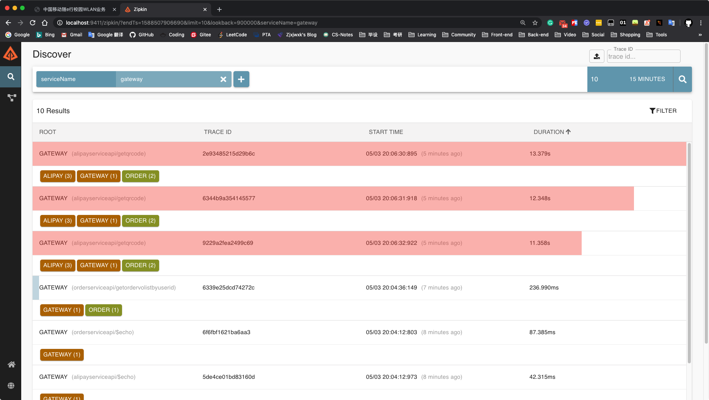

可以在 Discover 面板中，找到一定时间内被监控的服务调用。

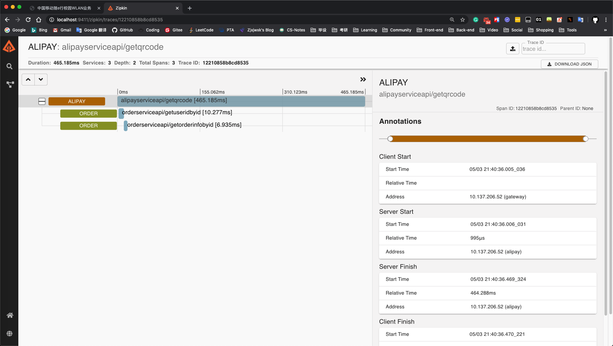

接口调用详情中，接口的调用链路和时间一目了然，可以找出哪个接口调用的时间较长，或者错误发生在哪个接口的调用过程中，还可以从右侧的 Annotaions 中看到客户端和服务器的 Start 和 Finish 时间，以判断哪一台服务器的访问速度较慢等。

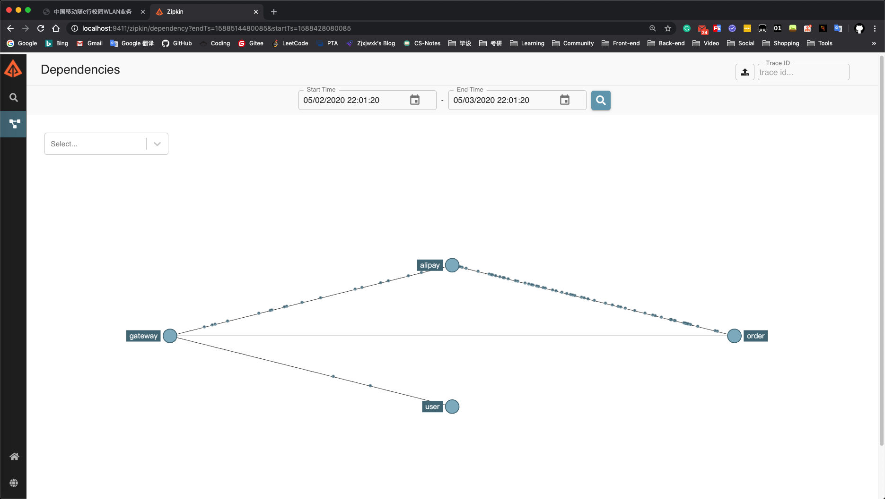

Dependencies 面板中，服务之间的依赖关系以及访问流量以可视化的方式呈现出来。

（Zipkin 默认使用内存的形式存储数据，它也支持 MySQL 等持久化存储方式，以便于以后的数据分析）