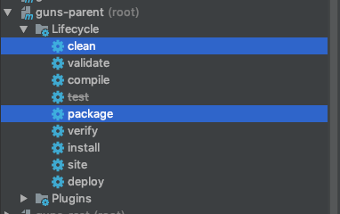

# 运行环境

- CentOS 6
- 云服务器

# 创建用户

创建一个 cinema 用户：

```bash
[root@huawei ~]# useradd cinema
[root@huawei ~]# passwd cinema
Changing password for user cinema.
New password: 
BAD PASSWORD: it does not contain enough DIFFERENT characters
Retype new password: 
passwd: all authentication tokens updated successfully.
```

给予其权限，首先需要赋予当前用户对 /etc/sudoers 的写权限，然后在 sudoers 文件中的 root ALL = (ALL) ALL 下增加一行，赋予其在任何地方执行任何命令的权限：

```bash
chmod u+w /etc/sudoers
vim sudoers
```

```bash
## Allow root to run any commands anywhere 
root    ALL=(ALL)       ALL
cinema  ALL=(ALL)       ALL
```

最后，取消当前用户的写权限：

```bash
chmod u-w /etc/sudoers
```

# 关闭 iptables 防火墙

我们只需要使用云服务器提供的防火墙就够了

```bash
service iptables stop
```

并且关闭开机启动

```bash
chkconfig iptables off
```

# 安装数据库

下载并安装 MySQL Yum Repository（MySQL 镜像源）：

```bash
wget https://dev.mysql.com/get/mysql80-community-release-el6-3.noarch.rpm
sudo yum install mysql80-community-release-el6-3.noarch.rpm
```

验证安装是否成功：

```bash
ls /etc/yum.repos.d/
```

若存在 mysql-community.repo 和 mysql-community-source.repo，则表示 MySQL Yum Repository 安装成功。

查看所有 MySQL 版本：

```bash
yum repolist all | grep mysql
```

禁用最新版，使用 5.7 版本：

```bash
sudo yum-config-manager --disable mysql80-community
sudo yum-config-manager --enable mysql57-community
```

安装 MySQL：

```bash
sudo yum install mysql-community-server
```

开启 MySQL 服务：

```bash
sudo service mysqld start
```

查看 MySQL 初始密码：

```bash
sudo grep "password" /var/log/mysqld.log
```

利用初始密码登录数据库：

```bash
mysql -uroot -p
```

修改初始密码：

```bash
set password for 'root'@'localhost' = password('Zjxjwxk19981018_');
```

查看当前有哪些用户：

```bash
mysql> select host, user from mysql.user;
+---------+---------------+
| host          | user                      |
+-------- +---------------+
| localhost | mysql.session    |
| localhost | mysql.sys            |
| localhost | root                       |
+-----------+-------------+
```

修改 root 用户访问权限，使得其可以被远程访问：

```bash
UPDATE mysql.user SET host = '%' WHERE user = 'root' and host = 'localhost';
```

修改后重启 MySQL：

```bash
sudo service mysqld restart
```

# 安装 vsftpd

> 阿里云文档：https://help.aliyun.com/knowledge_detail/60152.html

# 安装 JDK 和 Zookeeper

## 安装 JDK

在本地上，从 Oracle 官网下载 jdk 的 tar.gz 包 https://www.oracle.com/java/technologies/javase/javase-jdk8-downloads.html ，并上传到服务器上：

```shell
sudo scp jdk-8u251-linux-x64.tar.gz cinema@34.80.107.207:~/install/
```

如果 scp 出现 `Permission denied (publickey,gssapi-keyex,gssapi-with-mic).` ，则可能需要在服务器上设置密码登录为 `yes`：

```shell
sudo vim /etc/ssh/sshd_config
```

将 PasswordAuthentication no 中的 “no” 改为 "yes"。

在服务器解压：

```bash
tar -zxvf jdk-8u251-linux-x64.tar.gz
```

添加 JAVA_HOME 环境变量：

```bash
vim /etc/profile
```

添加以下几行：

```bash
## JAVA_HOME
export JAVA_HOME=/developer/jdk1.8.0_251

export PATH=$PATH:$JAVA_HOME/bin
```

生效环境变量：

```bash
source /etc/profile
```

## 安装 Zookeeper

从 Apache Zookeeper 官网获取 tar.gz 包：

```bash
wget https://mirror.bit.edu.cn/apache/zookeeper/zookeeper-3.4.14/zookeeper-3.4.14.tar.gz
```

同样，解压之：

```bash
tar -zxvf zookeeper-3.4.14.tar.gz
```

重命名 zoo_sample.cfg 为 zoo.cfg：

```bash
mv zookeeper-3.4.14/conf/zoo_sample.cfg zoo.cfg
```

启动 Zookeeper：

```bash
sh zookeeper-3.4.14/bin/zkServer.sh start
```

查看服务进程：

```bash
ps -ef | grep zookeeper
```

# 数据初始化、工程打包和部署

将各个模块的 application.yml 配置为线上环境，包括数据库和 FTP 服务器的地址、用户名和密码等。然后直接对父模块使用 maven clean 和 package 打包各个模块为 jar 包，发送到服务器上部署运行即可（jar 包后台运行和日志输出重定向见 [CentOS jar包后台运行](https://zjxjwxk.com/2019/01/30/Linux/CentOS/CentOS jar包后台运行/)）。当然，这里是一种比较 low 的部署方式，可以通过 Jenkins，k8s 等进行持续集成。



可以通过以下命令查看是否启动成功：

```bash
ps -ef | grep xxx
或者
jobs
```

# 安装 OpenResty

## 安装前的准备

您必须将这些库 `perl 5.6.1+`, `libpcre`, `libssl`安装在您的电脑之中。 对于 Linux来说, 您需要确认使用 `ldconfig` 命令，让其在您的系统环境路径中能找到它们。

## Fedora 和 RedHat 用户

推荐您使用yum安装以下的开发库:

```bash
yum install pcre-devel openssl-devel gcc curl
```

# 构建 OpenResty

## 下载

从下载页 [Download](https://openresty.org/cn/download.html)下载最新的 OpenResty® 源码包，并且像下面的示例一样将其解压:

```bash
tar -xzvf openresty-VERSION.tar.gz
```

`VERSION` 的地方替换成您下载的源码包的版本号，比如说 `0.8.54.6`。

## ./configure

然后在进入 `openresty-VERSION/` 目录, 然后输入以下命令配置:

```bash
./configure
```

默认, `--prefix=/usr/local/openresty` 程序会被安装到/usr/local/openresty目录。

您可以指定各种选项，比如

```bash
./configure --prefix=/developer/openresty \
            --with-luajit \
            --without-http_redis2_module \
            --with-http_iconv_module
```

试着使用 `./configure --help` 查看更多的选项。

配置文件（./configure script）运行出错可以到 `build/nginx-VERSION/objs/autoconf.err` 找到。 `VERSION` 的地方必须与[OpenResty](https://openresty.org/cn/openresty.html)版本号相对应, 比如 `0.8.54.6`。

需要额外安装 postersql-devel

```bash
sudo yum install -y postgresql-devel
```

## make

您可以使用下面的命令来编译：

```bash
make
```

如果您的电脑支持多核 `make` 工作的特性, 您可以这样编译:

```bash
make -j2
```

假设您是的机器是双核。

## make install

如果前面的步骤都没有问题的话,您可以使用下面的命令安装 [OpenResty](https://openresty.org/cn/openresty.html) 到您的系统中：

```bash
make install
```

在 Linux 上，通常需要使用 `sudo` 来获取 root 权限来完成安装。

如果在 prefix 目录有了 openresty 目录，这代表安装完成。

## 配置 Nginx

编辑 Nginx 的 nginx.conf

```bash
vim openresty/nginx/conf/nginx.conf
```

在其中启用（去掉注释） error_log, pid, http 中的 log_format 和 access_log。

在 http 的 server 中，去掉 access_log 的注释（全局也有一个 access_log，局部优先），并给 server_name 添加域名，将 location / 中修改为 proxy_pass http://127.0.0.1:8081 （此处为我的 gateway 网关模块运行端口），即代理访问 gateway 服务。FTP 服务器代理则为 root /ftpfile/ 。

```json

#user  nobody;
worker_processes  1;

error_log  logs/error.log;
#error_log  logs/error.log  notice;
#error_log  logs/error.log  info;

pid        logs/nginx.pid;


events {
    worker_connections  1024;
}


http {
    include       mime.types;
    default_type  application/octet-stream;

    log_format  main  '$remote_addr - $remote_user [$time_local] "$request" '
                      '$status $body_bytes_sent "$http_referer" '
                      '"$http_user_agent" "$http_x_forwarded_for"';

    access_log  logs/access.log  main;

    sendfile        on;
    #tcp_nopush     on;

    #keepalive_timeout  0;
    keepalive_timeout  65;

    #gzip  on;

    server {
        listen       80;
        server_name  localhost www.cinema.zjxjwxk.com cinema.zjxjwxk.com

        #charset koi8-r;

        access_log  logs/host.access.log  main;

        location / {
            proxy_pass http://127.0.0.1:8081
        }

        #error_page  404              /404.html;

        # redirect server error pages to the static page /50x.html
        #
        error_page   500 502 503 504  /50x.html;
        location = /50x.html {
            root   html;
        }

        # proxy the PHP scripts to Apache listening on 127.0.0.1:80
        #
        #location ~ \.php$ {
        #    proxy_pass   http://127.0.0.1;
        #}

        # pass the PHP scripts to FastCGI server listening on 127.0.0.1:9000
        #
        #location ~ \.php$ {
        #    root           html;
        #    fastcgi_pass   127.0.0.1:9000;
        #    fastcgi_index  index.php;
        #    fastcgi_param  SCRIPT_FILENAME  /scripts$fastcgi_script_name;
        #    include        fastcgi_params;
        #}

        # deny access to .htaccess files, if Apache's document root
        # concurs with nginx's one
        #
        #location ~ /\.ht {
        #    deny  all;
        #}
    }


    # another virtual host using mix of IP-, name-, and port-based configuration
    #
    # vsftpd FTP server
    #server {
    #    listen       80;   
    #    server_name  localhost img-cinema.zjxjwxk.com;

    #    location / {
    #        root   /ftpfile/;
    #    }
    #}


    # HTTPS server
    #
    #server {
    #    listen       443 ssl;
    #    server_name  localhost;

    #    ssl_certificate      cert.pem;
    #    ssl_certificate_key  cert.key;

    #    ssl_session_cache    shared:SSL:1m;
    #    ssl_session_timeout  5m;

    #    ssl_ciphers  HIGH:!aNULL:!MD5;
    #    ssl_prefer_server_ciphers  on;

    #    location / {
    #        root   html;
    #        index  index.html index.htm;
    #    }
    #}

}
```

在 sbin 中执行以下命令查看配置是否合法

```bash
sudo ./nginx -t
```

 运行 nginx

```bash
./nginx
```

验证是否运行成功

```bash
netstat -nlp | grep "nginx"
```

