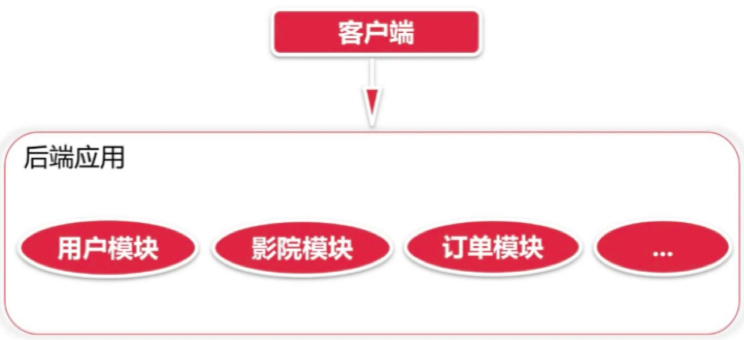
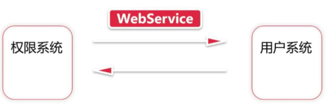

# 传统业务应用

# 传统应用带来的问题

- 单一业务开发和迭代困难
- 扩容困难
- 部署和回滚困难

# 微服务发展历程

## 面向服务开发 - SOA

## 微服务开发

# 微服务概述

- 微服务是一种将业务系统进一步拆分的架构风格
- 微服务强调每个单一业务都独立运行
- 每个单一服务都应该使用更轻量的机制保持通信
- 服务不强调环境，可以不同语言或数据源

# 微服务选择

- Dubbo
- Spring Cloud
- Zero ICE