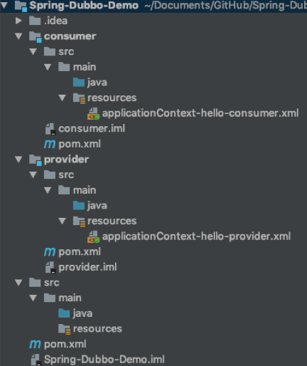
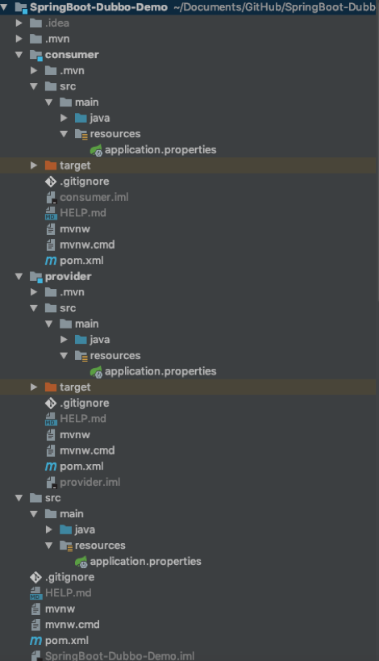
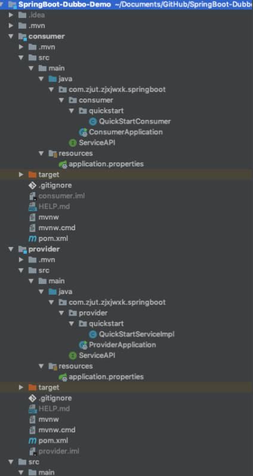
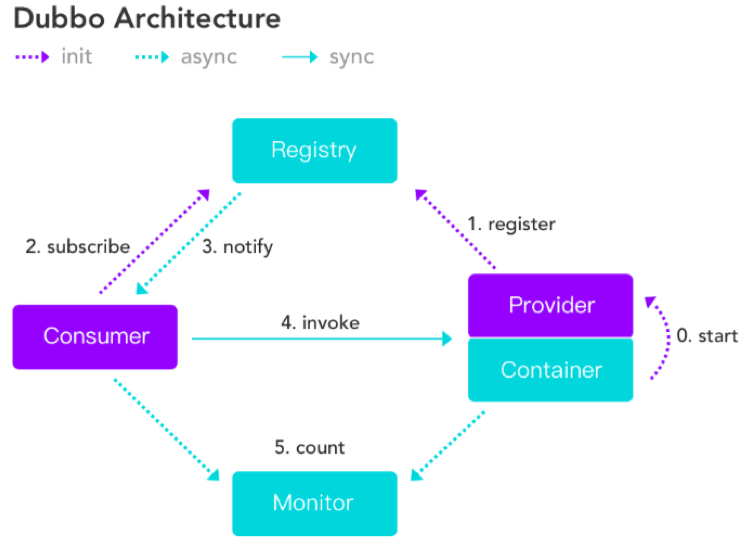

# 基础环境搭建

## 基于Guns + SpringBoot + Dubbo构建影院平台

- Spring + Dubbo
- SpringBoot + Dubbo

## 微服务基本概念

- Provider：服务提供者
- Consumer：服务调用者，调用 Provider 提供的服务实现
- 同一个服务可以即是 Provider，又是 Consumer

以下可以选用 Spring 或 SpringBoot

## Spring基础环境构建

### 项目结构



### 主模块（Spring-Dubbo-Demo）

在 pom.xml 中添加 dependencies

```xml
<dependencies>
    <dependency>
      <groupId>com.101tec</groupId>
      <artifactId>zkclient</artifactId>
      <version>0.9</version>
    </dependency>
    <dependency>
      <groupId>org.apache.zookeeper</groupId>
      <artifactId>zookeeper</artifactId>
      <version>3.4.9</version>
      <type>pom</type>
    </dependency>
    <dependency>
      <groupId>com.alibaba</groupId>
      <artifactId>dubbo</artifactId>
      <version>2.5.3</version>
    </dependency>
    <dependency>
      <groupId>io.netty</groupId>
      <artifactId>netty-all</artifactId>
      <version>4.1.6.Final</version>
    </dependency>
    <dependency>
      <groupId>commons-logging</groupId>
      <artifactId>commons-logging</artifactId>
      <version>1.2</version>
    </dependency>
    <dependency>
      <groupId>org.javassist</groupId>
      <artifactId>javassist</artifactId>
      <version>3.21.0-GA</version>
    </dependency>
    <dependency>
      <groupId>log4j</groupId>
      <artifactId>log4j</artifactId>
      <version>1.2.17</version>
    </dependency>
    <!-- spring相关jar -->
    <dependency>
      <groupId>org.springframework</groupId>
      <artifactId>spring-context</artifactId>
      <version>4.3.3.RELEASE</version>
    </dependency>
    <dependency>
      <groupId>org.springframework</groupId>
      <artifactId>spring-context-support</artifactId>
      <version>4.3.3.RELEASE</version>
    </dependency>
    <dependency>
      <groupId>org.springframework</groupId>
      <artifactId>spring-core</artifactId>
      <version>4.3.3.RELEASE</version>
    </dependency>
    <dependency>
      <groupId>org.springframework</groupId>
      <artifactId>spring-beans</artifactId>
      <version>4.3.3.RELEASE</version>
    </dependency>
    <dependency>
      <groupId>org.springframework</groupId>
      <artifactId>spring-aop</artifactId>
      <version>4.3.3.RELEASE</version>
    </dependency>
    <dependency>
      <groupId>org.springframework</groupId>
      <artifactId>spring-aspects</artifactId>
      <version>4.3.3.RELEASE</version>
    </dependency>
    <dependency>
      <groupId>org.springframework</groupId>
      <artifactId>spring-expression</artifactId>
      <version>4.3.3.RELEASE</version>
    </dependency>

    <dependency>
      <groupId>junit</groupId>
      <artifactId>junit</artifactId>
      <version>4.12</version>
      <scope>test</scope>
    </dependency>

  </dependencies>
```

### 子模块（provider、consumer）

在 resources 中添加 applicationContext.xml（可更改后缀）

```xml
<?xml version="1.0" encoding="UTF-8"?>
<beans xmlns="http://www.springframework.org/schema/beans"
	xmlns:xsi="http://www.w3.org/2001/XMLSchema-instance"
	xmlns:context="http://www.springframework.org/schema/context"
	xmlns:aop="http://www.springframework.org/schema/aop"
	xmlns:tx="http://www.springframework.org/schema/tx"
	xmlns:dubbo="http://code.alibabatech.com/schema/dubbo"
	xsi:schemaLocation="
	http://www.springframework.org/schema/beans http://www.springframework.org/schema/beans/spring-beans-3.0.xsd
	http://www.springframework.org/schema/context http://www.springframework.org/schema/context/spring-context-3.0.xsd
	http://www.springframework.org/schema/aop http://www.springframework.org/schema/aop/spring-aop-3.0.xsd
	http://www.springframework.org/schema/tx http://www.springframework.org/schema/tx/spring-tx-3.0.xsd
	http://code.alibabatech.com/schema/dubbo http://code.alibabatech.com/schema/dubbo/dubbo.xsd
	"
	>

</beans>
```

## Spring的直连提供者

### provider

applicationContext-hello-provider.xml 配置

```xml
<dubbo:application name="hello-world-app"  />
<dubbo:protocol name="dubbo" port="20880" />
<bean id="quickStartService" class="com.zjut.zjxjwxk.dubbo.quickstart.QuickStartServiceImpl"></bean>
<dubbo:service
	registry="N/A"
	interface="com.zjut.zjxjwxk.dubbo.ServiceAPI"
	ref="quickStartService" 
/>
```

启动 provider

```java
public class ProviderClient {

    public static void main(String[] args) {
        ClassPathXmlApplicationContext context = new ClassPathXmlApplicationContext("applicationContext-hello-provider.xml");

        context.start();

        try {
            System.in.read();
        } catch (IOException e) {
            e.printStackTrace();
        }
    }
}
```

### consumer

consumer 的 applicationContext-hello-consumer.xml 配置

```xml
<dubbo:application name="consumer-of-hello-world-app"  />
<dubbo:reference
	id="consumerService"
	interface="com.zjut.zjxjwxk.dubbo.ServiceAPI"
	url="dubbo://localhost:20880"
/>
```

启动 consumer 即可获取和调用 provider 提供的接口

```java
public class ConsumerClient {

    public static void main(String[] args) {
        ClassPathXmlApplicationContext context = new ClassPathXmlApplicationContext("applicationContext-hello-consumer.xml");

        context.start();

        while (true) {
            Scanner scanner = new Scanner(System.in);
            String message = scanner.next();

            // 获取接口
            ServiceAPI serviceAPI = (ServiceAPI) context.getBean("consumerService");
            System.out.println(serviceAPI.sendMessage(message));
        }

    }
}
```


## SpringBoot基础环境构建

### 项目结构



### 主模块（SpringBoot-Dubbo-Demo）

### 子模块（consumer、provider）

#### provider

- 配置 application.properties

```yaml
spring.application.name=dubbo-spring-boot-starter
spring.dubbo.server=true
spring.dubbo.registry=N/A
```


#### consumer

- 配置 application.properties

```yaml
spring.application.name=dubbo-spring-boot-starter
```


## SpringBoot的直连提供者

给 provider 和 consumer 的 Application 都添加 @EnableDubboConfiguration 注解。

### provider

- 给实现类添加 @Component 和 @Service 注解（来自dubbo的）
- @Service 指明实现接口的     Class

```java
@Component
@Service(interfaceClass = ServiceAPI.class)
public class QuickStartServiceImpl implements ServiceAPI {

    @Override
    public String sendMessage(String message) {
        return "quickstart-provider-message=" + message;
    }
}
```

### consumer

- consumer 即可注入并调用接口
- 声明的接口添加 @Reference 注解并注明 url （dubbo默认在20880端口）

```java
@Component
public class QuickStartConsumer {

    @Reference(url = "dubbo://localhost:20880")
    ServiceAPI serviceAPI;

    public void sendMessage(String message) {
        System.out.println(serviceAPI.sendMessage(message));
    }

}
```

- 项目结构



# 注册中心概念

## 直连提供者

- 消费端知道服务提供者的地址，直接进行连接
- 该种方式一般只在测试环境中使用
- 直连提供者限制了分布式的易扩展性

## Dubbo架构



| 节点      | 角色说明                                     |
| --------- | -------------------------------------------- |
| Provider  | 暴露服务的服务提供方                         |
| Consumer  | 调用远程服务的服务消费方                     |
| Registry  | 服务注册与发现的注册中心，通常使用 ZooKeeper |
| Monitor   | 统计服务的调用次数和调用时间的监控中心       |
| Container | 服务运行容器                                 |

# ZooKeeper安装和启动

- 从 Apache ZooKeeper 官网下载 https://www.apache.org/dyn/closer.cgi/zookeeper
- 在 conf 目录下将 zoo-sample.cfg 改为 zoo.cfg
- 在 bin 目录下启动 zkServer.sh
  ```shell
  sh zkServer.sh start
  ```

# Spring集成注册中心

## provider

在 applicationContext-hello-provider.xml 中添加注册中心配置

```xml
<dubbo:registry address="zookeeper://localhost:2181"/>
```

去除 service 中的 registry 属性

```xml
<dubbo:service
	interface="com.zjut.zjxjwxk.dubbo.ServiceAPI"
	ref="quickStartService" />
<!--registry="N/A"-->
```

## consumer

在 applicationContext-hello-consumer.xml 中添加注册中心配置

```xml
<dubbo:registry address="zookeeper://localhost:2181"/>
```

去除 reference 中的 url 属性（非直连，而是通过 zookeeper 注册中心）

```xml
<dubbo:reference
	id="consumerService"
	interface="com.zjut.zjxjwxk.dubbo.ServiceAPI"
/>
<!--url="dubbo://localhost:20880"-->
```

# SpringBoot集成注册中心

## provider

在 pom.xml 中添加 ZooKeeper 依赖

```xml
<dependency>
	<groupId>com.101tec</groupId>
	<artifactId>zkclient</artifactId>
	<version>0.10</version>
</dependency>
```

在 application.properties 中添加注册中心

```yaml
spring.dubbo.registry=zookeeper://localhost:2181
```

## consumer

在 pom.xml 中添加 ZooKeeper 依赖

```xml
<dependency>
	<groupId>com.101tec</groupId>
	<artifactId>zkclient</artifactId>
	<version>0.10</version>
</dependency>
```

在 application.properties 中添加注册中心

```yaml
spring.dubbo.registry=zookeeper://localhost:2181
```

去掉 @Reference 括号中的 url （非直连，而是通过 zookeeper 注册中心）

```java
@Reference
    ServiceAPI serviceAPI;
```

