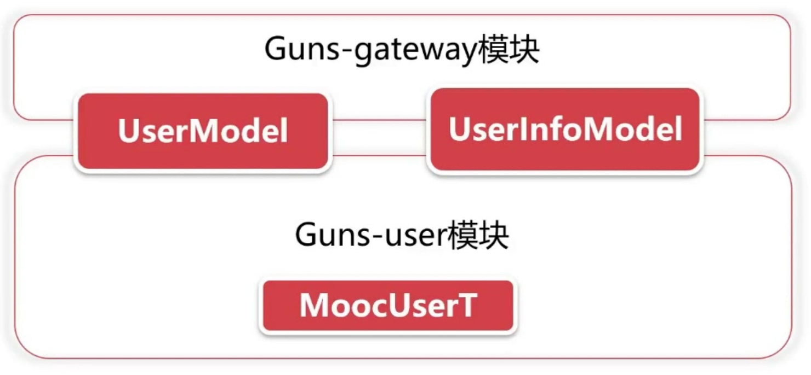

# 章节概要

- 学会 API 网关权限验证和其他服务交互
- 学会开发 SpringBoot 的自定义配置
- 学会 Dubbo 负载均衡策略选择和使用

## 修改 Guns 中的 JWT 模块

- 增加忽略验证 URL 配置
- 修改返回内容匹配业务
- 增加 Threadlocal 的用户信息保存

## 业务功能开发

- 增加用户服务并提供接口
- 初步了解 API 网关与服务之间交互的过程
- 根据接口文档开发用户接口

# 创建用户表

```sql
DROP TABLE IF EXISTS user;
CREATE TABLE user(
   UUID INT PRIMARY KEY AUTO_INCREMENT COMMENT '主键编号',
   user_name VARCHAR(50) COMMENT '用户账号',
   user_pwd VARCHAR(50) COMMENT '用户密码',
   nick_name VARCHAR(50) COMMENT '用户昵称',
   user_sex INT COMMENT '用户性别 0-男，1-女',
   birthday VARCHAR(50) COMMENT '出生日期',
   email VARCHAR(50) COMMENT '用户邮箱',
   user_phone VARCHAR(50) COMMENT '用户手机号',
   address VARCHAR(50) COMMENT '用户住址',
   head_url VARCHAR(50) COMMENT '头像URL',
   biography VARCHAR(200) COMMENT '个人介绍',
   life_state INT COMMENT '生活状态 0-单身，1-热恋中，2-已婚，3-为人父母',
   begin_time TIMESTAMP DEFAULT CURRENT_TIMESTAMP COMMENT '创建时间',
   update_time TIMESTAMP DEFAULT CURRENT_TIMESTAMP ON UPDATE CURRENT_TIMESTAMP COMMENT '修改时间'
) COMMENT '用户表' ENGINE = INNODB AUTO_INCREMENT = 2 CHARACTER SET = utf8 COLLATE = utf8_general_ci ROW_FORMAT = DYNAMIC;

insert into user(user_name,user_pwd,nick_name,user_sex,birthday,email,user_phone,address,head_url,life_state,biography) values('admin','0192023a7bbd73250516f069df18b500','管理员',0,'2018-07-31','admin@gmail.com','13888888888','浙江省杭州市西湖区某路某号','cinema/img/head-img.jpg',0,'我是苦逼的管理员');
insert into user(user_name,user_pwd,nick_name,user_sex,birthday,email,user_phone,address,head_url,life_state,biography) values('test','5e2de6bd1c9b50f6e27d4e55da43b917','测试用户',0,'2018-08-20','test@gmail.com','13866666666','测试地址','cinema/img/head-img.jpg',1,'我是测试用户');
```

# 用户服务与网关交互

在 guns 项目中复制一份 guns-gateway 模块并重命名为 guns-user（修改相应子模块和主模块的 pom.xml 等），并在 application.yml 中将其鉴权机制等关闭（网关才需要）

```yaml
rest:
  auth-open: false #jwt鉴权机制是否开启(true或者false)
  sign-open: false #签名机制是否开启(true或false)
```

端口设为8083

```yaml
server:
  port: 8083 #项目端口
```

在 spring:dubbo: 下添加 Dubbo 协议和端口（UserApplication 需要向外部暴露接口，先向注册中心注册，然后通过 Dubbo 协议被远程调用）

```yaml
spring:
  application:
    name: cinema-user
  dubbo:
    server: true
    registry: zookeeper://localhost:2181
    protocol:
      name: dubbo
      port: 20881
```

在 guns-user 中编写 UserAPI 的实现类，其中 UserAPI 接口是来自于 guns-api 的（在前一章已经做了业务 API 抽离），并通过 @Service 向外部暴露

```java
@Component
@Service(interfaceClass = UserAPI.class)
public class UserImpl implements UserAPI {

    @Override
    public boolean login(String username, String password) {
        System.out.println("This is user service! " + username + ", " + password);
        return false;
    }
}
```

然后，在 guns-gateway 中就可以远程调用 UserAPI 接口了

```java
    @Reference(interfaceClass = UserAPI.class)
    private UserAPI userAPI;
    
    userAPI.login(username, password);
```

# 基于 SpringBoot 配置忽略列表

配置 guns-gateway 网关模块中的 application.yml，在 jwt 下添加 ignore-url 配置，用逗号分隔 url（**注意不能有空格！**），这些接口将不通过 jwt 验证过滤器

```yaml
jwt:
  header: Authorization   #http请求头所需要的字段
  secret: mySecret        #jwt秘钥
  expiration: 604800      #7天 单位:秒
  auth-path: auth         #认证请求的路径
  md5-key: randomKey      #md5加密混淆key
  ignore-url: /user/,/film/  #忽略列表
```

在 JwtProperties 中添加一项成员变量，并添加 get、set 函数，这个类是配置类，`@ConfigurationProperties(prefix = JwtProperties.JWT_PREFIX)` 表示用于从配置文件 application.yml 中获取 jwt 开头的配置变量

```java
@Configuration
@ConfigurationProperties(prefix = JwtProperties.JWT_PREFIX)
public class JwtProperties {

    public static final String JWT_PREFIX = "jwt";

    private String header = "Authorization";

    private String secret = "defaultSecret";

    private Long expiration = 604800L;

    private String authPath = "auth";

    private String md5Key = "randomKey";

    private String ignoreUrl = "";
```

在 AuthFilter 的 doFilterInternal 方法中添加以下代码，用于忽略配置列表

```java
        // 配置忽略列表
        String ignoreUrl = jwtProperties.getIgnoreUrl();
        String[] ignoreUrls = ignoreUrl.split(",");

        for (int i = 0; i < ignoreUrls.length; i++) {
            if (request.getServletPath().equals(ignoreUrls[i])) {
                chain.doFilter(request, response);
                return;
            }
        }
```

# 修改 JWT 申请的返回报文

在 guns-gateway 模块中的 modular.vo 下，创建 ResponseVO 类作为响应VO类，其中包含了三种状态 Status ：0-成功，1-业务失败，999-系统异常

```java
public class ResponseVO<M> {

    /**
     * 返回状态 [0-成功，1-业务失败，999-系统异常]
     */
    private Integer status;
    /**
     * 返回信息
     */
    private String msg;
    /**
     * 返回数据实体
     */
    private M data;

    private ResponseVO() {}

    public static<M> ResponseVO success(M m) {
        ResponseVO responseVO = new ResponseVO();
        responseVO.setStatus(0);
        responseVO.setData(m);
        return responseVO;
    }

    public static ResponseVO serviceFail(String msg) {
        ResponseVO responseVO = new ResponseVO();
        responseVO.setStatus(1);
        responseVO.setMsg(msg);
        return responseVO;
    }

    public static ResponseVO appFail(String msg) {
        ResponseVO responseVO = new ResponseVO();
        responseVO.setStatus(999);
        responseVO.setMsg(msg);
        return responseVO;
    }
```

之后在 AuthController 中就可以用该类作为返回对象了

```java
    @RequestMapping(value = "${jwt.auth-path}")
    public ResponseVO createAuthenticationToken(AuthRequest authRequest) {

        boolean validate = true;

        // 去掉guns自身携带的用户名密码验证机制，使用自己的
        int userId = userAPI.login(authRequest.getUserName(), authRequest.getPassword());

        if (userId == 0) {
            validate = false;
        }

        if (validate) {
            // randomKey和token已经生成完毕
            final String randomKey = jwtTokenUtil.getRandomKey();
            final String token = jwtTokenUtil.generateToken("" + userId, randomKey);
            // 返回值
            return ResponseVO.success(new AuthResponse(token, randomKey));
        } else {
            return ResponseVO.serviceFail("用户名或密码错误");
        }
    }
```

# 增加 Threadlocal 的用户信息保存

在 guns-gateway 中的 common 下创建 CurrentUser 类用于保存 userId（不直接保存 userInfoModel 是因为更省空间，避免用户量大时出现内存溢出），该 userId 存在 ThreadLocal 中和线程绑定，同一线程内共享

```java
public class CurrentUser {

    /**
     * 线程绑定的存储空间
     */
    private static final ThreadLocal<String> threadLocal = new ThreadLocal<>();

    public static void saveUserId(String userId) {
        threadLocal.set(userId);
    }

    public static String getCurrentUser() {
        return threadLocal.get();
    }
}
```

之后，在 AuthFilter 验证 token 时，就可以通过 token 获取 userID，并且将之存入 ThreadLocal，以便后续业务调用了

```java
            String userId = jwtTokenUtil.getUsernameFromToken(authToken);
            if (userId == null) {
                return;
            } else {
                CurrentUser.saveUserId(userId);
            }
```

在用户后续访问时，就可以取出 userId，并从数据库或 redis 中获取用户信息了

```java
@Controller
@RequestMapping("/hello")
public class ExampleController {

    @RequestMapping("")
    public ResponseEntity hello() {

        System.out.println(CurrentUser.getCurrentUser());

        // 这里将以userId为key，userInfo为value存在redis中，TTL为30分钟
        // 或以userId为条件去数据库取出（和redis只有快慢的区别）

        return ResponseEntity.ok("请求成功!");
    }
}
```

# 用户模块开发

## 业务功能开发流程

### 使用代码生成器生成数据项

在每个 guns 模块的 test 下，都有 enerator.EntityGenerator 这个用于实体生成的类，只需根据需要稍微修改一下方法的参数即可。在 guns-user 模块中生成即可得到：UserT, UserTMapper, UserTMapper.xml

```java
...
// 生成代码的绝对目录
gc.setOutputDir("/Users/zjxjwxk/Documents/GitHub/Cinema-Dubbo/guns-user/src/main/java");
...
// 作者信息
gc.setAuthor("zjxjwxk");
...
// 数据库连接配置
dsc.setUsername("root");
dsc.setPassword("19981018");
dsc.setUrl("jdbc:mysql://127.0.0.1:3306/guns_rest?autoReconnect=true&useUnicode=true&characterEncoding=utf8&serverTimezone=GMT%2B8");
...
// 数据库表前缀
strategy.setInclude(new String[]{"user_t"});
...
// 生成 Entity、Mapper、XML 的包的相对目录
pc.setEntity("com.stylefeng.guns.rest.common.persistence.model");
pc.setMapper("com.stylefeng.guns.rest.common.persistence.dao");
pc.setXml("com.stylefeng.guns.rest.common.persistence.dao.mapping");
...
```

此处生成的实体类属于 guns-user 模块，用于和数据库打交道。以下是 guns-gateway 模块和 guns-user 模块不同的三种 user 类，UserModel 和 UserInfoModel 属于 BO，而 MoocUserT （即UserT） 属于 DO。



### 实现相应的接口功能

在 guns-user 模块的 UserServiceImpl 中实现 UserAPI （在 guns-api 中）的接口，如：

```java
@Component
@Service(interfaceClass = UserAPI.class)
public class UserServiceImpl implements UserAPI {

    @Autowired
    private UserTMapper userTMapper;

    @Override
    public boolean register(UserModel userModel)  {
		...
    }
}
```

在 guns-gateway 模块的 UserController 中实现编写相应 url 和控制层代码，如：

```java
@RequestMapping("/user/")
@RestController
public class UserController {

    @Reference(interfaceClass = UserAPI.class)
    private UserAPI userAPI;

    @RequestMapping(name = "register", method = RequestMethod.POST)
    public ResponseVO register(UserModel userModel) {
       ...
    }
}
```

#  Dubbo 特性

## 存在的问题

- 必须先启动服务提供者，否则会报错（如下）。如果有两个服务互相依赖，那么两个服务都无法启动成功。（Dubbo 启动检查）

```text
Caused by: java.lang.IllegalStateException: Failed to check the status of the service com.stylefeng.guns.api.user.UserAPI. No provider available for the service com.stylefeng.guns.api.user.UserAPI from the url zookeeper://localhost:2181/com.alibaba.dubbo.registry.RegistryService?application=cinema-gateway&dubbo=2.6.0&interface=com.stylefeng.guns.api.user.UserAPI&methods=updateUserInfo,checkUserName,getUserInfo,login,register&pid=10451&register.ip=192.168.6.102&side=consumer&timestamp=1584633672918 to the consumer 192.168.6.102 use dubbo version 2.6.0
```

- 如果我们将用户模块部署多台，消费者会如何访问？（Dubbo 负载均衡）
- spring: dubbo: 中的 protocol 属性是做什么的？（Dubbo 多协议支持）

## Dubbo 启动检查

> 官方文档：https://dubbo.apache.org/zh-cn/docs/user/demos/preflight-check.html

- 服务启动过程中验证服务提供者的可用性
- 验证过程出现问题，则阻止整个 Spring 容器初始化
- 服务启动检查可以尽可能早的发现服务问题

Dubbo 默认打开了启动检查，每个接口的 @Reference 注解都默认 check = true，如果确实想取消启动检查，只需在每个消费者所引用的接口的 @Reference 注解后手动设置 check = false 即可（但是并不推荐）。关闭启动检查后，无论所调用接口的服务有没有启动，都能够正常启动。但如果其调用没有启动的服务，将会报以下错误：

```text
com.alibaba.dubbo.rpc.RpcException: No provider available from registry localhost:2181 for service com.stylefeng.guns.api.user.UserAPI on consumer 192.168.6.102 use dubbo version 2.6.0, may be providers disabled or not registered ?
```

## Dubbo 负载均衡

> 官方文档：https://dubbo.apache.org/zh-cn/docs/user/demos/loadbalance.html

在集群负载均衡时，Dubbo 提供了多种均衡策略，缺省为 `random` 随机调用。

### 负载均衡策略

| 策略名称       | 策略描述                                                     |
| -------------- | ------------------------------------------------------------ |
| Random         | **随机**，按权重设置随机概率                                 |
| RoundRobin     | **轮询**，按公约后的权重设置轮询比率                         |
| LeastActive    | **最少活跃调用数**，相同活跃数的随机，活跃数指调用前后计数差 |
| ConsistentHash | **一致性 Hash**，相同参数的请求总是发到同一提供者            |

### 配置

#### 服务端服务级别

```xml
<dubbo:service interface="..."  loadbalance="roundrobin"/>
```

#### 客户端服务级别

```xml
<dubbo:reference interface="..." loadbalance="roundrobin" />
```

#### 服务端方法级别

```xml
<dubbo:service interface="...">
    <dubbo:method name="..." loadbalance="roundrobin"/>
</dubbo:service>
```

#### 客户端方法级别

```xml
<dubbo:reference interface="...">
    <dubbo:method name="..." loadbalance="roundrobin"/>
</dubbo:reference>
```

## Dubbo 多协议支持

> 官方文档：https://dubbo.apache.org/zh-cn/docs/user/demos/multi-protocols.html

### 多协议支撑

- Dubbo 支持多种协议
- 最常见的协议是 dubbo
- RMI、Hessian、HTTP、Redis、Memcached 等多种协议

### 协议对比

| 特性对比 | dubbo                                               | RMI                                                  | Hessian                                              |
| -------- | --------------------------------------------------- | ---------------------------------------------------- | ---------------------------------------------------- |
| 连接数   | 单连接                                              | 多连接                                               | 多连接                                               |
| 连接方式 | 长连接                                              | 短连接                                               | 短连接                                               |
| 传输协议 | TCP 传输                                            | 同步传输                                             | 同步传输                                             |
| 传输方式 | NIO 异步传输                                        | 同步传输                                             | 同步传输                                             |
| 适用场景 | 1. 数据包较小<br />2. 消费者个数多<br />3. 常规方式 | 1. 数据包大小不一<br />2. 消费者和提供者数量相差不大 | 1. 数据包大小不一<br />2. 消费者和提供者数量相差不大 |

# 总结

- API 网关与服务模块调用方式（API 网关相当于服务消费者，服务模块相当于服务提供者）
- Dubbo 特性：负载均衡、启动检查、Dubbo 协议
- JWT 的业务应用

