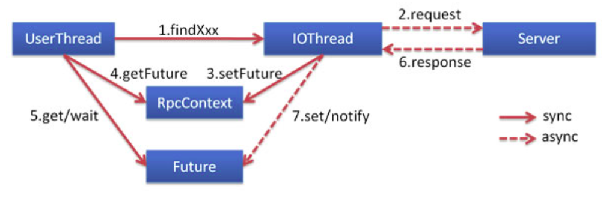

# 章节概要

- 掌握 API 网关服务聚合功能的实现
- 掌握 Mybatis-plus 自定义 SQL 实现
- 掌握 Dubbo 异步调用

## 服务聚合

- 服务聚合就是将多个服务调用封装
- 服务聚合可以简化前端调用方式
- 服务聚合提供更好的安全性、可扩展性

## 业务功能开发流程

- 根据接口文档思考功能列表
- 实现 API 接口和实体
- 服务提供者实现

# 影片模块创建

从 guns-user 拷贝一份重命名为 guns-film，修改相关配置

# API 网关功能聚合

- 优点
  1. 六个接口，一次请求，同一时刻节省了5次HTTP请求
  2. 同一个接口对外暴露，降低了前后端分离开发的难度和复杂度
- 缺点：
	1. 一次获取数据过多，容易出现问题

如 gateway 中的影片模块的获取首页信息接口，将 filmServiceApi 的多个方法所获得的对象聚合为 FilmIndexVO 对象返回给前端，将原本需要的多个接口聚合为一个 /film/getIndex 接口，避免了前端对不同接口的多次调用。

```java
@RequestMapping(value = "getIndex", method = RequestMethod.GET)
    public ResponseVO getIndex() {

        FilmIndexVO filmIndexVO = new FilmIndexVO();
        // 获取banner信息
        filmIndexVO.setBanners(filmServiceApi.getBanners());
        // 获取热映的影片
        filmIndexVO.setHotFilms(filmServiceApi.getHotFilms(true, 99, 99, 99, 99, 1, 8));
        // 获取即将上映的影片
        filmIndexVO.setSoonFilms(filmServiceApi.getSoonFilms(true, 99, 99, 99, 99, 1, 8));
        // 获取票房排行榜
        filmIndexVO.setBoxRanking(filmServiceApi.getBoxRanking());
        // 获取人气榜单
        filmIndexVO.setExpectRanking(filmServiceApi.getExpectRanking());
        // 获取排行前100影片
        filmIndexVO.setTop100(filmServiceApi.getTop());
        return ResponseVO.success(IMG_PRE, filmIndexVO);
    }
```

# Mybatis-plus 自定义 SQL 实现

在相应的 Mapper 接口中添加方法

```java
public interface ActorTMapper extends BaseMapper<ActorT> {

    List<ActorVO> getActors(@Param("filmId") String filmId);
}
```

在相应的 Mapper xml 配置文件中添加 select 语句

```java
<mapper namespace="com.stylefeng.guns.rest.common.persistence.dao.ActorTMapper">

    <!-- 通用查询映射结果 -->
    <resultMap id="BaseResultMap" type="com.stylefeng.guns.rest.common.persistence.model.ActorT">
        <id column="UUID" property="uuid" />
        <result column="actor_name" property="actorName" />
        <result column="actor_img" property="actorImg" />
    </resultMap>

    <select id="getActors" parameterType="java.lang.String" resultType="com.stylefeng.guns.api.film.vo.ActorVO">
        SELECT actor_img AS imgAddress, actor_name AS directorName, role_name AS roleName
        FROM actor_t, film_actor_t
        WHERE actor_t.UUID = film_actor_t.actor_id
          AND film_actor_t.film_id = ${filmId}
    </select>
</mapper>
```

这样，就能执行自定义 SQL 语句了，其实就是普通版 Mybatis 的正常使用而已...

# Dubbo 异步调用

> 官方文档：https://dubbo.apache.org/zh-cn/docs/user/demos/async-call.html

## 异步调用

异步调用利用 NIO 的非阻塞特性实现服务调用并行。



## 使用RpcContext

### 配置（Spring）

#### 服务端服务级别

```xml
<dubbo:service interface="..." async="true" />
```

#### 客户端服务级别

```xml
<dubbo:reference interface="..." async="true" />
```

#### 服务端方法级别

```xml
<dubbo:service interface="...">
    <dubbo:method name="..." async="true"/>
</dubbo:service>
```

#### 客户端方法级别

```xml
<dubbo:reference interface="...">
    <dubbo:method name="..." async="true"/>
</dubbo:reference>
```

### 配置（SpringBoot）

SpringBoot 的配置放在注解中，但只有服务级别，并没有方法级别。

#### 服务端服务级别

```java
@Service(interfaceClass = xxx.class, async = true)
```

#### 客户端服务级别

```java
@Reference(interfaceClass = xxx.class, async = true)
```

### 使用RpcContext

在 consumer.xml 中配置方法级别的异步调用：

```xml
<dubbo:reference id="asyncService" interface="org.apache.dubbo.samples.governance.api.AsyncService">
      <dubbo:method name="sayHello" async="true" />
</dubbo:reference>
```

调用代码:

```java
// 此调用会立即返回null
asyncService.sayHello("world");
// 拿到调用的Future引用，当结果返回后，会被通知和设置到此Future
CompletableFuture<String> helloFuture = RpcContext.getContext().getCompletableFuture();
// 为Future添加回调
helloFuture.whenComplete((retValue, exception) -> {
    if (exception == null) {
        System.out.println(retValue);
    } else {
        exception.printStackTrace();
    }
});
```

或者，你也可以这样做异步调用:

```java
CompletableFuture<String> future = RpcContext.getContext().asyncCall(
    () -> {
        asyncService.sayHello("oneway call request1");
    }
);

future.get();
```

需要注意的是，这里 asyncService.sayHello("world") 返回的是 null，不能通过该返回值获取结果，所有 asyncService 接口的 sayHello() 方法调用都需要通过 future 来获取结果。

#### SpringBoot中

由于 SpringBoot 没有方法级别的注解可以配置 async 参数，但如果加在服务级别，即客户端的 `@Reference` 或者服务端的 `@Service` 上，又会影响不需要使用异步调用的地方。

所以，可以通过在 api 中再创建一个专门用于异步调用的接口来声明需要异步调用的方法。

```java
public interface FilmAsyncServiceApi {

    FilmDescVO getFilmDesc(String filmId);

    ActorVO getDirectorInfo(String filmId);

    List<ActorVO> getActors(String filmId);
}
```

同时，在服务端中再创建一个用于异步调用的实现类。

```java
@Component
@Service(interfaceClass = FilmAsyncServiceApi.class)
public class DefaultFilmAsyncServiceImpl implements FilmAsyncServiceApi {

    @Override
    public FilmDescVO getFilmDesc(String filmId) {
        ...
    }

    @Override
    public ActorVO getDirectorInfo(String filmId) {
        ...
    }

    @Override
    public List<ActorVO> getActors(String filmId) {
        ...
    }
}
```

最后，在 API 网关的 Controller 中声明异步调用的接口，并使用 RpcContext 实现异步调用

```java
@RequestMapping(value = "films/{searchParam}", method = RequestMethod.GET)
    public ResponseVO films(@PathVariable("searchParam") String searchParam, int searchType) throws ExecutionException, InterruptedException {

            filmAsyncServiceApi.getFilmDesc(filmId);
            Future<FilmDescVO> filmDescVOFuture = RpcContext.getContext().getFuture();

            filmAsyncServiceApi.getDirectorInfo(filmId);
            Future<ActorVO> directorVOFuture = RpcContext.getContext().getFuture();

            filmAsyncServiceApi.getActors(filmId);
            Future<List<ActorVO>> actorsFuture = RpcContext.getContext().getFuture();

            /*
            省略无关代码...
            */
            actorRequestVO.setDirector(directorVOFuture.get());
            actorRequestVO.setActors(actorsFuture.get());
		  infoRequestVO.setBiography(filmDescVOFuture.get().getBiography());
            /*
            省略无关代码...
            */
    }
```

需要注意的是，SpringBoot 还需要在 Application 上添加 `@EnableAsync` 注解

```java
@SpringBootApplication(scanBasePackages = {"com.stylefeng.guns"})
@EnableDubboConfiguration
@EnableAsync
public class GatewayApplication {

    public static void main(String[] args) {
        SpringApplication.run(GatewayApplication.class, args);
    }
}
```

# 总结

- API 网关的服务聚合
- Dubbo 特性：异步调用
- Mybatis-plus 自定义 SQL 实现