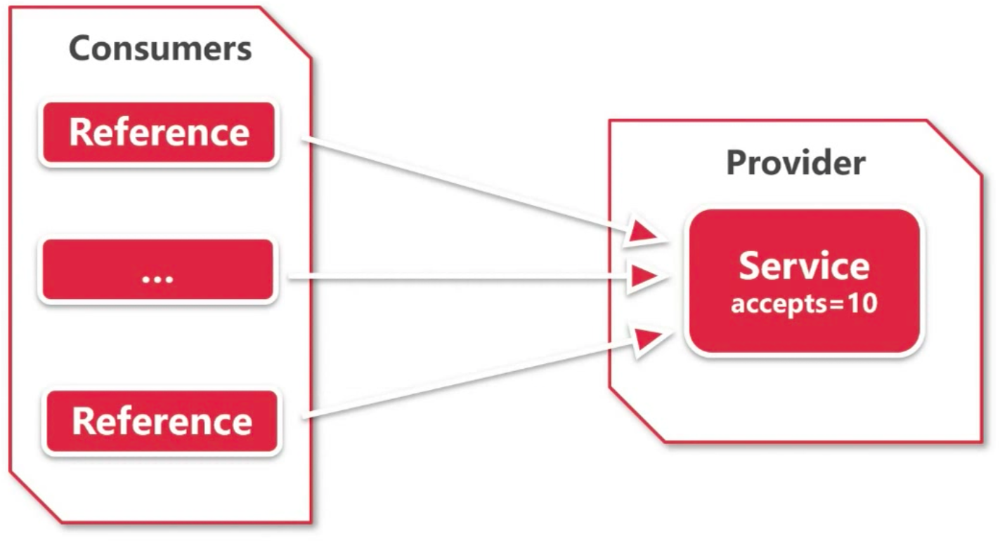
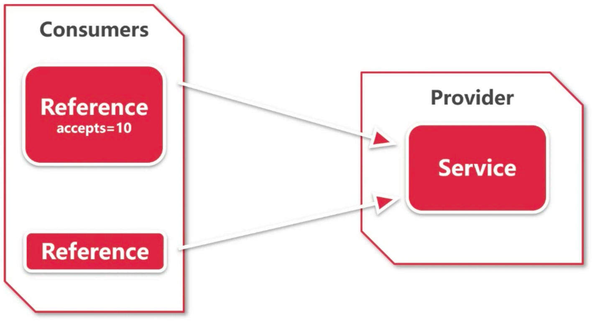

# 章节概要

- 完成影院模块业务开发
- 修改全局异常返回
- 学习 Dubbo 特性：结果缓存，连接和并发控制

# Dubbo 结果缓存

> 官方文档：https://dubbo.apache.org/zh-cn/docs/user/demos/result-cache.html

用于加速热门数据的访问速度，Dubbo 提供声明式缓存，以减少用户加缓存的工作量。

## 缓存类型

- `lru` 基于最近最少使用原则删除多余缓存，保持最热的数据被缓存。
- `threadlocal` 当前线程缓存，比如一个页面渲染，用到很多 portal，每个 portal 都要去查用户信息，通过线程缓存，可以减少这种多余访问。

## 配置

```xml
<dubbo:reference interface="com.foo.BarService" cache="lru" />
```

或：

```xml
<dubbo:reference interface="com.foo.BarService">
    <dubbo:method name="findBar" cache="lru" />
</dubbo:reference>
```


了解 Dubbo 结果缓存与 Redis 缓存等的区别：

- Dubbo 结果缓存是本地缓存，保存在当前 JVM 中，多台机器存储多份缓存。适合数据量小的数据，存储在本地占用资源少，而且速度较快。
- Redis 缓存则是分布式缓存，多台机器共享缓存。
- 小数据量的可以放在 Dubbo 结果缓存中，需要计算和共享的缓存数据可以放在 Redis 中。

# Dubbo 连接、并发控制

- Dubbo 可以对连接、并发数量进行控制
- 超出部分以错误形式返回

## Dubbo 连接控制

> 官方文档：https://dubbo.apache.org/zh-cn/docs/user/demos/config-connections.html

### 服务端连接控制

限制服务器端接受的连接不能超过 10 个：

```xml
<dubbo:provider protocol="dubbo" accepts="10" />
```

或

```xml
<dubbo:protocol name="dubbo" accepts="10" />
```

### 客户端连接控制

限制客户端服务使用连接不能超过 10 个（如果是长连接，比如 Dubbo 协议，connections 表示该服务对每个提供者建立的长连接数）：

```xml
<dubbo:reference interface="com.foo.BarService" connections="10" />
```

或

```xml
<dubbo:service interface="com.foo.BarService" connections="10" />
```

如果 dubbo:service 和 dubbo:reference 都配了 connections，dubbo:reference 优先。

### 区别

#### 服务端连接控制

服务端只能接受来自客户端的 10 个请求：



#### 客户端连接控制

服务端可以接受任意个请求，但是客户端只能接受 10 个请求。



如果超出了限制，则会报和没有启动服务类似的异常：

```
Caused by: java.lang.IllegalStateException: Failed to check the status of the service com.zjut.zjxjwxk.dubbo.ServiceAPI. No provider available for the service com.zjut.zjxjwxk.dubbo.ServiceAPI ...
```

## Dubbo 并发控制

> 官方文档：https://dubbo.apache.org/zh-cn/docs/user/demos/concurrency-control.html

### 服务端服务级别

限制 `com.foo.BarService` 的每个方法，服务器端并发执行（或占用线程池线程数）不能超过 10 个：

```xml
<dubbo:service interface="com.foo.BarService" executes="10" />
```

### 服务端方法级别

限制 `com.foo.BarService` 的 `sayHello` 方法，服务器端并发执行（或占用线程池线程数）不能超过 10 个：

```xml
<dubbo:service interface="com.foo.BarService">
    <dubbo:method name="sayHello" executes="10" />
</dubbo:service>
```

### 客户端服务界别

限制 `com.foo.BarService` 的每个方法，每客户端并发执行（或占用连接的请求数）不能超过 10 个：

```xml
<dubbo:service interface="com.foo.BarService" actives="10" />
```

或

```xml
<dubbo:reference interface="com.foo.BarService" actives="10" />
```

### 客户端方法级别

限制 `com.foo.BarService` 的 `sayHello` 方法，每客户端并发执行（或占用连接的请求数）不能超过 10 个：

```xml
<dubbo:service interface="com.foo.BarService">
    <dubbo:method name="sayHello" actives="10" />
</dubbo:service>
```

或

```xml
<dubbo:reference interface="com.foo.BarService">
    <dubbo:method name="sayHello" actives="10" />
</dubbo:service>
```

如果 dubbo:service 和 dubbo:reference 都配了actives，dubbo:reference 优先

### Load Balance 均衡

配置服务的客户端的 `loadbalance` 属性为 `leastactive`，此 Loadbalance 会调用并发数最小的 Provider（Consumer端并发数）。

```xml
<dubbo:reference interface="com.foo.BarService" loadbalance="leastactive" />
```

或

```xml
<dubbo:service interface="com.foo.BarService" loadbalance="leastactive" />
```

