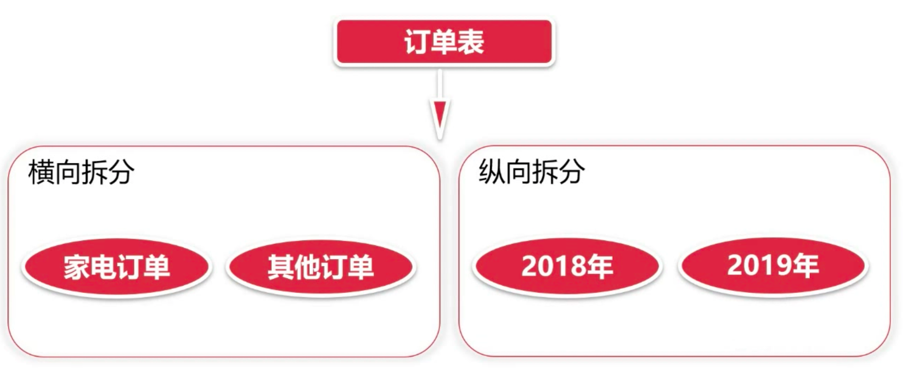

# 章节概要

- 完成订单模块业务开发
- 完成限流和熔断、降级相关内容
- Dubbo 特性之分组、聚合和版本控制

# 订单模块问题

- 订单模块的横向和纵向分表如何解决？
- 服务限流如何处理？
- 服务熔断和降级？
- 如何保证多版本的蓝绿上线？

# 横向拆分和纵向拆分



# Dubbo 服务分组

> 官方文档：https://dubbo.apache.org/zh-cn/docs/user/demos/service-group.html

当一个接口有多种实现时，可以用 group 区分。

## 服务

```xml
<dubbo:service group="feedback" interface="com.xxx.IndexService" />
<dubbo:service group="member" interface="com.xxx.IndexService" />
```

## 引用

```xml
<dubbo:reference id="feedbackIndexService" group="feedback" interface="com.xxx.IndexService" />
<dubbo:reference id="memberIndexService" group="member" interface="com.xxx.IndexService" />
```

任意组：

```xml
<dubbo:reference id="barService" interface="com.foo.BarService" group="*" />
```

# Dubbo 分组聚合

> https://dubbo.apache.org/zh-cn/docs/user/demos/group-merger.html

按组合并返回结果，比如菜单服务，接口一样，但有多种实现，用 group 区分，现在消费方需从每种 group 中调用一次返回结果，合并结果返回，这样就可以实现聚合菜单项。

## 配置

搜索所有分组

```xml
<dubbo:reference interface="com.xxx.MenuService" group="*" merger="true" />
```

合并指定分组

```xml
<dubbo:reference interface="com.xxx.MenuService" group="aaa,bbb" merger="true" />
```

指定方法合并结果，其它未指定的方法，将只调用一个 Group

```xml
<dubbo:reference interface="com.xxx.MenuService" group="*">
    <dubbo:method name="getMenuItems" merger="true" />
</dubbo:reference>
```

某个方法不合并结果，其它都合并结果

```xml
<dubbo:reference interface="com.xxx.MenuService" group="*" merger="true">
    <dubbo:method name="getMenuItems" merger="false" />
</dubbo:reference>
```

指定合并策略，缺省根据返回值类型自动匹配，如果同一类型有两个合并器时，需指定合并器的名称

```xml
<dubbo:reference interface="com.xxx.MenuService" group="*">
    <dubbo:method name="getMenuItems" merger="mymerge" />
</dubbo:reference>
```

指定合并方法，将调用返回结果的指定方法进行合并，合并方法的参数类型必须是返回结果类型本身

```xml
<dubbo:reference interface="com.xxx.MenuService" group="*">
    <dubbo:method name="getMenuItems" merger=".addAll" />
</dubbo:reference>
```

# Dubbo 多版本

当一个接口实现，出现不兼容升级时，可以用版本号过渡，版本号不同的服务相互间不引用。

可以按照以下的步骤进行版本迁移：

1. 在低压力时间段，先升级一半提供者为新版本
2. 再将所有消费者升级为新版本
3. 然后将剩下的一半提供者升级为新版本

## 配置

老版本服务提供者配置：

```xml
<dubbo:service interface="com.foo.BarService" version="1.0.0" />
```

新版本服务提供者配置：

```xml
<dubbo:service interface="com.foo.BarService" version="2.0.0" />
```

老版本服务消费者配置：

```xml
<dubbo:reference id="barService" interface="com.foo.BarService" version="1.0.0" />
```

新版本服务消费者配置：

```xml
<dubbo:reference id="barService" interface="com.foo.BarService" version="2.0.0" />
```

如果不需要区分版本，可以按照以下的方式配置：

```xml
<dubbo:reference id="barService" interface="com.foo.BarService" version="*" />
```

# 限流思路

- 限流措施是系统高可用的一种手段
- 使用并发与连接控制进行限流
- 使用**漏桶算法（Leaky Bucket）**和**令牌桶算法（Token Bucket）**算法进行限流

## 漏桶算法（Leaky Bucket）


## 令牌桶算法（Token Bucket）


## 区别

- 漏桶算法以均匀的速度处理请求，不需要承载较高的访问峰值
- 令牌桶算法则可能在短时间内处理大量请求，所以需要可以承载较高的访问峰值

## 令牌桶算法实现

```java
public class TokenBucket {

    /**
     * 桶的容量
     */
    private int bucketNums = 100;

    /**
     * 流入速度
     */
    private int rate = 1;

    /**
     * 当前令牌数
     */
    private int nowTokens;

    /**
     * 上次刷新当前令牌数的时间
     */
    private long lastTime = getNowTime();

    private long getNowTime() {
        return System.currentTimeMillis();
    }

    public boolean getToken() {

        // 记录当前时间
        long nowTime = getNowTime();

        // 刷新令牌
        nowTokens += (nowTime - lastTime) * rate;

        // 若令牌数比桶容量大，则改为桶容量
        nowTokens = Math.min(bucketNums, nowTokens);
        System.out.println("当前令牌数：" + nowTokens);

        // 修改上次刷新令牌数的时间为当前时间
        lastTime = nowTime;

        // 判断令牌是否足够
        if (nowTokens > 0) {
            nowTokens--;
            return true;
        } else {
            return false;
        }
    }
}

```

# Hystrix 熔断降级


网关模块添加依赖：

```xml
        <dependency>
            <groupId>org.springframework.cloud</groupId>
            <artifactId>spring-cloud-starter-netflix-hystrix</artifactId>
            <version>2.0.0.RELEASE</version>
        </dependency>
        <dependency>
            <groupId>org.springframework.boot</groupId>
            <artifactId>spring-boot-starter-actuator</artifactId>
        </dependency>
        <dependency>
            <groupId>org.springframework.cloud</groupId>
            <artifactId>spring-cloud-starter-netflix-hystrix-dashboard</artifactId>
            <version>2.0.0.RELEASE</version>
        </dependency>
```

GatewayApplication 添加注解：

```java
@EnableHystrixDashboard
@EnableCircuitBreaker
@EnableHystrix
```

给需要熔断器的控制器方法添加注解：

```java
@HystrixCommand(fallbackMethod = "error",
            commandProperties = {
                @HystrixProperty(name = "execution.isolation.strategy", value = "THREAD"),
                @HystrixProperty(name = "execution.isolation.thread.timeoutInMilliseconds", value = "4000"),
                @HystrixProperty(name = "circuitBreaker.requestVolumeThreshold", value = "10"),
                @HystrixProperty(name = "circuitBreaker.errorThresholdPercentage", value = "50")
            },
            threadPoolProperties = {
                    @HystrixProperty(name = "coreSize", value = "1"),
                    @HystrixProperty(name = "maxQueueSize", value = "10"),
                    @HystrixProperty(name = "keepAliveTimeMinutes", value = "1000"),
                    @HystrixProperty(name = "queueSizeRejectionThreshold", value = "8"),
                    @HystrixProperty(name = "metrics.rollingStats.numBuckets", value = "12"),
                    @HystrixProperty(name = "metrics.rollingStats.timeInMilliseconds", value = "1500")
            })
```

定义 fallbackMethod 方法，用于服务降级：

```java
public ResponseVO error(Integer fieldId, String soldSeats, String seatsName) {
	return ResponseVO.serviceFail("抱歉，下单的人太多了，请稍后重试");
}
```

# 总结

- 学习了限流措施以及实现方法（在真实业务环境中，可能会根据请求的字节数大小分配 TokenBucket）
- 掌握了 Dubbo 的分组聚合、版本控制
- 留下一个思考，如何处理事务？假如，下订单时，将 1. 验证所购买的票是否为真和 2. 检查所购买的票是否已售出，这两个 service 接口改为异步调用（因为要连接 FTP 和读取文件，速度较慢），那么可能还没有调用结束，就已经生成了订单......但是如果异步调用的验证结果不为真，该怎么办？这时候就需要事务来保证 ACID 了。那么应该如何处理分布式事务呢？且看下回分解。