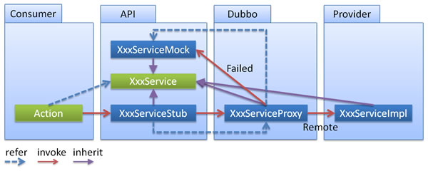

# 章节概要

- 完成支付模块业务开发
- Dubbo 特性学习：隐式参数、参数验证等

# Dubbo 本地存根

- 本地存根类似于 Dubbo 的静态代理
- Dubbo 会在客户端生成一个代理，处理部分业务
- Stub 必须有可传入 Proxy 的构造函数

> 官方文档：https://dubbo.apache.org/zh-cn/docs/user/demos/local-stub.html

远程服务后，客户端通常只剩下接口，而实现全在服务器端，但提供方有些时候想在客户端也执行部分逻辑，比如：做 ThreadLocal 缓存，提前验证参数，调用失败后伪造容错数据等等，此时就需要在 API 中带上 Stub，客户端生成 Proxy 实例，会把 Proxy 通过构造函数传给 Stub，然后把 Stub 暴露给用户，Stub 可以决定要不要去调 Proxy。



在 spring 配置文件中按以下方式配置：

```xml
<dubbo:service interface="com.foo.BarService" stub="true" />
```

或

```xml
<dubbo:service interface="com.foo.BarService" stub="com.foo.BarServiceStub" />
```

提供 Stub 的实现：

```java
package com.foo;
public class BarServiceStub implements BarService {
    private final BarService barService;
    
    // 构造函数传入真正的远程代理对象
    public BarServiceStub(BarService barService){
        this.barService = barService;
    }
 
    public String sayHello(String name) {
        // 此代码在客户端执行, 你可以在客户端做ThreadLocal本地缓存，或预先验证参数是否合法，等等
        try {
            return barService.sayHello(name);
        } catch (Exception e) {
            // 你可以容错，可以做任何AOP拦截事项
            return "容错数据";
        }
    }
}
```

1. Stub 必须有可传入 Proxy 的构造函数。
2. 在 interface 旁边放一个 Stub 实现，它实现 BarService 接口，并有一个传入远程 BarService 实例的构造函数

# Dubbo 本地伪装

- 本地伪装是本地存根的一个子集
- 通常会使用本地伪装处理服务降级
- 建议本地伪装在客户端实现

> 官方文档：https://dubbo.apache.org/zh-cn/docs/user/demos/local-mock.html

本地伪装通常用于服务降级，比如某验权服务，当服务提供方全部挂掉后，客户端不抛出异常，而是通过 Mock 数据返回授权失败。

在 spring 配置文件中按以下方式配置：

```xml
<dubbo:reference interface="com.foo.BarService" mock="true" />
```

或

```xml
<dubbo:reference interface="com.foo.BarService" mock="com.foo.BarServiceMock" />
```

在工程中提供 Mock 实现：

```java
package com.foo;
public class BarServiceMock implements BarService {
    public String sayHello(String name) {
        // 你可以伪造容错数据，此方法只在出现RpcException时被执行
        return "容错数据";
    }
}
```

如果服务的消费方经常需要 try-catch 捕获异常，如：

```java
Offer offer = null;
try {
    offer = offerService.findOffer(offerId);
} catch (RpcException e) {
   logger.error(e);
}
```

请考虑改为 Mock 实现，并在 Mock 实现中 return null。如果只是想简单的忽略异常，在 `2.0.11` 以上版本可用：

```xml
<dubbo:reference interface="com.foo.BarService" mock="return null" />
```

## 进阶用法

### return

使用 `return` 来返回一个字符串表示的对象，作为 Mock 的返回值。合法的字符串可以是：

- *empty*: 代表空，基本类型的默认值，或者集合类的空值
- *null*: `null`
- *true*: `true`
- *false*: `false`
- *JSON 格式*: 反序列化 JSON 所得到的对象

### throw

使用 `throw` 来返回一个 Exception 对象，作为 Mock 的返回值。

当调用出错时，抛出一个默认的 RPCException:

```xml
<dubbo:reference interface="com.foo.BarService" mock="throw" />
```

当调用出错时，抛出指定的 Exception：

```xml
<dubbo:reference interface="com.foo.BarService" mock="throw com.foo.MockException" />
```

### force 和 fail

在 `2.6.6` 以上的版本，可以开始在 Spring XML 配置文件中使用 `fail:` 和 `force:`。`force:` 代表强制使用 Mock 行为，在这种情况下不会走远程调用。`fail:` 与默认行为一致，只有当远程调用发生错误时才使用 Mock 行为。`force:` 和 `fail:` 都支持与 `throw` 或者 `return` 组合使用。

强制返回指定值：

```xml
<dubbo:reference interface="com.foo.BarService" mock="force:return fake" />
```

强制抛出指定异常：

```xml
<dubbo:reference interface="com.foo.BarService" mock="force:throw com.foo.MockException" />
```

### 在方法级别配置 Mock

Mock 可以在方法级别上指定，假定 `com.foo.BarService` 上有好几个方法，我们可以单独为 `sayHello()` 方法指定 Mock 行为。具体配置如下所示，在本例中，只要 `sayHello()` 被调用到时，强制返回 "fake":

```xml
<dubbo:reference id="demoService" check="false" interface="com.foo.BarService">
    <dubbo:parameter key="sayHello.mock" value="force:return fake"/>
</dubbo:reference>
```

1. Mock 是 Stub 的一个子集，便于服务提供方在客户端执行容错逻辑，因经常需要在出现 RpcException (比如网络失败，超时等)时进行容错，而在出现业务异常(比如登录用户名密码错误)时不需要容错，如果用 Stub，可能就需要捕获并依赖 RpcException 类，而用 Mock 就可以不依赖 RpcException，因为它的约定就是只有出现 RpcException 时才执行。 
2. 在 interface 旁放一个 Mock 实现，它实现 BarService 接口，并有一个无参构造函数。

在使用 SpringBoot + Dubbo 的项目中，优先使用 Hystrix 提供的熔断降级，因为 **Mock 只能捕获 RpcException (比如网络失败，超时等)**，而不能捕获 Java 异常。

# Dubbo 隐式参数

- Dubbo 提供了参数的隐式传递
- Dubbo 的隐式参数仅单次调用可用
- 注意隐式参数的保留字段

> 官方文档：https://dubbo.apache.org/zh-cn/docs/user/demos/attachment.html

可以通过 `RpcContext` 上的 `setAttachment` 和 `getAttachment` 在服务消费方和提供方之间进行参数的隐式传递。


## 在服务消费方端设置隐式参数

`setAttachment` 设置的 KV 对，在完成下面一次远程调用会被清空，即多次远程调用要多次设置。

```xml
RpcContext.getContext().setAttachment("index", "1"); // 隐式传参，后面的远程调用都会隐式将这些参数发送到服务器端，类似cookie，用于框架集成，不建议常规业务使用
xxxService.xxx(); // 远程调用
// ...
```

## 在服务提供方端获取隐式参数

```java
public class XxxServiceImpl implements XxxService {
 
    public void xxx() {
        // 获取客户端隐式传入的参数，用于框架集成，不建议常规业务使用
        String index = RpcContext.getContext().getAttachment("index"); 
    }
}
```

1. 注意：path, group, version, dubbo, token, timeout 几个 key 是保留字段，请使用其它值。

# 总结

- Dubbo 特性之隐式参数
- Dubbo 特性之本地存根和本地伪装（更常用）
- 支付宝当面付功能对接