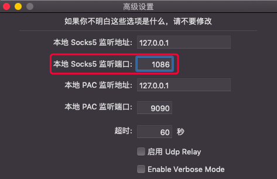

# 方法1（暂时）:

在终端中直接运行命令

```shell
export http_proxy=http://proxyAddres.s:port
```

这个办法的好处是简单直接，并且影响面很小（只对当前终端有效，退出就不行了）。

如果你用的是 s.s 代理，在当前终端运行以下命令，那么`wget` `curl` 这类网络命令都会经过 s.s 代理，port 端口号可以从 s.s 高级设置中查看，我的是1086。

```shell
export ALL_PROXY=socks5://127.0.0.1:1086
```



安装完软件以后，我们再执行以下命令取消终端代理

```shell
unset ALL_PROXY
```

# 方法2（永久）:

把代理服务器地址写入 shell 配置文件`.bashrc`或者`.zshrc`

直接在`.bashrc`或者`.zshrc`添加下面内容

```shell
export http_proxy="http://localhost:port"
export https_proxy="http://localhost:port"
```

以使用 s.s 代理为例，s.s 的代理端口为`1086`,那么应该设置为

```shell
export http_proxy="socks5://127.0.0.1:1086"
export https_proxy="socks5://127.0.0.1:1086"
```

或者直接设置 ALL_PROXY

```shell
export ALL_PROXY=socks5://127.0.0.1:1086
```

`localhost`就是一个域名，域名默认指向 `127.0.0.1`，两者是一样的。

然后`ESC`后`:wq`保存文件，接着在终端中执行`source ~/.bashrc`

这个办法的好处是把代理服务器永久保存了，下次就可以直接用了。

或者通过设置 alias 简写来简化操作，每次要用的时候输入`setproxy`，不用了就`unsetproxy`。

```shell
alias setproxy="export ALL_PROXY=socks5://127.0.0.1:1086"
alias unsetproxy="unset ALL_PROXY"
```

# Git 代理

git 设置全局代理：

```shell
git config --global http.proxy 'socks5://127.0.0.1:1086' 
git config --global https.proxy 'socks5://127.0.0.1:1086'
```

git 仅针对 GitHub 的单独配置：

```shell
git config --global http.https://github.com.proxy 'socks5://127.0.0.1:1086' 
```

git 取消全局代理，只需加个 --unset，单独配置同理：

```shell
git config --global --unset http.proxy 'socks5://127.0.0.1:1086' 
git config --global --unset https.proxy 'socks5://127.0.0.1:1086'
```

