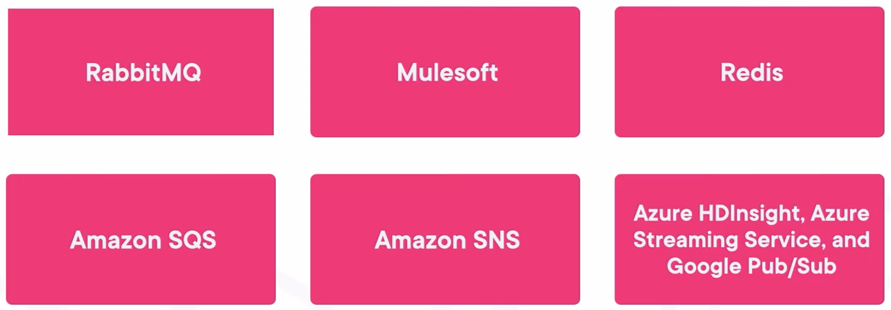

## We Call

- The entity/app creates a message, a publisher, or a producer.
- The entity/app consuming messages from a channel as a consumer.
- The system where the channels live and handle these requests as an Event Bus or, more recently, a streaming platform.
- The channel where messages flow as channel or topic.

## Definitions

- We say the pub-sub system is reliable when you ensure there is no message loss.
- Has at most one processing when you ensure there is no message duplication.
- And has exactly one processing when you only process a message once ensuring it wasn't lost. Of course, this is the holy grail.

## We Had a Ton of Other Pub/Sub Systems Before

## What is Kafka?

- Event Streaming Platform
- Scalable
- High Throughput

## Difference between Kafka and the Rest of Solutions

- **RabbitMQ**: As Kafka uses topics in a unidirectional log without a handshake, the **difference in performance** is brutal, easily 1000x.
- **Mulesoft**: Kafka **makes it simple** to create a channel of communication. Simply producing a message, the topic will be auto-created.
- **Redis**: Redis **does not handle streaming data** nor has a history past messages.
- **Amazon SQS**: It is based on queues, which is way better than RabbitMQ, but still, there is an **order of magnitude in throughput** and speed between Kafka and SQS. Plus, SQS is not exactly cheap.
- **Amazon SNS**: Very, very similar; but **way pricer**.
- **Azure Streaming Services**: This service in particular is **not exactly meant for pub-sub in general**.
- **Google Pub/Sub**: The same as Amazon SNS, very similar but **pricer**.
