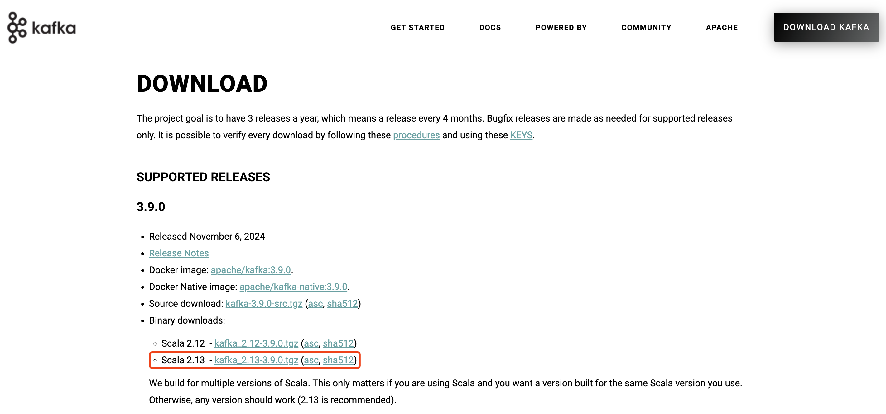
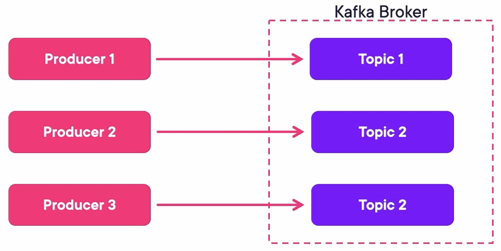

## Kafka Architecture


## Kafka Message


## Deploy Kafka

Create a docker-compose file `docker-compose.yaml` containing three Zookeepers, three Kafka Brokers, and a Kafka REST Proxy:

```yaml
---
version: '3'
services:
  zookeeper-1:
    image: confluentinc/cp-zookeeper:7.4.1
    hostname: zookeeper-1
    container_name: zookeeper-1
    volumes:
      - ./zookeeper-1_data:/var/lib/zookeeper/data
      - ./zookeeper-1_log:/var/lib/zookeeper/log
    environment:
      ZOOKEEPER_CLIENT_PORT: 2181
      ZOOKEEPER_TICK_TIME: 2000
      ZOO_MY_ID: 1
      ZOO_SERVERS: server.1=zookeeper-1:2888:3888;2181 server.2=zookeeper-2:2888:3888;2181 server.3=zookeeper-3:2888:3888;2181

  zookeeper-2:
    image: confluentinc/cp-zookeeper:7.4.1
    hostname: zookeeper-2
    container_name: zookeeper-2
    volumes:
      - ./zookeeper-2_data:/var/lib/zookeeper/data
      - ./zookeeper-2_log:/var/lib/zookeeper/log
    environment:
      ZOOKEEPER_CLIENT_PORT: 2181
      ZOOKEEPER_TICK_TIME: 2000
      ZOO_MY_ID: 2
      ZOO_SERVERS: server.1=zookeeper-1:2888:3888;2181 server.2=zookeeper-2:2888:3888;2181 server.3=zookeeper-3:2888:3888;2181

  zookeeper-3:
    image: confluentinc/cp-zookeeper:7.4.1
    hostname: zookeeper-3
    container_name: zookeeper-3
    volumes:
      - ./zookeeper-3_data:/var/lib/zookeeper/data
      - ./zookeeper-3_log:/var/lib/zookeeper/log
    environment:
      ZOOKEEPER_CLIENT_PORT: 2181
      ZOOKEEPER_TICK_TIME: 2000
      ZOO_MY_ID: 3
      ZOO_SERVERS: server.1=zookeeper-1:2888:3888;2181 server.2=zookeeper-2:2888:3888;2181 server.3=zookeeper-3:2888:3888;2181


  broker-1:
    image: confluentinc/cp-kafka:7.4.1
    hostname: broker-1
    container_name: broker-1
    volumes:
      - ./broker-1-data:/var/lib/kafka/data
    depends_on:
      - zookeeper-1
      - zookeeper-2
      - zookeeper-3
    ports:
      - 9092:9092
      - 29092:29092
    environment:
      KAFKA_BROKER_ID: 1
      KAFKA_ZOOKEEPER_CONNECT: zookeeper-1:2181
      KAFKA_ADVERTISED_LISTENERS: HOST://localhost:9092,INTERNAL://broker-1:29092
      KAFKA_LISTENER_SECURITY_PROTOCOL_MAP: HOST:PLAINTEXT,INTERNAL:PLAINTEXT
      KAFKA_INTER_BROKER_LISTENER_NAME: INTERNAL
      KAFKA_SNAPSHOT_TRUST_EMPTY: true

  broker-2:
    image: confluentinc/cp-kafka:7.4.1
    hostname: broker-2
    container_name: broker-2
    volumes:
      - ./broker-2-data:/var/lib/kafka/data
    depends_on:
      - zookeeper-1
      - zookeeper-2
      - zookeeper-3
      - broker-1
    ports:
      - 9093:9093
      - 29093:29093
    environment:
      KAFKA_BROKER_ID: 2
      KAFKA_ZOOKEEPER_CONNECT: zookeeper-1:2181
      KAFKA_ADVERTISED_LISTENERS: HOST://localhost:9093,INTERNAL://broker-2:29093
      KAFKA_LISTENER_SECURITY_PROTOCOL_MAP: HOST:PLAINTEXT,INTERNAL:PLAINTEXT
      KAFKA_INTER_BROKER_LISTENER_NAME: INTERNAL
      KAFKA_SNAPSHOT_TRUST_EMPTY: true

  broker-3:
    image: confluentinc/cp-kafka:7.4.1
    hostname: broker-3
    container_name: broker-3
    volumes:
      - ./broker-3-data:/var/lib/kafka/data
    depends_on:
      - zookeeper-1
      - zookeeper-2
      - zookeeper-3
      - broker-1
      - broker-2
    ports:
      - 9094:9094
      - 29094:29094
    environment:
      KAFKA_BROKER_ID: 3
      KAFKA_ZOOKEEPER_CONNECT: zookeeper-1:2181
      KAFKA_ADVERTISED_LISTENERS: HOST://localhost:9094,INTERNAL://broker-3:29094
      KAFKA_LISTENER_SECURITY_PROTOCOL_MAP: HOST:PLAINTEXT,INTERNAL:PLAINTEXT
      KAFKA_INTER_BROKER_LISTENER_NAME: INTERNAL
      KAFKA_SNAPSHOT_TRUST_EMPTY: true


  rest-proxy:
    image: confluentinc/cp-kafka-rest:7.4.1
    ports:
      - "8082:8082"
    depends_on:
      - zookeeper-1
      - zookeeper-2
      - zookeeper-3
      - broker-1
      - broker-2
      - broker-3
    hostname: rest-proxy
    container_name: rest-proxy
    environment:
      KAFKA_REST_HOST_NAME: rest-proxy
      KAFKA_REST_BOOTSTRAP_SERVERS: 'broker-1:29092,broker-2:29093,broker-3:29094'
      KAFKA_REST_LISTENERS: "http://0.0.0.0:8082"
```

Run composed containers:

```
docker compose up -d
```

When all containers run like this:

```
[+] Running 8/8
 ⠿ Network demo1_default  Created                                                                  0.1s
 ⠿ Container zookeeper-1  Started                                                                  2.6s
 ⠿ Container zookeeper-2  Started                                                                  2.5s
 ⠿ Container zookeeper-3  Started                                                                  2.6s
 ⠿ Container broker-1     Started                                                                  3.6s
 ⠿ Container broker-2     Started                                                                  4.4s
 ⠿ Container broker-3     Started                                                                  5.2s
 ⠿ Container rest-proxy   Started                                                                  5.7s
```

We can check the docker logs:

```
docker logs broker-1
```

We can also check all service statuses:

```
docker compose ps
```

It should show that all services are up:

```
NAME                IMAGE                              COMMAND                  SERVICE             CREATED             STATUS              PORTS
broker-1            confluentinc/cp-kafka:7.4.1        "/etc/confluent/dock…"   broker-1            3 minutes ago       Up 3 minutes        0.0.0.0:9092->9092/tcp, 0.0.0.0:29092->29092/tcp
broker-2            confluentinc/cp-kafka:7.4.1        "/etc/confluent/dock…"   broker-2            3 minutes ago       Up 3 minutes        0.0.0.0:9093->9093/tcp, 9092/tcp, 0.0.0.0:29093->29093/tcp
broker-3            confluentinc/cp-kafka:7.4.1        "/etc/confluent/dock…"   broker-3            3 minutes ago       Up 3 minutes        0.0.0.0:9094->9094/tcp, 9092/tcp, 0.0.0.0:29094->29094/tcp
rest-proxy          confluentinc/cp-kafka-rest:7.4.1   "/etc/confluent/dock…"   rest-proxy          3 minutes ago       Up 3 minutes        0.0.0.0:8082->8082/tcp
zookeeper-1         confluentinc/cp-zookeeper:7.4.1    "/etc/confluent/dock…"   zookeeper-1         3 minutes ago       Up 3 minutes        2181/tcp, 2888/tcp, 3888/tcp
zookeeper-2         confluentinc/cp-zookeeper:7.4.1    "/etc/confluent/dock…"   zookeeper-2         3 minutes ago       Up 3 minutes        2181/tcp, 2888/tcp, 3888/tcp
zookeeper-3         confluentinc/cp-zookeeper:7.4.1    "/etc/confluent/dock…"   zookeeper-3         3 minutes ago       Up 3 minutes        2181/tcp, 2888/tcp, 3888/tcp
```

We can also call the REST APIs provided by the Kafka REST Proxy. For example, display alive brokers:

```
curl localhost:8082/brokers
```

It should show that there are three living brokers:

```
{"brokers":[1,2,3]}%
```

## Kafka Ecosystem

Packaging Versions:

- Confluent Cloud
- Cloudera
- Strimzi offers the Helm charts to deploy Kafka to Kubernetes

Logging Plugins:

- Syslog
- Fluentd
- Logstash
- Filebeat

DBs:

- JDBC connector to cover RDBMS Dos.
- Debezium also offers a connector that includes no-SQL Dos.
- Presto connector that allows us to query Kafka using Presto queries.

## Demo: Interaction with Kafka via the CLI

### Run Kafka Containers

Run composed containers (if not):

```
docker compose up -d
```

### Add Kafka PATH

Download Kafka from the official website https://kafka.apache.org/downloads:



Add Kafka to your PATH. (I use zsh, so it's configured in the ~/.zshrc for me)

```bash
export KAFKA_HOME=/Users/zjxjwxk/Library/kafka_2.13-3.9.0
export PATH=$PATH:$KAFKA_HOME/bin
```

Then run this command (if you are using a Linux-like OS):

```
source ~/.zshrc
```

### Send Messages

Send messages by running Kafka Producer:

```bash
❯ kafka-console-producer.sh --bootstrap-server localhost:9092 --topic first_topic
>Hello 
[2024-11-16 15:41:58,970] WARN [Producer clientId=console-producer] The metadata response from the cluster reported a recoverable issue with correlation id 7 : {first_topic=LEADER_NOT_AVAILABLE} (org.apache.kafka.clients.NetworkClient)
>Kafka
>I'm Xinkang
>
```

### Receive Messages

Receive messages by running Kafka Consumer:

```bash
❯ kafka-console-consumer.sh --bootstrap-server localhost:9092 --topic first_topic --from-beginning
Hello
Kafka
I'm Xinkang
```

Display topics by Kafka REST Proxy:

```bash
❯ curl localhost:8082/topics
["first_topic"]%
```

## Topics

Kafka Producers send messages to topics of Kafka Brokers:



Retention Can Be Set To:

- **Days**: This means only keeping messages of up to N days and then deleting them.
- **Bytes**: This means only keeping messages until the topic has more than X bytes and then delete.
- **None**: This means storing all messages from the beginning of time.

Kafka Consumers consume messages from topics of Kafka Brokers:


## Partitions

A topic can be split into partitions and distributed within brokers in the cluster: 


The partitioner uses the key to distribute the messages to the correct partition:


## Consumer Read Scenarios

Consumer Offset: From the Beginning


Consumer Offset: From the End


Consumer Offset: Already Have Been Here


Summary:

- Topics can be partitioned.
- The partitioner uses the message key to redirect messages to partitions.
- Consumers read them from partitions and have an offset.
- Therefore, more partitions enable more consumers, which makes it more scalable.

## Topic Replication

Each topic has a number called the replication factor, which replicates each partition of that topic:


Each partition is on a different broker. Therefore, a single topic is scaled.

## Demo: Interaction with Kafka via the REST Proxy

### Run Kafka Containers

Run composed containers (if not):

```
docker compose up -d
```

### Import Postman Collection

Use this Open API yaml for Kafka REST Proxy: https://github.com/axel-sirota/getting-started-kafka/blob/main/rest_proxy.yaml, which provides RESTful interfaces to a Kafka cluster.

We can import this yaml to the Postman as a collection:


Then, add an environment for variables like baseUrl and use the environment.


### Create Topic

Create a topic `myorders` with one replication and three partitions:

```
kafka-topics.sh --create --bootstrap-server localhost:9092 --replication-factor 1 --partitions 3 --topic myorders
```

The created topic can be displayed by calling `{{baseUrl}}/topics/:topicName` via Postman. The path variable `:topicName` should be `myorders`. The response will be like:

```
{
    "name": "myorders",
    ...
    "partitions": [
        {
            "partition": 0,
            "leader": 1,
            "replicas": [
                {
                    "broker": 1,
                    "leader": true,
                    "in_sync": true
                }
            ]
        },
        {
            "partition": 1,
            "leader": 2,
            "replicas": [
                {
                    "broker": 2,
                    "leader": true,
                    "in_sync": true
                }
            ]
        },
        {
            "partition": 2,
            "leader": 3,
            "replicas": [
                {
                    "broker": 3,
                    "leader": true,
                    "in_sync": true
                }
            ]
        }
    ]
}
```

This is a pretty fragile scenario because if any broker goes down, there is no replica.

### Increase Replication

Prepare a json file `increase-replication.json` for reassigning partitions of topic `myorders`:

```json
{"version":1,
  "partitions":[
    {"topic":"myorders","partition":0,"replicas":[1,2]},
    {"topic":"myorders","partition":1,"replicas":[1,2]},
    {"topic":"myorders","partition":2,"replicas":[2]}
  ]
}
```

Reassign partitions with the json file:

```bash
kafka-reassign-partitions.sh --bootstrap-server localhost:9092 --reassignment-json-file increase_replication.json --execute
```

Then, we can see the replication of partition 0 and 1 are increased, and a leader is elected for each replica.

```json
{
    "name": "myorders",
    ...
    "partitions": [
        {
            "partition": 0,
            "leader": 1,
            "replicas": [
                {
                    "broker": 1,
                    "leader": true,
                    "in_sync": true
                },
                {
                    "broker": 2,
                    "leader": false,
                    "in_sync": true
                }
            ]
        },
        {
            "partition": 1,
            "leader": 2,
            "replicas": [
                {
                    "broker": 1,
                    "leader": false,
                    "in_sync": true
                },
                {
                    "broker": 2,
                    "leader": true,
                    "in_sync": true
                }
            ]
        },
        {
            "partition": 2,
            "leader": 2,
            "replicas": [
                {
                    "broker": 2,
                    "leader": true,
                    "in_sync": true
                }
            ]
        }
    ]
}
```

### Stop a Broker

Stop the broker 2 to test the system resilience.

```bash
docker stop broker-2
```

We can see that for partitions 0 and 1, the broker 2 is not `in_sync`. For partition 2, the `leader` is -1, which means there is no leader and cannot take any new message.

```json
{
    "name": "myorders",
    ...
    "partitions": [
        {
            "partition": 0,
            "leader": 1,
            "replicas": [
                {
                    "broker": 1,
                    "leader": true,
                    "in_sync": true
                },
                {
                    "broker": 2,
                    "leader": false,
                    "in_sync": false
                }
            ]
        },
        {
            "partition": 1,
            "leader": 1,
            "replicas": [
                {
                    "broker": 1,
                    "leader": true,
                    "in_sync": true
                },
                {
                    "broker": 2,
                    "leader": false,
                    "in_sync": false
                }
            ]
        },
        {
            "partition": 2,
            "leader": -1,
            "replicas": [
                {
                    "broker": 2,
                    "leader": false,
                    "in_sync": true
                }
            ]
        }
    ]
}
```

Try to send messages to the topic `myorders` by running Kafka Producer:

```bash
❯ kafka-console-producer.sh --bootstrap-server localhost:9092 --topic myorders
>Hello 
>again
>from
>Wxk
```

And try to receive messages from topic `myorders`:

```bash
kafka-console-consumer.sh --bootstrap-server localhost:9092 --topic myorders --from-beginning
```

We will find there is no response returned. The topic will be offline if one partition doesn't have any replica online.

### Restart the Broker

If we restart the stopped broker, Kafka will self-heal:

```bash
docker compose up -d
```

We can see that for partitions 0 and 1, broker 2 is `in_sync` again. And for partition 2, the `leader` 2 is elected again.

```json
{
    "name": "myorders",
    ...
    "partitions": [
        {
            "partition": 0,
            "leader": 1,
            "replicas": [
                {
                    "broker": 1,
                    "leader": true,
                    "in_sync": true
                },
                {
                    "broker": 2,
                    "leader": false,
                    "in_sync": true
                }
            ]
        },
        {
            "partition": 1,
            "leader": 1,
            "replicas": [
                {
                    "broker": 1,
                    "leader": true,
                    "in_sync": true
                },
                {
                    "broker": 2,
                    "leader": false,
                    "in_sync": true
                }
            ]
        },
        {
            "partition": 2,
            "leader": 2,
            "replicas": [
                {
                    "broker": 2,
                    "leader": true,
                    "in_sync": true
                }
            ]
        }
    ]
}
```

Then we can receive messages successfully:

```bash
❯ kafka-console-consumer.sh --bootstrap-server localhost:9092 --topic myorders --from-beginning
Hello
again
from
Wxk
```

