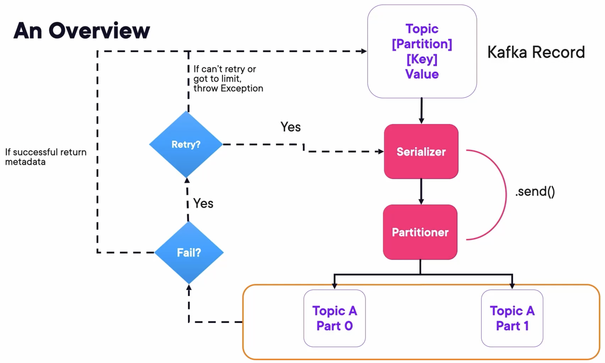

## Kafka Producer Overview



## Demo: Producing Messages with Kafka CLI

### Run Kafka Containers

Create a docker-compose file `docker-compose.yaml` containing 3 Zookeepers, 3 Kafka Brokers, and 1 Kafka REST Proxy:

```yaml
---
version: '3'
services:
  zookeeper-1:
    image: confluentinc/cp-zookeeper:7.4.1
    hostname: zookeeper-1
    container_name: zookeeper-1
    volumes:
      - ./zookeeper-1_data:/var/lib/zookeeper/data
      - ./zookeeper-1_log:/var/lib/zookeeper/log
    environment:
      ZOOKEEPER_CLIENT_PORT: 2181
      ZOOKEEPER_TICK_TIME: 2000
      ZOO_MY_ID: 1
      ZOO_SERVERS: server.1=zookeeper-1:2888:3888;2181 server.2=zookeeper-2:2888:3888;2181 server.3=zookeeper-3:2888:3888;2181

  zookeeper-2:
    image: confluentinc/cp-zookeeper:7.4.1
    hostname: zookeeper-2
    container_name: zookeeper-2
    volumes:
      - ./zookeeper-2_data:/var/lib/zookeeper/data
      - ./zookeeper-2_log:/var/lib/zookeeper/log
    environment:
      ZOOKEEPER_CLIENT_PORT: 2181
      ZOOKEEPER_TICK_TIME: 2000
      ZOO_MY_ID: 2
      ZOO_SERVERS: server.1=zookeeper-1:2888:3888;2181 server.2=zookeeper-2:2888:3888;2181 server.3=zookeeper-3:2888:3888;2181

  zookeeper-3:
    image: confluentinc/cp-zookeeper:7.4.1
    hostname: zookeeper-3
    container_name: zookeeper-3
    volumes:
      - ./zookeeper-3_data:/var/lib/zookeeper/data
      - ./zookeeper-3_log:/var/lib/zookeeper/log
    environment:
      ZOOKEEPER_CLIENT_PORT: 2181
      ZOOKEEPER_TICK_TIME: 2000
      ZOO_MY_ID: 3
      ZOO_SERVERS: server.1=zookeeper-1:2888:3888;2181 server.2=zookeeper-2:2888:3888;2181 server.3=zookeeper-3:2888:3888;2181


  broker-1:
    image: confluentinc/cp-kafka:7.4.1
    hostname: broker-1
    container_name: broker-1
    volumes:
      - ./broker-1-data:/var/lib/kafka/data
    depends_on:
      - zookeeper-1
      - zookeeper-2
      - zookeeper-3
    ports:
      - 9092:9092
      - 29092:29092
    environment:
      KAFKA_BROKER_ID: 1
      KAFKA_ZOOKEEPER_CONNECT: zookeeper-1:2181
      KAFKA_ADVERTISED_LISTENERS: HOST://localhost:9092,INTERNAL://broker-1:29092
      KAFKA_LISTENER_SECURITY_PROTOCOL_MAP: HOST:PLAINTEXT,INTERNAL:PLAINTEXT
      KAFKA_INTER_BROKER_LISTENER_NAME: INTERNAL
      KAFKA_SNAPSHOT_TRUST_EMPTY: true

  broker-2:
    image: confluentinc/cp-kafka:7.4.1
    hostname: broker-2
    container_name: broker-2
    volumes:
      - ./broker-2-data:/var/lib/kafka/data
    depends_on:
      - zookeeper-1
      - zookeeper-2
      - zookeeper-3
      - broker-1
    ports:
      - 9093:9093
      - 29093:29093
    environment:
      KAFKA_BROKER_ID: 2
      KAFKA_ZOOKEEPER_CONNECT: zookeeper-1:2181
      KAFKA_ADVERTISED_LISTENERS: HOST://localhost:9093,INTERNAL://broker-2:29093
      KAFKA_LISTENER_SECURITY_PROTOCOL_MAP: HOST:PLAINTEXT,INTERNAL:PLAINTEXT
      KAFKA_INTER_BROKER_LISTENER_NAME: INTERNAL
      KAFKA_SNAPSHOT_TRUST_EMPTY: true

  broker-3:
    image: confluentinc/cp-kafka:7.4.1
    hostname: broker-3
    container_name: broker-3
    volumes:
      - ./broker-3-data:/var/lib/kafka/data
    depends_on:
      - zookeeper-1
      - zookeeper-2
      - zookeeper-3
      - broker-1
      - broker-2
    ports:
      - 9094:9094
      - 29094:29094
    environment:
      KAFKA_BROKER_ID: 3
      KAFKA_ZOOKEEPER_CONNECT: zookeeper-1:2181
      KAFKA_ADVERTISED_LISTENERS: HOST://localhost:9094,INTERNAL://broker-3:29094
      KAFKA_LISTENER_SECURITY_PROTOCOL_MAP: HOST:PLAINTEXT,INTERNAL:PLAINTEXT
      KAFKA_INTER_BROKER_LISTENER_NAME: INTERNAL
      KAFKA_SNAPSHOT_TRUST_EMPTY: true


  rest-proxy:
    image: confluentinc/cp-kafka-rest:7.4.1
    ports:
      - "8082:8082"
    depends_on:
      - zookeeper-1
      - zookeeper-2
      - zookeeper-3
      - broker-1
      - broker-2
      - broker-3
    hostname: rest-proxy
    container_name: rest-proxy
    environment:
      KAFKA_REST_HOST_NAME: rest-proxy
      KAFKA_REST_BOOTSTRAP_SERVERS: 'broker-1:29092,broker-2:29093,broker-3:29094'
      KAFKA_REST_LISTENERS: "http://0.0.0.0:8082"
```

Run composed containers:

```
docker compose up -d
```

### Create Topic

Create a topic `myorders` with replication factor 3 and partitions 3:

```bash
kafka-topics.sh --create --bootstrap-server localhost:9092 --replication-factor 3 --partitions 3 --topic myorders
```

### Run Consumer

Run a Kafka Consumer subscribing to this `myorders` topic with group 1.

```bash
kafka-console-consumer.sh --bootstrap-server localhost:9092 --topic myorders --group 1
```

Open a new terminal, and run another Kafka Consumer with the same command.

We can check if these consumers run successfully by:

```bash
docker logs broker-1
```

If there is some logs like the following, then it's successful. They are both in the same group listening to the `myorders` topic.

```
[2024-11-17 02:40:35,317] INFO [GroupCoordinator 1]: Assignment received from leader console-consumer-2110450b-b5f1-42d1-a80f-a66c540b2a7b for group 1 for generation 1. The group has 1 members, 0 of which are static. (kafka.coordinator.group.GroupCoordinator)
...
[2024-11-17 02:42:50,507] INFO [GroupCoordinator 1]: Assignment received from leader console-consumer-2110450b-b5f1-42d1-a80f-a66c540b2a7b for group 1 for generation 2. The group has 2 members, 0 of which are static. (kafka.coordinator.group.GroupCoordinator)
```

### Send Messages

Run a Kafka Producer with some properties to parse the messages with key and value seperated by `:`

```bash
kafka-console-producer.sh --bootstrap-server localhost:9092 --topic myorders --property parse.key=true --property key.separator=:
```

Then, send some messages with the same key:

```bash
>Wxk:Hello
>Wxk:from
>Wxk:Wxk
>
```

We will find that one consumer get all the messages, but the other get nothing.

Consumer 1:

```sh
❯ kafka-console-consumer.sh --bootstrap-server localhost:9092 --topic myorders --group 1
Hello
from
Wxk
```

Consumer 2:

```bash
❯ kafka-console-consumer.sh --bootstrap-server localhost:9092 --topic myorders --group 1

```

The consumer 2 didn't get anything because messages with the same key always go to the same partition, which is assigned to the same consumer.

If we send some messages with other keys, the consumer 2 will get some messages.

```bash
❯ kafka-console-producer.sh --bootstrap-server localhost:9092 --topic myorders --property parse.key=true --property key.separator=:
>Wxk:Hello
>Wxk:from
>Wxk:Wxk
>Bob:Hello
>Tim:from
>John:others
>
```

Consumer 2:

```bash
❯ kafka-console-consumer.sh --bootstrap-server localhost:9092 --topic myorders --group 1
from
others
```

### Show Consumer Groups

We can show consumer groups and their descriptions by:

```bash
kafka-consumer-groups.sh --all-groups --all-topics --bootstrap-server localhost:9092 --describe
```

The consumer groups should show like this:

```
GROUP           TOPIC           PARTITION  CURRENT-OFFSET  LOG-END-OFFSET  LAG             CONSUMER-ID                                           HOST            CLIENT-ID
1               myorders        1          1               1               0               console-consumer-2110450b-b5f1-42d1-a80f-a66c540b2a7b /172.21.0.1     console-consumer
1               myorders        0          1               1               0               console-consumer-2110450b-b5f1-42d1-a80f-a66c540b2a7b /172.21.0.1     console-consumer
1               myorders        2          4               4               0               console-consumer-b8c1facf-2db9-4edf-8732-2e9349665caf /172.21.0.1     console-consumer%
```

These three consumers belong to the same group so that they share the load. The partitions 0 and 1 are assigned to a same consumer, and partition 2 is assigned to the other.

## Demo: Producing Messages with Java

### Serializers and Producer Configuration

Provide a Serializer for the key:

```java
Properties properties = new Properties();
properties.put(ProducerConfig.BOOTSTRAP_SERVERS_CONFIG, "localhost:9092");
properties.put(ProducerConfig.VALUE_SERIALIZER_CLASS_CONFIG, IntegerSerializer.class);
```

Producer Object:

```java
KafkaProducer producer = new KafkaProducer<>(properties);
```

Create a Record:

```java
ProducerRecord producerRecord = new ProducerRecord<>("my_orders", state, amount);
```

Sending a Message

```java
Future send = producer.send(producerRecord);
```

Contains information about your send including the messages:

```java
if (metadata.hasOffset()) {
	System.out.format("offset: %d\n", metadata.offset());
}
System.out.format("partition: %d\n", metadata.partition());
System.out.format("timestamp: %d\n", metadata.timestamp());
System.out.format("topic: %s\n", metadata.topic());
System.out.format("toString: %s\n", metadata.toString());
```

Capturing a Callback:

```java
producer.send(producerRecord, new Callback() {
	@Override
	public void onCompletion(RecordMetadata metadata, Exception e) {
		...
	}
})
```

Using Lambdas:

```java
producer.send(producerRecord, (metadata, e) -> {
	if (metadata != null) {
		System.out.println(producerRecord.key());
		System.out.println(producerRecord.value());
	}
})
```

Flush messages in the buffer and close connection:

```java
producer.flush();
producer.close();
```

### Sample code

```java
public class Main {
	private static final Logger log = LoggerFactory.getLogger(Main.class);
	private static final String TOPIC = "myorders";

	public static void main(String[] args) throws InterruptedException {

		Properties props = new Properties();
		props.put(ProducerConfig.BOOTSTRAP_SERVERS_CONFIG, "http://localhost:9092,http://localhost:9093,http://localhost:9094");
		props.put(ProducerConfig.KEY_SERIALIZER_CLASS_CONFIG, StringSerializer.class.getName());
		props.put(ProducerConfig.VALUE_SERIALIZER_CLASS_CONFIG, DoubleSerializer.class.getName());
		KafkaProducer<String, Double> producer = new KafkaProducer<>(props);
		String stateString =
				"AK,AL,AZ,AR,CA,CO,CT,DE,FL,GA," +
						"HI,ID,IL,IN,IA,KS,KY,LA,ME,MD," +
						"MA,MI,MN,MS,MO,MT,NE,NV,NH,NJ," +
						"NM,NY,NC,ND,OH,OK,OR,PA,RI,SC," +
						"SD,TN,TX,UT,VT,VA,WA,WV,WI,WY";
		String[] stateArray = stateString.split(",");
		for (int i = 0; i < 25000; i++) {
			String key = stateArray[(int) Math.floor(Math.random()*(50))];
			double value = Math.floor(Math.random()* (10000-10+1)+10);
			ProducerRecord<String, Double> producerRecord =
					new ProducerRecord<>(TOPIC, key, value);

			log.info("Sending message with key " + key + " to Kafka");

			producer.send(producerRecord, (metadata, e) -> {
				if (metadata != null) {
					System.out.println(producerRecord.key());
					System.out.println(producerRecord.value());
					System.out.println(metadata.toString());
				}
			});
			Thread.sleep(1000);
		}
		producer.flush();
		producer.close();

		log.info("Successfully produced messages to " + TOPIC + " topic");

	}
}
```

### Demo

Run a Kafka Consumer listening to the topic `myorders` and deserialize the messages by string key and double value separated by `,`.

```bash
kafka-console-consumer.sh \
--bootstrap-server localhost:9092 \
--topic myorders --from-beginning \
--key-deserializer org.apache.kafka.common.serialization.StringDeserializer \
--value-deserializer org.apache.kafka.common.serialization.DoubleDeserializer \
--property print.key=true \
--property key.separator=, \
--group 1
```

Run the Java Main class. The console will print information like:

```
[main] INFO com.globomantics.Main - Sending message with key UT to Kafka
UT
8272.0
myorders-1@38
[main] INFO com.globomantics.Main - Sending message with key IL to Kafka
IL
7659.0
myorders-0@39
[main] INFO com.globomantics.Main - Sending message with key CO to Kafka
CO
8457.0
myorders-1@39
```

And the consumer will receive messages like:

```
UT,8272.0
IL,7659.0
CO,8457.0
```

## Takeaways

- The producer protocol implies the existence of a Partitioner that redirects messages to the correct partition.
- The partition information is caught on the initial instantiation of the Producer Object.
- The response from the producer.send() method is a Future, but you can capture it in a Callback or Lambda.
- There are retryable and not retryable Exceptions and based on that the Protocol will automatically retry.