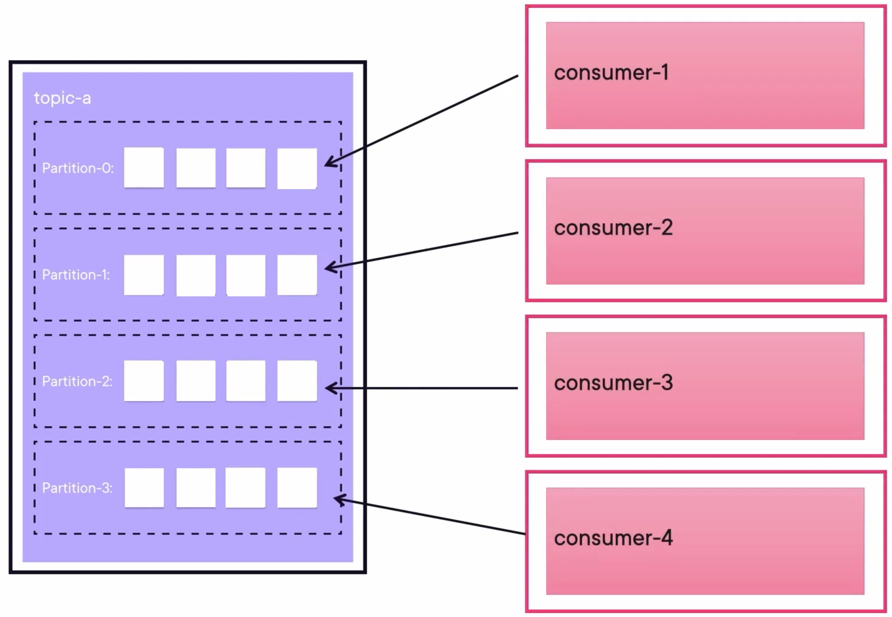
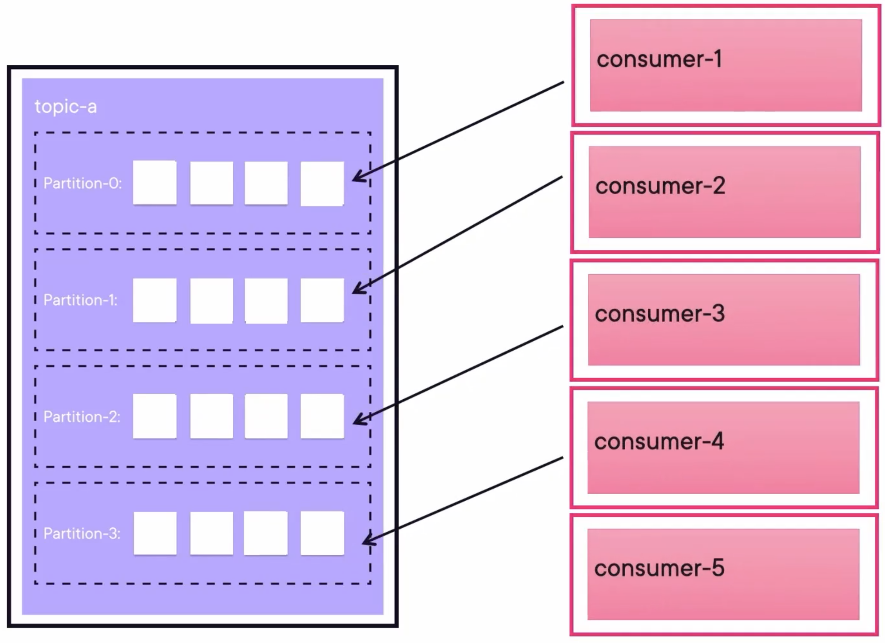

## Kafka Consumer Group

- Consumers are typically done as a group.
- A single consumer will end up inefficient with large amounts of data.
- A consumer may never catch up.
- Every consumer should be on it's own machine, instance, pod.

The consumer group ID is the key so Kafka knows that messages should be distributed to both consumers without duplicating.



If we add one more consumer to this group, the last one will be idle, because one partition can't be share across consumers. One partition can only be assigned to one consumer. Instead, the partitions are the way of Kafka to scale. More partitions imply you can have more consumers in the same consumer group.



## Demo: Consuming from Kafka

### Run Kafka Containers

Create a docker-compose file `docker-compose.yaml` containing 3 Zookeepers, 3 Kafka Brokers, and 1 Kafka REST Proxy:

```yaml
---
version: '3'
services:
  zookeeper-1:
    image: confluentinc/cp-zookeeper:7.4.1
    hostname: zookeeper-1
    container_name: zookeeper-1
    volumes:
      - ./zookeeper-1_data:/var/lib/zookeeper/data
      - ./zookeeper-1_log:/var/lib/zookeeper/log
    environment:
      ZOOKEEPER_CLIENT_PORT: 2181
      ZOOKEEPER_TICK_TIME: 2000
      ZOO_MY_ID: 1
      ZOO_SERVERS: server.1=zookeeper-1:2888:3888;2181 server.2=zookeeper-2:2888:3888;2181 server.3=zookeeper-3:2888:3888;2181

  zookeeper-2:
    image: confluentinc/cp-zookeeper:7.4.1
    hostname: zookeeper-2
    container_name: zookeeper-2
    volumes:
      - ./zookeeper-2_data:/var/lib/zookeeper/data
      - ./zookeeper-2_log:/var/lib/zookeeper/log
    environment:
      ZOOKEEPER_CLIENT_PORT: 2181
      ZOOKEEPER_TICK_TIME: 2000
      ZOO_MY_ID: 2
      ZOO_SERVERS: server.1=zookeeper-1:2888:3888;2181 server.2=zookeeper-2:2888:3888;2181 server.3=zookeeper-3:2888:3888;2181

  zookeeper-3:
    image: confluentinc/cp-zookeeper:7.4.1
    hostname: zookeeper-3
    container_name: zookeeper-3
    volumes:
      - ./zookeeper-3_data:/var/lib/zookeeper/data
      - ./zookeeper-3_log:/var/lib/zookeeper/log
    environment:
      ZOOKEEPER_CLIENT_PORT: 2181
      ZOOKEEPER_TICK_TIME: 2000
      ZOO_MY_ID: 3
      ZOO_SERVERS: server.1=zookeeper-1:2888:3888;2181 server.2=zookeeper-2:2888:3888;2181 server.3=zookeeper-3:2888:3888;2181


  broker-1:
    image: confluentinc/cp-kafka:7.4.1
    hostname: broker-1
    container_name: broker-1
    volumes:
      - ./broker-1-data:/var/lib/kafka/data
    depends_on:
      - zookeeper-1
      - zookeeper-2
      - zookeeper-3
    ports:
      - 9092:9092
      - 29092:29092
    environment:
      KAFKA_BROKER_ID: 1
      KAFKA_ZOOKEEPER_CONNECT: zookeeper-1:2181
      KAFKA_ADVERTISED_LISTENERS: HOST://localhost:9092,INTERNAL://broker-1:29092
      KAFKA_LISTENER_SECURITY_PROTOCOL_MAP: HOST:PLAINTEXT,INTERNAL:PLAINTEXT
      KAFKA_INTER_BROKER_LISTENER_NAME: INTERNAL
      KAFKA_SNAPSHOT_TRUST_EMPTY: true

  broker-2:
    image: confluentinc/cp-kafka:7.4.1
    hostname: broker-2
    container_name: broker-2
    volumes:
      - ./broker-2-data:/var/lib/kafka/data
    depends_on:
      - zookeeper-1
      - zookeeper-2
      - zookeeper-3
      - broker-1
    ports:
      - 9093:9093
      - 29093:29093
    environment:
      KAFKA_BROKER_ID: 2
      KAFKA_ZOOKEEPER_CONNECT: zookeeper-1:2181
      KAFKA_ADVERTISED_LISTENERS: HOST://localhost:9093,INTERNAL://broker-2:29093
      KAFKA_LISTENER_SECURITY_PROTOCOL_MAP: HOST:PLAINTEXT,INTERNAL:PLAINTEXT
      KAFKA_INTER_BROKER_LISTENER_NAME: INTERNAL
      KAFKA_SNAPSHOT_TRUST_EMPTY: true

  broker-3:
    image: confluentinc/cp-kafka:7.4.1
    hostname: broker-3
    container_name: broker-3
    volumes:
      - ./broker-3-data:/var/lib/kafka/data
    depends_on:
      - zookeeper-1
      - zookeeper-2
      - zookeeper-3
      - broker-1
      - broker-2
    ports:
      - 9094:9094
      - 29094:29094
    environment:
      KAFKA_BROKER_ID: 3
      KAFKA_ZOOKEEPER_CONNECT: zookeeper-1:2181
      KAFKA_ADVERTISED_LISTENERS: HOST://localhost:9094,INTERNAL://broker-3:29094
      KAFKA_LISTENER_SECURITY_PROTOCOL_MAP: HOST:PLAINTEXT,INTERNAL:PLAINTEXT
      KAFKA_INTER_BROKER_LISTENER_NAME: INTERNAL
      KAFKA_SNAPSHOT_TRUST_EMPTY: true


  rest-proxy:
    image: confluentinc/cp-kafka-rest:7.4.1
    ports:
      - "8082:8082"
    depends_on:
      - zookeeper-1
      - zookeeper-2
      - zookeeper-3
      - broker-1
      - broker-2
      - broker-3
    hostname: rest-proxy
    container_name: rest-proxy
    environment:
      KAFKA_REST_HOST_NAME: rest-proxy
      KAFKA_REST_BOOTSTRAP_SERVERS: 'broker-1:29092,broker-2:29093,broker-3:29094'
      KAFKA_REST_LISTENERS: "http://0.0.0.0:8082"
```

Run composed containers:

```bash
docker compose up -d
```

### Create Topic

Create a topic `myorders` with 2 partitions:

```bash
kafka-topics.sh --create --bootstrap-server localhost:9092 --partitions 2 --topic myorders
```

### Run Consumer

Run 3 Kafka Consumers in different terminals lisitening to the same topic `myorders` and deserialize the messages by string key and double value seperated by `,`:

```bash
kafka-console-consumer.sh \
--bootstrap-server localhost:9092 \
--topic myorders --from-beginning \
--key-deserializer org.apache.kafka.common.serialization.StringDeserializer \
--value-deserializer org.apache.kafka.common.serialization.DoubleDeserializer \
--property print.key=true \
--property key.separator=, \
--group 1
```

Then, in another terminal, run another consumer with all the other same parameters but with `--group 2`.

We can see check the logs of broker 1:

```bash
docker logs broker-1
```

The following log can be found, which means there are three members in the group 1:

```
[2024-11-18 14:36:14,337] INFO [GroupCoordinator 1]: Stabilized group 1 generation 3 (__consumer_offsets-49) with 3 members (kafka.coordinator.group.GroupCoordinator)
[2024-11-18 14:36:14,346] INFO [GroupCoordinator 1]: Assignment received from leader console-consumer-340e7131-cbd4-4811-a62a-543fbac93948 for group 1 for generation 3. The group has 3 members, 0 of which are static. (kafka.coordinator.group.GroupCoordinator)
```

And in the logs of broker 2 (or 3), we can see that there is one consumer in the group 2:

```
[2024-11-18 14:38:49,987] INFO [GroupCoordinator 3]: Stabilized group 2 generation 1 (__consumer_offsets-0) with 1 members (kafka.coordinator.group.GroupCoordinator)
[2024-11-18 14:38:50,050] INFO [GroupCoordinator 3]: Assignment received from leader console-consumer-bebf5e94-8479-4ab8-b078-ced3f0d81d4c for group 2 for generation 1. The group has 1 members, 0 of which are static. (kafka.coordinator.group.GroupCoordinator)
```

### Send Messages

Run the following Java method to send messages to the topic `myorders`:

```java
public class Main {
	private static final Logger log = LoggerFactory.getLogger(Main.class);
	private static final String TOPIC = "myorders";

	public static void main(String[] args) throws InterruptedException {

		Properties props = new Properties();
		props.put(ProducerConfig.BOOTSTRAP_SERVERS_CONFIG, "http://localhost:9092,http://localhost:9093,http://localhost:9094");
		props.put(ProducerConfig.KEY_SERIALIZER_CLASS_CONFIG, StringSerializer.class.getName());
		props.put(ProducerConfig.VALUE_SERIALIZER_CLASS_CONFIG, DoubleSerializer.class.getName());
		KafkaProducer<String, Double> producer = new KafkaProducer<>(props);
		String stateString =
				"AK,AL,AZ,AR,CA,CO,CT,DE,FL,GA," +
						"HI,ID,IL,IN,IA,KS,KY,LA,ME, MD," +
						"MA,MI,MN,MS,MO,MT,NE,NV,NH,NJ," +
						"NM,NY,NC,ND,OH,OK,OR,PA,RI,SC," +
						"SD,TN,TX,UT,VT,VA,WA,WV,WI,WY";
		String[] stateArray = stateString.split(",");
		for (int i = 0; i < 25000; i++) {
			String key = stateArray[(int) Math.floor(Math.random()*(50))];
			double value = Math.floor(Math.random()* (10000-10+1)+10);
			ProducerRecord<String, Double> producerRecord =
					new ProducerRecord<>(TOPIC, key, value);

			log.info("Sending message with key " + key + " to Kafka");

			producer.send(producerRecord, (metadata, e) -> {
				if (metadata != null) {
					System.out.println(producerRecord.key());
					System.out.println(producerRecord.value());
					System.out.println(metadata.toString());
				}
			});
			Thread.sleep(5000);
		}
		producer.flush();
		producer.close();

		log.info("Successfully produced messages to " + TOPIC + " topic");

	}
}
```

We can see that the consumer in the group 2 read all messages:

```
MT,4138.0
LA,6868.0
KS,6318.0
MA,6184.0
NM,8817.0
NJ,6606.0
NV,9748.0
```

The consumer 1 in the group 1:

```
MT,4138.0
NV,9748.0
```

The consumer 2 (or 3) in the group 2:

```
LA,6868.0
KS,6318.0
MA,6184.0
NM,8817.0
NJ,6606.0
```

But consumer 3 (or 2) in the group 3 doesn't read any message. That's because there are only two partitions, which has been assigned to the other two consumers. So this consumer is idle. **One partition can only be assigned to one consumer.**

We can chek the detail of consumer groups:

```bash
❯ kafka-consumer-groups.sh --all-groups --all-topics --bootstrap-server localhost:9092 --describe

GROUP           TOPIC           PARTITION  CURRENT-OFFSET  LOG-END-OFFSET  LAG             CONSUMER-ID                                           HOST            CLIENT-ID
1               myorders        0          13              13              0               console-consumer-340e7131-cbd4-4811-a62a-543fbac93948 /172.18.0.1     console-consumer
1               myorders        1          16              16              0               console-consumer-68f58739-69be-4f48-af94-590ee15add84 /172.18.0.1     console-consumer
GROUP           TOPIC           PARTITION  CURRENT-OFFSET  LOG-END-OFFSET  LAG             CONSUMER-ID                                           HOST            CLIENT-ID
2               myorders        1          16              16              0               console-consumer-bebf5e94-8479-4ab8-b078-ced3f0d81d4c /172.18.0.1     console-consumer
2               myorders        0          13              13              0               console-consumer-bebf5e94-8479-4ab8-b078-ced3f0d81d4c /172.18.0.1     console-consumer%
```

We can see that in the group 1, these two partitions are assigned to two different consumers. But in the group2, these two partitions are assigned to the same consumer.

## Demo: Consuming Messages with Java

### Deserializers and Consumer Configuration

Provide two or more locations where the Bootstrap servers are located:

```java
Properties properties = new Properties();
properties.put(ConsumerConfig.BOOTSTRAP_SERVERS_CONFIG, "localhost:9092");
properties.put(ConsumerConfig.GROUP_ID_CONFIG, "my_group");
properties.put(ConsumerConfig.KEY_DESERIALIZER_CLASS_CONFIG, "org.apache.kafka.common.serialization.StringDeserializer");
properties.put(ConsumerConfig.VALUE_DESERIALIZER_CLASS_CONFIG, "org.apache.kafka,common,serialization.IntegerDeserializer");
properties.put(ConsumerConfig.AUTO_OFFSET_RESET_CONFIG, "earliest");
```

Construct a org.apache.kafka.clients.consumer.KafkaConsumer object:

```java
KafkaConsumer consumer = new KafkaConsumer<>(properties);
```

Use the consumer that you have constructed, and call poll with pulse time:

```java
while (!done.get()) {
  	ConsumerRecords<String, String> records = consumer.poll(Duration.of(500, ChronoUnit.MILLIS));
  	for (ConsumerRecord<String, String> record : records) {
      	System.out.format("offset: %d\n", record.offset());
      	System.out.format("partition: %d\n", record.partition());
      	System.out.format("timestamp: %d\n", record.timestamp());
      	System.out.format("timeStamppType: %d\n", record.timestampType());
      	System.out.format("topic: %d\n", record.topic());
      	System.out.format("key: %d\n", record.key());
      	System.out.format("value: %d\n", record.value());
    }
}
```

Close the consumer:

```java
consumer.close();
```

### Rebalance

-   Regardless of what a consumer is doing, at regular intervals, which are configurable, they send a heartbeat to Kafka.
-   Specifically to the coordinator inside the broker, basically letting them know they are alive.
-   Also, when we poll for records, that lets Kafka know what consumer is alive.
-   When you close a consumer, that `close()` method lets Kafka know they are not alive anymore, which triggers a rebalance.

### Sample Code

```java
package com.globomantics;

import org.apache.kafka.clients.consumer.ConsumerConfig;
import org.apache.kafka.clients.consumer.ConsumerRecord;
import org.apache.kafka.clients.consumer.ConsumerRecords;
import org.apache.kafka.clients.consumer.KafkaConsumer;
import org.apache.kafka.common.serialization.DoubleDeserializer;
import org.apache.kafka.common.serialization.StringDeserializer;
import org.slf4j.Logger;
import org.slf4j.LoggerFactory;

import java.time.Duration;
import java.util.Collections;
import java.util.Properties;

public class Consumer {

	private static final Logger log = LoggerFactory.getLogger(Consumer.class);

	public static void main(String[] args) {

		Properties props = new Properties();
		props.put(ConsumerConfig.BOOTSTRAP_SERVERS_CONFIG, "http://localhost:9092,http://localhost:9093,http://localhost:9094");
		props.put(ConsumerConfig.KEY_DESERIALIZER_CLASS_CONFIG, StringDeserializer.class.getName());
		props.put(ConsumerConfig.VALUE_DESERIALIZER_CLASS_CONFIG, DoubleDeserializer.class.getName());
		props.put(ConsumerConfig.GROUP_ID_CONFIG, args[0] + "consumer");

		KafkaConsumer<String, Double> consumer = new KafkaConsumer<>(props);

		Thread haltedHook = new Thread(consumer::close);
		Runtime.getRuntime().addShutdownHook(haltedHook);

		consumer.subscribe(Collections.singletonList("myorders"));

		while (true) {
			ConsumerRecords<String, Double> records = consumer.poll(Duration.ofMillis(100));
			records.forEach(Consumer::processRecord);
		}
	}

	private static void processRecord(ConsumerRecord record) {
		log.info("Received message with key: " + record.key() + " and value " + record.value());
		log.info("It comes from partition: " + record.partition());
		try {
			Thread.sleep(1000);
		} catch (InterruptedException e) {
			System.out.println(e.getMessage());
		}
	}
}
```

### Demo

Run composed containers using the same yaml file:

```bash
docker compose up -d
```

create a topic `myorders` with four partitions:

```bash
kafka-topics.sh --create --bootstrap-server localhost:9092 \
--partitions 4 --topic myorders
```

Run two consumers in two terminals with the same command:

```bash
mvn clean install exec:java -Dexec.mainClass="com.globomantics.Consumer" -Dexec.args="1"
```

We can check the running consumers by checking the log of each broker:

```bash
docker logs broker-1
```

If any broker shows a log like the following, the two consumers are alive and assigned to this broker:

```
[2024-11-20 16:01:51,462] INFO [GroupCoordinator 2]: Assignment received from leader consumer-1consumer-1-ec9ee2fb-587c-44ad-bd09-be2b75182295 for group 1consumer for generation 2. The group has 2 members, 0 of which are static. (kafka.coordinator.group.GroupCoordinator)
```

Run a producer by the following Producer class, which send messages to the topic `myorders`:

```java
package com.globomantics;

import org.apache.kafka.clients.producer.KafkaProducer;
import org.apache.kafka.clients.producer.ProducerConfig;
import org.apache.kafka.clients.producer.ProducerRecord;
import org.apache.kafka.common.serialization.DoubleSerializer;
import org.apache.kafka.common.serialization.StringSerializer;
import org.slf4j.Logger;
import org.slf4j.LoggerFactory;

import java.util.Properties;

public class Producer {
	private static final Logger log = LoggerFactory.getLogger(Producer.class);
	private static final String TOPIC = "myorders";

	public static void main(String[] args) throws InterruptedException {

		Properties props = new Properties();
		props.put(ProducerConfig.BOOTSTRAP_SERVERS_CONFIG, "http://localhost:9092,http://localhost:9093,http://localhost:9094");
		props.put(ProducerConfig.KEY_SERIALIZER_CLASS_CONFIG, StringSerializer.class.getName());
		props.put(ProducerConfig.VALUE_SERIALIZER_CLASS_CONFIG, DoubleSerializer.class.getName());
		KafkaProducer<String, Double> producer = new KafkaProducer<>(props);
		String stateString =
				"AK,AL,AZ,AR,CA,CO,CT,DE,FL,GA," +
						"HI,ID,IL,IN,IA,KS,KY,LA,ME,MD," +
						"MA,MI,MN,MS,MO,MT,NE,NV,NH,NJ," +
						"NM,NY,NC,ND,OH,OK,OR,PA,RI,SC," +
						"SD,TN,TX,UT,VT,VA,WA,WV,WI,WY";
		String[] stateArray = stateString.split(",");
		for (int i = 0; i < 25000; i++) {
			String key = stateArray[(int) Math.floor(Math.random()*(50))];
			double value = Math.floor(Math.random()* (10000-10+1)+10);
			ProducerRecord<String, Double> producerRecord =
					new ProducerRecord<>(TOPIC, key, value);

			log.info("Sending message with key " + key + " to Kafka");

			producer.send(producerRecord, (metadata, e) -> {
				if (metadata != null) {
					System.out.println(producerRecord.key());
					System.out.println(producerRecord.value());
					System.out.println(metadata.toString());
				}
			});
			Thread.sleep(5000);
		}
		producer.flush();
		producer.close();

		log.info("Successfully produced messages to " + TOPIC + " topic");

	}
}
```

We can see that the consumer 1 received messages from partitions 0 and 1:

```
[com.globomantics.Consumer.main()] INFO com.globomantics.Consumer - Received message with key: KS and value 9144.0
[com.globomantics.Consumer.main()] INFO com.globomantics.Consumer - It comes from partition: 1
[com.globomantics.Consumer.main()] INFO com.globomantics.Consumer - Received message with key: MS and value 4089.0
[com.globomantics.Consumer.main()] INFO com.globomantics.Consumer - It comes from partition: 0
```

And, consumer 2 received messages from partitions 2 and 3:

```
[com.globomantics.Consumer.main()] INFO com.globomantics.Consumer - Received message with key: UT and value 1539.0
[com.globomantics.Consumer.main()] INFO com.globomantics.Consumer - It comes from partition: 2
[com.globomantics.Consumer.main()] INFO com.globomantics.Consumer - Received message with key: IA and value 9049.0
[com.globomantics.Consumer.main()] INFO com.globomantics.Consumer - It comes from partition: 3
```

We can chek the detail of consumer groups:

```
❯ kafka-consumer-groups.sh --all-groups --all-topics --bootstrap-server localhost:9092 --describe  

GROUP           TOPIC           PARTITION  CURRENT-OFFSET  LOG-END-OFFSET  LAG             CONSUMER-ID                                               HOST            CLIENT-ID
1consumer       myorders        2          2               2               0               consumer-1consumer-1-ec9ee2fb-587c-44ad-bd09-be2b75182295 /172.19.0.1     consumer-1consumer-1
1consumer       myorders        3          1               1               0               consumer-1consumer-1-ec9ee2fb-587c-44ad-bd09-be2b75182295 /172.19.0.1     consumer-1consumer-1
1consumer       myorders        1          2               2               0               consumer-1consumer-1-41553fd9-436f-459f-8345-84cac011a51d /172.19.0.1     consumer-1consumer-1
1consumer       myorders        0          2               2               0               consumer-1consumer-1-41553fd9-436f-459f-8345-84cac011a51d /172.19.0.1     consumer-1consumer-1%
```

We can see that the partitions 0 and 1 are assigned to a same consumer, and the partitions 2 and 3 are assigned to the same consumers.

Then let's run the third consumer by the same command:

```bash
mvn clean install exec:java -Dexec.mainClass="com.globomantics.Consumer" -Dexec.args="1"
```

Now, we can see something like the consumer 2 only received messages from partition 3:

```
[com.globomantics.Consumer.main()] INFO com.globomantics.Consumer - Received message with key: MA and value 202.0
[com.globomantics.Consumer.main()] INFO com.globomantics.Consumer - It comes from partition: 3
[com.globomantics.Consumer.main()] INFO com.globomantics.Consumer - Received message with key: FL and value 4078.0
[com.globomantics.Consumer.main()] INFO com.globomantics.Consumer - It comes from partition: 3
```

And, the new joining consumer 3 only received messages from partition 2:

```
[com.globomantics.Consumer.main()] INFO com.globomantics.Consumer - Received message with key: MN and value 8388.0
[com.globomantics.Consumer.main()] INFO com.globomantics.Consumer - It comes from partition: 2
[com.globomantics.Consumer.main()] INFO com.globomantics.Consumer - Received message with key: CT and value 1375.0
[com.globomantics.Consumer.main()] INFO com.globomantics.Consumer - It comes from partition: 2
```

The new consumer 3 shared the load of consumer 2.

We can also check the consumer groups again:

```
❯ kafka-consumer-groups.sh --all-groups --all-topics --bootstrap-server localhost:9092 --describe

GROUP           TOPIC           PARTITION  CURRENT-OFFSET  LOG-END-OFFSET  LAG             CONSUMER-ID                                               HOST            CLIENT-ID
1consumer       myorders        1          24              24              0               consumer-1consumer-1-41553fd9-436f-459f-8345-84cac011a51d /172.19.0.1     consumer-1consumer-1
1consumer       myorders        0          20              20              0               consumer-1consumer-1-41553fd9-436f-459f-8345-84cac011a51d /172.19.0.1     consumer-1consumer-1
1consumer       myorders        3          29              30              1               consumer-1consumer-1-ec9ee2fb-587c-44ad-bd09-be2b75182295 /172.19.0.1     consumer-1consumer-1
1consumer       myorders        2          16              16              0               consumer-1consumer-1-9bf052d6-4197-4c00-b327-8cc1f13662c4 /172.19.0.1     consumer-1consumer-1%
```

We can see that partition 3 is assigned to only one consumer, and partition 2 is assigned to the other new joining consumer.

We can also check the log of broker 2 (or maybe in other broker):

```
[2024-11-20 16:22:22,217] INFO [GroupCoordinator 2]: Dynamic member with unknown member id joins group 1consumer in Stable state. Created a new member id consumer-1consumer-1-9bf052d6-4197-4c00-b327-8cc1f13662c4 and request the member to rejoin with this id. (kafka.coordinator.group.GroupCoordinator)
[2024-11-20 16:22:22,234] INFO [GroupCoordinator 2]: Preparing to rebalance group 1consumer in state PreparingRebalance with old generation 2 (__consumer_offsets-7) (reason: Adding new member consumer-1consumer-1-9bf052d6-4197-4c00-b327-8cc1f13662c4 with group instance id None; client reason: rebalance failed due to MemberIdRequiredException) (kafka.coordinator.group.GroupCoordinator)
```

The group is rebalanced due to a new consumer joining in.

## Takeaways

-   Consumers act as a group via the consumer group ID.
-   Each consumer in the group gets assigned a partition, and a partition is not shared by two members of  a group.
-   A rebalance is triggered when a member leaves the group or they haven't sent a heartbeat in a long time.
-   A rebalance is a stop-the-world event that ensures all partitions are attended by some consumer in the group.

## Keys

-   Be sure to configure your consumer to ensure you are not duplicating messages.
-   Try to create a consumer loop with two consumers and verify the partition assignment by playing with keys in the producer.
-   See what happens in the logs of the broker when a consumer joins or leaves the group.
