## ETL with Apache Kafka

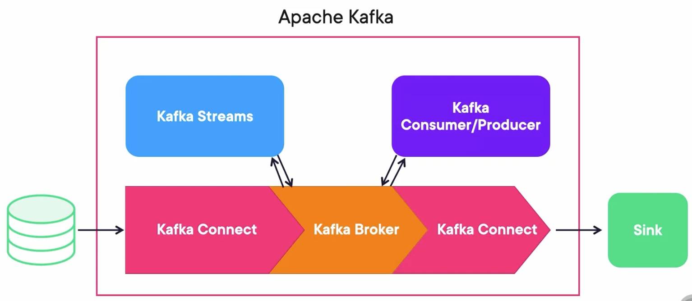

One important statement is that Kafka Connect is not an ETL(Extract, Load, Transform) solution itself, it only connects.

But with the help of the correct plugins it can have some ETL capabilities.

## Connectors

-   **Source Connectors**: Transfer data from a Source to Kafka.
-   **Sink Connectors**: Transfer data from Kafka to a Sink.

You can search through all of the connectors at thre registry: https://www.confluent.io/product/connectors.

## Standalone vs. Distributed

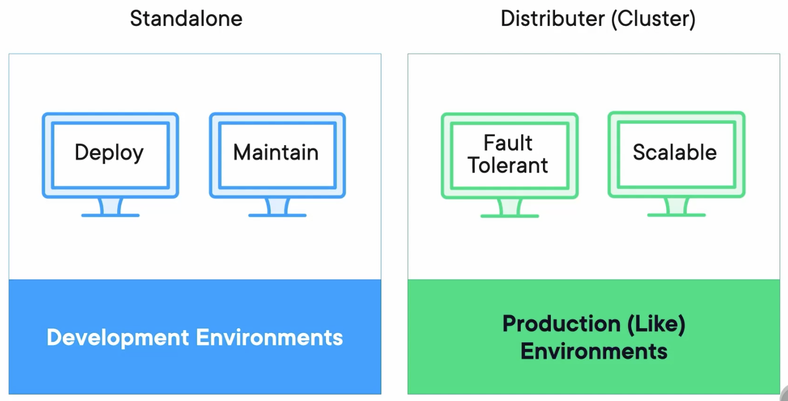

### Standalone

The connector configurations will be files. The worker will be just one script that we run.

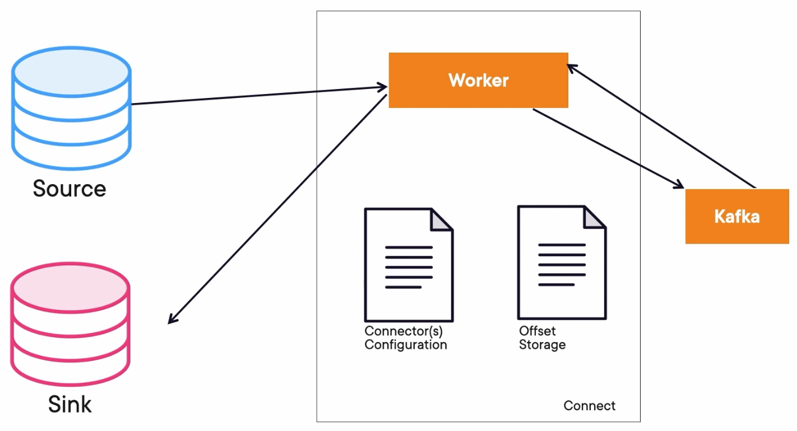

### Distributed

We will have more worker instances. The configurations instead of files will be offset and information in topics inside of Kafka. Kafka Connect in distributed mode offers a RESTful API to deploy a configuration.

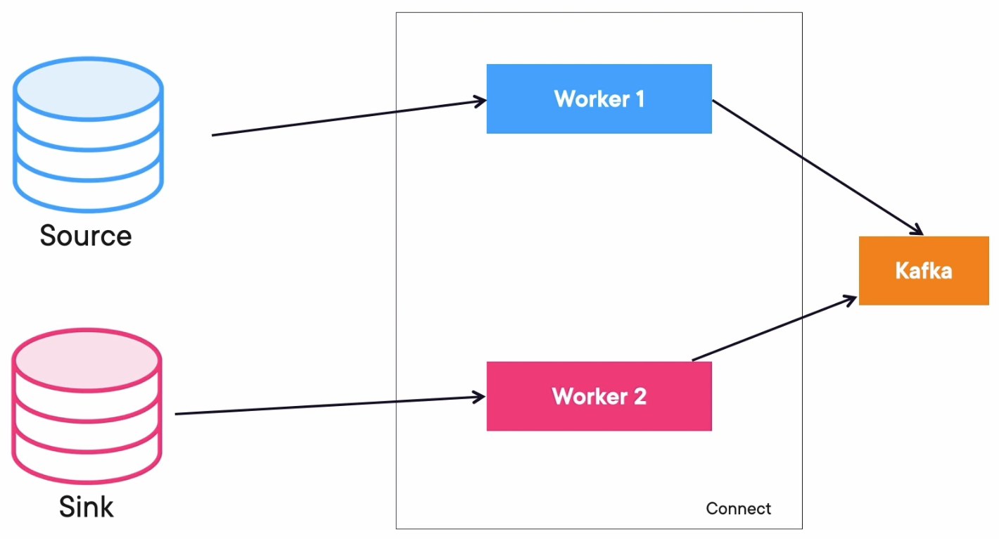

## Tasks Rebalancing

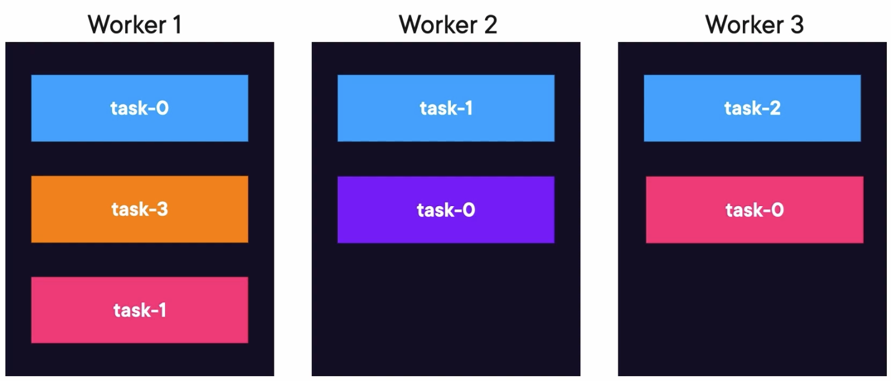

If worker 3 fails, the tasks will be moved to a living worker.

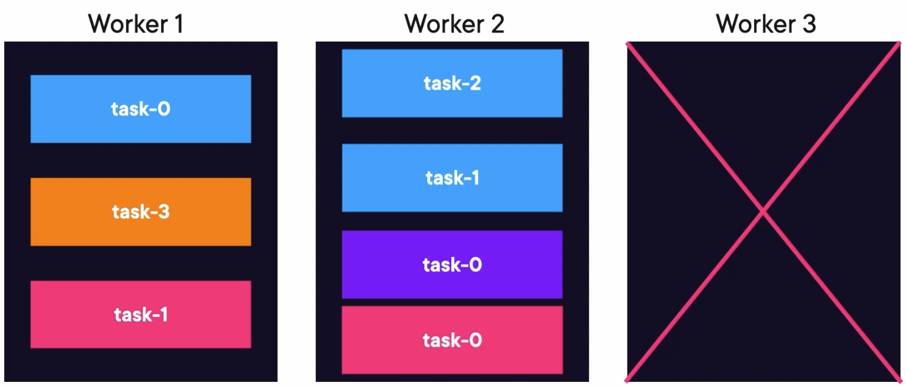

When worker 3 is alive again, the tasks rebalance again to the original worker.


## Demo: Using the File Connector in a Standalone Mode

Create a docker-compose file `docker-compose.yaml` containing 3 Zookeepers, 3 Kafka Brokers, 1 Kafka REST Proxy, and 1 Schema Registry:

```yaml
---
version: '3'
services:
  zookeeper-1:
    image: confluentinc/cp-zookeeper:7.4.1
    hostname: zookeeper-1
    container_name: zookeeper-1
    volumes:
      - ./zookeeper-1_data:/var/lib/zookeeper/data
      - ./zookeeper-1_log:/var/lib/zookeeper/log
    environment:
      ZOOKEEPER_CLIENT_PORT: 2181
      ZOOKEEPER_TICK_TIME: 2000
      ZOO_MY_ID: 1
      ZOO_SERVERS: server.1=zookeeper-1:2888:3888;2181 server.2=zookeeper-2:2888:3888;2181 server.3=zookeeper-3:2888:3888;2181

  zookeeper-2:
    image: confluentinc/cp-zookeeper:7.4.1
    hostname: zookeeper-2
    container_name: zookeeper-2
    volumes:
      - ./zookeeper-2_data:/var/lib/zookeeper/data
      - ./zookeeper-2_log:/var/lib/zookeeper/log
    environment:
      ZOOKEEPER_CLIENT_PORT: 2181
      ZOOKEEPER_TICK_TIME: 2000
      ZOO_MY_ID: 2
      ZOO_SERVERS: server.1=zookeeper-1:2888:3888;2181 server.2=zookeeper-2:2888:3888;2181 server.3=zookeeper-3:2888:3888;2181

  zookeeper-3:
    image: confluentinc/cp-zookeeper:7.4.1
    hostname: zookeeper-3
    container_name: zookeeper-3
    volumes:
      - ./zookeeper-3_data:/var/lib/zookeeper/data
      - ./zookeeper-3_log:/var/lib/zookeeper/log
    environment:
      ZOOKEEPER_CLIENT_PORT: 2181
      ZOOKEEPER_TICK_TIME: 2000
      ZOO_MY_ID: 3
      ZOO_SERVERS: server.1=zookeeper-1:2888:3888;2181 server.2=zookeeper-2:2888:3888;2181 server.3=zookeeper-3:2888:3888;2181


  broker-1:
    image: confluentinc/cp-kafka:7.4.1
    hostname: broker-1
    container_name: broker-1
    volumes:
      - ./broker-1-data:/var/lib/kafka/data
    depends_on:
      - zookeeper-1
      - zookeeper-2
      - zookeeper-3
    ports:
      - 9092:9092
      - 29092:29092
    environment:
      KAFKA_BROKER_ID: 1
      KAFKA_ZOOKEEPER_CONNECT: zookeeper-1:2181
      KAFKA_ADVERTISED_LISTENERS: HOST://localhost:9092,INTERNAL://broker-1:29092
      KAFKA_LISTENER_SECURITY_PROTOCOL_MAP: HOST:PLAINTEXT,INTERNAL:PLAINTEXT
      KAFKA_INTER_BROKER_LISTENER_NAME: INTERNAL
      KAFKA_SNAPSHOT_TRUST_EMPTY: true

  broker-2:
    image: confluentinc/cp-kafka:7.4.1
    hostname: broker-2
    container_name: broker-2
    volumes:
      - ./broker-2-data:/var/lib/kafka/data
    depends_on:
      - zookeeper-1
      - zookeeper-2
      - zookeeper-3
      - broker-1
    ports:
      - 9093:9093
      - 29093:29093
    environment:
      KAFKA_BROKER_ID: 2
      KAFKA_ZOOKEEPER_CONNECT: zookeeper-1:2181
      KAFKA_ADVERTISED_LISTENERS: HOST://localhost:9093,INTERNAL://broker-2:29093
      KAFKA_LISTENER_SECURITY_PROTOCOL_MAP: HOST:PLAINTEXT,INTERNAL:PLAINTEXT
      KAFKA_INTER_BROKER_LISTENER_NAME: INTERNAL
      KAFKA_SNAPSHOT_TRUST_EMPTY: true

  broker-3:
    image: confluentinc/cp-kafka:7.4.1
    hostname: broker-3
    container_name: broker-3
    volumes:
      - ./broker-3-data:/var/lib/kafka/data
    depends_on:
      - zookeeper-1
      - zookeeper-2
      - zookeeper-3
      - broker-1
      - broker-2
    ports:
      - 9094:9094
      - 29094:29094
    environment:
      KAFKA_BROKER_ID: 3
      KAFKA_ZOOKEEPER_CONNECT: zookeeper-1:2181
      KAFKA_ADVERTISED_LISTENERS: HOST://localhost:9094,INTERNAL://broker-3:29094
      KAFKA_LISTENER_SECURITY_PROTOCOL_MAP: HOST:PLAINTEXT,INTERNAL:PLAINTEXT
      KAFKA_INTER_BROKER_LISTENER_NAME: INTERNAL
      KAFKA_SNAPSHOT_TRUST_EMPTY: true


  rest-proxy:
    image: confluentinc/cp-kafka-rest:7.4.1
    ports:
      - "8082:8082"
    depends_on:
      - zookeeper-1
      - zookeeper-2
      - zookeeper-3
      - broker-1
      - broker-2
      - broker-3
    hostname: rest-proxy
    container_name: rest-proxy
    environment:
      KAFKA_REST_HOST_NAME: rest-proxy
      KAFKA_REST_BOOTSTRAP_SERVERS: 'broker-1:29092,broker-2:29093,broker-3:29094'
      KAFKA_REST_LISTENERS: "http://0.0.0.0:8082"

  schema-registry:
    image: confluentinc/cp-schema-registry:7.4.1
    hostname: schema-registry
    container_name: schema-registry
    depends_on:
      - rest-proxy
    ports:
      - "8081:8081"
    environment:
      SCHEMA_REGISTRY_HOST_NAME: schema-registry
      SCHEMA_REGISTRY_KAFKASTORE_BOOTSTRAP_SERVERS: 'broker-1:29092,broker-2:29093,broker-3:29094'
```

Run composed containers:

```bash
docker compose up -d
```

### Create Topic

Create a topic `connect-log` with partitions 4:

```bash
kafka-topics.sh --create --bootstrap-server localhost:9092 --partitions 4 --topic connect-log
```

### Create a Worker Properties File

Create a `worker.properties` file at the root of the project. You should change the `plugin.path` with your absolute path of Kafka libs. Then, set the `schema.registry.url` to your schema-registry` url, which is configured in the `docker-compose.yaml`.

```properties
#worker.properties
bootstrap.servers=http://localhost:9092,http://localhost:9093,http://localhost:9094

# The converters specify the format of data in Kafka and how to translate it into Connect data. Every Connect user will
# need to configure these based on the format they want their data in when loaded from or stored into Kafka
key.converter=org.apache.kafka.connect.storage.StringConverter
value.converter=org.apache.kafka.connect.storage.StringConverter

# The internal converter used for offsets and config data is configurable and must be specified, but most users will
# always want to use the built-in default. Offset and config data is never visible outside of Copcyat in this format.
internal.key.converter=org.apache.kafka.connect.json.JsonConverter
internal.value.converter=org.apache.kafka.connect.json.JsonConverter
internal.key.converter.schemas.enable=true
internal.value.converter.schemas.enable=true

offset.storage.file.filename=/tmp/connect.offsets

# Flush much faster than normal, which is useful for testing/debugging
offset.flush.interval.ms=5000

# Reload metadata faster too so consumer picks up new topics
consumer.metadata.max.age.ms=10000
plugin.path=/Users/zjxjwxk/Library/kafka_2.13-3.9.0/libs
schema.registry.url=http://localhost:8081
rest.port=8083
group.id=1
config.storage.topic=kafka_connect_configs
cleanup.policy=compact
offset.storage.topic=kafka_connect_offsets
status.storage.topic=kafka_connect_statuses
```

### Create a Sink Properties File

Create a `filesink.properties` file at the root of the project. We can set the number of tasks by `tasks.max`, set the path of the file by `file`, and set the topic we are listening to.

```properties
#my-file-sink.properties config file
name=local-file-sink
connector.class=FileStreamSink
tasks.max=1
file=./file-log.txt
topics=connectlog
```

### Start the Kafka Connect in Standalone Mode

Start a worker with a standalone instance. Set the parameters for the worker property file and the filesink property file.

```bash
connect-standalone.sh worker.properties filesink.properties
```

### Run a Kafka Producer

Create a Java file to run the Kafka Producer sending messages to the topic `connectlog`:

```java
package com.globomantics;

import org.apache.kafka.clients.producer.KafkaProducer;
import org.apache.kafka.clients.producer.ProducerConfig;
import org.apache.kafka.clients.producer.ProducerRecord;
import org.apache.kafka.common.serialization.DoubleSerializer;
import org.apache.kafka.common.serialization.IntegerSerializer;
import org.apache.kafka.common.serialization.StringSerializer;
import org.slf4j.Logger;
import org.slf4j.LoggerFactory;

import java.util.Properties;

public class LogProducer {
	private static final Logger log = LoggerFactory.getLogger(LogProducer.class);
	private static final String TOPIC = "connectlog";

	public static void main(String[] args) throws InterruptedException {

		Properties props = new Properties();
		props.put(ProducerConfig.BOOTSTRAP_SERVERS_CONFIG, "http://localhost:9092,http://localhost:9093,http://localhost:9094");
		props.put(ProducerConfig.KEY_SERIALIZER_CLASS_CONFIG, DoubleSerializer.class.getName());
		props.put(ProducerConfig.VALUE_SERIALIZER_CLASS_CONFIG, StringSerializer.class.getName());
		KafkaProducer<Double, String> producer = new KafkaProducer<>(props);
		for (int i = 0; i < 25000; i++) {
			double key = Math.floor(Math.random()*(50));
			String value = "Some logging info from Kafka with key" + key;
			ProducerRecord<Double, String> producerRecord =
					new ProducerRecord<>(TOPIC, key, value);

			log.info("Sending message " + value + " to Kafka");

			producer.send(producerRecord, (metadata, e) -> {
				if (metadata != null) {
					System.out.println(producerRecord.key());
					System.out.println(producerRecord.value());
					System.out.println(metadata.toString());
				}
			});
			Thread.sleep(1000);
		}
		producer.flush();
		producer.close();

		log.info("Successfully produced messages to " + TOPIC + " topic");

	}
}
```

### Check the Log File

We can check the log file which is configured in the Sink Properties File:

```bash
❯ cat file-log.txt
Some logging info from Kafka with key29.0
Some logging info from Kafka with key49.0
Some logging info from Kafka with key26.0
Some logging info from Kafka with key12.0
Some logging info from Kafka with key12.0
Some logging info from Kafka with key1.0
Some logging info from Kafka with key16.0
```

## Schema Evolution and Enforcement

Schema Registry is a service provided by confluent that stores and enforces the schema on each topic in Kafka.

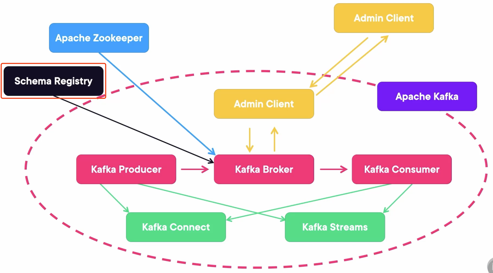

### Apache Avro

Apache Avro is the language over which the schemas are defined.

-   Serialization is defined by schema.
-   Schemas are JSON-based.
-   Codegen is available at the command line.
-   Codegen is available with Maven, Gradle, and SBT plugins.
-   Supports the following languages: C, C++, Java, Perl, Python, Ruby, and PHP.

### Three Modes

1.   Generic Mode: Where you use Avro just to validate it is a valid schema, but don't do codegen.
2.   Specific Mode: Where we use an avsc file and the codeine capabilities to generate the code we need.
3.   Reflection Mode: The inver of the previous mode, creates an avsc file based on a class.

### Primitive Types

| Avro Type | Java Type                        |
| --------- | -------------------------------- |
| null      | null                             |
| double    | double                           |
| float     | float                            |
| int       | int                              |
| long      | long                             |
| bool      | bool                             |
| string    | Unicode CharSequnce              |
| bytes     | Sequence of 8-bit unsigned bytes |

### Complex Types

```json
{
	"namespace": "com.xyzcorp",
	"type": "record",
	"doc": "An music album",
	"name": "Album",
	"fields": [
		{
			"name": "name",
			"type": "string"
		},
		{
			"name": "yearReleased",
			"type": [
				"int",
				"null"
			]
		}
	]
}
```

### Overview

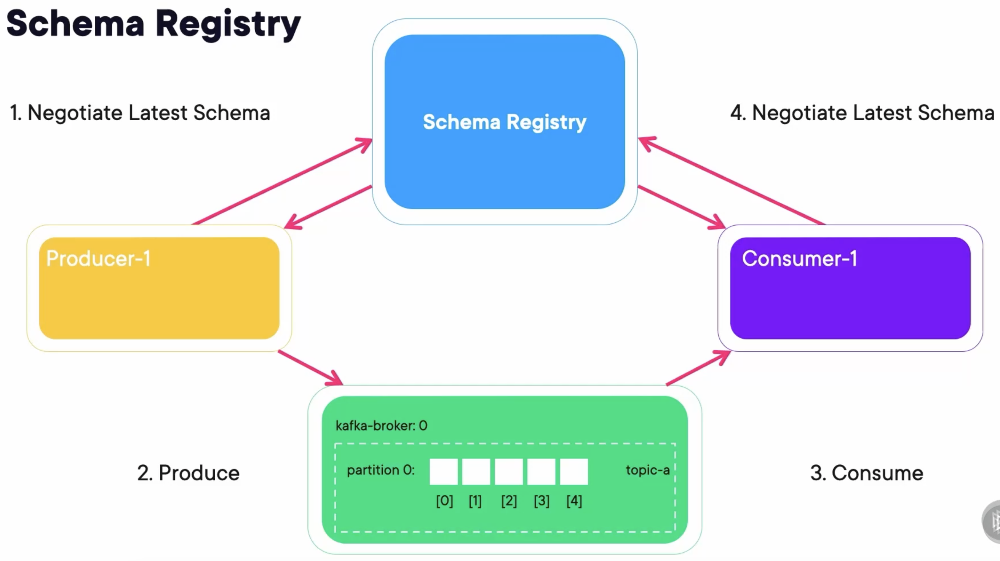

### Sample Code

#### Producer

What makes schema registry work is the Serializer. You must add `schema.registry.url` and specify the location of the registry.

```java
Properties properties = new Properties();

properties.put(ProducerConfig.BOOTSTRAP_SERVERS_CONFIG, "http://localhost:9092");
properties.put(ProducerConfig.KEY_SERIALIZER_CLASS_CONFIG, StringSerializer.class.getName());
properties.put(ProducerConfig.VALUE_SERIALIZER_CLASS_CONFIG, io.confluent.kafka.serializers.KafkaAvroSerializer.class.getName());
properties.put("schema.registry.url", "http://localhost:8081");
```

The ProducerRecord's value is accepting an actual Java Object. We can send the object just like any other type.

```java
Album album = new Album("Purple Rain", "Prince", 1984, Arrays.asList("Purple Rain", "Let's go crazy"));
ProducerRecord<String, Album> producerRecord = new ProducerRecord<>("music_albums", "Prince", album);
producer.send(producerRecord);
```

#### Consumer

What makes schema registry work is the Deserializer. You must add `schema.registry.url` and specify the location of the registry. You must add `specific.avro.reader` and specify that you used specific avro mode.

```java
Properties properties = new Properties();

properties.put(ConsumerConfig.BOOTSTRAP_SERVERS_CONFIG, "localhost:9092");
properties.put(ConsumerConfig.GROUP_ID_CONFIG, "my_group");
properties.put(ConsumerConfig.KEY_DESERIALIZER_CLASS_CONFIG, StringSerializer.class.getName());
properties.put(ConsumerConfig.VALUE_DESERIALIZER_CLASS_CONFIG, io.confluent.kafka.serializers.KafkaAvroDeserializer.class);
properties.setProperty("schema.registry.url", "http://localhost:8081");
properties.setProperty("specific.avro.reader", "true");
```

Receiving a Custom Object from Kafka:

```java
while (true) {
	ConsumerRecords<String, Album> records = consumer.poll(Duration.of(500, ChronoUnit.MILLIS));
	for (ConsumerRecord<String, Album> record: records) {
		Album a = record.value();
		System.out.format("value: %s\n", a.getTitle());
		System.out.format("value: %s\n", a.getArtist());
	}
}
```

## Demo: Using the MongoDB Connector with Distributed Kafka Connect to Query a Topic

### Install Confluent Hub Client

Use Brew if you are using Mac:

```bash
brew tap confluentinc/homebrew-confluent-hub-client
brew install --cask confluent-hub-client
```

### Install Kafka Connect Avro Converter

Install the Kafka Connect Avro Converter using the Confluent Hub we just installed:

```bash
confluent-hub install confluentinc/kafka-connect-avro-converter:7.5.0 --component-dir ~/Library/kafka_2.13-3.9.0/libs --worker-configs worker.properties
```

### Install Kafka MongoDB Connector

```bash
confluent-hub install mongodb/kafka-connect-mongodb:1.11.0 --component-dir ~/Library/kafka_2.13-3.9.0/libs --worker-configs worker.properties
```

### Downloading Some Missing Jars

Download and put some missing jars into the Kafka libs, including the `failureaccess-1.0.1.jar` and `guava-32.1.2-jre.jar`.

```bash
cp failureaccess-1.0.1.jar  ~/Library/kafka_2.13-3.9.0/libs
cp guava-32.1.2-jre.jar ~/Library/kafka_2.13-3.9.0/libs
```

### Run Docker Containers

Create a `docker-compose.yaml` file containing 3 Zookeepers, 3 Kafka Brokers, 1 Rest Proxy, 1 Schema Registry, and 1 MongoDB.

```yaml
---
version: '3'
services:
  zookeeper-1:
    image: confluentinc/cp-zookeeper:7.4.1
    hostname: zookeeper-1
    container_name: zookeeper-1
    volumes:
      - ./zookeeper-1_data:/var/lib/zookeeper/data
      - ./zookeeper-1_log:/var/lib/zookeeper/log
    environment:
      ZOOKEEPER_CLIENT_PORT: 2181
      ZOOKEEPER_TICK_TIME: 2000
      ZOO_MY_ID: 1
      ZOO_SERVERS: server.1=zookeeper-1:2888:3888;2181 server.2=zookeeper-2:2888:3888;2181 server.3=zookeeper-3:2888:3888;2181

  zookeeper-2:
    image: confluentinc/cp-zookeeper:7.4.1
    hostname: zookeeper-2
    container_name: zookeeper-2
    volumes:
      - ./zookeeper-2_data:/var/lib/zookeeper/data
      - ./zookeeper-2_log:/var/lib/zookeeper/log
    environment:
      ZOOKEEPER_CLIENT_PORT: 2181
      ZOOKEEPER_TICK_TIME: 2000
      ZOO_MY_ID: 2
      ZOO_SERVERS: server.1=zookeeper-1:2888:3888;2181 server.2=zookeeper-2:2888:3888;2181 server.3=zookeeper-3:2888:3888;2181

  zookeeper-3:
    image: confluentinc/cp-zookeeper:7.4.1
    hostname: zookeeper-3
    container_name: zookeeper-3
    volumes:
      - ./zookeeper-3_data:/var/lib/zookeeper/data
      - ./zookeeper-3_log:/var/lib/zookeeper/log
    environment:
      ZOOKEEPER_CLIENT_PORT: 2181
      ZOOKEEPER_TICK_TIME: 2000
      ZOO_MY_ID: 3
      ZOO_SERVERS: server.1=zookeeper-1:2888:3888;2181 server.2=zookeeper-2:2888:3888;2181 server.3=zookeeper-3:2888:3888;2181


  broker-1:
    image: confluentinc/cp-kafka:7.4.1
    hostname: broker-1
    container_name: broker-1
    volumes:
      - ./broker-1-data:/var/lib/kafka/data
    depends_on:
      - zookeeper-1
      - zookeeper-2
      - zookeeper-3
    ports:
      - 9092:9092
      - 29092:29092
    environment:
      KAFKA_BROKER_ID: 1
      KAFKA_ZOOKEEPER_CONNECT: zookeeper-1:2181
      KAFKA_ADVERTISED_LISTENERS: HOST://localhost:9092,INTERNAL://broker-1:29092
      KAFKA_LISTENER_SECURITY_PROTOCOL_MAP: HOST:PLAINTEXT,INTERNAL:PLAINTEXT
      KAFKA_INTER_BROKER_LISTENER_NAME: INTERNAL
      KAFKA_SNAPSHOT_TRUST_EMPTY: true

  broker-2:
    image: confluentinc/cp-kafka:7.4.1
    hostname: broker-2
    container_name: broker-2
    volumes:
      - ./broker-2-data:/var/lib/kafka/data
    depends_on:
      - zookeeper-1
      - zookeeper-2
      - zookeeper-3
      - broker-1
    ports:
      - 9093:9093
      - 29093:29093
    environment:
      KAFKA_BROKER_ID: 2
      KAFKA_ZOOKEEPER_CONNECT: zookeeper-1:2181
      KAFKA_ADVERTISED_LISTENERS: HOST://localhost:9093,INTERNAL://broker-2:29093
      KAFKA_LISTENER_SECURITY_PROTOCOL_MAP: HOST:PLAINTEXT,INTERNAL:PLAINTEXT
      KAFKA_INTER_BROKER_LISTENER_NAME: INTERNAL
      KAFKA_SNAPSHOT_TRUST_EMPTY: true

  broker-3:
    image: confluentinc/cp-kafka:7.4.1
    hostname: broker-3
    container_name: broker-3
    volumes:
      - ./broker-3-data:/var/lib/kafka/data
    depends_on:
      - zookeeper-1
      - zookeeper-2
      - zookeeper-3
      - broker-1
      - broker-2
    ports:
      - 9094:9094
      - 29094:29094
    environment:
      KAFKA_BROKER_ID: 3
      KAFKA_ZOOKEEPER_CONNECT: zookeeper-1:2181
      KAFKA_ADVERTISED_LISTENERS: HOST://localhost:9094,INTERNAL://broker-3:29094
      KAFKA_LISTENER_SECURITY_PROTOCOL_MAP: HOST:PLAINTEXT,INTERNAL:PLAINTEXT
      KAFKA_INTER_BROKER_LISTENER_NAME: INTERNAL
      KAFKA_SNAPSHOT_TRUST_EMPTY: true


  rest-proxy:
    image: confluentinc/cp-kafka-rest:7.4.1
    ports:
      - "8082:8082"
    depends_on:
      - zookeeper-1
      - zookeeper-2
      - zookeeper-3
      - broker-1
      - broker-2
      - broker-3
    hostname: rest-proxy
    container_name: rest-proxy
    environment:
      KAFKA_REST_HOST_NAME: rest-proxy
      KAFKA_REST_BOOTSTRAP_SERVERS: 'broker-1:29092,broker-2:29093,broker-3:29094'
      KAFKA_REST_LISTENERS: "http://0.0.0.0:8082"

  schema-registry:
    image: confluentinc/cp-schema-registry:7.4.1
    hostname: schema-registry
    container_name: schema-registry
    depends_on:
      - rest-proxy
    ports:
      - "8081:8081"
    environment:
      SCHEMA_REGISTRY_HOST_NAME: schema-registry
      SCHEMA_REGISTRY_KAFKASTORE_BOOTSTRAP_SERVERS: 'broker-1:29092,broker-2:29093,broker-3:29094'

  mongo:
    image: mongo
    hostname: mongo
    container_name: mongo
    ports:
      - 27017:27017
```

Run the composed containers:

```bash
docker compose up -d
```

### Create a Kafka Topic

Create a Kafka Topic with 4 partitions:

```bash
kafka-topics.sh --create --bootstrap-server localhost:9092 --partitions 4 --topic connect-distributed
```

### Generate Model with Avsc File

Create an avsc file, which represents the Album record:

```json
{
  "fields": [
    {
      "name": "name",
      "type": "string"
    },
    {
      "name": "year",
      "type": "int"
    }
  ],
  "name": "Album",
  "namespace": "com.globomantics.model",
  "type": "record"
}
```

Generate the model class by running the Maven plugin:

```bash
mvn generate-sources
```

Then, the package that is configured at the `namespace` in the avsc file will be created, and the Album class will be genereated in the package like this:

```java
/**
 * Autogenerated by Avro
 *
 * DO NOT EDIT DIRECTLY
 */
package com.globomantics.model;

import org.apache.avro.generic.GenericArray;
import org.apache.avro.specific.SpecificData;
import org.apache.avro.util.Utf8;
import org.apache.avro.message.BinaryMessageEncoder;
import org.apache.avro.message.BinaryMessageDecoder;
import org.apache.avro.message.SchemaStore;

@org.apache.avro.specific.AvroGenerated
public class Album extends org.apache.avro.specific.SpecificRecordBase implements org.apache.avro.specific.SpecificRecord {
	...
}
```

### Create Other Topics

We need to create some other necessary topics to apply the distributed mode, which are configured in the `worker.properties` file: `kafka_connect_configs`, `kafka_connect_offsets`, and `kafka_connect_statuses`.

```properties
config.storage.topic=kafka_connect_configs
cleanup.policy=compact
offset.storage.topic=kafka_connect_offsets
status.storage.topic=kafka_connect_statuses
```

Create these topics:

```bash
kafka-topics.sh --create --bootstrap-server localhost:9092 --topic kafka_connect_statuses --config cleanup.policy=compact

kafka-topics.sh --create --bootstrap-server localhost:9092 --topic kafka_connect_offsets --config cleanup.policy=compact

kafka-topics.sh --create --bootstrap-server localhost:9092 --topic kafka_connect_configs --config cleanup.policy=compact
```

### Start the Kafka Connect in Distributed Mode

```bash
connect-distributed.sh worker.properties
```

If we see the logs like the following, then Kafka Connect is started in distributed mode:

```
...
[2024-12-21 21:02:37,819] INFO [Worker clientId=connect-192.168.10.106:8083, groupId=1] Finished starting connectors and tasks (org.apache.kafka.connect.runtime.distributed.DistributedHerder:2008)
[2024-12-21 21:02:37,984] INFO [Worker clientId=connect-192.168.10.106:8083, groupId=1] Session key updated (org.apache.kafka.connect.runtime.distributed.DistributedHerder:2510)
```

### Deploy Connectors

The Kafka Connect in distributed mode offers some RESTful APIs. We can send an HTTP post request to the `localhost://8083` to create a connector with request body like:

```json
{
    "name": "mongo-sink",
    "config" : {
        "connector.class": "com.mongodb.kafka.connect.MongoSinkConnector",
        "connection.uri": "mongodb://localhost:27017",
        "database": "quickstart",
        "collection": "topicData",
        "topics": "connect-distributed"
    }
}
```

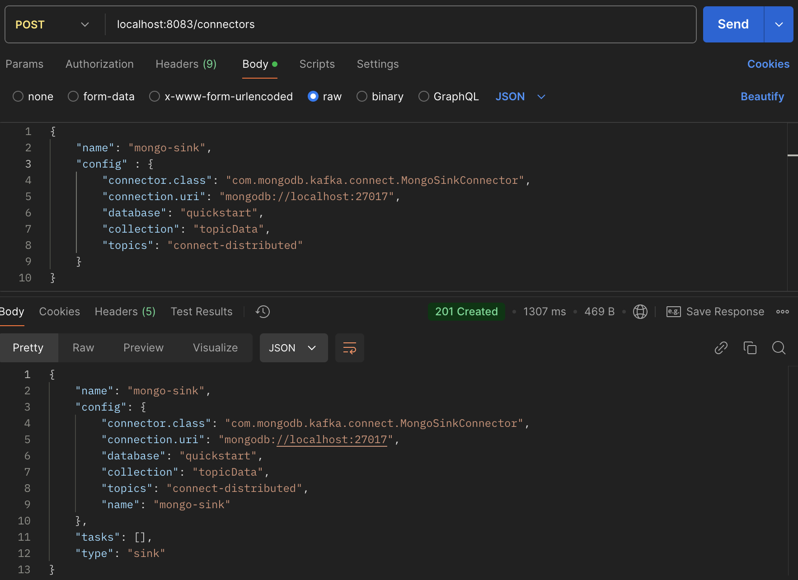

And we can get created connectors by the GET method:

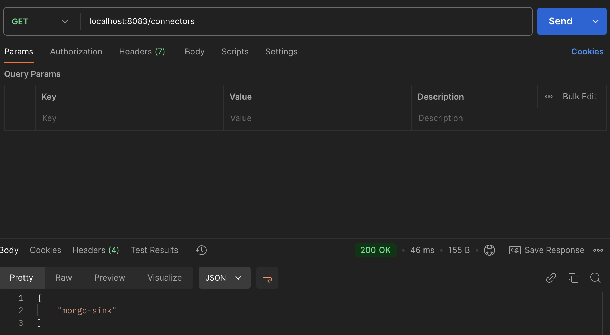

Then, we can append the name of the connector to the url to get the details of a specific connector:

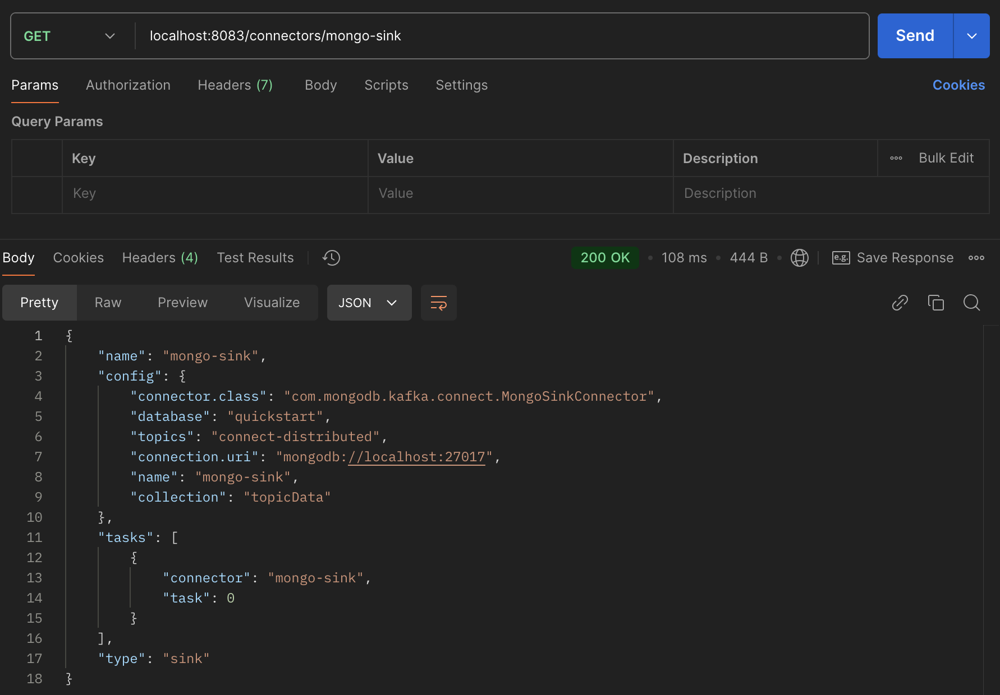

### Send a Message

Create a Java class using Kafka Producer to send a messages with an Album model as value:

```java
package com.globomantics;

import com.globomantics.model.Album;
import io.confluent.kafka.serializers.KafkaAvroSerializer;
import io.confluent.kafka.serializers.KafkaAvroSerializerConfig;
import org.apache.kafka.clients.producer.KafkaProducer;
import org.apache.kafka.clients.producer.ProducerConfig;
import org.apache.kafka.clients.producer.ProducerRecord;
import org.apache.kafka.common.serialization.DoubleSerializer;
import org.slf4j.Logger;
import org.slf4j.LoggerFactory;

import java.util.Properties;

public class AlbumSender {
	private static final Logger log = LoggerFactory.getLogger(AlbumSender.class);
	private static final String TOPIC = "connect-distributed";

	public static void main(String[] args) {

		Properties props = new Properties();
		props.put(ProducerConfig.BOOTSTRAP_SERVERS_CONFIG, "http://localhost:9092,http://localhost:9093,http://localhost:9094");
		props.put(ProducerConfig.KEY_SERIALIZER_CLASS_CONFIG, DoubleSerializer.class.getName());
		props.put(ProducerConfig.VALUE_SERIALIZER_CLASS_CONFIG, KafkaAvroSerializer.class.getName());
		props.put(KafkaAvroSerializerConfig.SCHEMA_REGISTRY_URL_CONFIG, "http://localhost:8081");
		Album album = Album.newBuilder()
				.setName("Use Your Illusion")
				.setYear(1991).build();
		KafkaProducer<Double, Album> producer = new KafkaProducer<>(props);
		double key = Math.floor(Math.random()*(50));
		ProducerRecord<Double, Album> producerRecord =
				new ProducerRecord<>(TOPIC, key, album);

		log.info("Sending message " + album + " to Kafka");

		producer.send(producerRecord, (metadata, e) -> {
			if (metadata != null) {
				System.out.println(producerRecord.key());
				System.out.println(producerRecord.value());
				System.out.println(metadata.toString());
			}
		});
		producer.flush();
		producer.close();

		log.info("Successfully produced messages to " + TOPIC + " topic");

	}
}
```

### Check MongoDB

After running the sender class, we need to connect to the MongoDB to check that the massage is here.

```bash
# mongosh localhost:27017
Current Mongosh Log ID: 6766c45295db57d019e94969
Connecting to:          mongodb://localhost:27017/?directConnection=true&serverSelectionTimeoutMS=2000&appName=mongosh+2.3.4
Using MongoDB:          8.0.4
Using Mongosh:          2.3.4

For mongosh info see: https://www.mongodb.com/docs/mongodb-shell/
...

test> show dbs
admin       40.00 KiB
config      60.00 KiB
local       40.00 KiB
quickstart  40.00 KiB
test> use quickstart
switched to db quickstart
quickstart> db.topicData.find()
[
  {
    _id: ObjectId('6766c377e0b35c19402f4c3d'),
    name: 'Use Your Illusion',
    year: 1991
  }
]
```

## Takeaways

-   Kafka Connect can come in two variants: Standalone and Distributed.
-   Kafka connects via worker processes where connectors get deployed as a number of tasks.
-   One can leverage the schema registry and AVRO to send classes through Kafka messages with much more metadata.
-   Thanks to the Kafka Connect that even sends those objects to another system.
