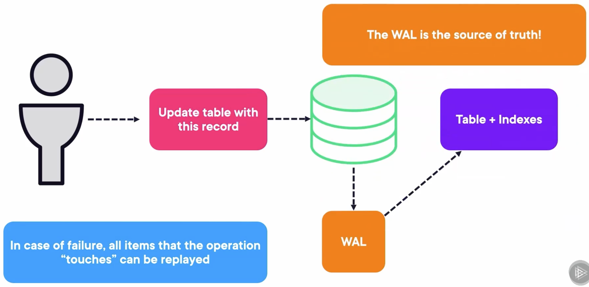
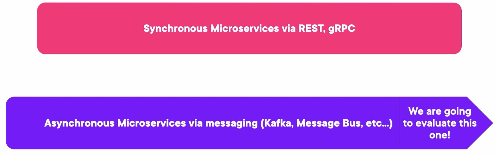
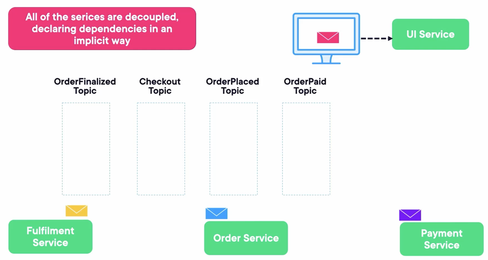
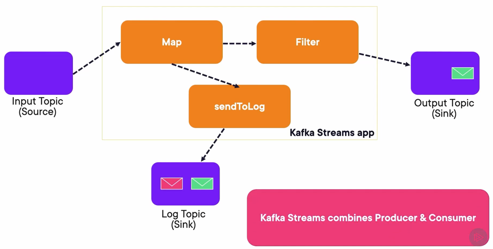
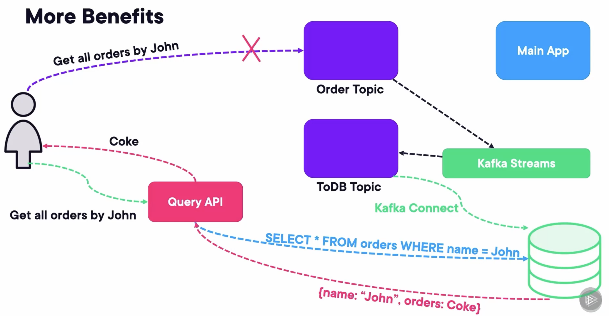

## Microservices with Kafka

To understand the logic behind doing microservices with Kafka, I believe it is important to take a smaller tour of how databases work. The engine uses a file called the write‑ahead log, or WAL. First, it writes the operation to the WAL. Then, it executes operations on the tables and indexes to reflect what the WAL said they should look like.



We have normally two types of microservices:

-   The first one is the synchronous microservices. These are the normal ones, normally RESTful services that wait on other dependent services to respond.
-   The asynchronous microservices have an event bus based on these futures or callbacks. Here is where we tie the knot because if we let Kafka become the center of the application, we can build an entire async application based on it. And to make it simpler, this is what Kafka Streams chimes in to create each of these services.



Let's see an example that an e-commerce application may clarify.

-   UI Service -> send message -> Checkout Topic -> receive message -> Order Service
-   Order Service -> send message -> OrderPlaced Topic -> receive message -> Payment Service
-   Payment Service -> send message -> OrderPaid Topic -> receive message -> Fulfilment Service
-   Fulfillment Service -> send message -> OrderFinalized Topic -> receive message -> UI Service



Kafka will be the center. There are some reasons:

1.   Every event happening in your application can be traced back to a Kafka topic, and that is stored.
2.   This also means that if each of these microservices is a Kafka Stream app, everything in your app goes through Kafka. Kafka topics have an abstraction called the log that allows messages to be replayed.
3.   This means Kafka becomes the WAL of the application and allows for things like multi-phase transactions.

## Kafka Streams and Stateless Stream Processing

This is what Kafka Stream apps look like. They read from an input topic, which is the source. They perform some operations defined in a graph or topology. Finally, they write normally to an output topic. Optionally, they can write to another topic that can act as a log.

-   The map operation maps this green message to sendToLog, as well as to the Filter. As this one is green, it passes the Filter. Then the app produces the message to both the Output Topic, as well as the Log Topic.

-   On the other hand, the red message is mapped to the Filter and sendToLog, but it cannot pass the filter. So, it's only sent to the Log Topic.



There are more benefits. Thanks to Kafka Connect and Kafka Streams, querying Kafka will be easier. If we set up a Kafka Streams app that takes the orders topic and writes it to a DB topic in the correct schema defined by the schema registry with Avro, then Kafka Connect can use the database connector to write it to a database like PostgreSQL or MongoDB. From there, we can expose a query API that only translates certain RESTful requests into DB queries.



## Creating a Kafka Streams Application

### Establishing Properties

-   Create an application.id that represents your application group or "team"
-   Serde is combination of Serializer/Deserializer
-   Every stream application and KSQL app (later) is a consumer-producer

```java
Properties props = new Properties();
props.put(StreamsConfig.APPLICATION_ID_CONFIG, "my_stream_app");
props.put(StreamsConfig.BOOTSTRAP_SERVERS_CONFIG, "localhost:9092");
props.put(StreamsConfig.DEFAULT_KEY_SERDE_CLASS_CONFIG, Serdes.String().getClass());
props.put(StreamsConfig.DEFAULT_VALUE_SERDE_CLASS_CONFIG, Serdes.String().getClass());
props.put("schema.registry.url", "http://localhost:8081");
```

### Create a Stream Builder

-   Always start with a StreamBuilder object.
-   This is the GoF builder pattern, where we will create a Topology object that represents our data pipeline.

```java
StreamsBuilder builder = new StreamsBuilder();
KStream<String, DisasterValue> rawReadings = builder.stream("DisasterReadings", Consumed.with(Serdes.String(), Serdes.Integer()));
```

### Standard Functional Programming

map, filter, flatMap, groupBy, reduce, window, join, leftJoin, outerJoin

#### Mapping

Before: (1, "Hello"), (2, "Zoom"), (3, "Fold")

```java
stream.map((key, value) -> new KeyValue<>(key + 1, value + "!"));
```

After: (2, "Hello!"), (3, "Zoom!"), (4, "Fold!")

#### Filter

Before: (1, "Hello"), (2, "Zoom"), (3, "Fold"), (4, "Past")

```java
stream.filter((key, value) -> key % 2 == 0);
```

(2, "Zoom"), (4, "Past")

### Dump Results to a Topic

Dump the results to a topic using through to post to the topic and continue.

```java
KStream stream = builder.stream("my_topic");
stream.filter(...).through("new_topic").flatMap(...).to("other_topic");
```

### Run

```java
Topology topology = builder.build();
KafkaStreams streams = new KafkaStreams(topology, props);
streams.start();
```

### Adding a Shutdown Hook

```java
Runtime.getRuntime().addShutdownHook(new Thread(streams::close));
```

## Demo: Creating a Kafka Streams Application

### Run Docker Containers

Create a docker-compose file, including 3 zookeepers, 3 Kafka brokers, 1 Rest Proxy, and 1 Schema Registry.

```yaml
---
version: '3'
services:
  zookeeper-1:
    image: confluentinc/cp-zookeeper:7.4.1
    hostname: zookeeper-1
    container_name: zookeeper-1
    volumes:
      - ./zookeeper-1_data:/var/lib/zookeeper/data
      - ./zookeeper-1_log:/var/lib/zookeeper/log
    environment:
      ZOOKEEPER_CLIENT_PORT: 2181
      ZOOKEEPER_TICK_TIME: 2000
      ZOO_MY_ID: 1
      ZOO_SERVERS: server.1=zookeeper-1:2888:3888;2181 server.2=zookeeper-2:2888:3888;2181 server.3=zookeeper-3:2888:3888;2181

  zookeeper-2:
    image: confluentinc/cp-zookeeper:7.4.1
    hostname: zookeeper-2
    container_name: zookeeper-2
    volumes:
      - ./zookeeper-2_data:/var/lib/zookeeper/data
      - ./zookeeper-2_log:/var/lib/zookeeper/log
    environment:
      ZOOKEEPER_CLIENT_PORT: 2181
      ZOOKEEPER_TICK_TIME: 2000
      ZOO_MY_ID: 2
      ZOO_SERVERS: server.1=zookeeper-1:2888:3888;2181 server.2=zookeeper-2:2888:3888;2181 server.3=zookeeper-3:2888:3888;2181

  zookeeper-3:
    image: confluentinc/cp-zookeeper:7.4.1
    hostname: zookeeper-3
    container_name: zookeeper-3
    volumes:
      - ./zookeeper-3_data:/var/lib/zookeeper/data
      - ./zookeeper-3_log:/var/lib/zookeeper/log
    environment:
      ZOOKEEPER_CLIENT_PORT: 2181
      ZOOKEEPER_TICK_TIME: 2000
      ZOO_MY_ID: 3
      ZOO_SERVERS: server.1=zookeeper-1:2888:3888;2181 server.2=zookeeper-2:2888:3888;2181 server.3=zookeeper-3:2888:3888;2181


  broker-1:
    image: confluentinc/cp-kafka:7.4.1
    hostname: broker-1
    container_name: broker-1
    volumes:
      - ./broker-1-data:/var/lib/kafka/data
    depends_on:
      - zookeeper-1
      - zookeeper-2
      - zookeeper-3
    ports:
      - 9092:9092
      - 29092:29092
    environment:
      KAFKA_BROKER_ID: 1
      KAFKA_ZOOKEEPER_CONNECT: zookeeper-1:2181
      KAFKA_ADVERTISED_LISTENERS: HOST://localhost:9092,INTERNAL://broker-1:29092
      KAFKA_LISTENER_SECURITY_PROTOCOL_MAP: HOST:PLAINTEXT,INTERNAL:PLAINTEXT
      KAFKA_INTER_BROKER_LISTENER_NAME: INTERNAL
      KAFKA_SNAPSHOT_TRUST_EMPTY: true

  broker-2:
    image: confluentinc/cp-kafka:7.4.1
    hostname: broker-2
    container_name: broker-2
    volumes:
      - ./broker-2-data:/var/lib/kafka/data
    depends_on:
      - zookeeper-1
      - zookeeper-2
      - zookeeper-3
      - broker-1
    ports:
      - 9093:9093
      - 29093:29093
    environment:
      KAFKA_BROKER_ID: 2
      KAFKA_ZOOKEEPER_CONNECT: zookeeper-1:2181
      KAFKA_ADVERTISED_LISTENERS: HOST://localhost:9093,INTERNAL://broker-2:29093
      KAFKA_LISTENER_SECURITY_PROTOCOL_MAP: HOST:PLAINTEXT,INTERNAL:PLAINTEXT
      KAFKA_INTER_BROKER_LISTENER_NAME: INTERNAL
      KAFKA_SNAPSHOT_TRUST_EMPTY: true

  broker-3:
    image: confluentinc/cp-kafka:7.4.1
    hostname: broker-3
    container_name: broker-3
    volumes:
      - ./broker-3-data:/var/lib/kafka/data
    depends_on:
      - zookeeper-1
      - zookeeper-2
      - zookeeper-3
      - broker-1
      - broker-2
    ports:
      - 9094:9094
      - 29094:29094
    environment:
      KAFKA_BROKER_ID: 3
      KAFKA_ZOOKEEPER_CONNECT: zookeeper-1:2181
      KAFKA_ADVERTISED_LISTENERS: HOST://localhost:9094,INTERNAL://broker-3:29094
      KAFKA_LISTENER_SECURITY_PROTOCOL_MAP: HOST:PLAINTEXT,INTERNAL:PLAINTEXT
      KAFKA_INTER_BROKER_LISTENER_NAME: INTERNAL
      KAFKA_SNAPSHOT_TRUST_EMPTY: true


  rest-proxy:
    image: confluentinc/cp-kafka-rest:7.4.1
    ports:
      - "8082:8082"
    depends_on:
      - zookeeper-1
      - zookeeper-2
      - zookeeper-3
      - broker-1
      - broker-2
      - broker-3
    hostname: rest-proxy
    container_name: rest-proxy
    environment:
      KAFKA_REST_HOST_NAME: rest-proxy
      KAFKA_REST_BOOTSTRAP_SERVERS: 'broker-1:29092,broker-2:29093,broker-3:29094'
      KAFKA_REST_LISTENERS: "http://0.0.0.0:8082"

  schema-registry:
    image: confluentinc/cp-schema-registry:7.4.1
    hostname: schema-registry
    container_name: schema-registry
    depends_on:
      - rest-proxy
    ports:
      - "8081:8081"
    environment:
      SCHEMA_REGISTRY_HOST_NAME: schema-registry
      SCHEMA_REGISTRY_KAFKASTORE_BOOTSTRAP_SERVERS: 'broker-1:29092,broker-2:29093,broker-3:29094'
```

Run composed containers:

```bash
docker compose up -d
```

### Create two Topics

Create a `RawTeampReadings` topic that has 4 partitions.

```bash
kafka-topics.sh --create --bootstrap-server localhost:9092 --partitions 4 --topic RawTempReadings
```

Then create a `ValidatedTempReadings` topic that has 4 partitions.

```bash
kafka-topics.sh --create --bootstrap-server localhost:9092 --partitions 4 --topic ValidatedTempReadings
```

### Create a Consumer

```bash
kafka-console-consumer.sh \
--bootstrap-server localhost:9092 \                                               
--topic ValidatedTempReadings --from-beginning \                                  
--key-deserializer org.apache.kafka.common.serialization.StringDeserializer \
--value-deserializer org.apache.kafka.common.serialization.IntegerDeserializer \  
--property print.key=true \                                                       
--property key.separator=, \                                                      
--group 1
```

### Run a Stream

Run a Kafka Stream from topic `RawTempReadings` to topic `ValidatedTempReadings`, only filtering the messages whose values are between -50 and 130.

```java
package com.globomantics;

import org.apache.kafka.common.serialization.Serdes;
import org.apache.kafka.streams.KafkaStreams;
import org.apache.kafka.streams.StreamsBuilder;
import org.apache.kafka.streams.StreamsConfig;
import org.apache.kafka.streams.Topology;
import org.apache.kafka.streams.kstream.KStream;

import java.util.Properties;

public class SimpleETL {

	public static void main(String[] args) {
		Properties props = new Properties();
    props.put(StreamsConfig.APPLICATION_ID_CONFIG, "weather.filter");
    props.put(StreamsConfig.BOOTSTRAP_SERVERS_CONFIG, "http://localhost:9092,http://localhost:9093,http://localhost:9094");
    props.put(StreamsConfig.DEFAULT_KEY_SERDE_CLASS_CONFIG, 
              Serdes.String().getClass());
    props.put(StreamsConfig.DEFAULT_VALUE_SERDE_CLASS_CONFIG, 
              Serdes.Integer().getClass());
		
		StreamsBuilder builder = new StreamsBuilder();
		KStream<String, Integer> rawReadings = builder.stream("RawTempReadings");
		KStream<String, Integer> validatedReadings = rawReadings
				.filter((key, value) -> value > -50 && value < 130);
		validatedReadings.to("ValidatedTempReadings");
		
		Topology topo = builder.build();
		System.out.println(topo.describe());

		KafkaStreams streams = new KafkaStreams(topo, props);
		Runtime.getRuntime().addShutdownHook(new Thread(streams::close));
		streams.cleanUp();
		streams.start();


		System.out.println("Starting simple ETL");

	}

}
```

### Run a Producer

Run a Kafka Producer that sends messages to the topic `RawTempReadings`, which sends messages whose values are between -20 and 180.

```java
package com.globomantics;

import org.apache.kafka.clients.producer.KafkaProducer;
import org.apache.kafka.clients.producer.ProducerConfig;
import org.apache.kafka.clients.producer.ProducerRecord;
import org.apache.kafka.common.serialization.IntegerSerializer;
import org.apache.kafka.common.serialization.StringSerializer;
import org.slf4j.Logger;
import org.slf4j.LoggerFactory;

import java.util.Properties;
import java.util.Random;
import java.util.concurrent.ThreadLocalRandom;

public class Producer {
	private static final Logger log = LoggerFactory.getLogger(Producer.class);
	private static final Properties props = new Properties();

	public static void main(String[] args) throws InterruptedException {
		props.put(ProducerConfig.BOOTSTRAP_SERVERS_CONFIG, "http://localhost:9092,http://localhost:9093,http://localhost:9094");
		props.put(ProducerConfig.KEY_SERIALIZER_CLASS_CONFIG, StringSerializer.class.getName());
		props.put(ProducerConfig.VALUE_SERIALIZER_CLASS_CONFIG, IntegerSerializer.class.getName());
		KafkaProducer<String, Integer> producer = new KafkaProducer<>(props);
		String[] sensors = new String[]{"sensor_1", "sensor_2", "sensor_3"};
		Runtime.getRuntime().addShutdownHook(new Thread(producer::close));
		while (true) {
			int idx = new Random().nextInt(sensors.length);
			String key = (sensors[idx]);
			int value = ThreadLocalRandom.current().nextInt(-20, 180 + 1);
			ProducerRecord<String, Integer> producerRecord =
					new ProducerRecord<>("RawTempReadings", key, value);

			producer.send(producerRecord);

			producer.flush();
			log.info("Successfully produced message from sensor " + key);
			Thread.sleep(200);
		}
	}
}
```

We can see the received messages from the consumer, whose values are only between -50 and 130, which have been filtered by the Kafka Stream successfully.

```bash
❯ kafka-console-consumer.sh \
--bootstrap-server localhost:9092 \
--topic ValidatedTempReadings --from-beginning \
--key-deserializer org.apache.kafka.common.serialization.StringDeserializer \
--value-deserializer org.apache.kafka.common.serialization.IntegerDeserializer \
--property print.key=true \
--property key.separator=, \
--group 1
sensor_2,89
sensor_2,86
sensor_1,75
sensor_1,0
sensor_2,39
sensor_3,-11
sensor_3,106
sensor_1,84
sensor_1,52
sensor_1,122
sensor_1,53
sensor_2,117
sensor_3,-10
sensor_1,16
sensor_2,113
sensor_3,-11
```

## Querying a Stream with KSQL

### Run Docker Containers

Create a docker-compose file, including 3 zookeepers, 3 Kafka brokers, 1 Rest Proxy, 1 Schema Registry, 1 KSQL DB Server, and 1 KSQL DB Client.

```yaml
---
version: '3'
services:
  zookeeper-1:
    image: confluentinc/cp-zookeeper:7.4.1
    hostname: zookeeper-1
    container_name: zookeeper-1
    volumes:
      - ./zookeeper-1_data:/var/lib/zookeeper/data
      - ./zookeeper-1_log:/var/lib/zookeeper/log
    environment:
      ZOOKEEPER_CLIENT_PORT: 2181
      ZOOKEEPER_TICK_TIME: 2000
      ZOO_MY_ID: 1
      ZOO_SERVERS: server.1=zookeeper-1:2888:3888;2181 server.2=zookeeper-2:2888:3888;2181 server.3=zookeeper-3:2888:3888;2181

  zookeeper-2:
    image: confluentinc/cp-zookeeper:7.4.1
    hostname: zookeeper-2
    container_name: zookeeper-2
    volumes:
      - ./zookeeper-2_data:/var/lib/zookeeper/data
      - ./zookeeper-2_log:/var/lib/zookeeper/log
    environment:
      ZOOKEEPER_CLIENT_PORT: 2181
      ZOOKEEPER_TICK_TIME: 2000
      ZOO_MY_ID: 2
      ZOO_SERVERS: server.1=zookeeper-1:2888:3888;2181 server.2=zookeeper-2:2888:3888;2181 server.3=zookeeper-3:2888:3888;2181

  zookeeper-3:
    image: confluentinc/cp-zookeeper:7.4.1
    hostname: zookeeper-3
    container_name: zookeeper-3
    volumes:
      - ./zookeeper-3_data:/var/lib/zookeeper/data
      - ./zookeeper-3_log:/var/lib/zookeeper/log
    environment:
      ZOOKEEPER_CLIENT_PORT: 2181
      ZOOKEEPER_TICK_TIME: 2000
      ZOO_MY_ID: 3
      ZOO_SERVERS: server.1=zookeeper-1:2888:3888;2181 server.2=zookeeper-2:2888:3888;2181 server.3=zookeeper-3:2888:3888;2181


  broker-1:
    image: confluentinc/cp-kafka:7.4.1
    hostname: broker-1
    container_name: broker-1
    volumes:
      - ./broker-1-data:/var/lib/kafka/data
    depends_on:
      - zookeeper-1
      - zookeeper-2
      - zookeeper-3
    ports:
      - 9092:9092
      - 29092:29092
    environment:
      KAFKA_BROKER_ID: 1
      KAFKA_ZOOKEEPER_CONNECT: zookeeper-1:2181
      KAFKA_ADVERTISED_LISTENERS: HOST://localhost:9092,INTERNAL://broker-1:29092
      KAFKA_LISTENER_SECURITY_PROTOCOL_MAP: HOST:PLAINTEXT,INTERNAL:PLAINTEXT
      KAFKA_INTER_BROKER_LISTENER_NAME: INTERNAL
      KAFKA_SNAPSHOT_TRUST_EMPTY: true

  broker-2:
    image: confluentinc/cp-kafka:7.4.1
    hostname: broker-2
    container_name: broker-2
    volumes:
      - ./broker-2-data:/var/lib/kafka/data
    depends_on:
      - zookeeper-1
      - zookeeper-2
      - zookeeper-3
      - broker-1
    ports:
      - 9093:9093
      - 29093:29093
    environment:
      KAFKA_BROKER_ID: 2
      KAFKA_ZOOKEEPER_CONNECT: zookeeper-1:2181
      KAFKA_ADVERTISED_LISTENERS: HOST://localhost:9093,INTERNAL://broker-2:29093
      KAFKA_LISTENER_SECURITY_PROTOCOL_MAP: HOST:PLAINTEXT,INTERNAL:PLAINTEXT
      KAFKA_INTER_BROKER_LISTENER_NAME: INTERNAL
      KAFKA_SNAPSHOT_TRUST_EMPTY: true

  broker-3:
    image: confluentinc/cp-kafka:7.4.1
    hostname: broker-3
    container_name: broker-3
    volumes:
      - ./broker-3-data:/var/lib/kafka/data
    depends_on:
      - zookeeper-1
      - zookeeper-2
      - zookeeper-3
      - broker-1
      - broker-2
    ports:
      - 9094:9094
      - 29094:29094
    environment:
      KAFKA_BROKER_ID: 3
      KAFKA_ZOOKEEPER_CONNECT: zookeeper-1:2181
      KAFKA_ADVERTISED_LISTENERS: HOST://localhost:9094,INTERNAL://broker-3:29094
      KAFKA_LISTENER_SECURITY_PROTOCOL_MAP: HOST:PLAINTEXT,INTERNAL:PLAINTEXT
      KAFKA_INTER_BROKER_LISTENER_NAME: INTERNAL
      KAFKA_SNAPSHOT_TRUST_EMPTY: true


  rest-proxy:
    image: confluentinc/cp-kafka-rest:7.4.1
    ports:
      - "8082:8082"
    depends_on:
      - zookeeper-1
      - zookeeper-2
      - zookeeper-3
      - broker-1
      - broker-2
      - broker-3
    hostname: rest-proxy
    container_name: rest-proxy
    environment:
      KAFKA_REST_HOST_NAME: rest-proxy
      KAFKA_REST_BOOTSTRAP_SERVERS: 'broker-1:29092,broker-2:29093,broker-3:29094'
      KAFKA_REST_LISTENERS: "http://0.0.0.0:8082"

  schema-registry:
    image: confluentinc/cp-schema-registry:7.4.1
    hostname: schema-registry
    container_name: schema-registry
    depends_on:
      - rest-proxy
    ports:
      - "8081:8081"
    environment:
      SCHEMA_REGISTRY_HOST_NAME: schema-registry
      SCHEMA_REGISTRY_KAFKASTORE_BOOTSTRAP_SERVERS: 'broker-1:29092,broker-2:29093,broker-3:29094'

  ksqldb-server:
    image: confluentinc/cp-ksqldb-server:7.4.1
    hostname: ksqldb-server
    container_name: ksqldb-server
    depends_on:
      - schema-registry
    ports:
      - "8088:8088"
    environment:
      KSQL_LISTENERS: http://0.0.0.0:8088
      KSQL_BOOTSTRAP_SERVERS: broker-1:29092,broker-2:29093,broker-3:29094
      KSQL_KSQL_LOGGING_PROCESSING_STREAM_AUTO_CREATE: "true"
      KSQL_KSQL_LOGGING_PROCESSING_TOPIC_AUTO_CREATE: "true"

  ksqldb-cli:
    image: confluentinc/cp-ksqldb-cli:7.4.1
    container_name: ksqldb-cli
    hostname: ksqldb-cli
    depends_on:
      - ksqldb-server
    entrypoint: /bin/sh
    tty: true
```

Run composed containers:

```bash
docker compose up -d
```

### Run KSQL CLient

```bash
docker exec -it ksqldb-cli ksql http://ksqldb-server:8088
```

We can show all the topics:

```bash
ksql> show all topics;

 Kafka Topic                            | Partitions | Partition Replicas 
--------------------------------------------------------------------------
 _confluent-ksql-default__command_topic | 1          | 1                  
 _schemas                               | 1          | 3                  
 default_ksql_processing_log            | 1          | 1                  
--------------------------------------------------------------------------
```

Then, set the topic offset to the `earliest`, so that we can see all topics from the beginning:

```bash
ksql> SET 'auto.offset.reset'='earliest';
Successfully changed local property 'auto.offset.reset' to 'earliest'. Use the UNSET command to revert your change.
```

### Create a Stream

Create a Kafka Stream `tempReadings` with columns zipcode, sensortime, and temp, which is associated with topic `readings`. Its timestamp will come from the `sensortime`.

```bash
ksql> CREATE STREAM tempReadings (zipcode VARCHAR, sensortime BIGINT, temp DOUBLE) \
> WITH (kafka_topic='readings', timestamp='sensortime', value_format='json', partitions=1);

 Message        
----------------
 Stream created 
----------------
```

We can see the topics:

```bash
ksql> show topics extended;

 Kafka Topic                 | Partitions | Partition Replicas | Consumers | ConsumerGroups 
--------------------------------------------------------------------------------------------
 default_ksql_processing_log | 1          | 1                  | 0         | 0              
 readings                    | 1          | 1                  | 0         | 0              
--------------------------------------------------------------------------------------------
```

We can see the streams:

```bash
ksql> show streams extended;

Name                 : TEMPREADINGS
Type                 : STREAM
Timestamp field      : SENSORTIME
Key format           : KAFKA
Value format         : JSON
Kafka topic          : readings (partitions: 1, replication: 1)
Statement            : CREATE STREAM TEMPREADINGS (ZIPCODE STRING, SENSORTIME BIGINT, TEMP DOUBLE) WITH (CLEANUP_POLICY='delete', KAFKA_TOPIC='readings', KEY_FORMAT='KAFKA', PARTITIONS=1, TIMESTAMP='sensortime', VALUE_FORMAT='JSON');

 Field      | Type            
------------------------------
 ZIPCODE    | VARCHAR(STRING) 
 SENSORTIME | BIGINT          
 TEMP       | DOUBLE          
------------------------------

...
```

### Insert Stream

We can insert records to the stream `tempReadings` like inserting into a DB, which will send messages to the topic `readings` at the same time:

```bash
ksql> INSERT INTO tempReadings (zipcode, sensortime, temp) VALUES ('1865', UNIX_TIMESTAMP(), 20);
ksql> INSERT INTO tempReadings (zipcode, sensortime, temp) VALUES ('1806', UNIX_TIMESTAMP(), 25);
ksql> INSERT INTO tempReadings (zipcode, sensortime, temp) VALUES ('1806', UNIX_TIMESTAMP() + 60 * 60 * 1000, 32);
ksql> INSERT INTO tempReadings (zipcode, sensortime, temp) VALUES ('1865', UNIX_TIMESTAMP() + 60 * 60 * 1000, 27);
```

### Query Stream

We can query the rowcount and average temperature of each zipcode and each window time from the stream:

```bash
ksql> SELECT zipcode, TIMESTAMPTOSTRING(WINDOWSTART, 'HH:mm:ss') as windowtime,
> COUNT(*) as rowcount, AVG(temp) as temp
>FROM tempReadings
>WINDOW TUMBLING (SIZE 1 HOURS)
>GROUP BY zipcode EMIT CHANGES;
+-----------------------+-----------------------+-----------------------+-----------------------+
|ZIPCODE                |WINDOWTIME             |ROWCOUNT               |TEMP                   |
+-----------------------+-----------------------+-----------------------+-----------------------+
|1865                   |07:00:00               |1                      |20.0                   |
|1806                   |07:00:00               |1                      |25.0                   |
|1806                   |08:00:00               |1                      |32.0                   |
|1865                   |08:00:00               |1                      |27.0                   |

Press CTRL-C to interrupt
```

We can also run consumer to consume messages from the topic:

```bash
❯ kafka-console-consumer.sh \
> --bootstrap-server localhost:9092 \
> --topic readings --from-beginning
{"ZIPCODE":"1865","SENSORTIME":1742023920742,"TEMP":20.0}
{"ZIPCODE":"1806","SENSORTIME":1742023939063,"TEMP":25.0}
{"ZIPCODE":"1806","SENSORTIME":1742027558360,"TEMP":32.0}
{"ZIPCODE":"1865","SENSORTIME":1742027593367,"TEMP":27.0}
```

### Create Table

We can create a table `highsandlows` that selects data including the minimum and maximum temperature of each zipcode from the stream:

```bash
ksql> CREATE TABLE highsandlows WITH (kafka_topic='readings') AS
> SELECT MIN(temp) as min_temp, MAX(temp) as max_temp, zipcode
>  FROM tempReadings GROUP BY zipcode;

 Message                                   
-------------------------------------------
 Created query with ID CTAS_HIGHSANDLOWS_3 
-------------------------------------------
```

### Query Table

Then, we can query data directly from the table, which is the latest data from the stream:

```bash
ksql> SELECT min_temp, max_temp, zipcode
> FROM highsandlows
> WHERE zipcode = '1865';
+--------------------------------+--------------------------------+--------------------------------+
|MIN_TEMP                        |MAX_TEMP                        |ZIPCODE                         |
+--------------------------------+--------------------------------+--------------------------------+
Query terminated
```

## Takeaways

-   Kafka can effectively act as the WAL for your app when using Kafka Streams.
-   A stream app is just a topology of functional applications to a stream of incoming messages.
-   One can deploy as many streams as you want and they act as microservices.
-   KSQL is the CLI to query KSQLDB which is a thin layer over Kafka Streams and permits to do simple stuff without creating an streams app with code.

## Keys

-   Try to create a table instead of a stream and query it.
-   Try to investigate how to use groupBy and perform JOINs.
-   Try to deploy the architecture we mentioned above to query a topic.
