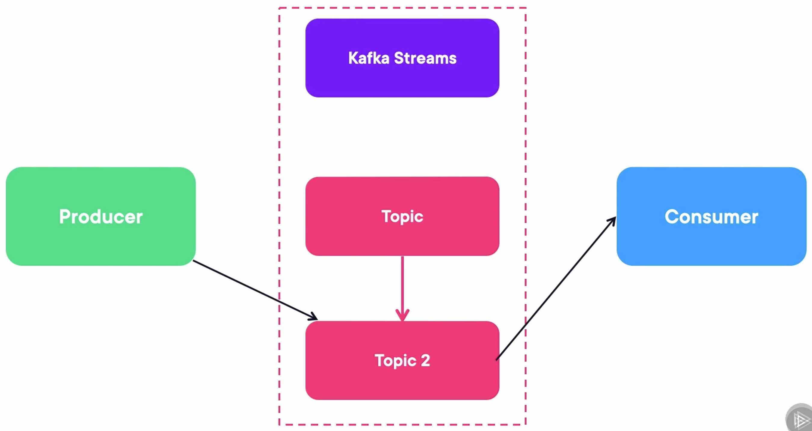

## TrustStore and KeyStore in Kafka

We need to have a secure deployment and encrypted communication on each of these four types of arrows.


Nowadays, the TLS is mostly used to secure a connection via a CA (Certificate Authority):

-   CA (Certificate Authority): The CA can sign other entities certificates.
-   Client: The client put certificates in the Trust Store and doesn't hold keys.
-   Server: The server puts certificates, public keys, and private keys in the Key Store. 


Let's analyze these five entities in Kafka: the CA, Zookeeper, Brokers, Producers, and Consumers. Who needs a key store, and who needs a trust store, or both?

-   The CA: CA is the source of trust, it doesn't need a keystore to verify against someone and just needs a trust store.
-   Zookeepers: They are clients between themselves, so they need a trust store. But they are servers to the brokers, so they also need a key store with a CA certificate and both private and public keys for the brokers. Therefore, they need both.
-   Brokers: They are similar to the zookeepers. They are clients between themselves and servers to producers and consumers. Therefore, they need both.
-   Producers: They are just clients, so they just need a trust store.
-   Consumers: They are just clients, so they just need a trust store.


## Demo: Creating the KeyStores and TrustStores

### Run Docker Containers

Create a docker-compose file, including three zookeepers, three Kafka brokers, a Rest Proxy, and a Schema Registry.

```yaml
---
version: '3'
services:
  zookeeper-1:
    image: confluentinc/cp-zookeeper:7.4.1
    hostname: zookeeper-1
    container_name: zookeeper-1
    volumes:
      - ./zookeeper-1_data:/var/lib/zookeeper/data
      - ./zookeeper-1_log:/var/lib/zookeeper/log
    environment:
      ZOOKEEPER_CLIENT_PORT: 2181
      ZOOKEEPER_TICK_TIME: 2000
      ZOO_MY_ID: 1
      ZOO_SERVERS: server.1=zookeeper-1:2888:3888;2181 server.2=zookeeper-2:2888:3888;2181 server.3=zookeeper-3:2888:3888;2181

  zookeeper-2:
    image: confluentinc/cp-zookeeper:7.4.1
    hostname: zookeeper-2
    container_name: zookeeper-2
    volumes:
      - ./zookeeper-2_data:/var/lib/zookeeper/data
      - ./zookeeper-2_log:/var/lib/zookeeper/log
    environment:
      ZOOKEEPER_CLIENT_PORT: 2181
      ZOOKEEPER_TICK_TIME: 2000
      ZOO_MY_ID: 2
      ZOO_SERVERS: server.1=zookeeper-1:2888:3888;2181 server.2=zookeeper-2:2888:3888;2181 server.3=zookeeper-3:2888:3888;2181

  zookeeper-3:
    image: confluentinc/cp-zookeeper:7.4.1
    hostname: zookeeper-3
    container_name: zookeeper-3
    volumes:
      - ./zookeeper-3_data:/var/lib/zookeeper/data
      - ./zookeeper-3_log:/var/lib/zookeeper/log
    environment:
      ZOOKEEPER_CLIENT_PORT: 2181
      ZOOKEEPER_TICK_TIME: 2000
      ZOO_MY_ID: 3
      ZOO_SERVERS: server.1=zookeeper-1:2888:3888;2181 server.2=zookeeper-2:2888:3888;2181 server.3=zookeeper-3:2888:3888;2181


  broker-1:
    image: confluentinc/cp-kafka:7.4.1
    hostname: broker-1
    container_name: broker-1
    volumes:
      - ./broker-1-data:/var/lib/kafka/data
    depends_on:
      - zookeeper-1
      - zookeeper-2
      - zookeeper-3
    ports:
      - 9092:9092
      - 29092:29092
    environment:
      KAFKA_BROKER_ID: 1
      KAFKA_ZOOKEEPER_CONNECT: zookeeper-1:2181
      KAFKA_ADVERTISED_LISTENERS: HOST://localhost:9092,INTERNAL://broker-1:29092
      KAFKA_LISTENER_SECURITY_PROTOCOL_MAP: HOST:PLAINTEXT,INTERNAL:PLAINTEXT
      KAFKA_INTER_BROKER_LISTENER_NAME: INTERNAL
      KAFKA_SNAPSHOT_TRUST_EMPTY: true

  broker-2:
    image: confluentinc/cp-kafka:7.4.1
    hostname: broker-2
    container_name: broker-2
    volumes:
      - ./broker-2-data:/var/lib/kafka/data
    depends_on:
      - zookeeper-1
      - zookeeper-2
      - zookeeper-3
      - broker-1
    ports:
      - 9093:9093
      - 29093:29093
    environment:
      KAFKA_BROKER_ID: 2
      KAFKA_ZOOKEEPER_CONNECT: zookeeper-1:2181
      KAFKA_ADVERTISED_LISTENERS: HOST://localhost:9093,INTERNAL://broker-2:29093
      KAFKA_LISTENER_SECURITY_PROTOCOL_MAP: HOST:PLAINTEXT,INTERNAL:PLAINTEXT
      KAFKA_INTER_BROKER_LISTENER_NAME: INTERNAL
      KAFKA_SNAPSHOT_TRUST_EMPTY: true

  broker-3:
    image: confluentinc/cp-kafka:7.4.1
    hostname: broker-3
    container_name: broker-3
    volumes:
      - ./broker-3-data:/var/lib/kafka/data
    depends_on:
      - zookeeper-1
      - zookeeper-2
      - zookeeper-3
      - broker-1
      - broker-2
    ports:
      - 9094:9094
      - 29094:29094
    environment:
      KAFKA_BROKER_ID: 3
      KAFKA_ZOOKEEPER_CONNECT: zookeeper-1:2181
      KAFKA_ADVERTISED_LISTENERS: HOST://localhost:9094,INTERNAL://broker-3:29094
      KAFKA_LISTENER_SECURITY_PROTOCOL_MAP: HOST:PLAINTEXT,INTERNAL:PLAINTEXT
      KAFKA_INTER_BROKER_LISTENER_NAME: INTERNAL
      KAFKA_SNAPSHOT_TRUST_EMPTY: true


  rest-proxy:
    image: confluentinc/cp-kafka-rest:7.4.1
    ports:
      - "8082:8082"
    depends_on:
      - zookeeper-1
      - zookeeper-2
      - zookeeper-3
      - broker-1
      - broker-2
      - broker-3
    hostname: rest-proxy
    container_name: rest-proxy
    environment:
      KAFKA_REST_HOST_NAME: rest-proxy
      KAFKA_REST_BOOTSTRAP_SERVERS: 'broker-1:29092,broker-2:29093,broker-3:29094'
      KAFKA_REST_LISTENERS: "http://0.0.0.0:8082"

  schema-registry:
    image: confluentinc/cp-schema-registry:7.4.1
    hostname: schema-registry
    container_name: schema-registry
    depends_on:
      - rest-proxy
    ports:
      - "8081:8081"
    environment:
      SCHEMA_REGISTRY_HOST_NAME: schema-registry
      SCHEMA_REGISTRY_KAFKASTORE_BOOTSTRAP_SERVERS: 'broker-1:29092,broker-2:29093,broker-3:29094'
```

Run composed containers:

```bash
docker compose up -d
```

### Create a Topic

Create a `myorders` topic that has four partitions.

```bash
kafka-topics.sh --create --bootstrap-server localhost:9092 --partitions 4 --topic myorders
```

### Generate the Certificate Authority

Create a shell script file `generate-called.sh` like the following:

```bash
VALIDITY_DAYS=36500
CA_KEY_FILE="ca-key"
CA_CERT_FILE="ca-cert" 

openssl req -new -x509 -keyout $CA_KEY_FILE -out $CA_CERT_FILE -days $VALIDITY_DAYS

#### Example Values ####
# Passphrase: password
# Country Name: US
# State or Province: UT
# City: Utah
# Organization Name: zjxjwxk
# Organizational Unit Name: zjxjwxk
# Common Name: zjxjwxk.github.io
# Email: zjxjwxk@gmail.com
```

Run the script and input all information it needs:

```bash
❯ ./generate-ca.sh
......+......+..+......+.........+.+......+...............+++++++++++++++++++++++++++++++++++++++*.+....+.........+++++++++++++++++++++++++++++++++++++++*..+.........+......++++++
....+.....+...+++++++++++++++++++++++++++++++++++++++*...+...+++++++++++++++++++++++++++++++++++++++*.........+...+....+............+........+.....................+......+.+...+.....+.......+...+.................+.........+...............+.+...+..+.........+...+.+...................................+.+.....+....+..++++++
Enter PEM pass phrase:
Verifying - Enter PEM pass phrase:
-----
You are about to be asked to enter information that will be incorporated
into your certificate request.
What you are about to enter is what is called a Distinguished Name or a DN.
There are quite a few fields but you can leave some blank
For some fields there will be a default value,
If you enter '.', the field will be left blank.
-----
Country Name (2 letter code) [AU]:US
State or Province Name (full name) [Some-State]:UT
Locality Name (eg, city) []:Utah
Organization Name (eg, company) [Internet Widgits Pty Ltd]:zjxjwxk
Organizational Unit Name (eg, section) []:zjxjwxk
Common Name (e.g. server FQDN or YOUR name) []:zjxjwxk.github.io
Email Address []:zjxjwxk@gmail.com
```

### Generate the KeyStores

Create a shell script file `generate-keystore.sh` like the following:

```bash
COMMON_NAME=$1
ORGANIZATIONAL_UNIT="zjxjwxk"
ORGANIZATION="zjxjwxk"
CITY="Utah"
STATE="UT"
COUNTRY="US"

CA_ALIAS="ca-root"
CA_CERT_FILE="ca-cert" 
VALIDITY_DAYS=36500

# Generate Keystore with Private Key
keytool -keystore keystore/$COMMON_NAME.keystore.jks -alias $COMMON_NAME -validity $VALIDITY_DAYS -genkey -keyalg RSA -dname "CN=$COMMON_NAME, OU=$ORGANIZATIONAL_UNIT, O=$ORGANIZATION, L=$CITY, ST=$STATE, C=$COUNTRY"

# Generate Certificate Signing Request (CSR) using the newly created KeyStore
keytool -keystore keystore/$COMMON_NAME.keystore.jks -alias $COMMON_NAME -certreq -file $COMMON_NAME.csr 

# Sign the CSR using the custom CA
openssl x509 -req -CA ca-cert -CAkey ca-key -in $COMMON_NAME.csr -out $COMMON_NAME.signed -days $VALIDITY_DAYS -CAcreateserial

# Import ROOT CA certificate into Keystore
keytool -keystore keystore/$COMMON_NAME.keystore.jks -alias $CA_ALIAS -importcert -file $CA_CERT_FILE

# Import newly signed certificate into Keystore
keytool -keystore keystore/$COMMON_NAME.keystore.jks -alias $COMMON_NAME -importcert -file $COMMON_NAME.signed

# Clean-up 
rm $COMMON_NAME.csr
rm $COMMON_NAME.signed
rm ca-cert.srl
```

Create the `keystore` folder in the same path and then run the script with a parameter, which will be the name using the key store (run this script 6 times for three brokers and three zookeepers), and then input the passphrase when needed:

```bash
❯ ./generate-keystore.sh broker-1
输入密钥库口令:  
再次输入新口令: 
输入 <broker-1> 的密钥口令
	(如果和密钥库口令相同, 按回车):  

Warning:
JKS 密钥库使用专用格式。建议使用 "keytool -importkeystore -srckeystore keystore/broker-1.keystore.jks -destkeystore keystore/broker-1.keystore.jks -deststoretype pkcs12" 迁移到行业标准格式 PKCS12。
输入密钥库口令:  

Warning:
JKS 密钥库使用专用格式。建议使用 "keytool -importkeystore -srckeystore keystore/broker-1.keystore.jks -destkeystore keystore/broker-1.keystore.jks -deststoretype pkcs12" 迁移到行业标准格式 PKCS12。
Certificate request self-signature ok
subject=C=US, ST=UT, L=Utah, O=zjxjwxk, OU=zjxjwxk, CN=broker-1
Enter pass phrase for ca-key:
输入密钥库口令:  
所有者: EMAILADDRESS=zjxjwxk@gmail.com, CN=zjxjwxk.github.io, OU=zjxjwxk, O=zjxjwxk, L=Utah, ST=UT, C=US
发布者: EMAILADDRESS=zjxjwxk@gmail.com, CN=zjxjwxk.github.io, OU=zjxjwxk, O=zjxjwxk, L=Utah, ST=UT, C=US
序列号: 7f8120f61b9782eadb2fd5097a6e58e116ba5351
有效期为 Sun Mar 16 15:13:13 CST 2025 至 Tue Feb 20 15:13:13 CST 2125
证书指纹:
	 MD5:  AE:1E:A0:89:D6:FC:FF:6C:73:83:A8:8E:72:EC:5C:14
	 SHA1: 27:BD:36:3A:64:92:08:BF:C5:93:EA:50:EC:B6:39:53:08:30:C9:96
	 SHA256: 7A:1A:E0:6D:91:C1:5E:FE:D1:6A:81:27:13:3E:08:5C:6A:D7:AF:A0:14:B4:C1:43:AA:65:85:AF:DC:B8:04:ED
签名算法名称: SHA256withRSA
主体公共密钥算法: 2048 位 RSA 密钥
版本: 3

扩展: 

#1: ObjectId: 2.5.29.35 Criticality=false
AuthorityKeyIdentifier [
KeyIdentifier [
0000: 85 57 ED 32 DF F0 D2 E5   4B E9 DF 4E 77 5E 3B CA  .W.2....K..Nw^;.
0010: 03 91 17 70                                        ...p
]
]

#2: ObjectId: 2.5.29.19 Criticality=true
BasicConstraints:[
  CA:true
  PathLen:2147483647
]

#3: ObjectId: 2.5.29.14 Criticality=false
SubjectKeyIdentifier [
KeyIdentifier [
0000: 85 57 ED 32 DF F0 D2 E5   4B E9 DF 4E 77 5E 3B CA  .W.2....K..Nw^;.
0010: 03 91 17 70                                        ...p
]
]

是否信任此证书? [否]:  y
证书已添加到密钥库中

Warning:
JKS 密钥库使用专用格式。建议使用 "keytool -importkeystore -srckeystore keystore/broker-1.keystore.jks -destkeystore keystore/broker-1.keystore.jks -deststoretype pkcs12" 迁移到行业标准格式 PKCS12。
输入密钥库口令:  
证书回复已安装在密钥库中

Warning:
JKS 密钥库使用专用格式。建议使用 "keytool -importkeystore -srckeystore keystore/broker-1.keystore.jks -destkeystore keystore/broker-1.keystore.jks -deststoretype pkcs12" 迁移到行业标准格式 PKCS12。
```

### Create the Truststores

Create a shell script file `generate-truststore.sh` like the following:

```bash
INSTANCE=$1
CA_ALIAS="ca-root"
CA_CERT_FILE="ca-cert" 

#### Generate Truststore and import ROOT CA certificate ####
keytool -keystore truststore/$INSTANCE.truststore.jks -import -alias $CA_ALIAS -file $CA_CERT_FILE
```

Create the `truststroe` folder in the same path and then run the script with a parameter, which will be the name using the trust store (run this script 6 times for three brokers and three zookeepers), and then input the passphrase when needed:

```bash
❯ ./generate-truststore.sh broker-1
输入密钥库口令:  
再次输入新口令: 
所有者: EMAILADDRESS=zjxjwxk@gmail.com, CN=zjxjwxk.github.io, OU=zjxjwxk, O=zjxjwxk, L=Utah, ST=UT, C=US
发布者: EMAILADDRESS=zjxjwxk@gmail.com, CN=zjxjwxk.github.io, OU=zjxjwxk, O=zjxjwxk, L=Utah, ST=UT, C=US
序列号: 7f8120f61b9782eadb2fd5097a6e58e116ba5351
有效期为 Sun Mar 16 15:13:13 CST 2025 至 Tue Feb 20 15:13:13 CST 2125
证书指纹:
	 MD5:  AE:1E:A0:89:D6:FC:FF:6C:73:83:A8:8E:72:EC:5C:14
	 SHA1: 27:BD:36:3A:64:92:08:BF:C5:93:EA:50:EC:B6:39:53:08:30:C9:96
	 SHA256: 7A:1A:E0:6D:91:C1:5E:FE:D1:6A:81:27:13:3E:08:5C:6A:D7:AF:A0:14:B4:C1:43:AA:65:85:AF:DC:B8:04:ED
签名算法名称: SHA256withRSA
主体公共密钥算法: 2048 位 RSA 密钥
版本: 3

扩展: 

#1: ObjectId: 2.5.29.35 Criticality=false
AuthorityKeyIdentifier [
KeyIdentifier [
0000: 85 57 ED 32 DF F0 D2 E5   4B E9 DF 4E 77 5E 3B CA  .W.2....K..Nw^;.
0010: 03 91 17 70                                        ...p
]
]

#2: ObjectId: 2.5.29.19 Criticality=true
BasicConstraints:[
  CA:true
  PathLen:2147483647
]

#3: ObjectId: 2.5.29.14 Criticality=false
SubjectKeyIdentifier [
KeyIdentifier [
0000: 85 57 ED 32 DF F0 D2 E5   4B E9 DF 4E 77 5E 3B CA  .W.2....K..Nw^;.
0010: 03 91 17 70                                        ...p
]
]

是否信任此证书? [否]:  y
证书已添加到密钥库中
```

Finally, the generated key stores and trust stores should look like this:


## Encrypt Zookeeper

Encrypting Zookeeper can be done in two ways: Online Fashion and Offline Fashion.

The configuration we need to add to each Zookeeper in the docker-compose file:

```yaml
      zookeeper-1:
        ...
        volumes:
        	...
          - ./security/keystore/zookeeper-1.keystore.jks:/security/zookeeper-1.keystore.jks
          - ./security/truststore/zookeeper-1.truststore.jks:/security/zookeeper-1.truststore.jks
        environment:
          ...
          ZOO_CFG_EXTRA: "sslQuorum=true
                          portUnification=false
                          serverCnxnFactory=org.apache.zookeeper.server.NettyServerCnxnFactory

                          ssl.quorum.hostnameVerification=false
                          ssl.quorum.keyStore.location=/security/zookeeper-1.keystore.jks
                          ssl.quorum.keyStore.password=password
                          ssl.quorum.trustStore.location=/security/zookeeper-1.truststore.jks
                          ssl.quorum.trustStore.password=password

                          secureClientPort=2281
                          ssl.hostnameVerification=false
                          ssl.keyStore.location=/security/zookeeper-1.keystore.jks
                          ssl.keyStore.password=password
                          ssl.trustStore.location=/security/zookeeper-1.truststore.jks
                          ssl.trustStore.password=password"
```

The configuration we need to add to each broker in the docker-compose file:

```yaml
      broker-1:
        ...
        volumes:
        	...
          - ./security/keystore/broker-1.keystore.jks:/kafka/security/broker-1.keystore.jks
          - ./security/truststore/broker-1.truststore.jks:/kafka/security/broker-1.truststore.jks
        environment:
          ...
          KAFKA_ZOOKEEPER_SSL_CLIENT_ENABLE: "true"
          KAFKA_ZOOKEEPER_CLIENT_CNXN_SOCKET: org.apache.zookeeper.ClientCnxnSocketNetty
          KAFKA_ZOOKEEPER_SSL_KEYSTORE_LOCATION: /kafka/security/broker-1.keystore.jks
          KAFKA_ZOOKEEPER_SSL_KEYSTORE_PASSWORD: password
          KAFKA_ZOOKEEPER_SSL_TRUSTSTORE_LOCATION: /kafka/security/broker-1.truststore.jks
          KAFKA_ZOOKEEPER_SSL_TRUSTSTORE_PASSWORD: password
```

## Encrypt Producers and Consumers

### Configuration

Four supported protocols are PLAINTEXT, SSL, SASL_PLAINTEXT, and SASL_SSL. (SASL involves authentication).

Declaring a listener is quite simple as well, in the environment we need to set:

```yaml
broker-1:
	...
  environment:
  	...
    KAFKA_LISTENERS: PLAINTEXT://broker-1:9091
    KAFKA_ADVERTISED_LISTENERS: PLAINTEXT://broker-1:9091
    KAFKA_LISTENER_SECURITY_PROTOCOL_MAP: PLAINTEXT:PLAINTEXT
```

If we want to use SSL, we need to change those to:

```yaml
broker-1:
	...
  environment:
  	...
    KAFKA_LISTENERS: SSL://broker-1:9192
    KAFKA_ADVERTISED_LISTENERS: SSL://broker-1:9192
    KAFKA_LISTENER_SECURITY_PROTOCOL_MAP: SSL:SSL
    KAFKA_SECURITY_INTER_BROKER_PROTOCOL: SSL
    KAFKA_SSL_CLIENT_AUTH: none
```

Set the TrustStores and KeyStores:

```yaml
broker-1:
	...
  environment:
  	...
    KAFKA_SSL_KEYSTORE_LOCATION: /kafka/security/broker-1.keystore.jks
    KAFKA_SSL_KEYSTORE_PASSWORD: password
    KAFKA_SSL_KEY_PASSWORD: passowrd
    KAFKA_SSL_TRUSTSTORE_LOCATION: /kafka/security/broker-1.truststore.jks
    KAFKA_SSL_TRUSTSTORE_PASSWORD: password
```

### Consumer and Producer using SSL in Java

The difference between a consumer using SSL and a consumer using plaintext is that:

1.   Change the ports of each broker configured to the `ConsumerConfig.BOOTSTRAP_SERVERS_CONFIG` to the ports using SSL.

     1.   ```java
          props.put(ConsumerConfig.BOOTSTRAP_SERVERS_CONFIG, "broker-1:9191,broker-2:9192,broker-3:9193");
          ```

2.   Set the `CommonClientConfigs.SECURITY_PROTOCOL_CONFIG` to SSL.

     1.   ```java
          props.put(CommonClientConfigs.SECURITY_PROTOCOL_CONFIG, "SSL");
          ```

3.   Set the trust store key and the password.

     ```java
     props.put(SslConfigs.SSL_TRUSTSTORE_LOCATION_CONFIG, "/Users/zjxjwxk/Documents/Project/getting-started-kafka/module8/demo3/security/truststore/consumer.truststore.jks"); // Replace with the absolute path on your machine
             props.put(SslConfigs.SSL_TRUSTSTORE_PASSWORD_CONFIG, "password");
     ```

The consumer using SSL should be like:

```java
import org.apache.kafka.clients.CommonClientConfigs;
import org.apache.kafka.clients.consumer.ConsumerConfig;
import org.apache.kafka.clients.consumer.ConsumerRecords;
import org.apache.kafka.clients.consumer.KafkaConsumer;
import org.apache.kafka.common.config.SslConfigs;
import org.apache.kafka.common.serialization.StringDeserializer;
import org.slf4j.Logger;
import org.slf4j.LoggerFactory;

import java.time.Duration;
import java.util.Collections;
import java.util.Properties;
import java.util.concurrent.ExecutionException;

public class BasicSSLConsumer {

    private static final Logger log = LoggerFactory.getLogger(BasicSSLConsumer.class);

    public static void main(String[] args) throws ExecutionException, InterruptedException {
        Properties props = new Properties();
        props.put(ConsumerConfig.BOOTSTRAP_SERVERS_CONFIG, "broker-1:9191,broker-2:9192,broker-3:9193");
        props.put(ConsumerConfig.KEY_DESERIALIZER_CLASS_CONFIG, StringDeserializer.class.getName());
        props.put(ConsumerConfig.VALUE_DESERIALIZER_CLASS_CONFIG, StringDeserializer.class.getName());
        props.put(ConsumerConfig.GROUP_ID_CONFIG, "basic.consumer");

        props.put(CommonClientConfigs.SECURITY_PROTOCOL_CONFIG, "SSL");

        props.put(SslConfigs.SSL_TRUSTSTORE_LOCATION_CONFIG, "/Users/zjxjwxk/Documents/Project/getting-started-kafka/module8/demo3/security/truststore/consumer.truststore.jks"); // Replace with the absolute path on your machine
        props.put(SslConfigs.SSL_TRUSTSTORE_PASSWORD_CONFIG, "password");

        KafkaConsumer<String, String> consumer = new KafkaConsumer<>(props);

        Thread haltedHook = new Thread(consumer::close);
        Runtime.getRuntime().addShutdownHook(haltedHook);

        consumer.subscribe(Collections.singletonList("basic-topic"));

        while (true) {
            ConsumerRecords<String, String> records = consumer.poll(Duration.ofMillis(100));

            records.forEach(record -> log.info("Consumed message: " + record.key() + ":" + record.value()));
        }
    }
}
```

The producer is similar:

```java
import org.apache.kafka.clients.CommonClientConfigs;
import org.apache.kafka.clients.producer.*;
import org.apache.kafka.common.config.SslConfigs;
import org.apache.kafka.common.serialization.StringSerializer;
import org.slf4j.Logger;
import org.slf4j.LoggerFactory;

import java.util.Properties;
import java.util.UUID;
import java.util.concurrent.ExecutionException;

public class BasicSSLProducer {

    private static final Logger log = LoggerFactory.getLogger(BasicSSLProducer.class);

    public static void main(String[] args) throws ExecutionException, InterruptedException {
        Properties props = new Properties();
        props.put(ProducerConfig.BOOTSTRAP_SERVERS_CONFIG, "broker-1:9191,broker-2:9192,broker-3:9193");
        props.put(ProducerConfig.KEY_SERIALIZER_CLASS_CONFIG, StringSerializer.class.getName());
        props.put(ProducerConfig.VALUE_SERIALIZER_CLASS_CONFIG, StringSerializer.class.getName());

        props.put(CommonClientConfigs.SECURITY_PROTOCOL_CONFIG, "SSL");

        props.put(SslConfigs.SSL_TRUSTSTORE_LOCATION_CONFIG, "/Users/zjxjwxk/Documents/Project/getting-started-kafka/module8/demo3/security/truststore/producer.truststore.jks"); // Replace with the absolute path on your machine
        props.put(SslConfigs.SSL_TRUSTSTORE_PASSWORD_CONFIG, "password");

        KafkaProducer<String, String> producer = new KafkaProducer<>(props);

        Thread haltedHook = new Thread(producer::close);
        Runtime.getRuntime().addShutdownHook(haltedHook);

        long i = 0;
        while(true) {
            String key = String.valueOf(i);
            String value = UUID.randomUUID().toString();

            ProducerRecord<String, String> producerRecord =
                new ProducerRecord<>("basic-topic", key, value);
            producer.send(producerRecord);
            log.info("Message sent: " + key + ":" + value);

            i++;
            Thread.sleep(20);
        }
    }
}
```

## Monitoring Kafka: Scaling

### Cluster Level

If there are some problems with the cluster level, usually means a high load. Add a broker 4 and turn on the balancer. Then the load will be balanced between brokers.

```
confluent.balancer.enable=true
```


### Broker Level

If there are some problems with the broker level. We can just restart the broker.


### Topic Level

The only problem that load balancer from confluent doesn't detect is the topic level. To detect that, the command to run is:

```bash
❯ kafka-consumer-groups.sh --bootstrap-server localhost:9092 --describe --group 1                          

GROUP           TOPIC           PARTITION  CURRENT-OFFSET  LOG-END-OFFSET  LAG             CONSUMER-ID                                           HOST            CLIENT-ID
1               myorders        1          0               0               0               console-consumer-8a295fc9-0d1f-4712-9c60-8e5ce13c7155 /172.30.0.1     console-consumer
1               myorders        0          0               0               0               console-consumer-8a295fc9-0d1f-4712-9c60-8e5ce13c7155 /172.30.0.1     console-consumer%
```

If a topic's LAG is high, the consumer is not catching up, which means we need more partitions.

Increasing the number of partitions of a topic is not easy. The best way is:

1.   Create another topic with more partitions.
2.   Then create a Kafka Streams application that will read from the original topic and write to the output topic. When that steam application is done, then there is no lag.
3.   Migrate producers and consumers to the new topic.



## Takeaway

-   We need to secure all communications channels in Kafka by encrypting them with TLS.
-   We created TrustStroes for all entities and KeyStores for Brokers and Zookeepers.
-   To scale out Kafka, most of the problems are solved by the Confluent tool, SBC (Self-Balancing Clusters).