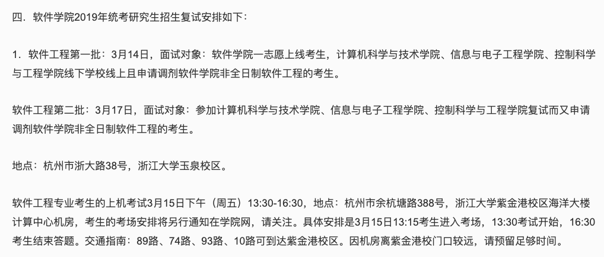
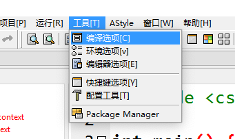
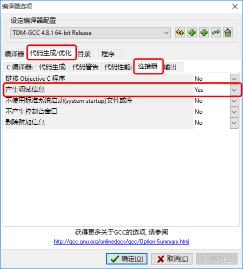
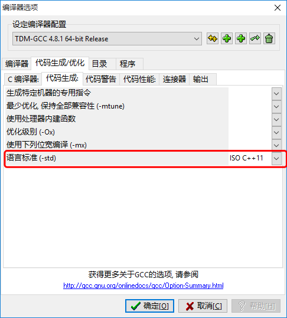
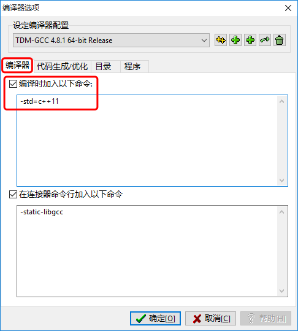
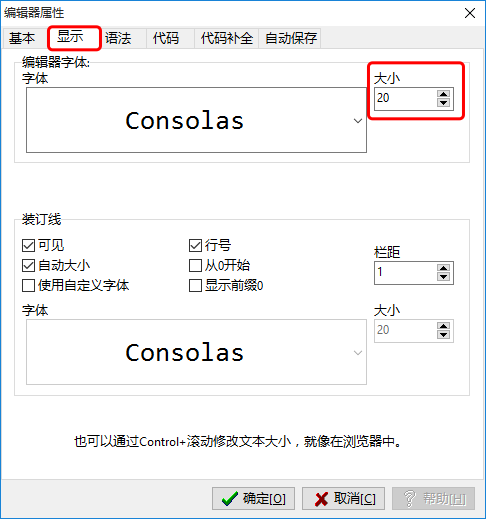
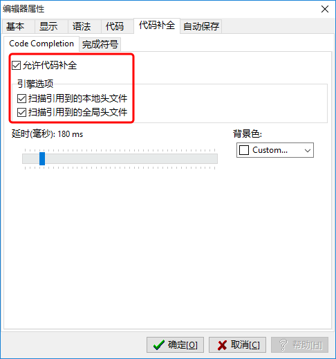
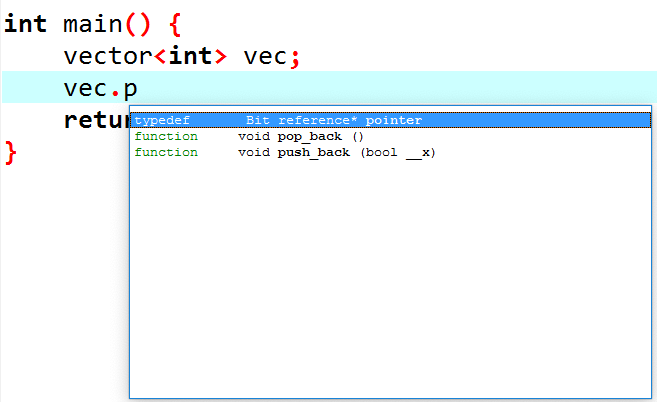
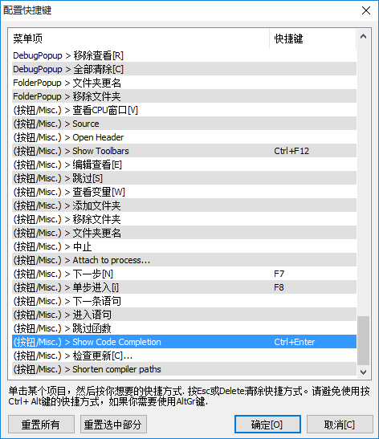
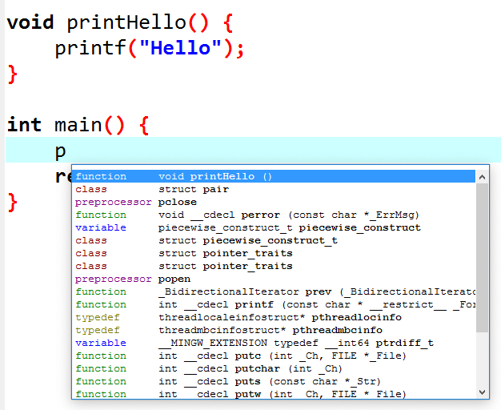

根据往年 (2019) 年浙大软件学院的考研复试公告，如果今年 (2020) 是线下复试，且考场没有变化的话，机试应该还是在 `浙大紫金港校区`（如下图）。

> 浙大软院招生通知：http://www.cst.zju.edu.cn/2019/0307/c36207a1478348/page.htm

从 PAT 官网可以找到紫金港的机房配置：

> PAT 考点联盟：https://www.patest.cn/location

我本人选择使用 `Dev C++ 5.10` 版本，考试那天在考场需要先对其作以下配置（当然也许已经配置好了）：

# 打开产生调试信息

在 `“工具(Tools)”` -> `“编译选项(Compiler Options)"` 中：

点击 `“代码生成/优化(Settings)”` 选项卡中的 `"连接器(Linker)"` 选项卡，将 `"产生调试信息(Generate debugging information)"` 选项改为 `“Yes”`。

这样，就可以愉快的 Debug 了～

# 添加 C++ 11 支持

由于 PAT 的 OJ 是支持 C++ 11 的，故最好打开 C++ 11 支持。

## 方法一（推荐）

在 `“工具(Tools)”` -> `“编译选项(Compiler Options)"` 中，`“代码生成/优化(Settings)”` 选项卡下的 `“代码生成(Code Generation)”` 选项卡中，将 `“语言标准(Language Standard)(-std)”` 设置为 `ISO C++11` 即可。

## 方法二

同样，也可以在`“工具(Tools)”` -> `“编译选项(Compiler Options)"`中，在`"编译器(General)"`选项卡中，勾选`"编译时加入以下命令：(Add the following commands when calling the compiler:)"`，并在下方加入 `-std=c++11`。

# 字体大小

由于默认字体是 10，实在太小了不能接受，可以在 `“工具(Tools)”` -> `“编译器选项(Editor Options)"` 中的`"显示(Fonts)"`选项卡，修改字体`大小(Size)`。或者通过 `Ctrl + 滚轮` 修改字体大小（更方便）。

# 代码补全

## 打开代码补全

Dev C++ 是有一定的代码补全功能的，在`“工具(Tools)”` -> `“编译器选项(Editor Options)"`中，在 `“代码补全(Completion)”` 选项卡下的 `Code Completion` 选项卡中，将所有勾勾上即可。

## 快捷键

同时，可以通过`“工具(Tools)”` -> `“快捷键选项(Configure Shortcuts)”` 来配置 `Show Code Completion` 的快捷键以唤出代码补全（默认为 Ctrl + Space）：

然后，就可以愉快地考试了～