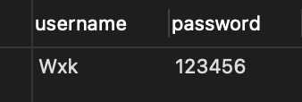
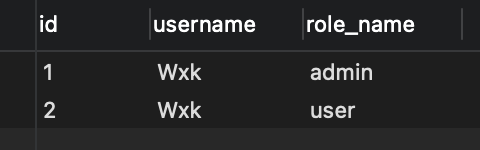
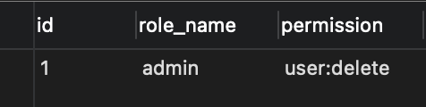

# 学习目标

- 认识 Shiro 的整体架构，各组件的概念
- Shiro 认证，授权的过程
- Shiro 自定义的 Realm，Filter
- Shiro Session 管理
- Shiro 缓存管理
- Shiro 集成 Spring

# Shiro 简介

- Apache 的强大灵活的开源安全框架
- 认证、授权、企业会话管理、安全加密

# Shiro 与 Spring Security 比较

## Shiro

- 简单、灵活
- 可脱离 Spring
- 粒度较粗

## Spring Security

- 复杂、笨重
- 不可脱离 Spring
- 粒度更细

# Shiro 整体架构


# Shiro 认证和授权

## 认证过程

- 创建 SecurityManager -> 主体提交认证 -> SecurityManager 认证 -> Authenticator 认证 -> Realm 验证

## 授权过程

- 创建 SecurityManager -> 主体提交授权 -> SecurityManager 授权 -> Authorizer 授权 -> Realm 获取角色权限数据

测试代码如下（这里先使用 SimpleAccountRealm 作为 Realm）：

```java
public class AuthenticationTest {

    private final SimpleAccountRealm simpleAccountRealm = new SimpleAccountRealm();

    @Before
    public void addUser() {
        simpleAccountRealm.addAccount("Wxk", "123456", "admin", "user");
    }

    @Test
    public void testAuthentication() {
        // 1. 构建SecurityManager环境
        DefaultSecurityManager defaultSecurityManager = new DefaultSecurityManager();
        // 2. 给SecurityManager设置Realm
        defaultSecurityManager.setRealm(simpleAccountRealm);
        // 3. 给SecurityUtils设置SecurityManager
        SecurityUtils.setSecurityManager(defaultSecurityManager);
        // 4. 获取Subject
        Subject subject = SecurityUtils.getSubject();
        // 5. Subject提交认证请求
        UsernamePasswordToken token = new UsernamePasswordToken("Wxk", "123456");
        subject.login(token);

        /*
        认证
         */
        System.out.println("isAuthenticated: " + subject.isAuthenticated());

        /*
        授权
         */
        subject.checkRoles("admin", "user");
    }
}
```

# Realm

- 内置 Realm
  - IniRealm
  - JdbcRealm
- 自定义 Realm

## IniRealm

1. 在 resources 下创建一个 user.ini 文件：

```ini
[users]
Wxk=123456,admin
[roles]
admin=user:delete
```

2. 使用 IniRealm 作为 Realm

测试代码如下：

```java
public class IniRealmTest {

    private final IniRealm iniRealm = new IniRealm("classpath:user.ini");

    @Test
    public void testAuthentication() {
        // 1. 构建SecurityManager环境
        DefaultSecurityManager defaultSecurityManager = new DefaultSecurityManager();
        // 2. 给SecurityManager设置Realm
        defaultSecurityManager.setRealm(iniRealm);
        // 3. 给SecurityUtils设置SecurityManager
        SecurityUtils.setSecurityManager(defaultSecurityManager);
        // 4. 获取Subject
        Subject subject = SecurityUtils.getSubject();
        // 5. Subject提交认证请求
        UsernamePasswordToken token = new UsernamePasswordToken("Wxk", "123456");
        subject.login(token);

        /*
        认证
         */
        System.out.println("isAuthenticated: " + subject.isAuthenticated());

        /*
        授权
         */
        // 检查角色授权
        subject.checkRole("admin");
        // 检查权限授权
        subject.checkPermission("user:delete");
    }
}
```

## JdbcRealm

1. 分别创建数据库表：用户表 test_user, 用户角色表 test_user_roles, 用户权限表 test_users_permissions。
2. 给 JdbcRealm 设置数据源
3. 打开权限查询开关
4. 给 JdbcRealm 自定义认证、角色和权限SQL查询语句
5. 使用 JdbcRealm 作为 Realm

数据库表如下：







测试代码如下：

```java
public class JdbcRealmTest {

    private final DruidDataSource dataSource = new DruidDataSource();
    private final JdbcRealm jdbcRealm = new JdbcRealm();

    @Test
    public void testAuthentication() {
        // 设置数据源
        dataSource.setUrl("jdbc:mysql://localhost:3306/test");
        dataSource.setUsername("root");
        dataSource.setPassword("123456");
        jdbcRealm.setDataSource(dataSource);
        // 打开权限查询开关
        jdbcRealm.setPermissionsLookupEnabled(true);

        // 自定义认证查询SQL
        String AuthenticationSQL = "SELECT password FROM test_user WHERE username = ?";
        jdbcRealm.setAuthenticationQuery(AuthenticationSQL);

        // 自定义角色查询SQL
        String rolesSQL = "SELECT role_name FROM test_user_roles WHERE username = ?";
        jdbcRealm.setUserRolesQuery(rolesSQL);

        // 自定义权限查询SQL
        String permissionsSQL = "SELECT permission FROM test_roles_permissions WHERE role_name = ?";
        jdbcRealm.setPermissionsQuery(permissionsSQL);

        // 1. 构建SecurityManager环境
        DefaultSecurityManager defaultSecurityManager = new DefaultSecurityManager();
        // 2. 给SecurityManager设置Realm
        defaultSecurityManager.setRealm(jdbcRealm);
        // 3. 给SecurityUtils设置SecurityManager
        SecurityUtils.setSecurityManager(defaultSecurityManager);
        // 4. 获取Subject
        Subject subject = SecurityUtils.getSubject();
        // 5. Subject提交认证请求
        UsernamePasswordToken token = new UsernamePasswordToken("Wxk", "123456");
        subject.login(token);

        /*
        认证
         */
        System.out.println("isAuthenticated: " + subject.isAuthenticated());

        /*
        授权
         */
        // 检查角色授权
        subject.checkRoles("admin", "user");
        // 检查权限授权
        subject.checkPermission("user:delete");
    }
}
```

## 自定义 Realm

1. 自定义 MyRealm 类继承自 AuthorizingRealm，重写 doGetAuthenticationInfo 和 doGetAuthorizationInfo 方法来返回认证和授权验证信息：

```java
public class MyRealm extends AuthorizingRealm {

    /**
     * 模拟数据库或缓存
     */
    Map<String, String> userMap = new HashMap<String, String>(16){{
        put("Wxk", "123456");
    }};

    {
        // 设置Realm名称
        super.setName("myRealm");
    }

    @Override
    protected AuthorizationInfo doGetAuthorizationInfo(PrincipalCollection principals) {
        // 1. 获得用户名
        String username = (String) principals.getPrimaryPrincipal();
        // 2. 通过用户名到数据库或缓存中获取角色集合和权限集合
        Set<String> roles = getRolesByUsername(username);
        Set<String> permissions = getPermissionsByUsername(username);
        // 3. 给AuthorizationInfo设置角色集合和权限结合
        SimpleAuthorizationInfo simpleAuthorizationInfo = new SimpleAuthorizationInfo();
        simpleAuthorizationInfo.setRoles(roles);
        simpleAuthorizationInfo.setStringPermissions(permissions);
        // 4. 返回AuthorizationInfo
        return simpleAuthorizationInfo;
    }

    @Override
    protected AuthenticationInfo doGetAuthenticationInfo(AuthenticationToken token) throws AuthenticationException {
        // 1. 从Subject传来的认证信息中获得用户名
        String username = (String) token.getPrincipal();
        // 2. 通过用户名到数据库中获取凭证
        String password = getPasswordByUsername(username);
        if (password == null) {
            return null;
        }
        // 3. 返回AuthenticationInfo（将会和token进行匹配）
        return new SimpleAuthenticationInfo(username, password, getName());
    }

    /**
     * 模拟数据库查询密码
     * @param username 用户名
     * @return 密码
     */
    private String getPasswordByUsername(String username) {
        return userMap.get(username);
    }

    /**
     * 模拟数据库或缓存查询角色集合
     * @param username 用户名
     * @return 角色集合
     */
    private Set<String> getRolesByUsername(String username) {
        Set<String> roles = new HashSet<String>();
        roles.add("admin");
        roles.add("user");
        return roles;
    }

    /**
     * 模拟数据库或缓存查询权限集合
     * @param username 用户名
     * @return 权限集合
     */
    private Set<String> getPermissionsByUsername(String username) {
        Set<String> permissions = new HashSet<String>();
        permissions.add("user:delete");
        return permissions;
    }
}
```

2. 测试代码：

```java
public class MyRealmTest {

    private final MyRealm myRealm = new MyRealm();

    @Test
    public void testAuthentication() {
        // 1. 构建SecurityManager环境
        DefaultSecurityManager defaultSecurityManager = new DefaultSecurityManager();
        // 2. 给SecurityManager设置Realm
        defaultSecurityManager.setRealm(myRealm);
        // 3. 给SecurityUtils设置SecurityManager
        SecurityUtils.setSecurityManager(defaultSecurityManager);
        // 4. 获取Subject
        Subject subject = SecurityUtils.getSubject();
        // 5. Subject提交认证请求
        UsernamePasswordToken token = new UsernamePasswordToken("Wxk", "123456");
        subject.login(token);

        /*
        认证
         */
        System.out.println("isAuthenticated: " + subject.isAuthenticated());

        /*
        授权
         */
        // 检查角色授权
        subject.checkRoles("admin", "user");
        // 检查权限授权
        subject.checkPermission("user:delete");
    }
}
```

# Shiro 加密

- Shiro 散列配置
  - HashedCredentialsMatcher
  - 自定义 Realm 中使用散列
  - 盐的使用

1. 数据库中的密码加盐后 md5 哈希加密。
2. 在 Realm 返回 AuthenticationInfo 前给其设置盐值：

```java
SimpleAuthenticationInfo simpleAuthenticationInfo = new SimpleAuthenticationInfo(username, password, getName());
// 设置盐值
simpleAuthenticationInfo.setCredentialsSalt(ByteSource.Util.bytes("salt"));
return simpleAuthenticationInfo;
```

3. 进行认证时，给 Realm 设置 HashedCredentialsMatcher。

```java
// 给Realm设置HashedCredentialsMatcher
HashedCredentialsMatcher matcher = new HashedCredentialsMatcher();
// 哈希算法
matcher.setHashAlgorithmName("md5");
// 哈希次数
matcher.setHashIterations(1);
myRealm.setCredentialsMatcher(matcher);
```

完整 MyRealm 代码：

```java
public class MyRealm extends AuthorizingRealm {

    /**
     * 模拟数据库或缓存
     */
    Map<String, String> userMap = new HashMap<String, String>(16){{
        put("Wxk", "f51703256a38e6bab3d9410a070c32ea");
    }};

    {
        // 设置Realm名称
        super.setName("myRealm");
    }

    @Override
    protected AuthorizationInfo doGetAuthorizationInfo(PrincipalCollection principals) {
        // 1. 获得用户名
        String username = (String) principals.getPrimaryPrincipal();
        // 2. 通过用户名到数据库或缓存中获取角色集合和权限集合
        Set<String> roles = getRolesByUsername(username);
        Set<String> permissions = getPermissionsByUsername(username);
        // 3. 给AuthorizationInfo设置角色集合和权限结合
        SimpleAuthorizationInfo simpleAuthorizationInfo = new SimpleAuthorizationInfo();
        simpleAuthorizationInfo.setRoles(roles);
        simpleAuthorizationInfo.setStringPermissions(permissions);
        // 4. 返回AuthorizationInfo
        return simpleAuthorizationInfo;
    }

    @Override
    protected AuthenticationInfo doGetAuthenticationInfo(AuthenticationToken token) throws AuthenticationException {
        // 1. 从Subject传来的认证信息中获得用户名
        String username = (String) token.getPrincipal();
        // 2. 通过用户名到数据库中获取凭证
        String password = getPasswordByUsername(username);
        if (password == null) {
            return null;
        }
        // 3. 返回AuthenticationInfo（将会和token进行匹配）
        SimpleAuthenticationInfo simpleAuthenticationInfo = new SimpleAuthenticationInfo(username, password, getName());
        // 设置盐值
        simpleAuthenticationInfo.setCredentialsSalt(ByteSource.Util.bytes("salt"));
        return simpleAuthenticationInfo;
    }

    /**
     * 模拟数据库查询密码
     * @param username 用户名
     * @return 密码
     */
    private String getPasswordByUsername(String username) {
        return userMap.get(username);
    }

    /**
     * 模拟数据库或缓存查询角色集合
     * @param username 用户名
     * @return 角色集合
     */
    private Set<String> getRolesByUsername(String username) {
        Set<String> roles = new HashSet<String>();
        roles.add("admin");
        roles.add("user");
        return roles;
    }

    /**
     * 模拟数据库或缓存查询权限集合
     * @param username 用户名
     * @return 权限集合
     */
    private Set<String> getPermissionsByUsername(String username) {
        Set<String> permissions = new HashSet<String>();
        permissions.add("user:delete");
        return permissions;
    }

    public static void main(String[] args) {
        Md5Hash md5Hash = new Md5Hash("123456", "salt");
        System.out.println(md5Hash);
    }
}
```

完整测试代码：

```java
public class MyRealmTest {

    private final MyRealm myRealm = new MyRealm();

    @Test
    public void testAuthentication() {
        // 1. 构建SecurityManager环境
        DefaultSecurityManager defaultSecurityManager = new DefaultSecurityManager();
        // 2. 给SecurityManager设置Realm
        defaultSecurityManager.setRealm(myRealm);

        // 给Realm设置HashedCredentialsMatcher
        HashedCredentialsMatcher matcher = new HashedCredentialsMatcher();
        // 哈希算法
        matcher.setHashAlgorithmName("md5");
        // 哈希次数
        matcher.setHashIterations(1);
        myRealm.setCredentialsMatcher(matcher);

        // 3. 给SecurityUtils设置SecurityManager
        SecurityUtils.setSecurityManager(defaultSecurityManager);
        // 4. 获取Subject
        Subject subject = SecurityUtils.getSubject();
        // 5. Subject提交认证请求
        UsernamePasswordToken token = new UsernamePasswordToken("Wxk", "123456");
        subject.login(token);

        /*
        认证
         */
        System.out.println("isAuthenticated: " + subject.isAuthenticated());

        /*
        授权
         */
        // 检查角色授权
        subject.checkRoles("admin", "user");
        // 检查权限授权
        subject.checkPermission("user:delete");
    }
}
```

# Shiro 过滤器

- anon, authBasic, authc, user, logout
- perms, roles, ssl, port

## 自定义 Filter

如创建 RolesOrFilter 继承自 AuthorizationFilter，过滤条件为满足 roles 集合其中任何一个即可：：

```java
 public class RolesOrFilter extends AuthorizationFilter {
    @Override
    protected boolean isAccessAllowed(javax.servlet.ServletRequest servletRequest, javax.servlet.ServletResponse servletResponse, Object o) throws Exception {
        Subject subject = getSubject(servletRequest, servletResponse);
        String[] roles = (String[]) o;
        if (roles == null || roles.length == 0) {
            return true;
        }
        for (String role : roles) {
            if (subject.hasRole(role)) {
                return true;
            }
        }
        return false;
    }
}
```

# Shiro 会话管理

- SessionManager、SessionDAO
- Redis 实现 Session 共享

## 1. SessionDAO

实现自定义的 SessionDao 继承自 AbstractSessionDAO：

```java
public class RedisSessionDao extends AbstractSessionDAO {

    @Resource
    private JedisUtil jedisUtil;

    private final static String SHIRO_SESSION_PREFIX = "session:";

    private byte[] getKey(String key) {
        return (SHIRO_SESSION_PREFIX + key).getBytes();
    }

    private void saveSession(Session session) {
        if (session != null && session.getId() != null) {
            byte[] key = getKey(session.getId().toString());
            byte[] value = SerializationUtils.serialize(session);
            jedisUtil.set(key, value);
            jedisUtil.expire(key, 600);
        }
    }

    @Override
    protected Serializable doCreate(Session session) {
        Serializable sessionId = generateSessionId(session);
        assignSessionId(session, sessionId);
        saveSession(session);
        return sessionId;
    }

    @Override
    protected Session doReadSession(Serializable sessionId) {
        if (sessionId == null) {
            return null;
        }
        byte[] key = getKey(sessionId.toString());
        byte[] value = jedisUtil.get(key);
        return (Session) SerializationUtils.deserialize(value);
    }

    @Override
    public void update(Session session) throws UnknownSessionException {
        saveSession(session);
    }

    @Override
    public void delete(Session session) {
        if (session == null || session.getId() == null) {
            return;
        }
        byte[] key = getKey(session.getId().toString());
        jedisUtil.del(key);
    }

    @Override
    public Collection<Session> getActiveSessions() {
        Set<byte[]> keys = jedisUtil.keys(SHIRO_SESSION_PREFIX);
        Set<Session> sessions = new HashSet<>();
        if (CollectionUtils.isEmpty(keys)) {
            return sessions;
        }
        for (byte[] key : keys) {
            Session session = (Session) SerializationUtils.deserialize(jedisUtil.get(key));
            sessions.add(session);
        }
        return sessions;
    }
}
```

## 2. SessionManager

实现自定义的 SessionManager 继承自 DefaultSessionManager：

```java
public class MySessionManager extends DefaultWebSessionManager {

    @Override
    protected Session retrieveSession(SessionKey sessionKey) throws UnknownSessionException {
        Serializable sessionId = getSessionId(sessionKey);
        if (sessionId == null) {
            return null;
        }
        ServletRequest request = null;
        if (sessionKey instanceof WebSessionKey) {
            request = ((WebSessionKey) sessionKey).getServletRequest();
        }
        Session session = null;
        if (request != null) {
            // 先尝试从request中获取，以减少从redis中获取的次数
            session = (Session) request.getAttribute(sessionId.toString());
            // 若从request获取不到，再按照自己重写的readSession()方法的方式获取，并存入request
            if (session == null) {
                session = super.retrieveSession(sessionKey);
                request.setAttribute(sessionId.toString(), session);
            }
        }
        if (session == null) {
            String msg = "Could not find session with ID [" + sessionId + "]";
            throw new UnknownSessionException(msg);
        }
        return session;
    }
}
```

3. 给 securityManager 设置 sessionManager。

# Shiro 缓存管理

- CacheManager、Cache
- Redis 实现 CacheManager

## 1. RedisCache

自定义 RedisCache 继承自 Cache：

```java
public class RedisCache<K, V> implements Cache<K, V> {

    @Resource
    private JedisUtil jedisUtil;

    private final static String CACHE_PREFIX = "cache:";

    private byte[] getKey(K k) {
        if (k instanceof String) {
            return (CACHE_PREFIX + k).getBytes();
        }
        return SerializationUtils.serialize(k);
    }

    @Override
    public V get(K k) throws CacheException {
        byte[] value = jedisUtil.get(getKey(k));
        if (value != null) {
            return (V) SerializationUtils.deserialize(value);
        }
        return null;
    }

    @Override
    public V put(K k, V v) throws CacheException {
        byte[] key = getKey(k);
        byte[] value = SerializationUtils.serialize(v);
        jedisUtil.set(key, value);
        jedisUtil.expire(key, 600);
        return v;
    }

    @Override
    public V remove(K k) throws CacheException {
        byte[] key = getKey(k);
        byte[] value = jedisUtil.get(key);
        jedisUtil.del(key);
        if (value != null) {
            return (V) SerializationUtils.deserialize(value);
        }
        return null;
    }

    @Override
    public void clear() throws CacheException {

    }

    @Override
    public int size() {
        return 0;
    }

    @Override
    public Set<K> keys() {
        return null;
    }

    @Override
    public Collection<V> values() {
        return null;
    }
}
```

## 2. RedisCacheManager

自定义 RedisCacheManager 继承自 CacheManager：

```java
public class RedisCacheManager implements CacheManager {

    @Resource
    private RedisCache redisCache;

    @Override
    public <K, V> Cache<K, V> getCache(String s) throws CacheException {
        return redisCache;
    }
}
```

3. 给 securityManager 设置 cacheManager。

# Shiro RememberMe

1. 配置 Bean：CookieRememberMeManager 和 SimpleCookie。
2. 设置 CookieRememberMeManager 的 cookie 为 SimpleCookie。
3. 给 securityManager 设置 rememberMeManager。
4. 提交认证前，设置 rememberMe。

```java
token.setRememberMe(true);
subject.login(token);
```