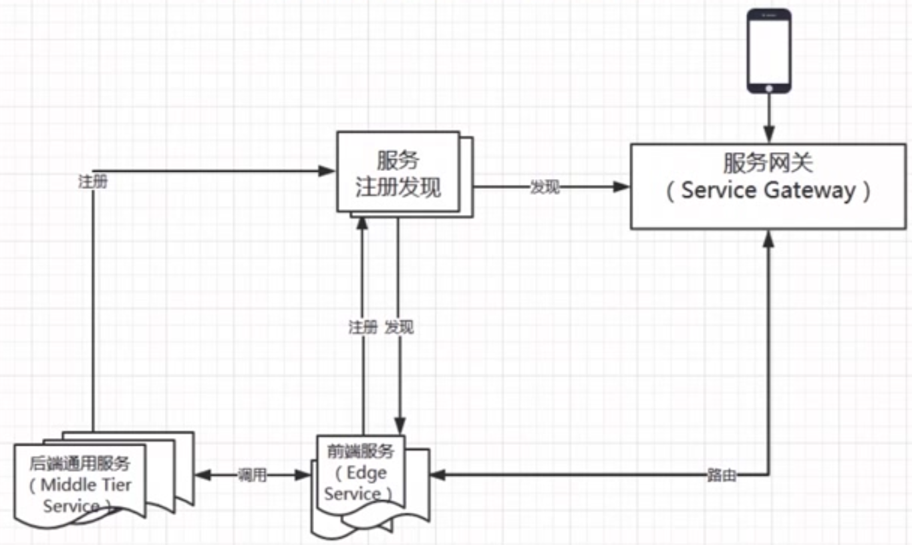

# images

## 定义

The microservice architectural style is an approach to developing a single application running as **a suite of small services**, each **running its own process** and communicating with lightweight mechanisms, often an HTTP resource API. These services are **built around business capabilities** and **independently deployable** by fully automated deployment machinery. There is **a bare minimum of centralized management of these services**, which may be written in different programming languages and use different data storage technologies.

-   一系列微小的服务共同组成
- 跑在自己的进程里
- 每个服务为独立的业务开发
- 独立部署
- 分布式的管理

## 背景

随着互联网的发展，网站应用的规模不断扩大，常规的垂直应用架构已无法应对，分布式服务架构以及流动计算架构势在必行，亟需一个治理系统确保架构有条不紊的演进。

### 单一应用架构

当网站流量很小时，只需一个应用，将所有功能都部署在一起，以减少部署节点和成本。此时，用于简化增删改查工作量的数据访问框架(ORM)是关键。

### 垂直应用架构

当访问量逐渐增大，单一应用增加机器带来的加速度越来越小，将应用拆成互不相干的几个应用，以提升效率。此时，用于加速前端页面开发的Web框架(MVC)是关键。

### 分布式服务架构

当垂直应用越来越多，应用之间交互不可避免，将核心业务抽取出来，作为独立的服务，逐渐形成稳定的服务中心，使前端应用能更快速的响应多变的市场需求。此时，用于提高业务复用及整合的分布式服务框架(RPC)是关键。

### 流动计算架构

当服务越来越多，容量的评估，小服务资源的浪费等问题逐渐显现，此时需增加一个调度中心基于访问压力实时管理集群容量，提高集群利用率。此时，用于提高机器利用率的资源调度和治理中心(SOA)是关键。

## 单体架构

### 优点

- 容易测试
- 容易部署

### 缺点

- 开发效率低
- 代码维护难
- 部署不灵活
- 稳定性不高
- 扩展性不够

## 分布式定义

旨在支持应用程序和服务的开发，可以利用物理架构，由多个自治的处理元素，不共享主内存，但通过网络发送消息合作。——Leslie Lamport

## 简单的微服务

### 微服务架构的基础框架/组件

- 服务注册发现
- 服务网关（Service Gateway）

- 后端通用服务（也称中间层服务 Middle Tire Service）
- 前端服务（也称边缘服务 Edge Service）
  - 聚合
    - 对多个API调用进行聚合，从而减少客户端的请求数
  - 裁剪
    - 对返回不同的设备的内容进行裁剪（PC、移动端）

## 两大阵营

### 阿里系

- Dubbo（服务化治理）
- Zookeeper（服务注册中心）
- Spring MVC or SpringBoot
- ...

### Spring Cloud

- Spring Cloud Netflix Eureka
- SpringBoot
- ...

## Spring Cloud 是什么

- Spring Cloud 是一个开发工具集，含了多个子项目
  - 利用Spring Boot的开发便利
  - 主要是基于对Netflix开源组件的进一步封装
- Spring Cloud 简化了分布式开发
- 掌握如何使用，更要理解分布式、架构的特点