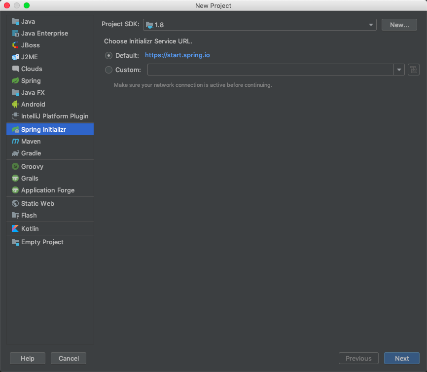
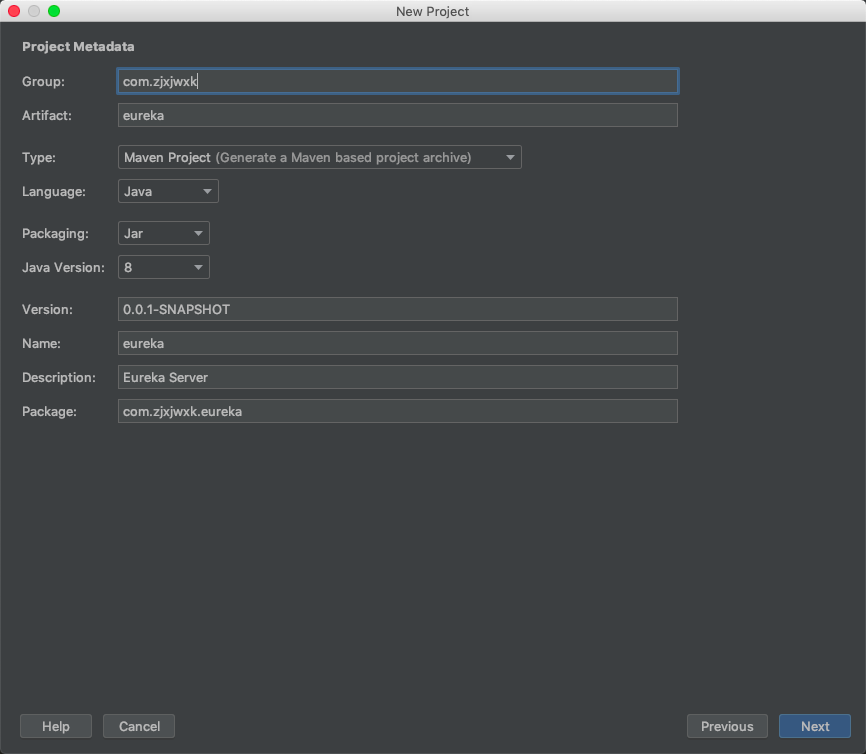
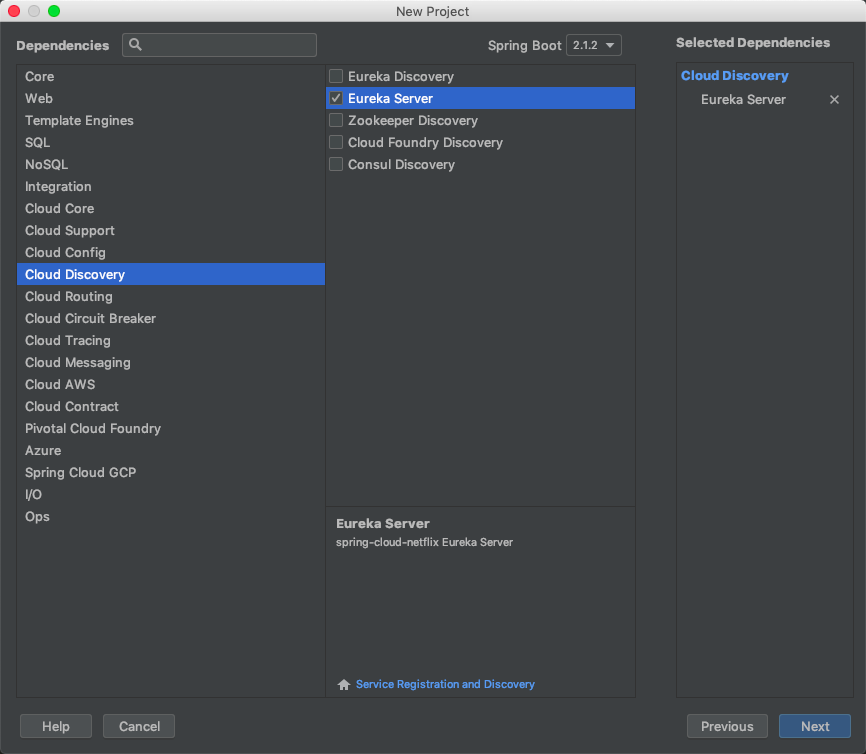
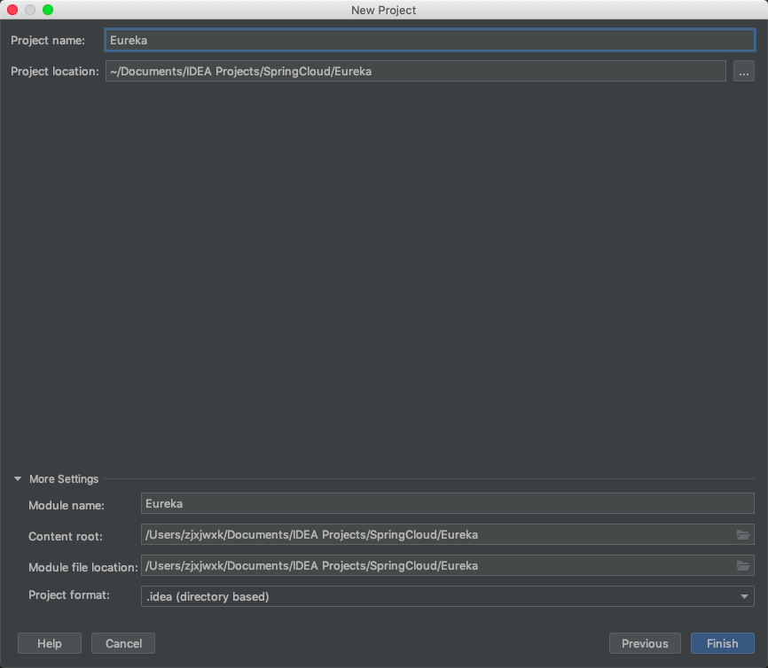
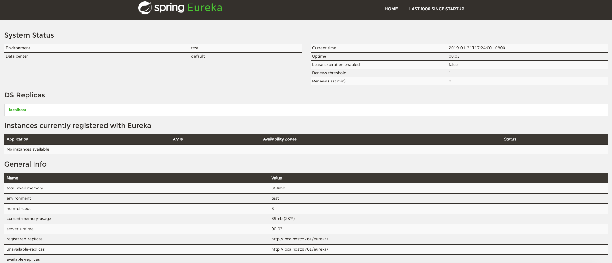

# Spring Cloud Eureka

- 基于 Netflix Eureka 做了二次封装
- 两个组件组成：
  - Eureka Server 注册中心
    - 作为具有服务注册功能的服务器，是服务注册中心，系统中的其他微服务使用 Eureka Client 连接到Eureka Server ，并维持心跳连接以监控各个微服务是否正常运行。
  - Eureka Client 服务注册
    - 用于简化与服务器的交互，作为轮询负载均衡器，并提供服务的故障切换支持。

# 启动 Eureka Server

## 1. 创建Spring项目



## 2. 填充项目信息



## 3. 选择项目类型为 Cloud Discovery 中的 Eureka Server



## 4. 完成创建



## 5. 添加注解 @EnableEurekaServer

```java
@SpringBootApplication
@EnableEurekaServer
public class EurekaApplication {

    public static void main(String[] args) {
        SpringApplication.run(EurekaApplication.class, args);
    }

}
```

## 6. 配置 application.yml

```yml
eureka:
  client:
    service-url:
      defaultZone: http://localhost:8761/eureka/
    register-with-eureka: false
spring:
  application:
    name: eureka
server:
  port: 8761
```

## 7. 启动 Eureka Server



这样，一个简单的Eureka Server就启动完成了。