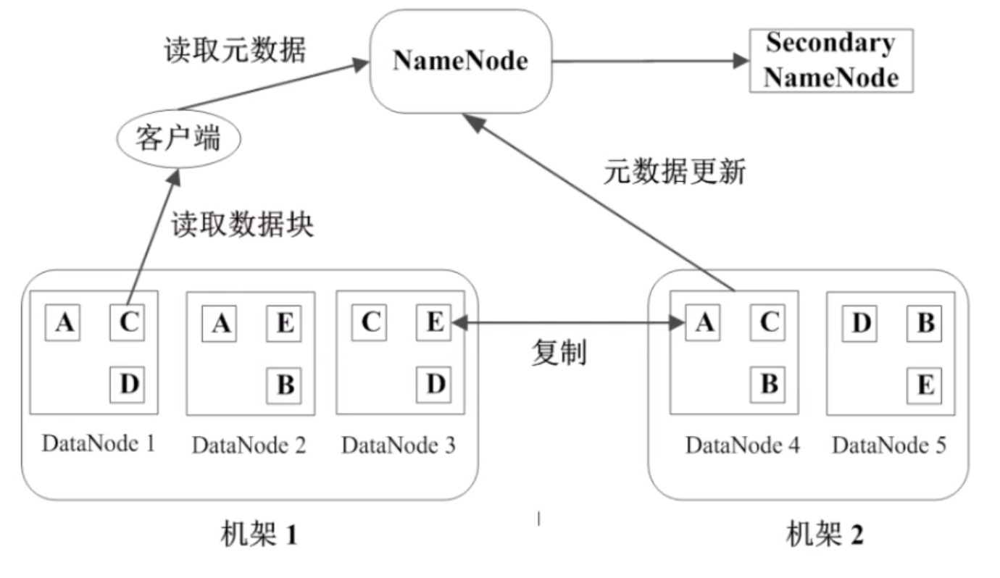
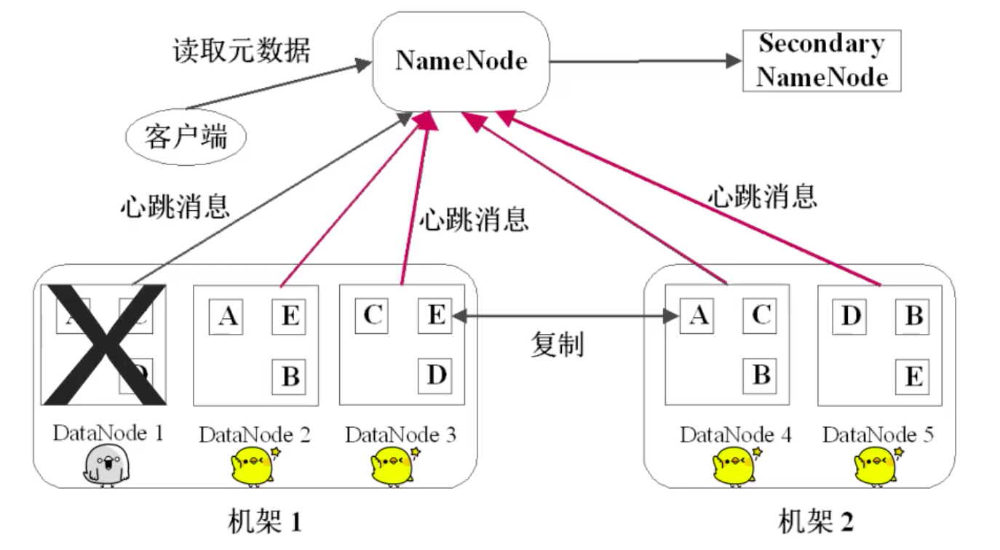
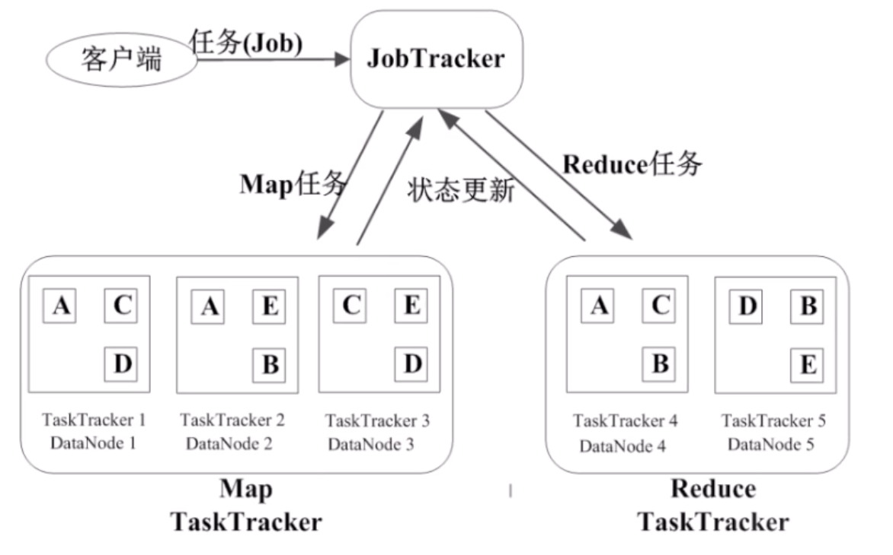
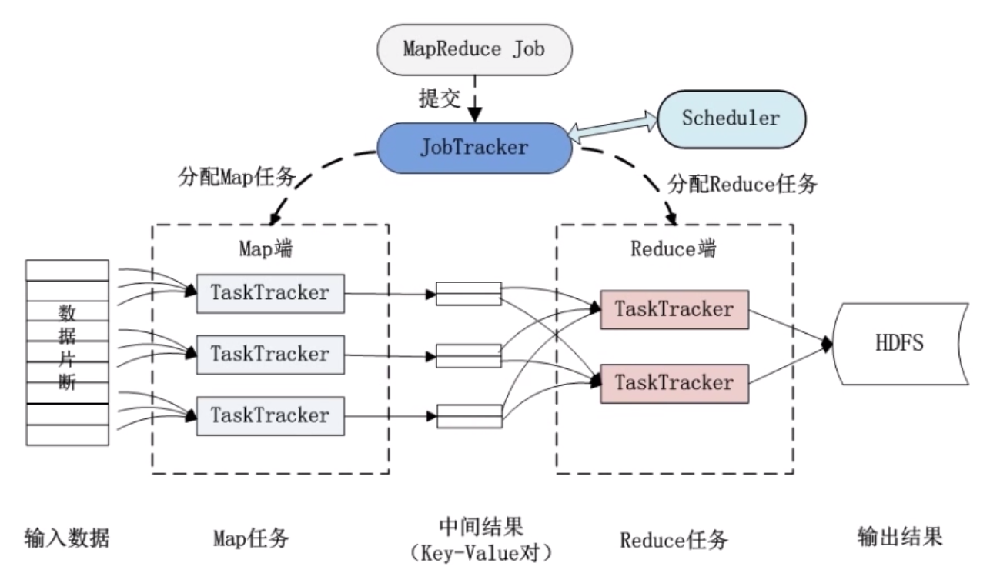
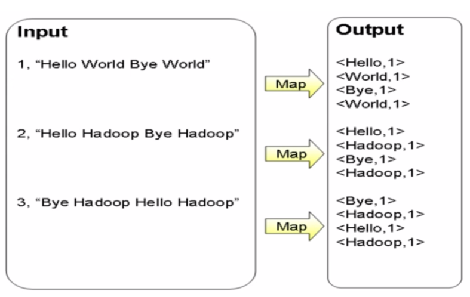
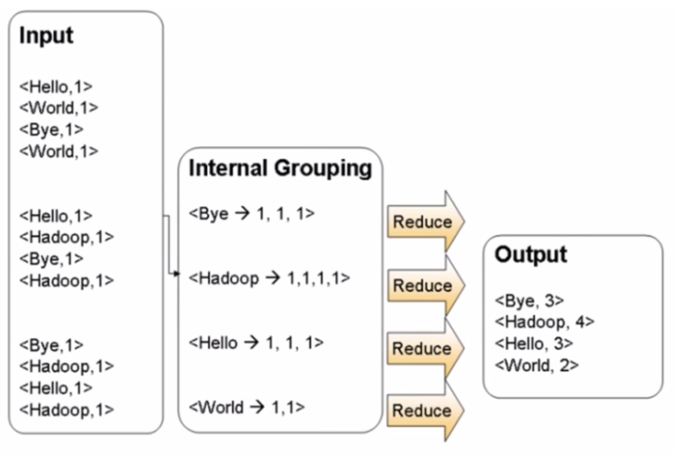

# 概要

1. 大数据技术的相关概念
2. Hadoop 的架构和运行机制
3. 实战：Hadoop 的安装和配置
4. 实战：Hadoop 的开发

# 目标

- 掌握大数据存储与处理技术的原理（理论知识）
- 掌握 Hadoop 的使用和开发能力（实践能力）
- 结合书本，如《Hadoop 权威指南》

# Hadoop 的前世今生

为了解决系统存在的瓶颈：存储容量、读写速率、计算效率... Google 提出了大数据技术：MapReduce、BigTable、GFS，这三样技术取得了革命性的变化：

1. 成本降低，能用 PC 机，就不用大型机和高端存储
2. 软件容错硬件故障视为常态，通过软件保证可靠性
3. 简化并行分布式计算，无须控制节点同步和数据交换

但是，Google 只发表了相关的技术论文，没有开放源代码。于是，一个模仿 Google 大数据技术的开源实现出现了：Hadoop。

# Hadoop 的功能和优势

Hadoop 是开源的分布式存储和分布式计算框架。

## Hadoop 的组成

包含两个核心组件：

1. HDFS：分布式文件系统，存储海量的数据
2. MapReduce：并行处理框架，实现任务分解和调度

Hadoop 可以用来搭建大型数据仓库，PB 级数据的存储、处理、分析、统计等业务。如：搜索引擎、日志分析、商业智能、数据挖掘。

## Hadoop 的优势

1. 高扩展
2. 低成本
3. 成熟的生态圈（Hive、HBase 等）

# Hadoop 生态系统及版本

## Hadoop 生态系统

- Hive：只需要编写 SQL 语句，Hive 就能够将其转化为一个 Hadoop 任务去执行，降低了使用 Hadoop 的门槛。

- HBase：和传统的关系型数据库不同，HBase 放弃事务特性，追求更高的扩展；和 HDFS 不同，HBase 提供数据的随机读写和实时访问，实现对表数据的读写功能。
- ZooKeeper：用于监控 Hadoop 集群的状态，管理一些配置，维护数据间节点的一致性等。

## Hadoop 版本

ver1.x较为稳定且容易上手，本人将选择 ver1.x。

# 安装 Hadoop

- 准备 Linux 环境
- 安装 JDK
- 配置 Hadoop

## 下载 Hadoop

```bash
wget https://archive.apache.org/dist/hadoop/core/hadoop-1.2.1/hadoop-1.2.1.tar.gz
```

并解压之。

## 配置 Hadoop

在 conf 目录下找到 hadoop-env.sh 脚本，编辑之，将 JAVA_HOME 的注释去掉并配置为 Java 目录：

```bash
export JAVA_HOME=/Library/Java/JavaVirtualMachines/jdk1.8.0_201.jdk/Contents/Home
```

配置 core.site.xml 添加如下配置：

```xml
<configuration>
	<!-- Hadoop 的临时工作目录 -->
	<property>
		<name>hadoop.tmp.dir</name>
		<value>/hadoop</value>
	</property>
	<!-- Hadoop 的元数据目录 -->
	<property>
		<name>dfs.name.dir</name>
		<value>/hadoop/name</value>
	</property>
	<!-- 文件系统 namenode 的访问地址 -->
	<property>
		<name>fs.default.name</name>
		<value>hdfs://localhost:9000</value>
	</property>
</configuration>
```

配置 hdfs-site.xml：

```xml
<configuration>
	<!-- dfs 文件块的存放目录，文件系统的数据目录 -->
	<property>
		<name>dfs.data.dir</name>
		<value>/hadoop/data</value>
	</property>
</configuration>
```

配置 mapred-site.xml

```xml
<configuration>
	<!-- MapReduce 的 job tracker 访问地址 -->
	<property>
		<name>mapred.job.tracker</name>
		<value>localhost:9001</value>
	</property>
</configuration>
```

配置 Hadoop 环境变量，编辑 /etc/profile，添加以下：

```bash
export HADOOP_HOME=/Library/hadoop-1.2.1
export PATH=$PATH:$HADOOP_HOME/bin
```

## 启动 Hadoop

对 NameNode 进行格式化操作：

```bash
hadoop namenode -format
```

启动 Hadoop，执行 bin/start-all.sh ，使用 jps 命令查看是否有以下进程，若有则表示 Hadoop 已正常运行：

```bash
10690 NameNode
10773 DataNode
10920 JobTracker
10859 SecondaryNameNode
11003 TaskTracker
11101 Jps
```

可以查看 Hadoop 下有哪些文件：

```bash
hadoop fs -ls /
```

# Hadoop 的核心——HDFS简介

## HDFS 设计架构

- 块（Block）
- NameNode
- DataNode

### 块（Block）

HDFS 的文件被分成块进行存储，块的默认大小为 64MB，块是文件存储处理的逻辑单元。

### 节点（Node）

HDFS 中有两类节点 NameNode 和 DataNode：

#### NameNode

NameNode 是管理节点，存放文件元数据：

1. 文件与数据块的映射表
2. 数据块与数据节点的映射表

#### DataNode

DateNode 是 HDFS 的工作节点，存放数据块：



## 数据管理策略

### 冗余数据块

每个数据块 3 个副本，分布在两个机架内的三个节点，存储冗余数据是为了预防数据丢失。


### 心跳检测

每隔一段时间，DataNode 就像 NameNode 发送自己的状态：



### 二级 NameNode

二级 NameNode 定期同步元数据映像文件和修改日志，NameNode 发生故障时，备胎转正，以保证 NameNode 的高可用性。


## HDFS 中文件的读写操作

### HDFS 读取文件的流程

1. 客户端（Java 程序或命令行）向 NameNode 发起文件读取请求，把文件名和路径告诉 NameNode
2. NameNode 查询元数据，并返回给客户端，客户端就知道了这个文件包含哪些块，以及这些块分别能在哪些 DataNode 里找到
3. 然后，客户端就能从这些 DataNode 找到这些块，并读取下载，再对它们进行组装


### HDFS 写入文件的流程

1. 客户端将需要写的文件拆分成块，并通知 NameNode
2. NameNode 会找到当前可用的磁盘空间中的 DataNodes，并返回给客户端
3. 根据返回的 DataNodes，客户端将这些块写入 DataNodes
4. 客户端在向 DataNode 写入一个块后，DataNode 就要通过管道进行流水线复制
5. 复制完之后，就对 NameNode 更新元数据


## HDFS 的特点

### 特点

- 数据冗余，硬件容错
- 流式的数据访问（写一次，读多次）
- 存储大文件

### 适用性和局限性

- 适合数据批量读写，吞度量高（但不适合交互式应用，低延迟很难满足）
- 适合一次写入多次读取，顺序读写（但不支持多用户并发写相同文件）

## HDFS 的使用

### 格式化 NameNode

先对 NameNode 进行格式化操作：

```bash
hadoop namenode -format
```

### 创建文件夹

在 HDFS 中创建一个文件夹 input：

```bash
hadoop fs -mkdir input
```

input 文件夹将会在 HDFS 中的 /user/root/ 下

```bash
MacBook-Pro-of-Wxk:~ root# hadoop fs -ls /user/root/input
Found 1 items
-rw-r--r--   3 root supergroup          0 2020-05-07 15:26 /user/root/input
```

### 上传文件

将本地 test.txt 文件上传到 HDFS 中刚刚创建的 input 中：

```bash
hadoop fs -put test.txt input/
```

这样就能在 /user/root/input/ 下找到该文件了

```bash
MacBook-Pro-of-Wxk:~ root# hadoop fs -ls /user/root/input
Found 1 items
-rw-r--r--   3 root supergroup         14 2020-05-07 16:00 /user/root/input/test.txt
```

#### 读取文件

输出 HDFS 中的文件：

```bash
MacBook-Pro-of-Wxk:~ root# hadoop fs -cat input/test.txt
Hello Hadoop!
```

#### 下载文件

从 HDFS 下载指定路径下的文件到本地：

```bash
hadoop fs -get input/test.txt test2.txt
```

即可在本地找到该文件：

```bash
MacBook-Pro-of-Wxk:~ root# cat test2.txt 
Hello Hadoop!
```

#### 查看 NameNode 信息

```bash
MacBook-Pro-of-Wxk:~ root# hadoop dfsadmin -report
Configured Capacity: 249531727872 (232.39 GB)
Present Capacity: 83015577640 (77.31 GB)
DFS Remaining: 83015569408 (77.31 GB)
DFS Used: 8232 (8.04 KB)
DFS Used%: 0%
Under replicated blocks: 2
Blocks with corrupt replicas: 0
Missing blocks: 0

-------------------------------------------------
Datanodes available: 1 (1 total, 0 dead)

Name: 127.0.0.1:50010
Decommission Status : Normal
Configured Capacity: 249531727872 (232.39 GB)
DFS Used: 8232 (8.04 KB)
Non DFS Used: 166516150232 (155.08 GB)
DFS Remaining: 83015569408(77.31 GB)
DFS Used%: 0%
DFS Remaining%: 33.27%
Last contact: Thu May 07 16:09:02 CST 2020
```

# Hadoop 的核心——MapReduce 原理与实现

## MapReduce 原理

分而治之，一个大任务分成多个小的子任务（map），并行执行后，合并结果（reduce）。

假如有 100 副扑克牌混在了一起，其中少了一张，怎么找出缺少的那一张？

- Map：随机分为 100 副扑克牌，各自统计该副牌总每张牌的出现次数。
- Reduce：通过交换每副牌各自统计的结果，再次统计总的每张牌出现次数。一个 Reduce 统计一张牌的总出现次数。

最后对每张牌的总出现次数进行排序，筛选出结果。


再如：100 GB 的网站访问日志文件，找出访问次数最多的 IP 地址；SELECT 表查询操作、JOIN 表连接操作，都可以通过 MapReduce 来实现。

## MapReduce 的运行流程

- Job & Task
- JobTracker
- TaskTracker

### Job & Task

一个 Job 拆分为多个 Task 来解决，Task 又分为 MapTask 和 ReduceTask。



### JobTracker

- 作业调度
- 分配任务、监控任务执行进度
- 监控 TaskTracker 的状态

### TaskTracker

- 执行任务
- 汇报任务状态



## MapReduce 的容错机制

### 重复执行

重复执行将会最多重复执行四次任务，若仍然失败则放弃执行。

### 推测执行

当 JobTracker 发现其中某个 TaskTracker 执行特别慢的时候，就会另开一个 TaskTracker 执行该任务，这两个 Task 谁先执行完，则终止另一个。


# 开发 Hadoop 应用程序

## WordCount 单词计数

WordCount 单次计数：计算文件中出现每个单词的频数，输出结果按照字母顺序进行排序。

### MapReduce 过程





### 源码

```java
package com.zjut;

import java.io.IOException;
import java.util.StringTokenizer;
import org.apache.hadoop.conf.Configuration;
import org.apache.hadoop.fs.Path;
import org.apache.hadoop.io.IntWritable;
import org.apache.hadoop.io.LongWritable;
import org.apache.hadoop.io.Text;
import org.apache.hadoop.mapreduce.Job;
import org.apache.hadoop.mapreduce.Mapper;
import org.apache.hadoop.mapreduce.Reducer;
import org.apache.hadoop.mapreduce.lib.input.FileInputFormat;
import org.apache.hadoop.mapreduce.lib.input.TextInputFormat;
import org.apache.hadoop.mapreduce.lib.output.FileOutputFormat;
import org.apache.hadoop.mapreduce.lib.output.TextOutputFormat;

/**
 * @author zjxjwxk
 */
public class WordCount {

    public static class WordCountMap extends
            Mapper<LongWritable, Text, Text, IntWritable> {

        private final IntWritable one = new IntWritable(1);
        private Text word = new Text();

        @Override
        public void map(LongWritable key, Text value, Context context)
                throws IOException, InterruptedException {
            String line = value.toString();
            StringTokenizer token = new StringTokenizer(line);
            while (token.hasMoreTokens()) {
                word.set(token.nextToken());
                context.write(word, one);
            }
        }
    }

    public static class WordCountReduce extends
            Reducer<Text, IntWritable, Text, IntWritable> {

        @Override
        public void reduce(Text key, Iterable<IntWritable> values,
                           Context context) throws IOException, InterruptedException {
            int sum = 0;
            for (IntWritable val : values) {
                sum += val.get();
            }
            context.write(key, new IntWritable(sum));
        }
    }

    public static void main(String[] args) throws Exception {

        Configuration conf = new Configuration();
        Job job = new Job(conf);
        job.setJarByClass(WordCount.class);
        job.setJobName("wordcount");
        job.setOutputKeyClass(Text.class);
        job.setOutputValueClass(IntWritable.class);
        job.setMapperClass(WordCountMap.class);
        job.setReducerClass(WordCountReduce.class);
        job.setInputFormatClass(TextInputFormat.class);
        job.setOutputFormatClass(TextOutputFormat.class);
        FileInputFormat.addInputPath(job, new Path(args[0]));
        FileOutputFormat.setOutputPath(job, new Path(args[1]));
        job.waitForCompletion(true);
    }
}

```

### 编译和打包

编译（添加 classpath 依赖包）：

```bash
javac -classpath /Library/hadoop-1.2.1/hadoop-core-1.2.1.jar:/Library/hadoop-1.2.1/lib/commons-cli-1.2.jar -d WordCountClass/ WordCount.java
```

打包所有 class 文件为 jar 包：

```
jar -cvf WordCount.jar *.class
```

### 准备文件

创建一个 input 文件夹，在里面添加两个文本文件：

Hello.txt

```txt
Hello World
Hello Hadoop
Hello HDFS
Hello Map
Hello Reduce
```

Hello2.txt

```txt
Hadoop World
Hadoop NameNode
Hadoop DataNode
Hadoop MapReduce
Hello BigData
```

### 上传文件

在 HDFS 中创建一个 input_wordcount 文件夹：

```bash
hadoop fs -mkdir input_wordcount
```

将两个文本文件上传到 HDFS：

```bash
hadoop fs -put input/* input_wordcount/
```

可以在 HDFS 中找到这两个文件：

```bash
MacBook-Pro-of-Wxk:Project root# hadoop fs -ls input_wordcount
Found 2 items
-rw-r--r--   3 root supergroup         59 2020-05-08 13:51 /user/root/input_wordcount/Hello.txt
-rw-r--r--   3 root supergroup         76 2020-05-08 13:51 /user/root/input_wordcount/Hello2.txt
```

### 执行 MapReduce

```bash
hadoop jar Hadoop/WordCount/WordCountClass/WordCount.jar WordCount input_wordcount output_wordcount
```

hadoop 中执行本地 jar 包，最后有两个参数 `input_wordcount`,  `output_wordcount`，分别为输入路径和输出路径。

执行过程和结果：

```bash
20/05/08 13:59:11 WARN mapred.JobClient: Use GenericOptionsParser for parsing the arguments. Applications should implement Tool for the same.
20/05/08 13:59:11 INFO input.FileInputFormat: Total input paths to process : 2
20/05/08 13:59:11 WARN util.NativeCodeLoader: Unable to load native-hadoop library for your platform... using builtin-java classes where applicable
20/05/08 13:59:11 WARN snappy.LoadSnappy: Snappy native library not loaded
20/05/08 13:59:11 INFO mapred.JobClient: Running job: job_202005081303_0001
20/05/08 13:59:12 INFO mapred.JobClient:  map 0% reduce 0%
20/05/08 13:59:15 INFO mapred.JobClient:  map 100% reduce 0%
20/05/08 13:59:22 INFO mapred.JobClient:  map 100% reduce 33%
20/05/08 13:59:23 INFO mapred.JobClient:  map 100% reduce 100%
20/05/08 13:59:24 INFO mapred.JobClient: Job complete: job_202005081303_0001
20/05/08 13:59:24 INFO mapred.JobClient: Counters: 26
20/05/08 13:59:24 INFO mapred.JobClient:   Map-Reduce Framework
20/05/08 13:59:24 INFO mapred.JobClient:     Spilled Records=40
20/05/08 13:59:24 INFO mapred.JobClient:     Map output materialized bytes=267
20/05/08 13:59:24 INFO mapred.JobClient:     Reduce input records=20
20/05/08 13:59:24 INFO mapred.JobClient:     Map input records=10
20/05/08 13:59:24 INFO mapred.JobClient:     SPLIT_RAW_BYTES=245
20/05/08 13:59:24 INFO mapred.JobClient:     Map output bytes=215
20/05/08 13:59:24 INFO mapred.JobClient:     Reduce shuffle bytes=267
20/05/08 13:59:24 INFO mapred.JobClient:     Reduce input groups=10
20/05/08 13:59:24 INFO mapred.JobClient:     Combine output records=0
20/05/08 13:59:24 INFO mapred.JobClient:     Reduce output records=10
20/05/08 13:59:24 INFO mapred.JobClient:     Map output records=20
20/05/08 13:59:24 INFO mapred.JobClient:     Combine input records=0
20/05/08 13:59:24 INFO mapred.JobClient:     Total committed heap usage (bytes)=578813952
20/05/08 13:59:24 INFO mapred.JobClient:   File Input Format Counters 
20/05/08 13:59:24 INFO mapred.JobClient:     Bytes Read=135
20/05/08 13:59:24 INFO mapred.JobClient:   FileSystemCounters
20/05/08 13:59:24 INFO mapred.JobClient:     HDFS_BYTES_READ=380
20/05/08 13:59:24 INFO mapred.JobClient:     FILE_BYTES_WRITTEN=156788
20/05/08 13:59:24 INFO mapred.JobClient:     FILE_BYTES_READ=261
20/05/08 13:59:24 INFO mapred.JobClient:     HDFS_BYTES_WRITTEN=91
20/05/08 13:59:24 INFO mapred.JobClient:   Job Counters 
20/05/08 13:59:24 INFO mapred.JobClient:     Launched map tasks=2
20/05/08 13:59:24 INFO mapred.JobClient:     Launched reduce tasks=1
20/05/08 13:59:24 INFO mapred.JobClient:     SLOTS_MILLIS_REDUCES=8065
20/05/08 13:59:24 INFO mapred.JobClient:     Total time spent by all reduces waiting after reserving slots (ms)=0
20/05/08 13:59:24 INFO mapred.JobClient:     SLOTS_MILLIS_MAPS=4142
20/05/08 13:59:24 INFO mapred.JobClient:     Total time spent by all maps waiting after reserving slots (ms)=0
20/05/08 13:59:24 INFO mapred.JobClient:     Data-local map tasks=2
20/05/08 13:59:24 INFO mapred.JobClient:   File Output Format Counters 
20/05/08 13:59:24 INFO mapred.JobClient:     Bytes Written=91
```

### 查看执行结果

```bash
MacBook-Pro-of-Wxk:Project root# hadoop fs -ls output_wordcount
Found 3 items
-rw-r--r--   3 root supergroup          0 2020-05-08 13:59 /user/root/output_wordcount/_SUCCESS
drwxr-xr-x   - root supergroup          0 2020-05-08 13:59 /user/root/output_wordcount/_logs
-rw-r--r--   3 root supergroup         91 2020-05-08 13:59 /user/root/output_wordcount/part-r-00000
```

其中，part-r-00000 就包含执行的结果，即统计了两个文件中，每个单词的总个数，并且按照字典顺序排序：

```bash
MacBook-Pro-of-Wxk:Project root# hadoop fs -cat output_wordcount/part-r-00000
BigData	1
DataNode	1
HDFS	1
Hadoop	5
Hello	6
Map	1
MapReduce	1
NameNode	1
Reduce	1
World	2
```

## 利用 MapReduce 进行排序

将多个文件中的数字排序。

### MapReduce 过程

- Map：将数据分片后，将数字按照区间进行标记。
- Reduce：将每个分区的数字分别进行排序，最后合并。


### 源码

```java
import java.io.IOException;

import java.util.StringTokenizer;

import org.apache.hadoop.conf.Configuration;

import org.apache.hadoop.fs.Path;

import org.apache.hadoop.io.IntWritable;

import org.apache.hadoop.io.Text;

import org.apache.hadoop.mapreduce.Job;

import org.apache.hadoop.mapreduce.Mapper;

import org.apache.hadoop.mapreduce.Reducer;

import org.apache.hadoop.mapreduce.Partitioner;

import org.apache.hadoop.mapreduce.lib.input.FileInputFormat;

import org.apache.hadoop.mapreduce.lib.output.FileOutputFormat;

import org.apache.hadoop.util.GenericOptionsParser;

public class Sort {

	public static class Map extends
			Mapper<Object, Text, IntWritable, IntWritable> {

		private static IntWritable data = new IntWritable();

		public void map(Object key, Text value, Context context)
				throws IOException, InterruptedException {
			String line = value.toString();

			data.set(Integer.parseInt(line));

			context.write(data, new IntWritable(1));

		}

	}

	public static class Reduce extends
			Reducer<IntWritable, IntWritable, IntWritable, IntWritable> {

		private static IntWritable linenum = new IntWritable(1);

		public void reduce(IntWritable key, Iterable<IntWritable> values,
				Context context) throws IOException, InterruptedException {

			for (IntWritable val : values) {

				context.write(linenum, key);

				linenum = new IntWritable(linenum.get() + 1);
			}

		}
	}

	public static class Partition extends Partitioner<IntWritable, IntWritable> {

		@Override
		public int getPartition(IntWritable key, IntWritable value,
				int numPartitions) {
			int MaxNumber = 65223;
			int bound = MaxNumber / numPartitions + 1;
			int keynumber = key.get();
			for (int i = 0; i < numPartitions; i++) {
				if (keynumber < bound * i && keynumber >= bound * (i - 1))
					return i - 1;
			}
			return 0;
		}
	}

	/**
	 * @param args
	 */

	public static void main(String[] args) throws Exception {
		// TODO Auto-generated method stub
		Configuration conf = new Configuration();
		String[] otherArgs = new GenericOptionsParser(conf, args)
				.getRemainingArgs();
		if (otherArgs.length != 2) {
			System.err.println("Usage Sort <int> <out>");
			System.exit(2);
		}
		Job job = new Job(conf, "Sort");
		job.setJarByClass(Sort.class);
		job.setMapperClass(Map.class);
		job.setPartitionerClass(Partition.class);
		job.setReducerClass(Reduce.class);
		job.setOutputKeyClass(IntWritable.class);
		job.setOutputValueClass(IntWritable.class);
		FileInputFormat.addInputPath(job, new Path(otherArgs[0]));
		FileOutputFormat.setOutputPath(job, new Path(otherArgs[1]));
		System.exit(job.waitForCompletion(true) ? 0 : 1);
	}

}
```

### 编译和打包

编译：

```bash
javac -classpath /Library/hadoop-1.2.1/hadoop-core-1.2.1.jar:/Library/hadoop-1.2.1/lib/commons-cli-1.2.jar -d SortClass/ Sort.java
```

打包：

```bash
jar -cvf Sort.jar *.class
```

### 准备文件

Numbers.txt

```txt
199
3
609
456
789
119
```

Numbers2.txt

```
478
971
988
125
9
3
1
```

### 上传文件

在 HDFS 中创建 input_sort 文件夹：

```bash
hadoop fs -mkdir input_sort
```

将两个文本文件上传到 HDFS：

```
hadoop fs -put Sort/* input_sort/
```

### 执行 MapReduce

```
hadoop jar Hadoop/WordCount/WordCountClass/WordCount.jar WordCount input_wordcount output_wordcount
```

执行过程和结果：

```bash
MacBook-Pro-of-Wxk:Project root# hadoop jar Hadoop/Sort/SortClass/Sort.jar Sort input_sort output_sort
20/05/08 14:58:36 INFO input.FileInputFormat: Total input paths to process : 2
20/05/08 14:58:36 WARN util.NativeCodeLoader: Unable to load native-hadoop library for your platform... using builtin-java classes where applicable
20/05/08 14:58:36 WARN snappy.LoadSnappy: Snappy native library not loaded
20/05/08 14:58:36 INFO mapred.JobClient: Running job: job_202005081303_0002
20/05/08 14:58:37 INFO mapred.JobClient:  map 0% reduce 0%
20/05/08 14:58:40 INFO mapred.JobClient:  map 100% reduce 0%
20/05/08 14:58:48 INFO mapred.JobClient:  map 100% reduce 100%
20/05/08 14:58:48 INFO mapred.JobClient: Job complete: job_202005081303_0002
20/05/08 14:58:48 INFO mapred.JobClient: Counters: 26
20/05/08 14:58:48 INFO mapred.JobClient:   Map-Reduce Framework
20/05/08 14:58:48 INFO mapred.JobClient:     Spilled Records=26
20/05/08 14:58:48 INFO mapred.JobClient:     Map output materialized bytes=142
20/05/08 14:58:48 INFO mapred.JobClient:     Reduce input records=13
20/05/08 14:58:48 INFO mapred.JobClient:     Map input records=13
20/05/08 14:58:48 INFO mapred.JobClient:     SPLIT_RAW_BYTES=239
20/05/08 14:58:48 INFO mapred.JobClient:     Map output bytes=104
20/05/08 14:58:48 INFO mapred.JobClient:     Reduce shuffle bytes=142
20/05/08 14:58:48 INFO mapred.JobClient:     Reduce input groups=12
20/05/08 14:58:48 INFO mapred.JobClient:     Combine output records=0
20/05/08 14:58:48 INFO mapred.JobClient:     Reduce output records=13
20/05/08 14:58:48 INFO mapred.JobClient:     Map output records=13
20/05/08 14:58:48 INFO mapred.JobClient:     Combine input records=0
20/05/08 14:58:48 INFO mapred.JobClient:     Total committed heap usage (bytes)=578813952
20/05/08 14:58:48 INFO mapred.JobClient:   File Input Format Counters 
20/05/08 14:58:48 INFO mapred.JobClient:     Bytes Read=44
20/05/08 14:58:48 INFO mapred.JobClient:   FileSystemCounters
20/05/08 14:58:48 INFO mapred.JobClient:     HDFS_BYTES_READ=283
20/05/08 14:58:48 INFO mapred.JobClient:     FILE_BYTES_WRITTEN=156172
20/05/08 14:58:48 INFO mapred.JobClient:     FILE_BYTES_READ=136
20/05/08 14:58:48 INFO mapred.JobClient:     HDFS_BYTES_WRITTEN=74
20/05/08 14:58:48 INFO mapred.JobClient:   Job Counters 
20/05/08 14:58:48 INFO mapred.JobClient:     Launched map tasks=2
20/05/08 14:58:48 INFO mapred.JobClient:     Launched reduce tasks=1
20/05/08 14:58:48 INFO mapred.JobClient:     SLOTS_MILLIS_REDUCES=7980
20/05/08 14:58:48 INFO mapred.JobClient:     Total time spent by all reduces waiting after reserving slots (ms)=0
20/05/08 14:58:48 INFO mapred.JobClient:     SLOTS_MILLIS_MAPS=3902
20/05/08 14:58:48 INFO mapred.JobClient:     Total time spent by all maps waiting after reserving slots (ms)=0
20/05/08 14:58:48 INFO mapred.JobClient:     Data-local map tasks=2
20/05/08 14:58:48 INFO mapred.JobClient:   File Output Format Counters 
20/05/08 14:58:48 INFO mapred.JobClient:     Bytes Written=74
```

### 查看执行结果

```bash
MacBook-Pro-of-Wxk:Project root# hadoop fs -ls output_sort
Found 3 items
-rw-r--r--   3 root supergroup          0 2020-05-08 14:58 /user/root/output_sort/_SUCCESS
drwxr-xr-x   - root supergroup          0 2020-05-08 14:58 /user/root/output_sort/_logs
-rw-r--r--   3 root supergroup         74 2020-05-08 14:58 /user/root/output_sort/part-r-00000
```

其中，part-r-00000 就包含执行的结果，即两个文件中所有数字从小到大排序后的排名和数字。

```
MacBook-Pro-of-Wxk:Project root# hadoop fs -cat output_sort/part-r-00000
1	1
2	3
3	3
4	9
5	119
6	125
7	199
8	456
9	478
10	609
11	789
12	971
13	988
```

