# 概要

- 概述
- 深入探索 MapReduce 过程
- Hadoop 的分布式缓存
- Hadoop 应用——推荐算法

# HDFS

HDFS 是 Hadoop 分布式文件系统的简称，由若干台计算机组成，用于存放 PB、TB 数量级以上的文件，每份文件可以有多个副本，所以 HDFS 是一个具有高冗余、高容错的文件系统。

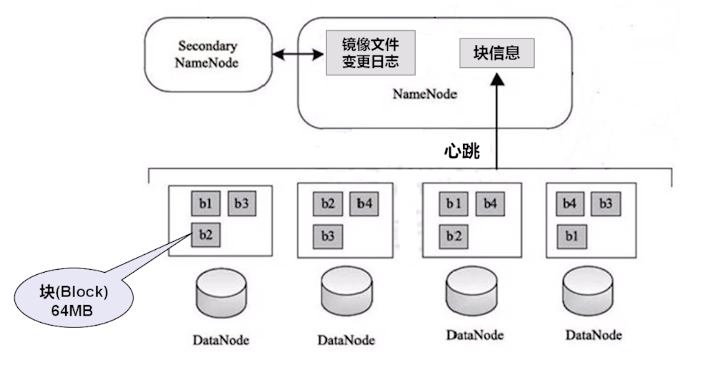

# Hadoop

## Hadoop 1.x

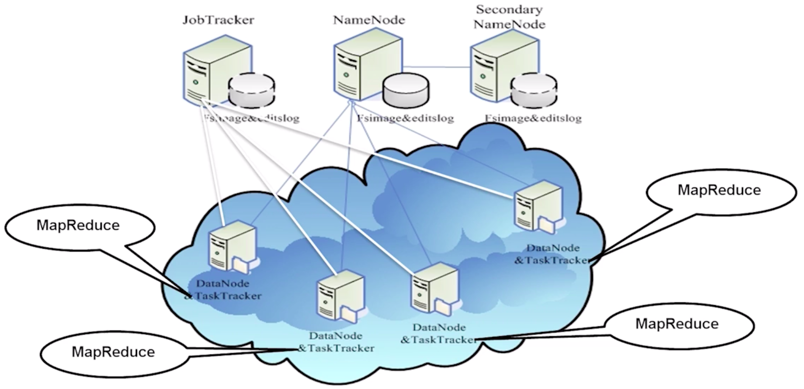

## Hadoop 2.x

Hadoop 1.0 到 2.0 的变化：Hadoop 2.0 以后的版本移除了原有的 JobTracker 和 TaskTracker，改由 Yarn 平台的 ResourceManager 负责集群中所有资源的统一管理和分配，NodeManager 管理 Hadoop 集群中单个计算节点。

YARN 的设计减小了 JobTracker 的资源消耗，减少了 Hadoop 1.0 中发生单点故障的风险。我们还可以在 YARN 平台上运行 Spark 和 Storm 作业，充分利用资源。

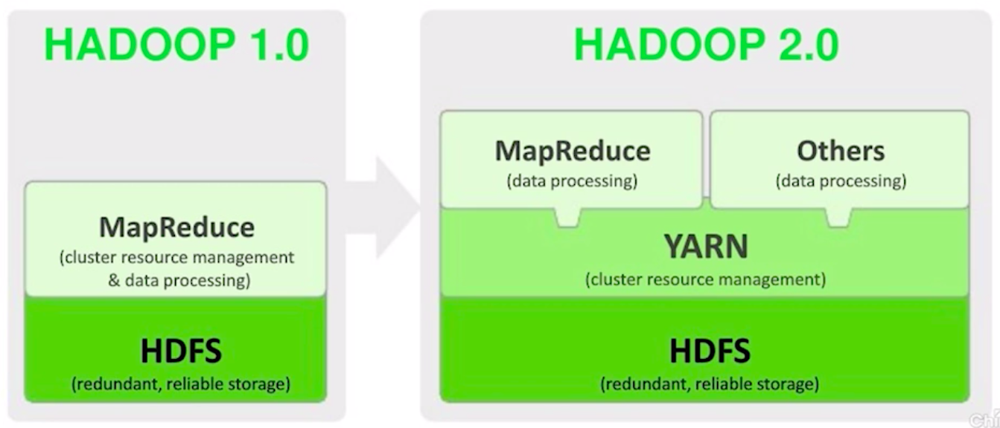

# 深入探索 MapReduce

## WordCount 实例回顾

MapReduce 作业是一种大规模数据集的并行计算的编程模型。我们可以将 HDFS 中存放的海量数据，通过 MapReduce 作业进行计算，得到目标数据。

### 四个阶段

- Split 阶段
- Map 阶段（需要编码）
- Shuffle 阶段
- Reduce 阶段（需要编码）

#### Split 阶段

Split 分片（设置文件输入类型为 CombineFileInputFormat ，将文件合并后再分片）：

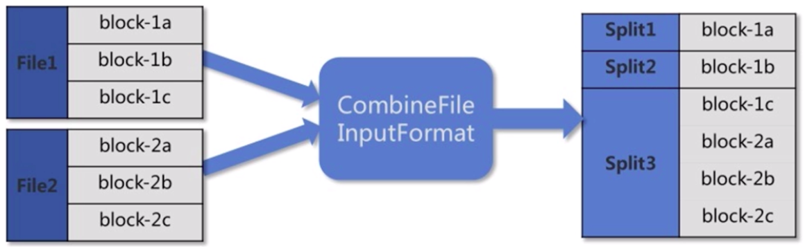

分片结果，分别作为 Map 阶段的输入。

#### Map 阶段（需要编码）

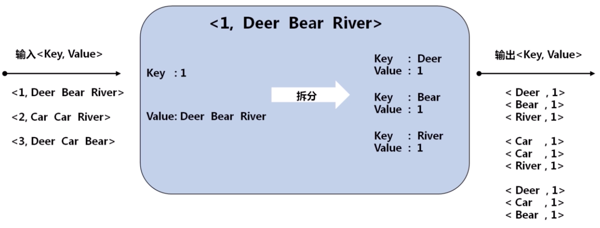

#### Shuffle 阶段

Shuffle 阶段过程比较复杂，可以理解为 Map 输出到 Reduce 输入的过程，而且涉及到网络传输。

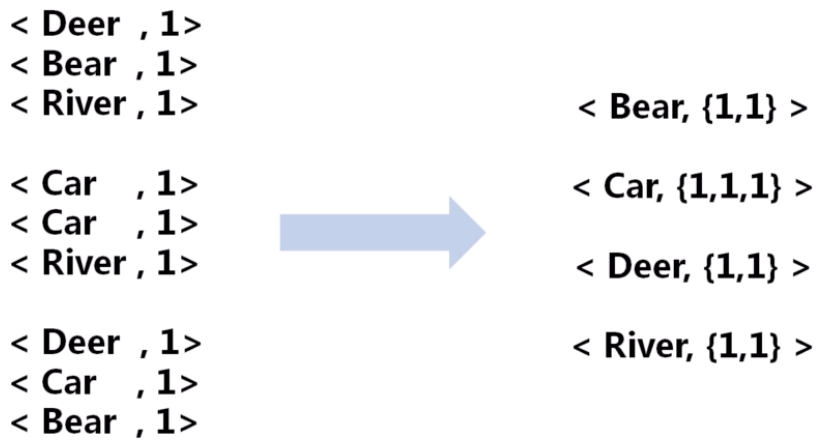

#### Reduce 阶段（需要编码）

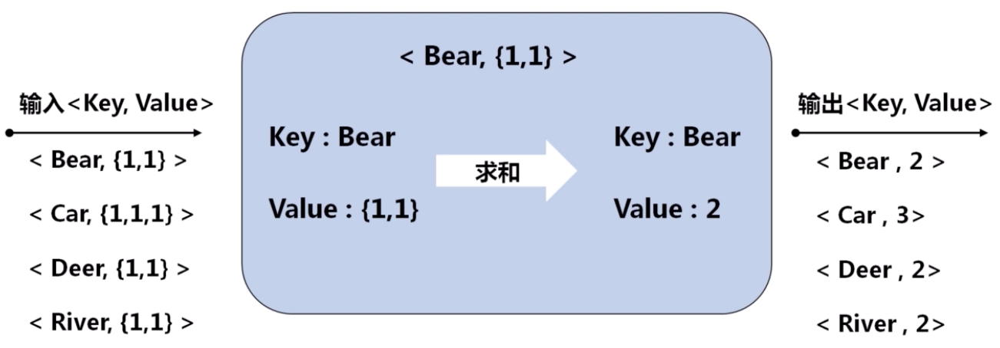

#### 总过程

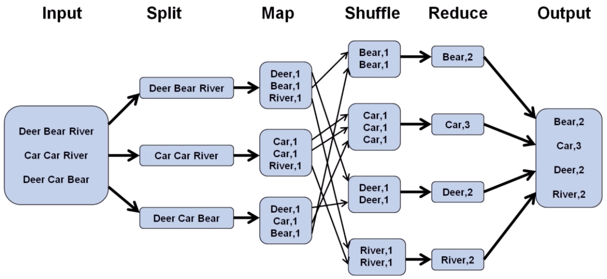

## 从分片输入到 Map

### 输入文件

文件保存在 DataNode 的 block 块中：

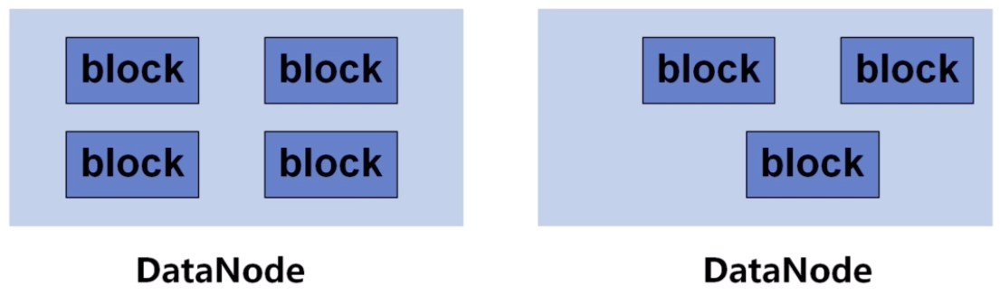

- Hadoop 1.x 默认的 block 大小：64MB
- Hadoop 2.x 默认的 block 大小：128MB

可以在 hdfs-site.xml 中设置参数：dfs.block.size

### 分片输入（Split）

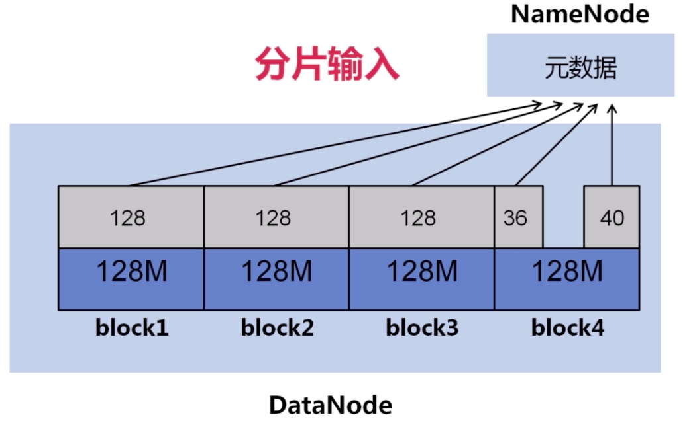

理想的输入文件：由于 NameNode 内存有限，大量的小文件会给 HDFS 带来性能上的问题。故 HDFS 适合存放大文件，对于大量小文件，可以采用压缩、合并小文件的优化策略。例如，设置文件输入类型为 CombineFileInputFormat 格式。

### 节点 Map 任务的个数

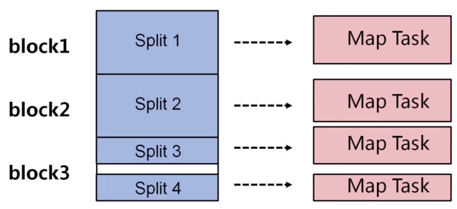

在实际情况下，Map 任务的个数是受到多个条件的制约，一般一个 DataNode 的 Map 任务数量控制在 10 到 100 比较合适。

控制 Map 任务数量的方法：

- 增加 Map 个数，可增大 mapred.map.tasks
- 减少 Map 个数，可增大 mapred.min.split.size
- 如果要减少 Map 个数，但有很多小文件，可将小文件合并成大文件，再使用准则 2

