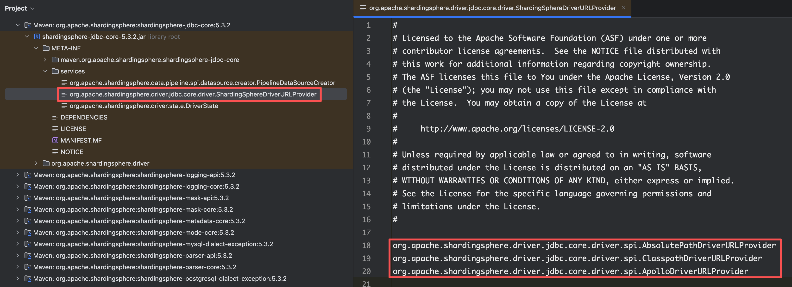
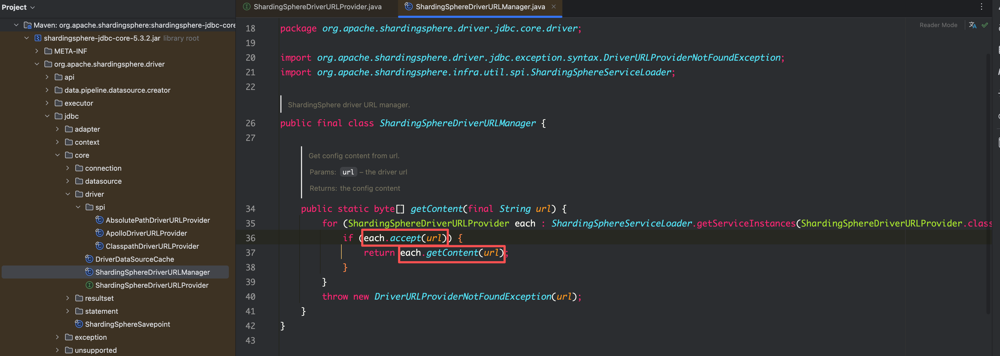

## ShardingJDBC 的配置源路径 SPI 机制

由于最新版本 ShardingJDBC 不再支持基于 Nacos 作为配置数据源的功能，可以从 ShardingSphere JDBC 的依赖包中观察到，其数据源配置的获取接口 `org.apache.shardingsphere.driver.jdbc.core.driver.ShardingSphereDriverURLProvider` 采用了 SPI 机制，但其默认仅实现了以下几种配置获取方式： AbsolutePathDriverURLProvider（绝对路径）、ClasspathDriverURLProvider （Class Path 路径） 和 ApolloDriverURLProvider （Apollo 路径）。



因此需要自行基于 ShardingJDBC 的 SPI 机制对 ShardingJDBC 进行二次开发，以实现从 Nacos 获取数据源配置文件。

## ShardingJDBC 配置获取的源码分析

根据该接口的包路径  `org.apache.shardingsphere.driver.jdbc.core.driver` ，可以找到其接口及其实现类，该接口包含两个方法：

-   boolean accept(String url)：校验当前 url 是否应该使用当前类获取配置
-   byte[] getContent(String url)：从该 url 获取配置文件，并返回字节数组


如果将配置文件 `db-sharding.yaml` 放在 `src/main/resources` 目录下，并使用 classpath 作为配置文件的路径（如 `spring.datasource.url=jdbc:shardingsphere:classpath:db-sharding.yaml`），并在 `ClasspathDriverURLProvider` 类的 accept 方法中打断点并启动服务，可以发现在上层使用了 `ShardingSphereDriverURLManager` 类来对每个实现类进行遍历，分别调用 accept 校验当前 url 是否适用于当前类，若适用则调用其 getContent 方法从该 url 获取相应的配置文件。



因此，很容易想到可以基于该 SPI 机制实现自己的 `ShardingSphereDriverURLProvider` 实现类，分别实现 accept 方法用于校验当前 url 是否是 Nacos 格式的配置文件路径，并实现 getContent 方法利用该 url 从 Nacos 获取相应配置文件。

## 基于 SPI 机制实现 ShardingJDBC 的 Nacos 数据源配置

### 引入 Maven 依赖

此处需要先引入以下依赖，以实现 ShardingJDBC 的相关接口，并利用 Nacos 提供的 Client API 获取配置文件。

```xml
<dependency>
  <groupId>org.apache.shardingsphere</groupId>
  <artifactId>shardingsphere-jdbc-core</artifactId>
  <version>5.3.2</version>
</dependency>
<dependency>
  <groupId>com.alibaba.nacos</groupId>
  <artifactId>nacos-client</artifactId>
</dependency>
```

### 实现 Nacos 配置文件获取类

创建  `NacosDriverURLProvider` 类实现 ShardingJDBC 提供的 `ShardingSphereDriverURLProvider` SPI 接口：

```java
package com.zjxjwxk.live.framework.datasource.starter.config;

import com.alibaba.nacos.api.NacosFactory;
import com.alibaba.nacos.api.PropertyKeyConst;
import com.alibaba.nacos.api.config.ConfigService;
import com.alibaba.nacos.api.exception.NacosException;
import groovy.util.logging.Slf4j;
import org.apache.commons.lang3.StringUtils;
import org.apache.shardingsphere.driver.jdbc.core.driver.ShardingSphereDriverURLProvider;
import org.slf4j.Logger;
import org.slf4j.LoggerFactory;

import java.util.Properties;

/**
 * Sharding JDBC Nacos URL Provider
 *
 * @author Xinkang Wu
 * @date 2026/1/19 22:50
 */
@Slf4j
public class NacosDriverURLProvider implements ShardingSphereDriverURLProvider {

    private static final String NACOS_TYPE = "nacos:";
    private static final String GROUP = "DEFAULT_GROUP";
    private static final Logger log = LoggerFactory.getLogger(NacosDriverURLProvider.class);

    @Override
    public boolean accept(String url) {
        return StringUtils.isNotBlank(url) && url.contains(NACOS_TYPE);
    }

    @Override
    public byte[] getContent(String url) {
        // url: jdbc:shardingsphere:nacos:live.zjxjwxk.com:8848:live-user-shardingjdbc.yaml?username=nacos&&password=nacos
        if (StringUtils.isBlank(url)) {
            return null;
        }
        // nacosUrl: live.zjxjwxk.com:8848:live-user-shardingjdbc.yaml?username=nacos&&password=nacos
        String nacosUrl = url.substring(url.lastIndexOf(NACOS_TYPE) + NACOS_TYPE.length());

        // nacosUrlStr: {"live.zjxjwxk.com", "8848", "live-user-shardingjdbc.yaml?username=nacos&&password=nacos"}
        String[] nacosUrlStr = nacosUrl.split(":");
        // nacosFileUrl: live-user-shardingjdbc.yaml?username=nacos&&password=nacos
        String nacosFileUrl = nacosUrlStr[2];

        // dataId: live-user-shardingjdbc.yaml
        String dataId = getDataId(nacosFileUrl);

        // username=>nacos, password=>nacos
        Properties properties = getProperties(nacosFileUrl);

        // serverAddr=>live.zjxjwxk.com:8848
        properties.setProperty(PropertyKeyConst.SERVER_ADDR, nacosUrlStr[0] + ":" + nacosUrlStr[1]);

        try {
            ConfigService configService = NacosFactory.createConfigService(properties);
            String content = configService.getConfig(dataId, GROUP, 6000);
            log.info("Sharding JDBC Configuration File from Nacos:\n{}", content);
            return content.getBytes();
        } catch (NacosException e) {
            throw new RuntimeException(e);
        }
    }

    /**
     * 获取 Data ID
     *
     * @param nacosFile live-user-shardingjdbc.yaml?username=nacos&&password=nacos
     * @return live-user-shardingjdbc.yaml
     */
    private String getDataId(String nacosFile) {
        // nacosProperties: {"live-user-shardingjdbc.yaml", "username=nacos&&password=nacos"}
        String[] nacosProperties = nacosFile.split("\\?");
        // dataId: live-user-shardingjdbc.yaml
        return nacosProperties[0];
    }

    /**
     * 获取 Properties
     *
     * @param nacosFileUrl live-user-shardingjdbc.yaml?username=nacos&&password=nacos
     * @return username=>nacos, password=>nacos
     */
    private Properties getProperties(String nacosFileUrl) {
        Properties properties = new Properties();

        // nacosProperties: {"live-user-shardingjdbc.yaml", "username=nacos&&password=nacos"}
        String[] nacosProperties = nacosFileUrl.split("\\?");
        // propertyPairs: {"username=nacos", "password=nacos"}
        String[] propertyPairs = nacosProperties[1].split("&&");

        for (String propertyPair : propertyPairs) {
            // propertyItem: {"username", "nacos"}
            String[] propertyItem = propertyPair.split("=");
            String key = propertyItem[0];
            String value = propertyItem[1];
            properties.put(key, value);
        }
        return properties;
    }
}
```

此处配置的相应 url 路径为 `jdbc:shardingsphere:nacos:live.zjxjwxk.com:8848:live-user-shardingjdbc.yaml?username=nacos&&password=nacos`，因此以下方法分别用于实现：

-   boolean accept(String url)：校验当前 url 是否包含 "nacos:"
-   byte[] getContent(String url)：从该 url 获取 Nacos 配置文件，其中需要分别从 url 中提取以下字段用于从 Nacos 获取配置文件：
    -   dataId（即 Nacos 上该配置文件的 Data ID）
    -   group：默认为 "DEFAULT_GROUP"
    -   Properties 中需要包含的字段（相关字段常量可以从 `com.alibaba.nacos.api.PropertyKeyConst` 获取）：
        -   username：Nacos 用户名
        -   password：Nacos 密码
        -   serverAddr：Nacos 服务地址

对应 Nacos 配置中心上传的配置文件：


### 创建 SPI 配置文件

遵循 SPI 机制，在 `/META-INF/services/` 路径下，创建 SPI 接口同名文件 `org.apache.shardingsphere.driver.jdbc.core.driver.ShardingSphereDriverURLProvider` （全限定类名），并在其文件中写入我们刚刚实现的 Nacos 配置文件获取类 `NacosDriverURLProvider` 的全限定类名：

```
com.zjxjwxk.live.framework.datasource.starter.config.NacosDriverURLProvider
```


### 修改 datasource url 为 Nacos 地址

最后，在 `application.yml` 文件中，将 `spring.datasource.url` 修改为 Nacos 配置文件路径即可：

```yaml
spring:
  datasource:
    driver-class-name: org.apache.shardingsphere.driver.ShardingSphereDriver
#    url: jdbc:shardingsphere:classpath:db-sharding.yaml
    url: jdbc:shardingsphere:nacos:live.zjxjwxk.com:8848:live-user-shardingjdbc.yaml?username=nacos&&password=nacos
```