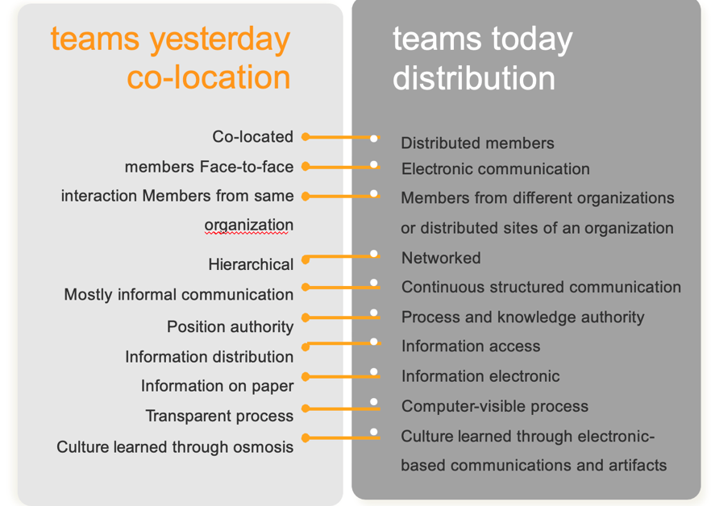
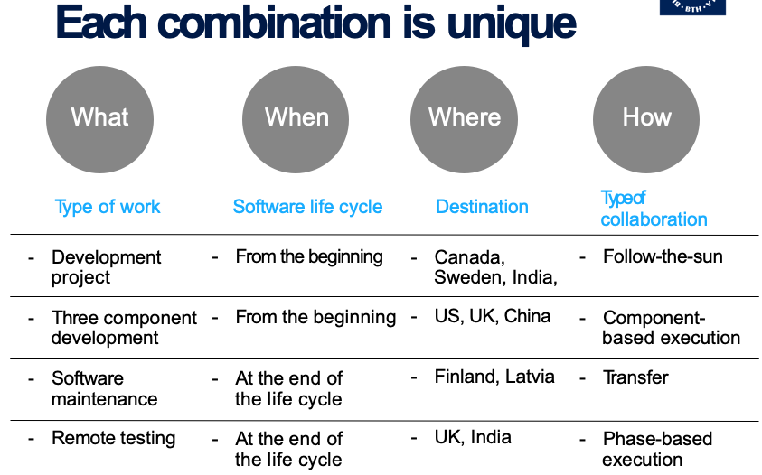
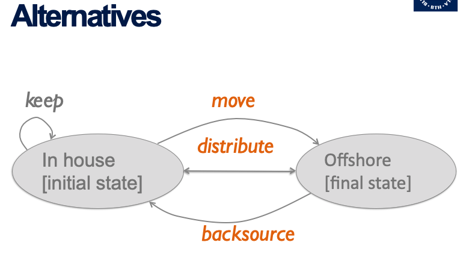
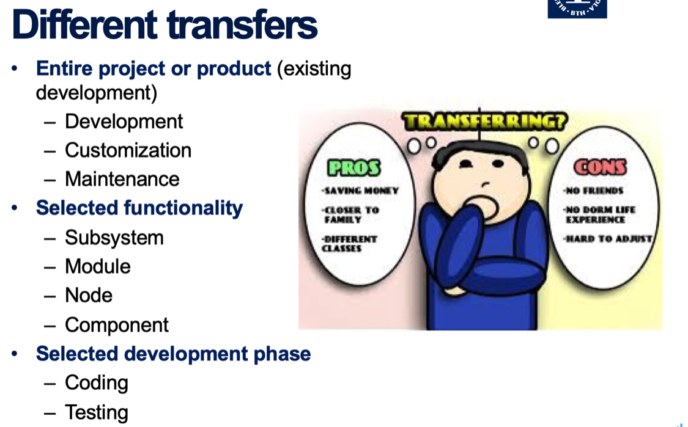
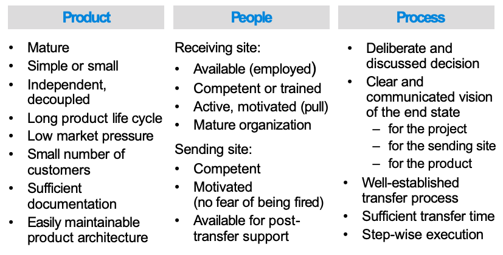
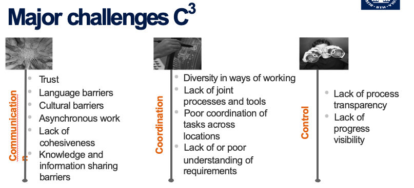
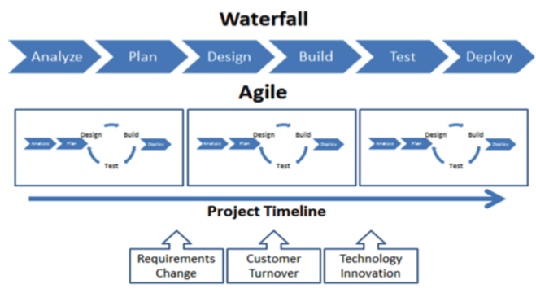
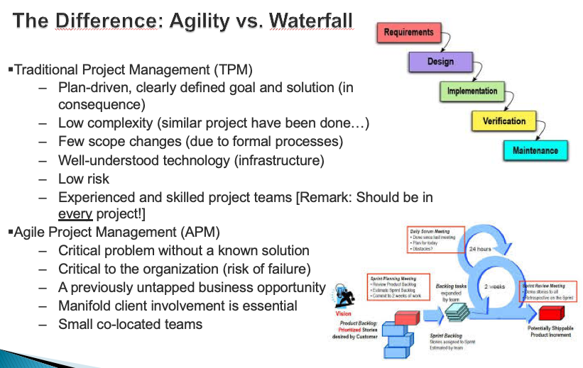
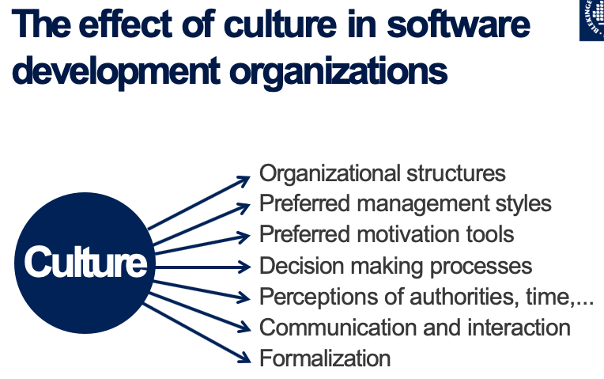
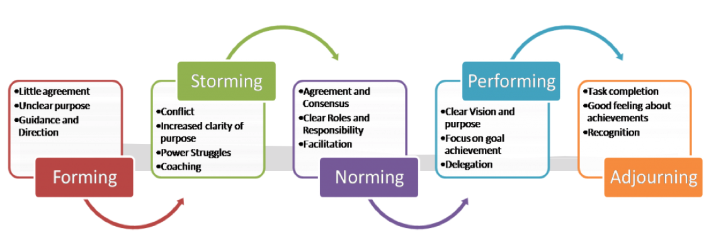

# What is GSE?

GSE is a complex phenomenon that unites many different collaboration models and project organization models.

# Reason for GSE?

- Reduce overheads, free up resources
- Improve efficiency
- Offload non-core functions
- Get access to specialized skills
- Get access to a specific market

# Differences between co-located team and global team

 

# According to What, When, Where to determine whether the supplier is suitable

 

# Alternative

  

# Different transfers

  

# Different transfers can result in

- Full relocation of a product to the receiving site
- Relocation of a component / task / phase which overall is developed jointly

# (18P) There are several ways or models to transfer GSE project globally. Please tell at least three models that you would apply in your GSE project, and give your comments about their advantages and disadvantages in applying them respectively.

## Customization model

**advantages**: customization can satisfy customers according to their special requirements

**disadvantages**: customization will use more resource, such as, human resources, time and money.

## Follow-the-sun model

**advantages**: It works for defect resolution and support

**disadvantages**: Not good for development

## Modularized model

**advantage**: This reduce the need for inter-site coordination and communication; good for decoupled and clear tasks.

**disadvantage**: Increase the cost of whole project.

# Critical factors that alleviate transfers

 

# Describe 6 reasons for applying Global Software Engineering(GSE) and 3 reasons for not good to do GSE.

## Good:

1. Reduce development costs
2. Leveraging time zone effectiveness
3. Access to large skilled labor pool
4. Closer proximity to market and customer
5. Innovation and shared best practice
6. Improved resource allocation

## Not good:

1. Loss of knowledge within the product
2. Temporary productivity decrease
3. Temporal decrease in quality

# Causes of failure of global projects

Many specific problems, but mainly because managers are unaware of these problems and fail to properly coordinate work in a distributed environment

 

# (16P) The course discussed quite lot about 3C in GSE, since they are important factors for successful project in GES The 3C are (6P) (1) C_____________ (2) C_________________ (3) C__________________ Please tell the main contents or activities that involved in each C (10P)

## Communication

- Cohesiveness, teamness, mutual trust
- Common background, language and culture

## Coordination

- Joint processes and tools
- Plan-driven standardized approach

## Control

- Process transparency and visibility
- Managers directly supervise team performance

# What is a project?

## A project is a temporary endeavour undertaken to create a unique product or service. 

- Temporary means that every project has a definite beginning and a definite end.
- Unique means that the product or service is different in some distinguishing way from all similar products or services.

# (15P) Both development models of agile method and waterfall method can be applied in GSE project. Briefly describe the two methods (just some basic idea or steps without details) and why you would choose which method in your project development.

The **waterfall model** is a sequential (non-iterative) design process, used in software development processes, in which progress is flowing steadily downwards (like a waterfall). Steps can be described in following picture:

 

**Agile method** is a group of software development methods in which requirements and solutions evolve through collaboration between self-organizing, cross-functional teams. It promotes adaptive planning, evolutionary development, early delivery, continuous improvement, and encourages rapid and flexible response to change. Steps can be described in following picture: 

## Advantage of Agile

- Focus on the question of how to address key problems in software development: too long, too costly, poor quality
- Have the potential to improve communication and, as a result, reduce coordination and control overhead
- Small co-located teams, so it is easily for coordination.
- Scrum Agile method is a simple and effective way to have control over your development process, make sure things go according to plan

# The Difference: Agility vs. Waterfall

 

# (20P) Culture does matter in GSE, then what is culture (can be examples) (5P)? What are building blocks (elements) for a culture (5P)? And describe Hofstede’s 5 dimensions of culture (10P).

## What is culture?

Culture is a set of shared experiences, understandings, and meanings among members of a group, an organization, a community, or a nation.

Culture provides members with images of:
  - the basic concerns, principles, ethics
  - bodies of manners
  - Rituals(礼仪）, ideologies
  - strategies, tactics of self-survival
  - notions of good acts and bad
  - various forms of folklore and legends

## What are building blocks (elements) for a culture?

**values**, including preferences people use to make work related and communication related decisions in projects.

**practices**, including cultural norms for adopting specific project management styles and organization structures.

## Hofstede’s 5 dimensions of culture?

- **Power distance** - how a society handles inequalities; A higher degree of the Index indicates that hierarchy is clearly established and executed in society, without doubt or reason. A lower degree of the Index signifies that people question authority and attempt to distribute power.
- **Individualism/collectivism** - behavior towards the group; individualism has loose ties that often only relates an individual. Collectivism emphasizes on building skills and has tightly-integrated relations into group.
- **Masculinity/femininity** - behavior according to gender; besides distinction of gender, masculinity is defined as a preference in society for achievement, heroism, assertiveness and material rewards for success. Femininity represents a preference for cooperation, modesty, caring for the weak and quality of life.
- **Uncertainty avoidance** - the need for structure; a high degree in this index strictly follows laws, guidelines, behaviors and etc. a low degree in this index shows more acceptance of differing thoughts or ideas.
- **Long term orientation(LTO)** - value of long-standing traditions; a high degree in this index indicates the factors of family, elders, strong work ethic and high value. A low degree in this index emphasizes creativity, individualism, equality and selfactualization.

# The effect of culture in software development organizations

 

# (5P) You are a project leader for GSE project, and you know it is important to build up to the team work. What would you do to build up your team to trust each other? Provide at least 5 ways or kinds of activities to this team building.

- kick-off meetings
- regular traveling
- team-building activities
- cultural training
- regular video-conferences

# Phase in forming a team

 

**Forming:** the team gets together and gets to know each other. It clarifies roles, figures out the tasks and objectives

**Storming:** conflicts break out over roles, objectives, and task allocations. Different leaders, official or otherwise, are pursuing different goals

**Norming:** the team begins to form norms, roles, and protocols for working together. Some team cohesion may begin.

**Performing:** the team begins to perform well, working together toward a common goal. Conflicts are handled constructively