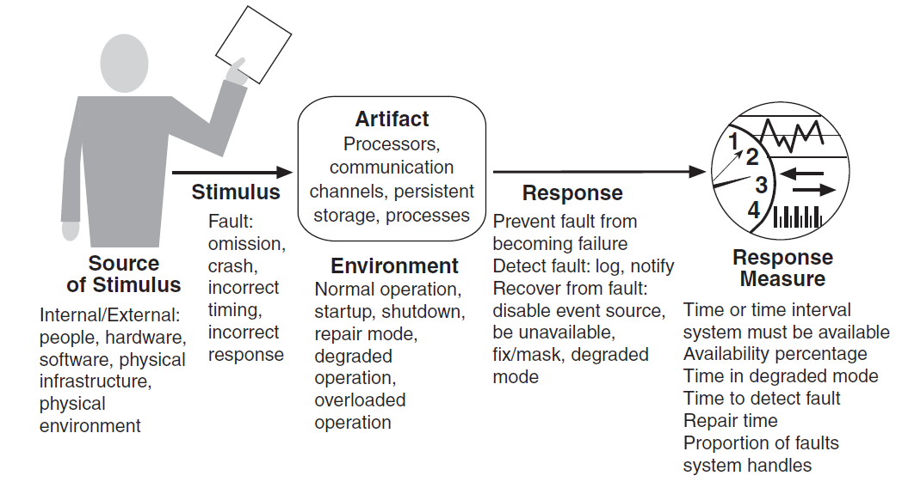
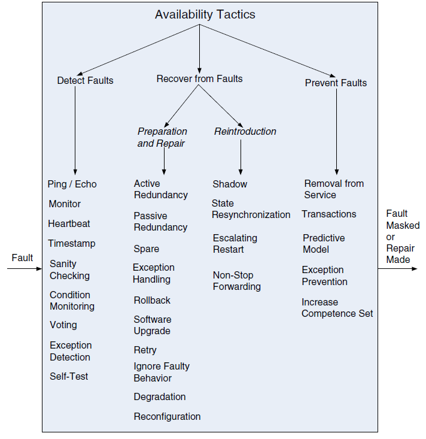
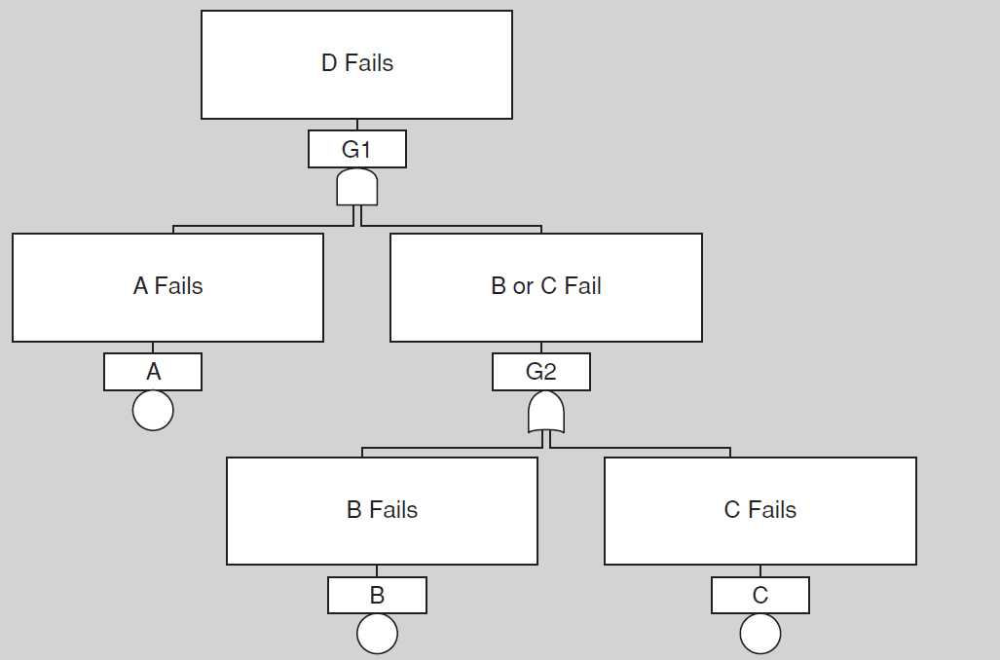
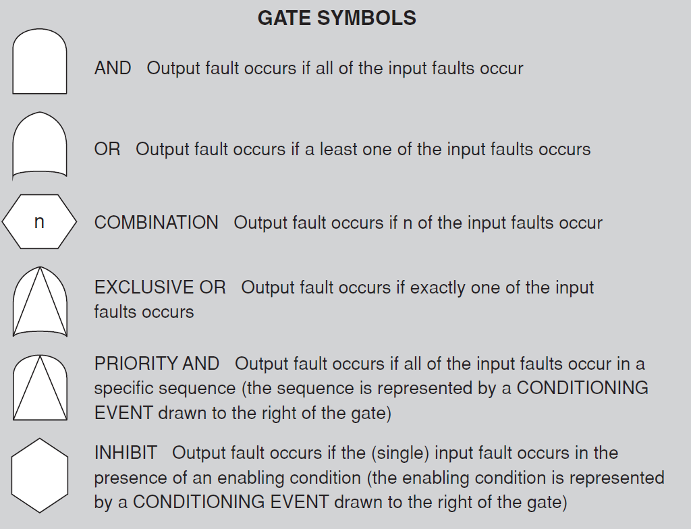
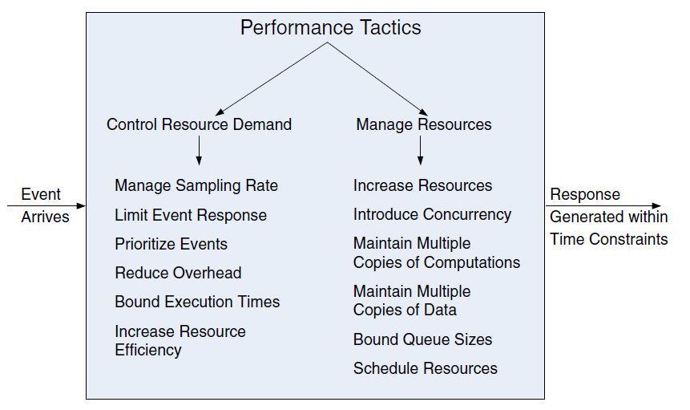

# CH 1. What is software architecture?

## What is software architecture

The software architecture of a system is the set of structures needed to reason about the system, which comprise software elements, relations among them, and properties of both.

1. To find out what users of the system think about the system. ×
2. To assist in marketing activities. ×
3. To make estimate for projects planning purposes. √
4. To use as input for dividing up the work into tasks. √
5. To analyze and predict characteristics of the implemented system. √
6. To present the future development of the product. ×

## Categories of structures

- First, some structures partition systems into implementation units called **modules**.
- Other structures are dynamic, meaning that they focus on the way the elements interact with each other at runtime to carry out the system’s functions. we will call runtime structures **component-and-connector (C&C) structures**.
- A third kind of structure describes the mapping from software structures to the system’s organizational, developmental, installation, and execution environments. These mappings are called **allocation structures**.

## Three Kinds of Structures
### **Module structures** 
embody decisions as to how the system is to be structured as a set of code or data units that have to be constructed or procured. 
- **Decomposition structure**. The units are modules that are related to each other by the is-a-submodule-of relation, showing how modules are decomposed into smaller modules recursively until the modules are small enough to be easily understood.
- **Uses structure**. The units are related by the uses relation, a specialized form of dependency.
- **Layer structure**. The modules in this structure are called layers. A layer is an abstract “virtual machine” that provides a cohesive set of services through a managed interface.

### **Component-and-connector** 
structures embody decisions as to how the system is to be structured as a set of elements that have runtime behavior (components) and interactions (connectors). 
- **Service structure**. The units here are services that interoperate with each other by service coordination mechanisms.
- **Concurrency structure**. This component-and-connector structure allows the architect to determine opportunities for parallelism and the locations where resource contention may occur.

### **Allocation structures** 
embody decisions as to how the system will relate to nonsoftware structures in its environment (such as CPUs, file systems, networks, development teams, etc.).
-  **Deployment structure**. The deployment structure shows how software is assigned to hardware processing and communication elements.
- **Implementation structure**. This structure shows how software elements (usually modules) are mapped to the file structure(s) in the system’s development, integration, or configuration control environments.
- **Work assignment structure**. This structure assigns responsibility for implementing and integrating the modules to the teams who will carry it out.

# CH 4. Understanding Quality Attributes

## System requirements can be categorized as

**Functional requirements**. These requirements state what the system must do, and how it must behave or react to run-time stimuli. 

**Quality attribute requirements**. These requirements annotate (qualify) functional requirements. Qualification might be how fast the function must be performed, how resilient it must be to erroneous input, how easy the function is to learn, etc.

**Constraints**. A constraint is a design decision with zero degrees of freedom. That is, it's a design decision that has already been made for you.

## Quality Attribute Requirements six parts

1. **Source of stimulus**. This is some entity (a human, a computer system, or any other actuator) that generated the stimulus.
2. **Stimulus**. The stimulus is a condition that requires a response when it arrives at a system.
3. **Environment**. The stimulus occurs under certain conditions. The system may be in an overload condition or in normal operation, or some other relevant state. For many systems, “normal” operation can refer to one of a number of modes. For these kinds of systems, the environment should specify in which mode the system is executing.
4. **Artifact**. Some artifact is stimulated. This may be a collection of systems, the whole system, or some piece or pieces of it.
5. **Response**. The response is the activity undertaken as the result of the arrival of the stimulus.
6. **Response measure**. When the response occurs, it should be measurable in some fashion so that the requirement can be tested.

## Guiding Quality Design Decisions

- Architecture design is a systematic approach to making design decisions.
### We categorize the design decisions that an architect needs to make as follows:
  - Allocation of responsibilities
  - **Coordination model**
  - **Data model**
  - Management of resources
  - Mapping among architectural elements
  - **Binding time decisions**
  - Choice of technology
## **Coordination model**
### Software works by having elements interact with each other through designed mechanisms. These mechanisms are collectively referred to as a coordination model. Decisions about the coordination  model include these:
- Identifying the elements of the system that must coordinate, or are prohibited from coordinating.
- Determining the **properties of the coordination**, such as **timeliness, currency, completeness, correctness, and consistency**.
- Choosing the **communication mechanisms** (between systems, between our system and external entities, between elements of our system) that realize those properties. Important properties of the communication mechanisms include **stateful versus stateless**, **synchronous versus asynchronous**, **guaranteed versus nonguaranteed delivery**, and performance-related properties such as **throughput and latency**.
### Example:
- Both asynchronous communication and synchronous  communication can be used in the same system
- Asynchronous communication does not block the program thread until a response is ready 
- Asynchronous communication guarantees when a response is returned
## **Data model**
### Every system must represent artifacts of system-wide interest—data—in some internal fashion. The collection of those representations and how to interpret them is referred to as the data model. Decisions about the data model include the following:
- Choosing the major **data abstractions**, their operations, and their properties. This includes determining how the data items are created, initialized, accessed, persisted, manipulated, translated, and destroyed.
1. **Compiling metadata** needed for consistent interpretation of the data.
2. **Organizing the data**. This includes determining whether the data is going to be kept in a relational database, a collection of objects, or both. If both, then the mapping between the two different locations of the data must be determined.
### Example:
- Choosing the major data abstractions, their operations, and their  properties.
- Compiling metadata needed for consistent interpretation of the data.
- Organizing the data.
## **Binding time decisions**
- Binding time decisions introduce allowable ranges of variation. This variation can be bound at different times in the software life cycle by different entities— from design time by a developer to runtime by an end user. A binding time decision establishes the scope, the point in the life cycle, and the mechanism for achieving the variation.
The decisions in the other six categories have an associated binding time decision. Examples of such binding time decisions include the following:
- For allocation of responsibilities, you can have **build-time selection of modules** via a parameterized makefile.
- For choice of coordination model, you can design **runtime negotiation of protocols**.
- For resource management, you can design a system to **accept new peripheral devices plugged in at runtime**, after which the system recognizes them and **downloads and installs the right drivers automatically**.
- For choice of technology, you can build an app store for a smartphone that **automatically downloads the version of the app** appropriate for the phone of the customer buying the app.
### Example:
- Setting the hostname of the server in a configuration file
- Using the user input to set the destination of a message
- Using inheritance in the code to execute the different subclass implementations depending on program state

## Quality attributes

1. **Availability**
2. Interoperability
3. **Modifiability**
4. **Performance**
5. **Security**
6. **Testability**
7. Usability

## Development time qualities

- Modifiability
- Testability

# CH5. Availability

## Terms

### **Fault**
- A failure’s cause is called a **fault**. A fault can be either internal or  external to the system under consideration. Intermediate states between the occurrence of a fault and the occurrence of a failure are called **errors**. 

### **Failure**

- A **failure** is the deviation of the system from its specification, where the deviation is externally visible.

### **Fault and failure**
#### **Fault**
- Internal or external deviation of correct function
#### **Failure**
- When the system cannot provide its intended service
- Caused by faults that could not be handled/repaired
### **Resilient**
- Faults can be prevented, tolerated, removed, or forecast. In this way a system becomes “**resilient**” to faults.

### **Degraded operation mode**
- we are often concerned with the level of capability that remains when a failure has occurred—a degraded operating mode.
### **MTBF**
  - mean time between failures
### **MTTR**
  - mean time to repair
### **Formula**
$$
MTBF\over(MTBF+MTTR)
$$

## **Service Level Agreement, SLA**
- The availability provided by a computer system or hosting service is frequently expressed as a **service-level agreement**. This SLA specifies the availability level that is guaranteed and, usually, the penalties that the computer system or hosting service will suffer if the SLA is violated.

## Tactic

### Detect Faults
#### **Heart-beat**
- Heartbeat is a fault detection mechanism that employs a periodic message exchange between a system monitor and a process being monitored.
#### **Ping/Echo**
- Ping/echo refers to an asynchronous request/response message pair exchanged between nodes, used to determine reachability and the round-trip delay through the associated network path.
#### **Heart-beat tactic** vs. **Ping/Echo- tactic**
- The big difference between heartbeat and ping/echo is who holds the responsibility for initiating the health check—the monitor or the component itself.
### Recover from Faults
#### **Active Redundancy**
- Active redundancy (hot spare). This refers to a configuration where all of the nodes (active or redundant spare) in a protection group receive and process identical inputs in parallel, allowing the redundant spare(s) to maintain synchronous state with the active node(s).
#### **Passive Redundancy**
- Passive redundancy (warm spare). This refers to a configuration where only the active members of the protection group process input traffic; one of their duties is to provide the redundant spare(s) with periodic state updates.
#### **Spare**
- Spare (cold spare). Cold sparing refers to a configuration where the redundant spares of a protection group remain out of service until a fail-over occurs, at which point a power-on-reset procedure is initiated on the redundant spare prior to its being placed in service.
#### **Rollback**
- Rollback. This tactic permits the system to revert to a previous known good state, referred to as the “rollback line”—rolling back time—upon the detection of a failure.

## Fault tree

Fault tree analysis is an analytical technique that specifies a state of the system that negatively impacts safety or reliability, and then analyzes the system’s context and operation to find all the ways that the undesired state could occur.

# CH7. Modifiability

## What is Modifiability？

- Modifiability is about change and our interest in it is in the cost and risk of making change
- To plan for modifiability, an architect has to consider **four questions**:
1. **What can change?** 
A change can occur to any aspect of a system: the **functions** that the system computes, the **platform** (the hardware, operating system, middleware), the **environment** in which the system operates (the systems with which it must interoperate, the **protocols** it uses to communicate with the rest of the world), the **qualities** the system exhibits (its performance, its reliability, and even its future modifications), and its **capacity** (number of users supported, number of simultaneous operations).
2. **What is the likelihood of the change?** 
One cannot plan a system for all potential changes—the system would never be done, or if it was done it would be far too expensive and would likely suffer quality attribute problems in other dimensions. Although anything might change, **the architect has to make the tough decisions about which changes are likely, and hence which changes are to be supported, and which are not.**
3. **When is the change made and who makes it?** 
Most commonly in the past, a change was made to source code. Changes can be made to the **implementation** (by modifying the source code), during **compile** (using compile-time switches), during **build** (by choice of libraries), during **configuration setup** (by a range of techniques, including parameter setting), or during **execution** (by parameter settings, plugins, etc.). A change can also be made by a **developer**, an **end user**, or a **system administrator**.
4. **What is the cost of the change?** 
Making a system more modifiable involves two types of cost:
- The cost of introducing the mechanism(s) to make the system more modifiable
- The cost of making the modification using the mechanism(s)

# CH8. Performance

## Performance General Scenario

| Portion of Scenario | Possible Values                                          |
| ------------------- | -------------------------------------------------------- |
| Source              | Internal or external to the system                       |
| Stimulus            | Arrival of a periodic, sporadic, or stochastic event     |
| Artifact            | System or one or more components in the system           |
| Environment         | Operational mode: normal, emergency, peak load, overload |
| Response            | Process events, change level of service                  |
| Response Measure    | Latency, deadline, throughput, jitter, miss rate         |

## Tactics for Performance

### **Control Resource Demand**
  - **Manage sampling rate**. If it is possible to reduce the sampling frequency at which a stream of environmental data is captured, then demand can be reduced, typically with some attendant loss of fidelity.
  - **Limit event response**. Process events only up to a set maximum rate, thereby ensuring more predictable processing when the events are actually processed.
  - **Prioritize events**. If not all events are equally important, you can impose a priority scheme that ranks events according to how important it is to service them.
### **Manage Resources**
  - **Increase resources**. Faster processors, additional processors, additional memory, and faster networks all have the potential for reducing latency.
  - **Introduce concurrency**. Concurrency can be introduced by processing different streams of events on different threads or by creating additional threads to process different sets of activities.
  - **Maintain multiple copies of computations**. Reduce the contention that would occur if all computations took place on a single server.

# CH13. Patterns and Tactics

## What is a Pattern?

An architectural pattern

- is a package of design decisions that is found repeatedly in practice,
- has known properties that permit reuse, and
- describes a class of architectures.

## Architectural Pattern

- **A context**. A recuSrring, common situation in the world that gives rise to a problem.
- **A problem**. The problem, appropriately generalized, that arises in the given context. 
- **A solution**. A successful architectural resolution to the problem, appropriately abstracted. The solution for a pattern is determined and described by:
  - A set of element types (for example, data repositories, processes, and objects)
  - A set of interaction mechanisms or connectors (for example, method calls, events, or message bus)
  - A topological layout of the components
  - A set of semantic constraints covering topology, element behavior, and interaction mechanisms

# CH18. Architecture Document

## View consistency

### A view is consistent with its definition when:
  - All **elements** that fulfills the selection criterion is in the view
  - All **relations** that fulfills the selection criterion is in the view
  - That all **properties** that fulfills the selection criterion is in the view
  - THAT **NO additional** elements, relation or properties that does not meet the selection is in the view
#### Elements
All elements in the view must have a corresponding part in the view definition.
#### Relation
Only relations that meet the selection criteria must be in the view.
#### Properties
Properties must have values in the view.
#### Criteria
Selection criteria can exclude certain elements or relations from the view.

## 4+1 view model

Logical, Process, Development, Physical + Use Cases

