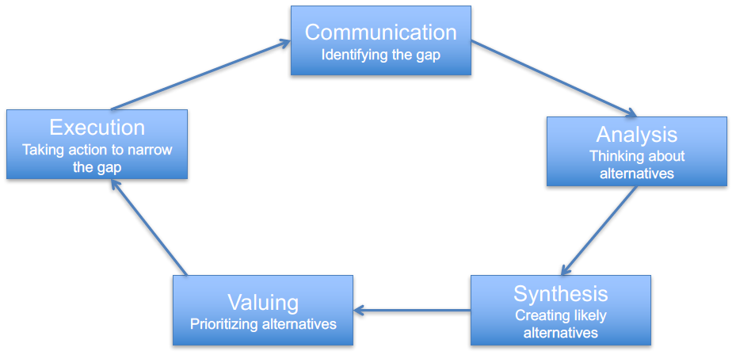
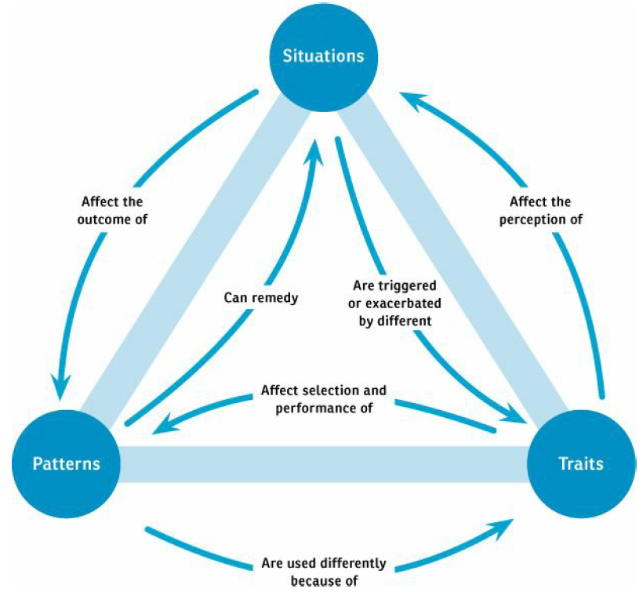

### During the lectures we defined three different areas important for every individual: Values, Interests and Skills. These should be described regarding your internal focus in a resume.
**a. Describe, explain, these three areas, including at least two examples from each area. (15)**
- **Values** are what is important for you, what you really care about, and which give you a sense of purpose. **Example**: High Income, Helping others.
- **Interests** are what is fun for you, what enjoys you, and those work activities which hold your attention and fire your enthusiasm. **Example**: Technical, Scientific.
- **Skills** are things you can do well, things you have learned, special talent and special abilities. **Example**: Technical skills, Leadership.
**b. What is a GAP? Give at least one example of a possible GAP relating to your own experiences, one example from each area. (6)**
- A GAP is where you are and where you want to be.
- The GAP for me: I hope that I can enter a big company like Alibaba to work as a Java developer. The GAP for me is that my understanding of the Java virtual machine is not deep enough, I don't have enough knowledge of multithreading, don't know enough about the principle and implementation of the database, and don't know much about the distributed architecture.

### 2. Name the 5 elements of the Career Development Cycle. Draw the model of the cycle. Describe shortly, 1-2 sentences, every action in the cycle. (12)
- Communication, Analysis, Synthesis, Valuing, Execution
  
- **Communication**: Become aware of the gap and feel discomfort about the gap. Seek assistance if needed.
- **Analysis**: Clarify your knowledge, what do you want, what are your values, interests and skills and so on.
- **Synthesis**: Solve the gap, avoid missing alternatives and reduce to a manageable amount of options.
- **Valuing**: Judge the benefit (and cost) and rank them to find the best choice. Select an option.
- **Execution**: Convert decisions into action, formulate a goal and a plan, and execute the plan.
- **Communication**: Review the state and think has the gap been closed. It is an on-going process.

### 3. Brown talks about four general role categories of people in teams. Name these roles and describe them shortly? (12)
- **Designers**: People responsible for generating and documenting ideas about how the product works, looks, or behaves.
- **Managers**: People responsible for ensuring the project team delivers on its obligations, creates plans to do so, and successfully executes against those plans.
- **Subject Matter Experts**: People responsible for contributing information to the design process.
- **Stakeholders**: People ultimately accountable for the success of the project.

### 4. Consider the following questions among individuals where we have different characteristics. Select three of them. Describe how people (individuals), can have different characteristics. Describe pros and cons, and possible consequences to a characteristic. Comments if the characteristics you choose are good characteristics or not.
  **a. Can I interrupt you?**
  **b. Do you attend agreed meetings?**
  **c. Are you late to meetings?**
  **d. Are you focusing on details or the big-picture?**
  **e. Which tasks do you prefer to commit to?**
  **f. How quickly do you respond to e-mail?**
  **g. Do you treat others how you would like to be treated yourself?**
  **h. Can she/he say no? Can you say no?**
  **i. Does she/he usually say no/yes?**
  **(12)**

### 5. Describe at least 4 positive consequences to conflicts. (8)

- Produces better ideas
- Forces people to search for new approaches
- Causes problems to surface
- Forces clarification

### 6. Brown draws a triangle for the model of conflict. Specify this triangle and describe the elements and how they are connected. (9)

> Situations: The different ways conflict manifests itself
>
> Patterns: The behaviors team members can use to deal with conflict
>
> Traits: The inherent characteristics that shape our behaviors and perceptions

#### Situations < > Patterns
- Designers can use patterns (specific behaviors) to untangle situations
  - Situations can also affect the outcome of patterns
#### Patterns < > Traits
- A designer’s traits influences which pattern she chooses for a particular situation
- By using a particular pattern successfully, a designer may take that to reinforce part of her personality
#### Traits < > Situations
- Traits can make certain situations worse by reinforcing the misunderstanding between people
- Some situations may amplify a designer’s trait

### 7. Brown lists three areas important for self-awareness. Describe these areas and give one example from each area for improving it. (9)

To understand your limitations, your boundaries, strengths
- Limitations: 
- Boundaries: By understanding their limitations, designers can be honest and open about their capabilities, their ability to contribute to a project, and their level of comfort in asking for help.
- Strengths: 

