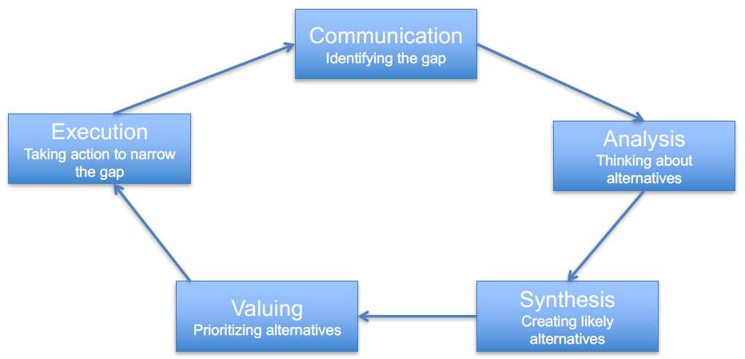
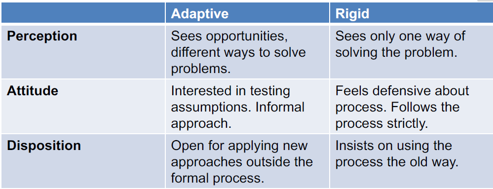
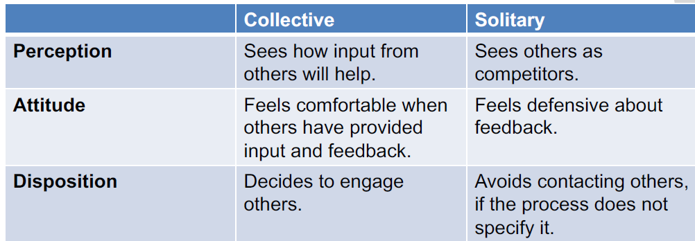
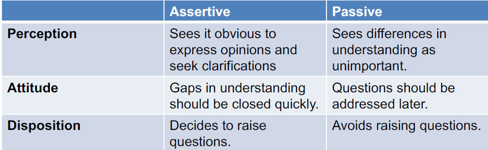

# Career decision making cycle

## Know the elements
Communication, Analysis, Synthesis, Valuing, Execution
## Know the definition
**Communication**: Identifying the gap
**Analysis**: Thinking about alternatives
**Synthesis**: Creating likely alternatives
**Valuing**: Prioritizing alternatives
**Execution**: Taking action to narrow the gap

## Be able to elaborate the elements
**Communication**:
• Become aware of the gap
• Discomfort, not so much fear of change
• Seek assistance if needed
• Emotions
**Analysis**:
• Clarify your knowledge
• Clarify gap
• Understand how you make decisions
• Understand what influences you
• What do you want?
• What have you learned?
• What are your values, interests and skills?
• Do you want to take responsibility?
• Self-awareness
**Synthesis**:
• Solve the gap
• Avoid missing alternatives
• Reduce to a manageable amount of options.
• Brainstorm and reduce.
**Valuing**:
• Judge the benefit (and cost)
• Rank
• What´s the best choice?
• Select an option
**Execution**:
• Convert decisions into action
• Formulate a goal and a plan
• Execute the plan
• Plan, try, evaluate

# Describe forces that affect our career

- The world is rapidly changing
- The economy goes up and down
- New companies emerges
- Some companies close down
- Unemployment goes up and down
- Organizational failures appears sometimes

# Career planning vs. workforce planning

## Career development
  - What the individuals in the organization do in order to ensure their interests and future
## Workforce planning
  - What the organization does in order to ensure growth and profit

# Activities to find employers

- Business/Industry
- Government
- Education
- Non-profit
- Private

# The elements of a job campaign, describe and elaborate

- Gain Experience
- Create Connections
- First Impressions Count
- Be Professional
- Be Prepared and Persistent
- Be Realistic, Open-minded and Flexible

# Elements and recommendations for writing a CV

## Elements
- Identification
- Career objective
- Education/Training
- Experience
- Other categories as appropriate
- References
## Recommendations
- Be brief
- Be consistent
- Be positive
- Be honest
- Be neat

# Know basic elements for good communication

 Treat others as you would like to be treated yourself

# The typical team, as defined by Brown

- Designers
- Managers
- Subject Matter Experts
- Stakeholders

# The three values of the glue of a team

- Respect
- Humility
- Empathy

# Be able to distinguish between assignment and commitment

## Assignments
### Assignments should be commitments
### Pressure to deliver
### Requirements to perform
- The expected result
- The expected cost
- Within the expected time frame
- Normally, these three items are pushed to its limits
## Commitment
- Should be voluntarily
- Deadlines, delivery dates should be defined
- Should be specific, clearly defined
- Clearly motivated
- Admit problems and risks
- Practice commitment culture

# Mindset defined (Perception, Attitude, Disposition)

## Perception
– How to interpret thing
## Attitude
– How to react
## Disposition
– Decide course of action, what to do

# Different mindsets

# Active listening

## Active listening
- Understanding
- Acknowledge
- Encourage
- Elaborate
- Hear others ideas
- See others ideas

# Types of listening

## Prepare

– Get ready

## Pause

– Give time for speaking

## Probe

– Let people elaborate

## Paraphrase/re-phrase

– Summarize

– Repeat

– Confirm

# Three obstacles to listening

- Short-circuiting
- Closed doors
- Embattled egos

# Browns definition of conflict

Conflict is the way teams come to a shared understanding of each decision made in the process

# Origins to conflicts

• Differences in objectives
• Different opinions
• Different values
• Argumentation and friction are unavoidable
• Negotiations with the customer
• Argumentation within the project organization
• Different or changed priorities

# Positive consequences of conflicts

- Produces better ideas
- Forces people to search for new approaches
- Causes problems to surface
- Forces clarification
- Stimulates interest and creativity
- An opportunity for people to test capacities

# Shared understanding

# Obstacles to shared understanding

- Unclear goals
- Unclear process, directions
- Unknown constraints
- Personal disagreements
- Misconception
- Ego
- Disinterest

# Healthy and unhealthy conflicts

## Unhealthy conflict
### A mask for
– Not understanding
– Not knowing
– Anxiety for the decision
– Personal conflicts

# Root causes to conflicts

## External
### Four types of tensions
– Disconnectedness
– Exclusion
– Misdirection
– Ambiguity
## Internal
### Method conflict
– Different ways of interpreting the method – HOW things are to be done
– Different criteria for success
– Re-do things
– Adapt and tailor the method
– Could be hidden by an outcome conflict
– Usually it is healthy, it progresses work
### Outcome conflict
– “The content of a decision”
– Product outcomes – how the product look like
– Poor performance – how to work
– How to structure (Plan) the project
– Purpose conflict – Why is this done?
– Lack of decisions, lack of clarity

# Know the five principles of behaviour patterns

1. There is no single right answer
2. Patterns may introduce new approaches
3. Not every pattern works in every situation
4. Several patterns may give the same result
5. Patterns that are experienced as comfortable may be your favourite patterns

# The four types of patterns to solve root causes of conflicts
## Empathize
	– Break down misunderstandings – shared understanding
	– Let a neutral person take notes
## Involve
	– To get more involvement
	– Story telling. Could use neutral persons
## Redirect
	– Find focus, narrow the scope, take baby steps
## Reframe
	– Use different words, find other approaches

# The definition of collaboration

• Collaboration means “working together” according to the dictionary
• In software projects it also includes “producing something”

# Collaboration vs. Groupthink

## Collaboration
- Working together

## Groupthink
- When you agree rather than come up with something better

Collaboration should lead to groupthink

# Aspects of collaboration

## Tools
### The tools have different focus
Tools helps in sharing and collaboration
Software tools for
– Messages
– Chats
– Video

## Mindset

### Perception
– How to interpret thing
### Attitude
– How to react
### Disposition
– Decide course of action, what to do

## Culture

  • Open workspaces or closed rooms?
  • Dislike in some way of communicating
  • Against or for face-to-face communication
  • Organizational limitations and boundaries
  • Competition between people
  • Heading for a promotion?

# The four virtues of collaboration
1. Clarity and Definition
2. Accountability and Ownership
3. Awareness and Respect
4. Openness and Honesty

| situations                                                   | example                                                      | interpretation                                               | pattern                                                      |
| ------------------------------------------------------------ | ------------------------------------------------------------ | ------------------------------------------------------------ | ------------------------------------------------------------ |
| design ignorance                                             | “I don’t see why we even   need to spend time on this.”我不知道为什么我们要浪费时间做这个 | Designers sometimes find   themselves defending the practice of design itself. | reflect the position(考虑他的位置);   anticipate agendas;   communicate   implications 讨论影响（如果..会..?） |
| Distracted by internal   competition内部矛盾                 | “The   marketing team is setting up their own Web site.”     | Members of the project   team lose focus on project objectives because they are distracted by a competitor | Help me prioritize;   Fame the conversition;   Recount previous conversation |
| Distracted by shiny   objects（consequence of   distraction） | “Our site   needs social sharing functions.”                 | “Shiny objects” is one   term for ideas or technologies or techniques that have captured the   imagination of the public or the industry. | make it real;   hold a workshop;   offer alternatives(做一些 mock-up来比较) |
| Don’t know   what we need                                    | “What do you   think we should do?”                          | Without a   clear definition of the design problem, the project team may run in different   directions. | provide starting points;   set reasonable expectations;   make assumption; |
| Efforts ignored                                              | “This stuff   doesn’t really matter because we’re working on a separate track.” | 利益相关者或其他成员选择忽视outputs, recommendations, and   solutions provided by people assigned to   those activities. | convert failure to action;   help me help you;   blame a “bad cop” |
| Excluded from planning                                       | “It’s a   shame she’s not in the meeting. All these action items are for her.” | In this situation,   the people responsible for delivering and executing are not included in the   planning process. | acknowledge achievements;   communicate implications;   reduce the assignment |
| False consensus                                              | “I think we all agree here.” 大家都认为已经达到共识了，但仔细想想其实没有 | In this   situation the team comes to some agreement (on direction or approach, for   example) but doesn’t re | ask for a story;   communicate implications;   help me make this better(说出有挑战的点) |
| Inconsistent   expectations                                  | “That’s not   what I said!”                                  | From one   conversation to the next, team members change their expectations. | Blame a “bad cop”;   make it real;   set reasonable expectations |
| Insufficient   progress   项目进度很慢，和懒惰有关           | “You’ve done   how much?”                                    | assigned   tasks remain incomplete, design problems remain unsolved, or feedback   isn’t fully   incorporated. | Go back to basics;   Reduce the assignment;   set reasonable expectations |
| Irrelevant (无关紧要的)comparisons                           | “Have you   seen this Web site?”                             | someone   contributes comparative examples with little or no practical relevance to the   design problem | consider micro/macro perspectives;   help me prioritize指出哪里相关;   communicate implications |
| Lack of clear inputs                                         | “Mmm...   yeah... we’re not going to have the budget to do user research.” | Designers   don’t have detailed inputs (requirements, starting points, etc.) to frame the   problem and inform the solution. | Make a plan;   Make it real;   Make assumptions              |
| Lack of   context                                            | “There’s a   lot going on behind the scenes here...”         | Teams do not   have insight into the organizational, business, or operational context   surrounding a project. | Pick one thing;   Help me help you;   List assumptions       |
| Lack of decision maker                                       | “So, what   does the group think?”                           | Design   decisions drag out because no authority is capable of rendering executive   decisions when necessary. | anticipate agendas;   hold a workshop;   communicate implications |
| Lack of stable strategy                                      | “So, things   have changed since we last spoke...”           | the project’s   objectives, parameters, or constraints change regularly. | make assumption一些原则;   blame a “bad cop”制定deadline;   treat it like a project |
| Late-breaking   requirements                                 | “Now that I   think about it, we’re also going to need...”   | the   stakeholder who didn’t have time to participate in the process; the one thing   that one guy   forgot; a   change to the business that has a ripple effect throughout all the company’s   systems. | Help me prioritize;   make it real;   make a plan            |
| Misinterpretation of tone                                    | “Your email   was really snippy.”                            | breeds hostility(敌意) or disrespect   in the   communications. | Change the channel;   reflect the position;   come back later |
| New perspectives                                             | “I know I’m   coming in with this late, but...”              | stakeholders offering new perspectives may not welcome   their positions being hastily dismissed.(立场被驳回) | assert your process;   frame the conversation(和利益相关者建立谈话);   offer alternatives（提供更多的选择） |
| No plan                                                      | “OK, so what   do we do next?”                               | In this   situation, the project lacks a plan that defines desired outcomes,   activities, schedule, and assignments. | Blame a “bad cop”;   draw pictures;   offer alternatives     |
| No time to   design                                          | “Just get   some rough ideas down by tomorrow, OK?”          | Forces   outside the design team establish an unreasonable schedule for producing   design ideas | assert your process(坚持自己，说完不成);   help me help you;   set reasonable expectations |
| Not a team   player   拒绝和别人合作                         | “I can take   care of this.”                                 | Someone on   the team refuses to engage with other members   | Ask for help;   Go back to basic;   communicate implications |
| Overpreparation认为已经解决了问题                            | “I think we’ve   got the solution already.”                  | Product   teams may create early mock-ups to frame the problem, which locks them into a   particular way of thinking about the   problem. | Hold a workshop;   ask questions;   ask for a story          |
| Poorly   composed feedback                                   | “That just   doesn’t look right to me.”                      | The team   receives feedback that doesn’t clearly articulate the next steps, the desired   improvements, or the issues with the current   version. | Frame the conversation;   take baby steps(go through the   design point by point);   change the metaphor |
| Poorly   planned presentation or discussion                  | “I hate to   put you on the spot, but...”                    | Project   stakeholders do not understand the design work because the design team hasn’t   assembled a meaningful narrative | set reasonable expectations;   assert your process;   ask questions |
| Reluctant   participation in design activities   (一些人不积极参与design) | “I’ll leave   the drawing to my colleagues.”                 | Some members   of the team may not actively participate in creative games and brainstorming   activities. | provide starting points;   assert your process;   communicate implications |
| Responses   not timely                                       | “[This quote   intentionally left blank.]”                   |                                                              | provide starting points;   assert your process;   communicate implications(和25pattern一样) |
| Separated   from key stakeholders                            | “Let me take   this to the VP, and I’ll let you know what she says.” | Designers   find themselves separated from the true client or customer through layers of   bureaucracy. | Hold a workshop;   assert your process;   take baby steps    |
| Tasks and   goals not aligned                                | “Everyone   says we need to hold a daylong brainstorming session.” | Designers   sometimes engage in design activities with no real rationale. Such activities   yield outcomes that likely don’t move the   project   forward, or do so inefficiently. | set expectations;   ask for the first step;   make a plan    |
| Uncoordinated   collaboration                                | “So, which   one of us is doing this?”(分配任务)             | Some project   teams have no plan, no overall direction of where they’re going long-term and   the activities required to get there. | Take responsibility;   provide starting points;   enumerate issues |
| Unfounded   design direction（毫无根据的设计方向）           | “Hey, I did   some mock-ups!”                                | Someone   outside the design team prepares screen designs, concepts, or other artifacts   attempting to establish a creative direction.   When a   non-designer shows up with design artifacts, the team may feel tension   because it implies lack of performance from the   designers. | Ask questions;   take responsibility;   acknowledge achievements |
| Unreasonable   constraints                                   | “I want the   design to look the same on every Web browser.” | Designers   thrive on constraints: boundaries help designers understand what constitutes   a good solution for the challenge. Some   projects,   however, are bounded by constraints that are arbitrary. | consider micro/macro perspectives;   help me prioritize;   make it real |
| Wrong scope                                                  | “What do you   mean I wasn’t supposed to work on that?”      | A designer   works on the wrong thing.                       | Take responsibility;   acknowledge achievements;   Go back to basics |

| pattern                                              |                                                              |                                                              |                                                              |
| ---------------------------------------------------- | ------------------------------------------------------------ | ------------------------------------------------------------ | ------------------------------------------------------------ |
| Acknowledge achievements（involve                    | “Wow, you   guys did a great job on this. I can see the effort you put in. Can you walk   me through to make sure I understand   everything?” |                                                              | Engaging with someone   about his or her work, and potentially balancing achievements with   opportunities for improvement. |
| Anticipate agendas（empathize                        | “I know   there are a few things that are especially important to you, so I wanted to   address them right away.” | Imagine what’s   important to other members of the team or project stakeholders before   engaging in a discussion with them. | Entering a   conversation with people expected to be competitive or confrontational, to   demonstrate that you have their best   interest in mind. |
| ask for a story（reframe                             |                                                              | Ask someone   to describe their ideas or thoughts or needs in the form of a story. | Someone   struggles to articulate their needs in the abstract, and you want to help   them make it more concrete. |
| ask for help（involve                                |                                                              | Directly ask   someone to help you with your task.           | You need   help. You’re preoccupied with proving yourself instead of solving the design   problem. |
| ask for the first step(Reframe)                      |                                                              | Ask someone   what their first step will be in attempting to achieve an objective. | Someone   struggles to articulate their process for performing a task, by getting them   to focus only on a small slice. |
| ask questions(Reframe,Involve)                       |                                                              | Instead of   jumping to conclusions, ask questions to make sure both you and the other people   understand what’s going on. | All. The.   Time. No other skill is as essential to designers as being able to ask good   questions. Except, perhaps, listening to   the answers. |
| assert your process(redirect)                        |                                                              | Remind   participants of the schedule and the process on which it is based, providing   lots of detail about activities, outcomes, and goals. | Someone   introduces factors that may compromise or derail the process, like late-breaking   requirements. |
| Blame a “bad cop”(reframe)                           |                                                              | Use another   team member (not present) as a scapegoat. By putting a human face on the   situation, people might work harder to find a   compromise,   or might forgive ignorance. | Facing   unreasonable constraints or being put on the spot for a question you can’t   answer immediately. |
| Call their bluff(揭发底牌) reframe                   |                                                              | Take a   challenge to its inevitable conclusion and hold everyone involved accountable   for meeting the challenge. Help other team   members   understand the impact of their request. | Presented   with unreasonable requests that aim to put pressure on the design team   without any meaningful outcome. |
| Capture   lessons learned（involve，redirect）       |                                                              | Make a list   of issues, obstacles, and difficulties that came out of a prior project or   situation or challenge. | The project   team hasn’t taken a moment to reflect on their previous work and how they   could have done it better. |
| change the channel（email，voice，etc）（reframe     |                                                              | Find a   different “channel” in which to communicate. Sometimes this means moving from   email to voice, or in person to email, or   instant   messenger to video chat. Sometimes this means taking a conversation out of a   public venue. | The medium   of communications is impacting participants’ ability to express themselves   clearly. |
| Change the   metaphor（reframe）                     |                                                              | Use a   different concept to explore or explain a complex idea. | Participants   become fixated on the metaphor and not the problem being solved, or when   participants need a new way of   looking at   the same old problem. |
| Channel your   colleagues’ best qualities（redirect  |                                                              | ，想想一个能处理好这件事的人。考虑他们将如何表现,并试图将其融入到情况。 | Confronting   a situation that is causing you particular anxiety or frustration. Sometimes,   pretending to be a different person   allows us to   tap into not only their capabilities, but also their strength. |
| come back later（Empathize, Redirect                 |                                                              | Postpone(延期) taking action until   participants can consider the situation more deliberately. | The   situation has gotten out of hand, such that the participants aren’t providing   reasonable and appropriate contributions |
| Communicate   implications（reframe                  | “If we don’t   get feedback until next week, we’ll have to shift our delivery milestones.   Without feedback, I’m worried that   we’ll have   more work later in the project dealing with late-breaking requirements.” | State, in   the simplest terms possible, the consequences of a decision | Participants   make decisions without realizing the negative consequences for the process or   project outcome. |
| Consider   micro/macro perspectives（redirect        |                                                              | Look at the   situation from two different angles, broad versus narrow or high versus low.   Adopting a new perspective can help   expose new   issues and solutions. | Participants   become so focused on one perspective that they lose sight of the project or   task objectives |
| Consider   your work/their work（reframe             |                                                              | Offer   encouragement and deflate the anxiety of critique by reminding colleagues   that stakeholders and other team members are just   doing their jobs. | Confrontations   have escalated to the extent that participants are having trouble hearing   each other’s concerns |
| Convert   failure to action（redirect                |                                                              | Take   outcomes that seem to be dead ends and use those as starting points for   subsequent tasks. | Confronted   by people who approach failure with a gloom and doom attitude, thinking that nothing   is recoverable from such   outcomes |
| draw pictures（reframe                               |                                                              | Use visual   aids, spontaneous sketches, whiteboards, diagrams, or other visualizations to   organize thoughts. Encourage participants to   draw or embellish others’ drawings. | Participants   are having trouble making sense of each other’s statements |
| Frame the   conversation（Involve,   Redirect）      |                                                              | Establish a   structure for conversations, with clearly articulated topics and goals. To   the extent feasible, identify items outside the   scope of the   discussion to avoid getting off track. | Participants   struggle to keep conversations focused or the agenda becomes dominated by a   few players that distract from   objectives. |
| Go back to   basics(redirect, involve)               |                                                              | Rely on tried-and-true   project management tools and techniques to keep project teams aligned and on   track. | Project   teams begin to spin out of control because they take project management   basics for granted |
| Help me help   you (empathize)                       | “I know how important   this design project is to your work here. I’d like to make sure you can be   successful and meet the   milestones   of the larger project. What I can I do to help you meet those goals?” | Position the   team’s work and the team’s role relative to another’s goals. 展示团队的目标是如何与个人目标相一致的。 | A   stakeholder or participant signals that they see themselves as competitive   with or opposed to the rest of the team. |
| Help me make   this better（involve）                |                                                              | 让expert去帮助improve   the design                           | 参与者不愿意或不能提供建设性的反馈。                         |
| Help me   prioritize （redirect）                    |                                                              | Ask participants to prioritize issues, requirements,   feedback, or whatever else may be driving subsequent activities.（找重点） | Presented with a list of issues that will impact the team’s   ability to execute their plan or to complete tasks within the project’s   constraints.（有好多问题要解决） |
| Hold a   workshop（involve）                         |                                                              | 组织一个meeting，可以让利益相关者来Structure a meeting as a   collection of participatory activities combined with presentations, as if   team members were attending a   training workshop.   By making the activity more participatory, teams can engage all stakeholders. | Working with   a team of people who need structure to actively contribute to a project. |
| List   assumptions（reframe）                        |                                                              | List the   educated guesses the team made to allow them to move forward with the   project. Assumptions may be related to any   context:   product, performance, plan, or purpose | The list of   assumptions   may be used to justify decisions or as a tool to validate assumptions.团队里一些人没有什么看法，依赖于别人的看法。 |
| make a plan （refame                                 |                                                              | Identify a   goal, a set of activities to reach that goal, and a set of milestones leading   up to the goal. With multiple goals, be sure to   prioritize. | 面对大量的工作，没有明确的下一步如何取得进展                 |
| make   assumptions （redirect）                      |                                                              | 不要让未知的信息阻碍了项目目标的实现。对丢失的信息进行有根据的猜测。一定要分享这些假设与项目团队提供设计决策的基本原理。 | 您已经准备好开始设计过程，但是无法弥补在理解上的差距         |
| make it real   （redirect）                          |                                                              | Take steps   to embody abstract ideas                        | 参与者在不考虑可行性的情况下抛出想法和反馈。                 |
| Offer   alternatives（involve                        |                                                              | 提供两三个想法，让参与者对比和比较                           | 提出了一个模糊的问题，将没有明确的标准来评估一个解决方案。   |
| Offer a sneak peek(提供一个先睹为快)（invole         | 我们明天要讲三个概念，我先说一下你们明天会看到的。           | Show or   describe upcoming work in brief to set expectations about what will be seen   or what participants will need to comment on. | Presenting   ideas or approaches that will challenge some underlying assumptions, as a way   to build the right mindset in key   participants. |
| Pick one   thing （redirect）                        |                                                              | Select one   item from a list to focus on.                   | 有很多issue困扰着                                            |
| Pick your   battles（empathize）                     | 避免对抗，以后再说                                           | Choose the right   time to engage in active conflict.        | Facing a   potentially major conflict that, compared to confrontations likely to emerge   later, will have little impact on the final   outcome. |
| Prioritize the portfolio（优先考虑投资组合）redirect | 虽然不喜欢这个project，但能提高职业目标                      |                                                              | 一个项目或任务的线程已经变得如此妥协，以至于很难在其中找到个人意义或满足感 |
| Provide   starting points（empathize）               |                                                              | 给人们举一些例子来说明你所期望的工作水平                     | 要给新人分配任务，团队，确立方向和期望值                     |
| Recount   previous conversation（reframe             |                                                              | 总结之前的对话，为当前的对话奠定基础                         | 当和记忆里不好的人一起工作时，先确定她们agree之前的对话要点。（避免他们经常在会议中改变自己的想法） |
| Reduce   the assignment（redirect                    | redirect                                                     | 把手头任务的一小部分用来控制范围                             | 有一个很大的项目，一小块的分配允许人们关注一个可控的设计问题和调整他们的预期。 |
| Reflect the   position（e）                          |                                                              | 重复别人说的话来确保自己听到的是正确的，也可以体现respect    | 当参与者觉得他们可能不理解对方的立场时                       |
| Seek small   victories（redirect）                   |                                                              | Drive toward   a win, no matter how small, to demonstrate success or establish a foundation   of success. 努力争取胜利，无论多么小 |                                                              |
| Set   reasonable expectations（redirect）            |                                                              | Provide a   clear account of how long tasks will take.       | 被问到项目的截止时间和范围，何时交付项目                     |
| Show the   goal（Empathize,   Involve, Redirect      |                                                              | 让利益相关者尽可能生动地描述项目或任务的期望结果，确保他们知道他们要什么。Ask stakeholders to describe as   vividly as possible the desired outcome of a project or task. This isn’t so   much to describe the final   design as it   is to make sure they know what they’re getting. | 项目已经花了很多时间，但还是不清楚stakeholders到底要什么     |
| show your   work（invole                             |                                                              | 揭示设计关键点，提供了基础和设计决策的理由                   | 当给stakeholders看你的design   idea时                        |
| take baby   staps（redirect，involve                 |                                                              | introduce引进小小的改变 给项目，一种文化来影响大的charge     | 团队或组织的习惯根深蒂固,新的思维方式难以实现。              |
| take responsibility（Empathize                       |                                                              | 诚实坦率地面对错误。主动帮忙收拾残局 Be honest and forthright with   errors. Offer to help clean up the mess. | Facing an   error that has an impact on other team members or the success of the project. |
| treat it   like a project（reframe）                 | 有一个问题很难达成一致，   create a plan 去解决              | 建立目标、活动、依赖关系、角色和其他结构，以推动冲突的解决方案Establish a goal, activities,   dependencies, roles, and other structure to drive toward a solution for a   conflict | Facing a   conflict with so many moving parts that resolution requires careful planning. |
|                                                      |                                                              |                                                              |                                                              |

| behavior                                                   | how                                                          | virtue                       | interpretation                                               |
| ---------------------------------------------------------- | ------------------------------------------------------------ | ---------------------------- | ------------------------------------------------------------ |
| ask questions that yield specific   answers                |                                                              | Clarity and Definition       | Structure   questions to encourage increasingly direct and detailed responses. Yes/no   questions are OK, so long as they validate a   specific decision or direction. |
| Centralize decision making 集中决策                        | At the   beginning of the project, ask who owns final decisions about design.   Lean on the   decision maker to validate direction and approach | Accountability and Ownership |                                                              |
| Clarify   expectations regarding ability and delivery      | 在收到任务后，确保你明白任务的交付时间和任务                 | Accountability and Ownership | 项目参与者应该让对方诚实地、公开地了解他们的工作地点         |
| Communicate progress                                       | 日常保持小火苗！Establish a rhythm for   communicating updates to project leads.   Use a simple   template for email or other electronic messages to communicate updates. | Accountability and Ownership |                                                              |
| Don’t hog opportunities不要占用机会？？？                  | 在要说话之前，保持15分钟沉默，让别人先说                     | Awareness and Respect        | 让每个参与者都参与进来。                                     |
| Embrace constructive criticism接受建设性的建议             | 先考虑一下这是他们的工作，也不算他们的错。在他们打击之前，先预测一下Anticipate   critiques before they happen to soften the blow. | Accountability and Ownership |                                                              |
| Embrace risk                                               | 明白风险，可能的消极后果                                     | Accountability and Ownership |                                                              |
| Employ采用 tools that   yield meaningful outcomes          | 判断工具是否能让项目继续Question the value of every activity or deliverable, and   seek to understand how it will move the project forward and how it   will lead to   the next step | Clarity and Definition       | make a contribution                                          |
| Encourage disruptive communications                        | 采用多种沟通渠道，为团队成员提供各种相互交流的方式。         | Clarity and Definition       |                                                              |
| Engage in dialogue                                         | Show up to   meetings with lots of questions prepared, whether you’re responsible for   presenting concepts or not. | Clarity and Definition       | 鼓励对话来阐述项目的概念、设计要求等。                       |
| Engage multiple senses to   communicate 调用多种感官来交流 | 计划会议不只是说什么，而是要展示什么。有一个文档相机准备显示屏幕上快速草图或投射在墙上。注意图片所示的节奏,特别是,人们会花最多的时间看看照片 | Clarity and Definition       | Use both   speaking and pictures to engage team members.     |
| Establish role definitions                                 | If you’re   not in charge of defining roles, ask for each participant’s responsibilities | Clarity and Definition       | 确保团队中的每个人都知道他或她的职责是什么。Take the time to ensure they understand whether they   own   particular activities, or are just contributors. |
| Give others   room to learn from mistakes                  | Offer to help colleagues reflect on   their failures.        | Awareness and Respect        |                                                              |
| Have a communications plan                                 | 使用模板为常见的电子邮件格式。建立一些规则用不同的交流方式。Identify who can respond to inquiries from different   stakeholders | Clarity and Definition       | 为团队成员之间的交流创建标准。                               |
| Have a project plan                                        | ensure you can answer who, what, where, when, why, and   how questions about the project.确保你能回答谁，什么，什么，何时，为什么，以及如何对这个项目的问题 | Clarity and Definition       | Create a   project schedule with milestones and resource assignments. Clearly state how   much time each team member should spend   on each   activity. |
| Have decision-making mechanisms有决策机制                  | 为设计或项目计划制定目标或原则以指导决策。指定具体的人负责,负责具体的决策。Establish goals or principles for the design or project   plan to guide decisions.   Designate   specific people responsible and accountable for specific decisions. | Clarity and Definition       |                                                              |
| Have   objectives for every discussion                     | If you’re   organizing the meeting, send an agenda, a list of topics, or even a   one-sentence objective beforehand.   If you’re   not organizing the meeting, ask the organizer for the agenda or objectives.   If it’s an   ad hoc meeting, take a moment to validate expectations with other   participants. | Clarity and Definition       | know   beforehand what you expect to come out of it.         |
| Keep   meetings focused and short                          | Conclude a   meeting when it’s over, not when the clock says it’s over.   Show up with   an agenda and objectives so you know when it’s over. | Awareness and Respect        | Golden Rule: Assume other people’s time is as valuable as   yours. 假设别人的时间和你的一样宝贵 |
| Know when you’re “spinning” 知道你遇到瓶颈的时候           | 在任务或任务上花一小段时间(大约10% - 20%的时间)，然后评估进度。如果开始适应,坚持下去。如果没有明确的方向，可以向同事寻求帮助。 | Accountability and Ownership | 意识到你的努力没有成效。旋转的行为将是一个问题解决,没有做出任何实质性的进展。有些人坚持啃一个问题,消耗时间和金钱,因为他们需要证明自己。 |
| Offer direct critiques                                     | Avoid generalizations like “It’s not   good.”避免笼统地说“这不好”。 | Awareness and Respect        |                                                              |
| Play to strengths 发挥优势                                 | Reflect on abilities and skills to identify strengths反思能力和技能，以确定优势 | Accountability and Ownership | 确保项目中的角色和责任与团队成员的个人能力、技能和性格相一致。 |
| Provide a rationale for decisions为决策提供依据            | Enumerate key decisions and identify   the primary rationale for driving them.列举关键决策并确定驱动它们的基本原理。 | Accountability and Ownership | 确保所有的决定——关于产品，关于计划，关于项目——都有合理的理由 |
| Recognize contributions承认贡献                            |                                                              | Accountability and Ownership | if someone   inspired a particular direction or lent an insight, give them a shout-out. |
| Reduce competition                                         | In   competitions, there is always a loser. Losers no longer feel as invested in   the project. When people feel like they will make a meaningful contribution,   regardless of their role, they will do better work and support each other in   the pursuit of the project’s goals | Accountability and Ownership | 从设计过程中消除对彼此不利的设计过程。鼓励人们一起工作,而不是竞选。 |
| Reflect on your performance                                |                                                              | Awareness and Respect        | 花点时间考虑一下你在一个项目或任务上的表现。识别领域你可以表现的更好,发挥你的长处。确定下次你会做不同的事情，然后吸取教训，下次再用。 |
| Respect the calendar                                       |                                                              | Awareness and Respect        |                                                              |
| Set availability expectations                              |                                                              | Awareness and Respect        |                                                              |
| Set performance expectations                               |                                                              | Awareness and Respect        | Clearly   communicate ability to complete tasks and assignments. |

| Traits                           |                  |                                  |      |
| -------------------------------- | ---------------- | -------------------------------- | ---- |
| Adaptability                     |                  |                                  |      |
| Adherence to style               |                  |                                  |      |
| Assumption threshold             | 假设阈值         |                                  |      |
| Creative triggers                |                  |                                  |      |
| Defining the challenge           |                  |                                  |      |
| Desired cadence                  | 期望的节拍       | Workload， client   culture      |      |
| Dogmatism                        | 教条主义         |                                  |      |
| Format for feedback              |                  |                                  |      |
| Giving and getting   recognition |                  |                                  |      |
| Knee-jerk reaction               | 很快的反应       | 要么不思考马上赞同，要么马上反对 |      |
| Level of abstraction             | 喜欢做抽象的事情 |                                  |      |
| Perception of control            |                  |                                  |      |
| Preferred environment            |                  |                                  |      |
| Preferred perspective            |                  |                                  |      |
| Project load                     |                  |                                  |      |
| Structure of design   reviews    |                  |                                  |      |
| Transparency                     | 透明度           |                                  |      |