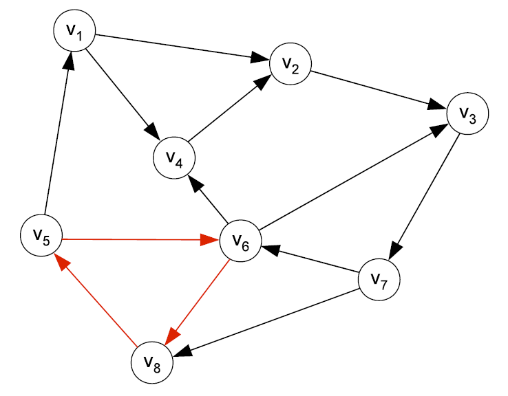
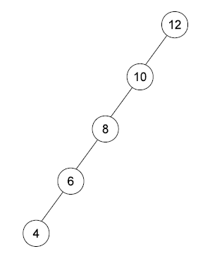
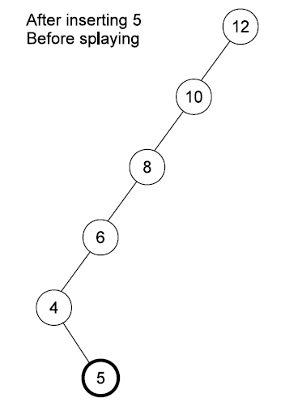
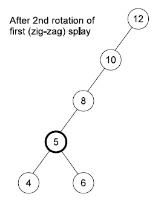
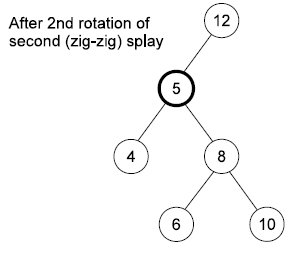
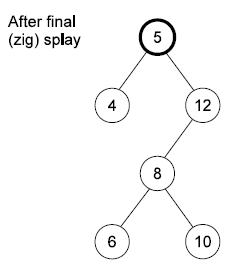

# This question tests your knowledge on algorithms and algorithm construction:

**(a) A function that is defined in terms of itself is called a recursive function. Describe the purpose of a base case in a recursive function.(3p)**

A base case is an (input) value for which the function can be calculated without recursion. 

There needs to be at least one base case, which can be solved without recursion. 

For the cases that are solved using recursion, the recursive calls must progress towards a base case.

**(b) Mergesort is based on the principles of divide-and-conquer. Briefly describe what the mergesort algorithm does in the divide step and in the conquer step. (4p)**

**Divide step:** Divide the array into two parts to convert the problem of sorting the entire array into sub-problems (to sort the left and right arrays separately) until the size of the array is 1.

**Conquer step:** Repeatedly merging sorted lists into sorted lists of larger size until the initial list is sorted.

**(c) A constructive heuristic is a method that iteratively “builds up” a solution. It starts with nothing and adds (fixes) the value of exactly one variable (solution component) in each of the iterations. The algorithm ends when all variables have been assigned a value. Describe what is a greedy constructive heuristic. (3p)**

Each variable fixing is chosen as the variable that (locally) improves the objective most. Of course, variable fixings are chosen without breaking feasibility.

# This question test your knowledge on graphs and trees.

**(a) What does a “worst case” binary tree look like? (5p)**

In the *worst case*, if the binary search tree has n nodes,  it can have O(n) height, when the unbalanced *tree* looks like a linked list. 

The worst case occurs when inserting an sorted list into the tree in order.

**(b) Describe what is a topological ordering. (4p)**

A topological ordering of a directed non-cyclic graph is an ordering of the vertices such that if there is an edge (u, v) between u and v, then u comes before v in the ordering.

**(c) Illustrate and explain using an example why there can be no topological ordering of a graph that contains a cycle. (6p)**

 

Consider the cycle v5 -> v6 -> v8 -> v5:

- (v5, v6) 属于 E => v5 needs to come before v6 in the topological order.
- (v6, v8) 属于  E => v6 needs to come before v8 in the topological order => v5 before v8 in the topological order.
- (v8, v5) 属于  E => v8 needs to come before v5 in the topological order, which is not possible as we previously concluded the opposite.

# This question concerns complexity analysis.

**(a) Briefly describe the complexity class P. (3p)**

All problems that can be solved using a polynomial bound algorithm belongs to the same complexity class (complexity class P).

**(b) Describe what is a basic operation of an algorithm. (3p)**

A basic operation can be seen as an operation that is fundamental for the performance of a particular algorithm.

The performance of the algorithm is in principle proportional to the number of basic operations.

**(c) Describe the concepts of worst-case and average-case complexity of an algorithm. (6p)**

**The worst-case** complexity W(n) of an algorithm is the maximum number of basic operations performed for any input of size n.

**The average-case** complexity A(n) of an algorithm is the average number of basic operations performed by the algorithm, where each input I occurs with some probability p(I).

**(d) What does it mean to say that a data structure has an amortized bound of O(n) per operation? (3p).**

This means that regardless of which sequence of n operations, the worst-case average cost per operation is O(n).

# Your task for this question is to insert a node with value 5 into the following splay tree.

You are required to show what the tree looks like after inserting the new node and after each of the (3) splay operations.

Hint: you will have to perform all three types of splay operations. (20p)

# Your task is to apply dynamic programming in order to solve a knapsack
problem instance with 4 items:
Item 1: Value: p1 = 8 - Weight: w1 = 2
Item 2: Value: p2 = 6 - Weight: w2 = 1
Item 3: Value: p3 = 7 - Weight: w3 = 2
Item 4: Value: p4 = 5 - Weight: w4 = 1
The knapsack (bag) has a weight capacity of 4 (W = 4).
You should graphically illustrate your solution. (20p)

